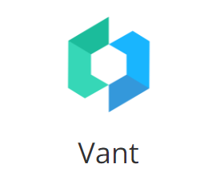
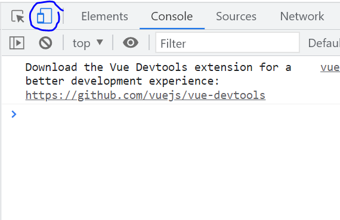
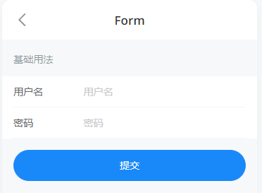
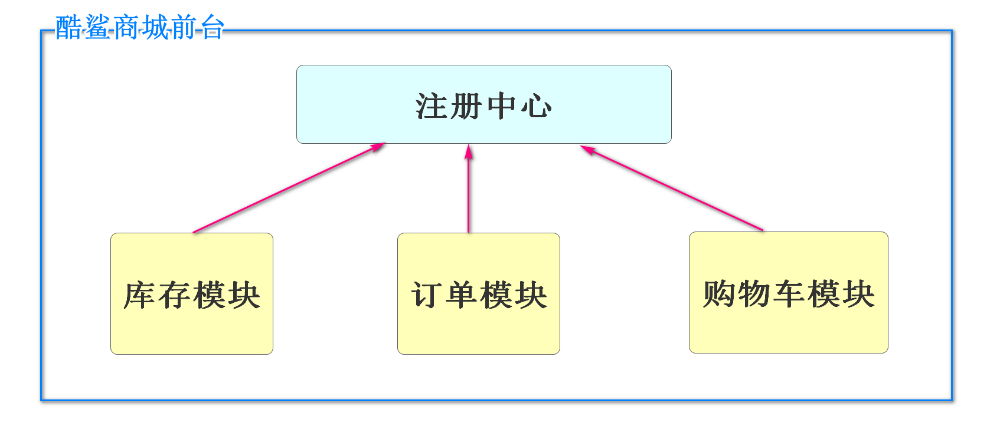
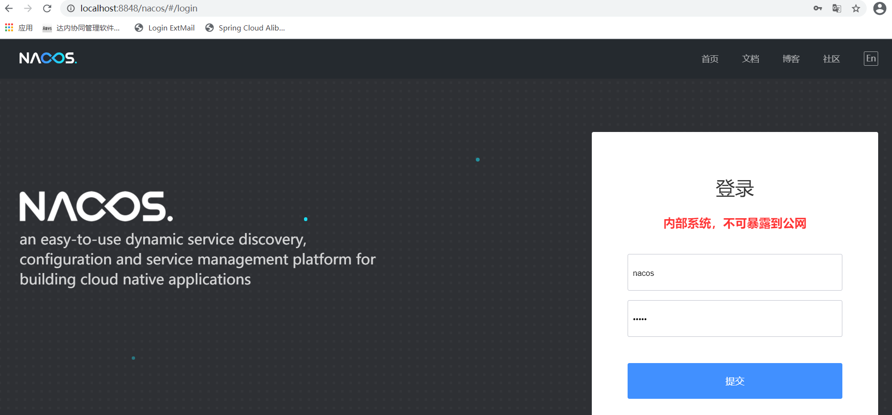

张皓岚

微信号：Jtzhanghl

第五阶段

19天

第一部分：微服务知识 8天

第二部分：酷鲨商城前台 11天

# Vant

## 什么是Vant



Vant是一个轻量，可靠的移动端组件库，2017开源

目前 Vant 官方提供了 [Vue 2 版本](https://vant-contrib.gitee.io/vant/v2)、[Vue 3 版本](https://vant-contrib.gitee.io/vant)和[微信小程序版本](http://vant-contrib.gitee.io/vant-weapp)，并由社区团队维护 [React 版本](https://github.com/3lang3/react-vant)和[支付宝小程序版本](https://github.com/ant-move/Vant-Aliapp)。

课程中使用Vant 2.x版本可以浏览网站

https://youzan.github.io/vant/v2/#/zh-CN/

## Vant的优势

ElementUI是开发电脑浏览器页面的组件库

而Vant是开发移动端显示页面的组件库

酷鲨商城前台设计的是手机来访问，所以使用移动端更合适也就是使用Vant

## Vant特性

- 🚀 性能极佳，组件平均体积小于 1KB（min+gzip）
- 🚀 65+ 个高质量组件，覆盖移动端主流场景
- 💪 使用 TypeScript 编写，提供完整的类型定义
- 💪 单元测试覆盖率超过 90%，提供稳定性保障
- 📖 提供完善的中英文文档和组件示例

- .......

# 第一个Vant程序

## 创建Vue项目

参考第四阶段创建Vue项目的比较创建Vue项目

首先确定一个文件夹创建Vue项目

G盘下创建一个文件夹vue-home

进入文件夹在地址栏输入cmd，打开dos命令行

```
G:\vue-home>vue create demo-vant
```

具体选项,参考之前阶段创建Vue的笔记

## 添加\安装Vant支持

我们创建一个Vue项目,Vue项目不会自动支持Vant

我们需要将Vant添加到Vue项目中

进入到我们刚刚创建的项目的文件夹

```
G:\vue-home>cd demo-vant
```

运行安装\添加Vant支持的npm命令

```
G:\vue-home\demo-vant>npm i vant@latest-v2 -S
```

运行结束后可能有警告,无视掉

最终看到的提示可能是

```
added 5 packages in 3s
```

到此为止,当前Vue项目,就支持Vant功能了

我们利用idea打开这个项目即可

https://gitee.com/jtzhanghl/vant2202.git

## 添加Vant引用

如果想在Vue项目中开始使用Vant的功能

还需要在Vue项目代码中添加Vant的引用

Vue项目的src/main.js中,添加如下引用,启用Vant功能

```js
// 添加Vant引用
import Vant from 'vant';
import 'vant/lib/index.css';

Vue.use(Vant)
```

添加了上面的引用,当前Vue项目就可以使用Vant组件了

为了实时运行项目,我们启动Vue项目

在idea的Terminal中编写启动代码

```
G:\vue-home\demo-vant>npm run serve
```

打开浏览器

输入localhost:8080

进入移动端页面调试模式

以Google浏览器为例按F12进入调试模式后点击移动端调试即可




## 按钮组件

在HomeView.vue中修改代码为

```html
<template>
  <div class="home">
    <van-button type="primary">主要按钮</van-button>
    <van-button type="info">信息按钮</van-button>
    <van-button type="default">默认按钮</van-button>
    <van-button type="warning">警告按钮</van-button>
    <van-button type="danger">危险按钮</van-button>
  </div>
</template>
```

打开页面,就可以看到按钮

## 表单页面

使用表单组件实现登录页面

是Vant直接提供的组件



在AboutView.vue页面中编写代码如下

```html
<template>
  <div class="about">
    <van-form @submit="onSubmit" @failed="myFail">
      <van-field
          v-model="username"
          name="用户名"
          label="用户名"
          placeholder="用户名"
          :rules="[{ required: true, message: '请填写用户名' }]"
      />
      <van-field
          v-model="password"
          type="password"
          name="密码"
          label="密码"
          placeholder="密码"
          :rules="[{ required: true, message: '请填写密码' }]"
      />
      <div style="margin: 16px;">
        <van-button round block type="info" native-type="submit">提交</van-button>
      </div>
    </van-form>
  </div>
</template>
<script>
export default {
  data() {
    return {
      username: '',
      password: '',
    };
  },
  methods: {
    onSubmit(values) {
        // 提交成功的方法
      console.log('submit', values);
    },
    myFail(errorInfo){
        // 提交失败的方法
      console.log(errorInfo);
    }
  },
};
</script>
```

注意@submit和@failed这两个事件的绑定关系

## area省市区选择

先在views文件夹下创建AreaView.vue文件

编写代码如下

```html
<template>
  <div>
    <van-area title="省市区选择" :area-list="areaList" />
  </div>
</template>

<script>
const areaList = {
  province_list: {
    110000: '北京市',
    120000: '天津市',
  },
  city_list: {
    110100: '北京市',
    120100: '天津市',
  },
  county_list: {
    110101: '东城区',
    110102: '西城区',
    // ....
  },
};
export default {
  data(){
    return{areaList}
  }
}
</script>
```

新建的页面要设置路由才能访问

```js
const routes = [
  {
    path: '/',
    name: 'home',
    component: HomeView
  },
  {
    path: '/about',
    name: 'about',
    // route level code-splitting
    // this generates a separate chunk (about.[hash].js) for this route
    // which is lazy-loaded when the route is visited.
    component: () => import(/* webpackChunkName: "about" */ '../views/AboutView.vue')
  },
  {
    path: '/area',
    name: 'area',
    component: () => import('../views/AreaView.vue')
  }
]
```

通过输入路径http://localhost:8080/area

访问省市区选择页面

只有少量数据

如果需要真实的全国省市区数据,我们需要直接引入

使用npm命令如下

```
G:\vue-home\demo-vant>npm i @vant/area-data
```

下面我们修改AreaView.vue的代码

引用安装好的全国数据,并绑定确认按钮,输出选择的省市区的信息

```html
<template>
  <div>
    <van-area title="省市区选择" :area-list="areaList"
      @confirm="showArea"/>
  </div>
</template>

<script>
import {areaList} from '@vant/area-data'
export default {
  data(){
    return{areaList}
  },
  methods:{
    showArea(area){
      console.log(area);
    }
  }
}
</script>
```

## 商品列表

我们的电商网站一定会需要商品列表

移动端Vant直接支持了商品列表的格式

我们也不需要大范围的修改

创建ListView.vue

代码如下

```html
<template>
  <div>
    <van-row>
      <van-col span="8">综合</van-col>
      <van-col span="8">销量</van-col>
      <van-col span="8">价格</van-col>
    </van-row>
    <van-card
        num="2"
        price="168.00"
        desc="超10万好评热销产品"
        title="酷鲨键盘鼠标套装"
        thumb="https://img01.yzcdn.cn/vant/ipad.jpeg"
    >
      <template #tags>
        <van-tag type="primary">自营</van-tag>
        <van-tag plain type="primary">酷鲨物流</van-tag>
      </template>
      <template #footer>
        <van-button size="mini">按钮</van-button>
        <van-button size="mini">按钮</van-button>
      </template>
    </van-card>
    <van-card
        num="2"
        price="168.00"
        desc="超10万好评热销产品"
        title="酷鲨键盘鼠标套装"
        thumb="https://img01.yzcdn.cn/vant/ipad.jpeg"
    >
      <template #tags>
        <van-tag type="primary">自营</van-tag>
        <van-tag plain type="primary">酷鲨物流</van-tag>
      </template>
      <template #footer>
        <van-button size="mini">按钮</van-button>
        <van-button size="mini">按钮</van-button>
      </template>
    </van-card>
  </div>
</template>

<script>

</script>
```

路由代码

```js
{
  path: '/list',
  name: 'list',
  component: () => import('../views/ListView.vue')
}
```

# 服务器端项目演进

**服务器初期状态**

最早的服务器就是安装部署了一些静态页面

功能非常单一,只能做信息的呈现和输出

**服务器动态页面**

后来因为业务和技术的发展,页面连接了数据库,页面中大部分数据来自于数据库中

用户的操作可以修改数据库的内容,这样在不修改页面代码的前提下,页面中的数据可能发生变化

这样的页面可以实现用户注册,登录,查询(基本增删改查)功能

**用户贡献网页内容**

进入21世纪,随着互联网进入千家万户,个人多社交需求的提升

出现了很多主要由用户贡献信息的网站

现在也有很多这样的网站

微博,抖音,淘宝,大众点评或类似的网站

**微服务时代**

随着用户量的增加,和各种新需求的出现,一个服务器应用程序不能支持网站的运行时

就需要多台服务器共同支持网站的运行

我们需要强大的服务器性能,支持各种网站的活动

达到"三高"的目标

"高并发,高可用,高性能"

# Java服务器项目分类

现在市面上常见的java开发的项目可以分为两大类

1.企业级应用

一般指一个企业或机构内部使用的网站或服务器应用程序

包括的领域很多,包括并不限于:商业,企事业单位,医疗,军事,政府,金融等

这种项目的特征是访问人数不多,不是全国乃至全世界都需要使用的网站

因为人数比较少又没有替代品,所以不强烈要求三高

但是企业级项目一般会有比较复杂的权限设置和业务流程

2.互联网应用

指对全国乃至全世界开放的网站或服务器引用程序

我们手机中安装的app大部分都是互联网应用

微信,支付宝,京东,淘宝,饿了么,美团,抖音,qq音乐,爱奇艺,高德地图等

他们因为商业竞争等各种原因,对服务器性能有要求,也就是前面提到的"三高"

及时并发量非常大,程序也要正常运行,迅速响应

互联网应用一般业务和权限相对简单,但是要求"三高"


因为上述java项目的分类偏重点不同

在当今java开发的业界中,有下面的基本规律

* 如果开发的是企业级应用,使用单体架构的情况比较多
* 如果开发的是互联网应用,使用微服务架构的情况比较多

# 微服务概述

## 什么是微服务

微服务的概念是由Martin Fowler（**马丁·福勒**）在2014年提出的


微服务是由以单一应用程序构成的小服务，自己拥有自己的行程与轻量化处理，服务依业务功能设计，以全自动的方式部署，与其他服务使用 HTTP API 通信。同时服务会使用最小的规模的集中管理能力，服务可以用不同的编程语言与数据库等组件实现。

简单来说,微服务就是将一个大型项目的各个业务代码,拆分成多个互不干扰的小项目,而这些小项目专心完成自己的功能,而且可以调用别的小项目的方法,从而完成整体功能

京东\淘宝这样的大型互联网应用程序,基本每个操作都是一个单独的微服务在支持:

- 登录服务器
- 搜索服务器
- 商品信息服务器
- 购物车服务器
- 订单服务器
- 支付服务器
- 物流服务器
- .....


## 为什么使用微服务


左侧小餐馆就像单体项目

一旦服务器忙,所有业务都无法快速响应

即使添加了服务器,也不能很好的解决这个问题

不能很好的实现"高并发,高可用,高性能"

但是因为服务器数量少,所以成本低,适合并发访问少的项目

右侧的大餐厅就是微服务项目

每个业务有专门一批人负责,业务之间互不影响

能够针对的在性能不足的业务上添加服务器来改善性能,同时万一一个服务器异常,不会影响整体功能

但是服务器数量多,成本高,适合要要求"高并发,高可用,高性能"的项目

## 怎么搭建微服务项目

在微服务概念提出之前(2014年),每个厂商都有自己的解决方案

但是Martin Fowler（**马丁·福勒**）提出了微服务的标准之后,为了技术统一和兼容性,很多企业开始支持这个标准

现在业界中开发微服务项目,大多数都是在这个标准下的

如果我们自己编写支持这个标准的代码是不现实的,必须通过现成的框架或组件完成满足这个微服务标准的项目结构和格式

当今程序员要想快速完成微服务标准的程序,首选SpringCloud

# Spring Cloud

## 什么是Spring Cloud

SpringCloud是由Spring提供的一套能够快速搭建微服务架构程序的框架集

框架集表示SpringCloud不是一个框架,而是很多框架的统称

SpringCloud是为了搭建微服务架构的程序而出现的

有人将SpringCloud称之为"Spring全家桶",广义上指代所有Spring的产品

## SpringCloud的内容

**从内容提供者角度**

* Spring自己编写的框架和软件
* Netflix(奈非):早期提供了很多(全套)微服务架构组件
* alibaba(阿里巴巴):新版本SpringCloud推荐使用(正在迅速占领市场)

课程中大量使用alibaba的微服务组件

**从功能上分类**

* 微服务的注册中心
* 微服务间的调用
* 微服务的分布式事务
* 微服务的限流
* 微服务的网关
* ......

# Nacos注册中心

## 什么Nacos

Nacos是Spring Cloud Alibaba提供的一个软件

这个软件主要具有注册中心和配置中心的功能

我们先学习它注册中心的功能

微服务中所有项目都必须注册到注册中心才能成为微服务的一部分

注册中心和企业中的人力资源管理部门有相似



## Nacos的启动

我们要启动Nacos必须保证当前系统配置了java环境变量

简单来说就是要环境变量中,有JAVA_HOME的配置,指向安装jdk的路径

确定了支持java后,可以通过下面路径下载

https://github.com/alibaba/nacos/releases/download/1.4.3/nacos-server-1.4.3.zip

国外网站,下载困难可以多试几次

或直接向项目经理老师索取

## 安装启动Nacos

将下载好的Nacos压缩包解压

将压缩包解压(注意不要有中文路径或空格)

打开解压得到的文件夹后打开bin目录会有如下内容


cmd结尾的文件是windows版本的

sh结尾的文件是linux和mac版本的

startup是启动文件,shutdown是停止文件

**Windows下启动Nacos不能直接双击cmd文件**

需要进入dos命令运行

在当前资源管理器地址栏输入cmd

```
G:\pgm\nacos\bin>startup.cmd -m standalone
```

-m是设置启动方式参数

standalone翻译为标准的孤独的

意思是单机模式标准运行

运行成功默认占用8848端口,并且在代码中提示

如果不输入standalone运行会失败

```
startup.cmd -m standalone
```

验证Nacos的运行状态

打开浏览器输入http://localhost:8848/nacos



如果是首次访问,会出现这个界面

登录系统

用户名:nacos

密码:nacos

登录之后可以进入后台列表

不能关闭启动nacos的dos窗口

我们要让我们编写的项目注册到Nacos,才能真正是微服务项目

# 创建csmall项目

我们需要学习微服务知识

我们使用一个相对简单的项目结构来学习

微服务框架搭建项目完成版git路径:

https://gitee.com/jtzhanghl/csmall-cgb2112.git

## 业务概述

这个项目作为学习微服务组件使用

我们需要完成一个添加订单的业务

模拟用户选中购物车中商品并且确定了数量的情况下点击提交订单时后端的操作

1.减少选中商品sku的库存数

2.删除用户再购物车中勾选的商品

3.生成订单,将订单信息保存到数据库

上面三个步骤分别由3个模块完成

* 库存模块:减少库存
* 购物车模块:删除购物车信息
* 订单模块:新增订单

下面就开始搭建这个项目

## 创建csmall父项目

创建项目名称csmall

首先删除项目的src目录,因为我们使用不到

其次,pom文件有大量配置

直接从提供给大家的完整版中复制

其中的内容,我们会随着后面学习,逐一给大家讲解

最终的pom文件内容为

```xml
<?xml version="1.0" encoding="UTF-8"?>
<project xmlns="http://maven.apache.org/POM/4.0.0" xmlns:xsi="http://www.w3.org/2001/XMLSchema-instance"
         xsi:schemaLocation="http://maven.apache.org/POM/4.0.0 https://maven.apache.org/xsd/maven-4.0.0.xsd">
    <modelVersion>4.0.0</modelVersion>
    <parent>
        <groupId>org.springframework.boot</groupId>
        <artifactId>spring-boot-starter-parent</artifactId>
        <version>2.5.4</version>
        <relativePath/> <!-- lookup parent from repository -->
    </parent>
    <groupId>cn.tedu</groupId>
    <artifactId>csmall</artifactId>
    <version>0.0.1-SNAPSHOT</version>
    <name>csmall</name>
    <description>微服务框架演示案例</description>
    <packaging>pom</packaging>
    <modules>
<!--        <module>csmall-business</module>-->
<!--        <module>csmall-commons</module>-->
<!--        <module>csmall-cart</module>-->
<!--        <module>csmall-order</module>-->
<!--        <module>csmall-stock</module>-->
    </modules>
    <properties>
        <java.version>1.8</java.version>
        <spring-cloud.version>2020.0.3</spring-cloud.version>
        <spring-cloud-alibaba.version>2.2.2.RELEASE</spring-cloud-alibaba.version>
        <spring-boot.version>2.5.4</spring-boot.version>
        <spring-boot-configuration-processor.version>2.3.0.RELEASE</spring-boot-configuration-processor.version>
        <spring-security-jwt.version>1.0.10.RELEASE</spring-security-jwt.version>
        <mybatis-spring-boot.version>2.2.0</mybatis-spring-boot.version>
        <mybaits-plus.version>3.4.1</mybaits-plus.version>
        <pagehelper-spring-boot.version>1.4.0</pagehelper-spring-boot.version>
        <mysql.version>8.0.26</mysql.version>
        <lombok.version>1.18.20</lombok.version>
        <knife4j-spring-boot.version>2.0.9</knife4j-spring-boot.version>
        <spring-rabbit-test.version>2.3.10</spring-rabbit-test.version>
        <spring-security-test.version>5.5.2</spring-security-test.version>
        <fastjson.version>1.2.45</fastjson.version>
        <druid.version>1.1.20</druid.version>
        <jjwt.version>0.9.0</jjwt.version>
        <seata-server.version>1.4.2</seata-server.version>
    </properties>
    <dependencies>
        <dependency>
            <groupId>org.projectlombok</groupId>
            <artifactId>lombok</artifactId>
        </dependency>
    </dependencies>
    <!-- 依赖管理 -->
    <dependencyManagement>
        <dependencies>
            <!--seata-all-->
            <dependency>
                <groupId>io.seata</groupId>
                <artifactId>seata-all</artifactId>
                <version>${seata-server.version}</version>
            </dependency>
            <!-- Lombok -->
            <dependency>
                <groupId>org.projectlombok</groupId>
                <artifactId>lombok</artifactId>
                <version>${lombok.version}</version>
            </dependency>
            <!-- MySQL -->
            <dependency>
                <groupId>mysql</groupId>
                <artifactId>mysql-connector-java</artifactId>
                <version>${mysql.version}</version>
                <scope>runtime</scope>
            </dependency>
            <!-- Alibaba Druid -->
            <dependency>
                <groupId>com.alibaba</groupId>
                <artifactId>druid</artifactId>
                <version>${druid.version}</version>
            </dependency>
            <!-- MyBatis Spring Boot：数据访问层MyBatis编程 -->
            <dependency>
                <groupId>org.mybatis.spring.boot</groupId>
                <artifactId>mybatis-spring-boot-starter</artifactId>
                <version>${mybatis-spring-boot.version}</version>
            </dependency>
            <!-- MyBatis Plus Spring Boot：MyBatis增强 -->
            <dependency>
                <groupId>com.baomidou</groupId>
                <artifactId>mybatis-plus-boot-starter</artifactId>
                <version>${mybaits-plus.version}</version>
            </dependency>
            <!-- MyBatis Plus Generator：代码生成器 -->
            <dependency>
                <groupId>com.baomidou</groupId>
                <artifactId>mybatis-plus-generator</artifactId>
                <version>${mybaits-plus.version}</version>
            </dependency>
            <!-- PageHelper Spring Boot：MyBatis分页 -->
            <dependency>
                <groupId>com.github.pagehelper</groupId>
                <artifactId>pagehelper-spring-boot-starter</artifactId>
                <version>${pagehelper-spring-boot.version}</version>
            </dependency>
            <!-- Spring Boot：基础框架 -->
            <dependency>
                <groupId>org.springframework.boot</groupId>
                <artifactId>spring-boot-starter</artifactId>
                <version>${spring-boot.version}</version>
            </dependency>
            <!-- Spring Boot Web：WEB应用 -->
            <dependency>
                <groupId>org.springframework.boot</groupId>
                <artifactId>spring-boot-starter-web</artifactId>
                <version>${spring-boot.version}</version>
            </dependency>
            <!-- Spring Boot Freemarker：MyBaits Plus Generator的辅助项 -->
            <dependency>
                <groupId>org.springframework.boot</groupId>
                <artifactId>spring-boot-starter-freemarker</artifactId>
                <version>${spring-boot.version}</version>
            </dependency>
            <!-- Spring Boot Validation：验证请求参数 -->
            <dependency>
                <groupId>org.springframework.boot</groupId>
                <artifactId>spring-boot-starter-validation</artifactId>
                <version>${spring-boot.version}</version>
            </dependency>
            <!-- Spring Boot Security：认证授权 -->
            <dependency>
                <groupId>org.springframework.boot</groupId>
                <artifactId>spring-boot-starter-security</artifactId>
                <version>${spring-boot.version}</version>
            </dependency>
            <!-- Spring Boot Oauth2：认证授权 -->
            <dependency>
                <groupId>org.springframework.boot</groupId>
                <artifactId>spring-boot-starter-oauth2-client</artifactId>
                <version>${spring-boot.version}</version>
            </dependency>
            <!-- Spring Boot配置处理器 -->
            <dependency>
                <groupId>org.springframework.boot</groupId>
                <artifactId>spring-boot-configuration-processor</artifactId>
                <version>${spring-boot-configuration-processor.version}</version>
            </dependency>
            <!-- Spring Security JWT -->
            <dependency>
                <groupId>org.springframework.security</groupId>
                <artifactId>spring-security-jwt</artifactId>
                <version>${spring-security-jwt.version}</version>
            </dependency>
            <!-- Knife4j Spring Boot：在线API -->
            <dependency>
                <groupId>com.github.xiaoymin</groupId>
                <artifactId>knife4j-spring-boot-starter</artifactId>
                <version>${knife4j-spring-boot.version}</version>
            </dependency>
            <!-- Spring Boot Data Redis：缓存 -->
            <dependency>
                <groupId>org.springframework.boot</groupId>
                <artifactId>spring-boot-starter-data-redis</artifactId>
                <version>${spring-boot.version}</version>
            </dependency>
            <!-- Spring Boot Data MongoDB：缓存 -->
            <dependency>
                <groupId>org.springframework.boot</groupId>
                <artifactId>spring-boot-starter-data-mongodb</artifactId>
                <version>${spring-boot.version}</version>
            </dependency>
            <!-- Spring Boot Data Elasticsearch：文档搜索 -->
            <dependency>
                <groupId>org.springframework.boot</groupId>
                <artifactId>spring-boot-starter-data-elasticsearch</artifactId>
                <version>${spring-boot.version}</version>
            </dependency>
            <!-- Spring Boot AMQP：消息队列 -->
            <dependency>
                <groupId>org.springframework.boot</groupId>
                <artifactId>spring-boot-starter-amqp</artifactId>
                <version>${spring-boot.version}</version>
            </dependency>
            <!-- Spring Boot Actuator：健康监测 -->
            <dependency>
                <groupId>org.springframework.boot</groupId>
                <artifactId>spring-boot-starter-actuator</artifactId>
                <version>${spring-boot.version}</version>
            </dependency>
            <!-- Spring Cloud家族 -->
            <dependency>
                <groupId>org.springframework.cloud</groupId>
                <artifactId>spring-cloud-dependencies</artifactId>
                <version>${spring-cloud.version}</version>
                <type>pom</type>
                <scope>import</scope>
            </dependency>
            <!-- Spring Cloud Alibaba -->
            <dependency>
                <groupId>com.alibaba.cloud</groupId>
                <artifactId>spring-cloud-alibaba-dependencies</artifactId>
                <version>${spring-cloud-alibaba.version}</version>
                <type>pom</type>
                <scope>import</scope>
            </dependency>
            <!-- Alibaba FastJson -->
            <dependency>
                <groupId>com.alibaba</groupId>
                <artifactId>fastjson</artifactId>
                <version>${fastjson.version}</version>
            </dependency>
            <!-- JJWT -->
            <dependency>
                <groupId>io.jsonwebtoken</groupId>
                <artifactId>jjwt</artifactId>
                <version>${jjwt.version}</version>
            </dependency>
            <!-- Spring Boot Test：测试 -->
            <dependency>
                <groupId>org.springframework.boot</groupId>
                <artifactId>spring-boot-starter-test</artifactId>
                <version>${spring-boot.version}</version>
                <scope>test</scope>
            </dependency>
            <!-- Spring Rabbit Test：消息队列测试 -->
            <dependency>
                <groupId>org.springframework.amqp</groupId>
                <artifactId>spring-rabbit-test</artifactId>
                <version>${spring-rabbit-test.version}</version>
                <scope>test</scope>
            </dependency>
            <!-- Spring Security Test：Security测试 -->
            <dependency>
                <groupId>org.springframework.security</groupId>
                <artifactId>spring-security-test</artifactId>
                <version>${spring-security-test.version}</version>
                <scope>test</scope>
            </dependency>
            <!--seata整合springboot-->
            <dependency>
                <groupId>io.seata</groupId>
                <artifactId>seata-spring-boot-starter</artifactId>
                <version>${seata-server.version}</version>
            </dependency>
        </dependencies>
    </dependencyManagement>

</project>
```

随课程更新的git地址

https://gitee.com/jtzhanghl/csmall-class-cgb2202.git

完整的微服务学习项目git地址

https://gitee.com/jtzhanghl/csmall-cgb2112.git

前端Vant项目git地址(包含今天笔记)

https://gitee.com/jtzhanghl/vant2202.git

## 创建通用项目commons

创建好之后

删除test测试文件夹

删除resources目录

删除SpringBoot启动类

这些都用不到

编写父项目的module配置

```xml
<module>csmall-commons</module>
```

在修改子项目pom文件

```xml
<?xml version="1.0" encoding="UTF-8"?>
<project xmlns="http://maven.apache.org/POM/4.0.0" xmlns:xsi="http://www.w3.org/2001/XMLSchema-instance"
         xsi:schemaLocation="http://maven.apache.org/POM/4.0.0 https://maven.apache.org/xsd/maven-4.0.0.xsd">
    <modelVersion>4.0.0</modelVersion>
    <parent>
        <groupId>cn.tedu</groupId>
        <artifactId>csmall</artifactId>
        <version>0.0.1-SNAPSHOT</version>
    </parent>
    <groupId>cn.tedu</groupId>
    <artifactId>csmall-commons</artifactId>
    <version>0.0.1-SNAPSHOT</version>
    <name>csmall-commons</name>
    <description>Demo project for Spring Boot</description>
    <dependencies>
        <!--在线api文档-->
        <dependency>
            <groupId>com.github.xiaoymin</groupId>
            <artifactId>knife4j-spring-boot-starter</artifactId>
        </dependency>
        <!-- Spring Boot Web：WEB应用 -->
        <dependency>
            <groupId>org.springframework.boot</groupId>
            <artifactId>spring-boot-starter-web</artifactId>
            <exclusions>
                <exclusion>
                    <groupId>org.springframework.boot</groupId>
                    <artifactId>spring-boot-starter</artifactId>
                </exclusion>
                <exclusion>
                    <groupId>org.springframework.boot</groupId>
                    <artifactId>spring-boot-starter-json</artifactId>
                </exclusion>
                <exclusion>
                    <groupId>org.springframework.boot</groupId>
                    <artifactId>spring-boot-starter-tomcat</artifactId>
                </exclusion>
            </exclusions>
        </dependency>
    </dependencies>

</project>
```

创建包

cn.tedu.csmall.commons.pojo.cart.dto包

包中创建类CartAddDTO

代码如下

```java
@ApiModel("购物车新增DTO")
@Data
public class CartAddDTO implements Serializable {
    @ApiModelProperty(value = "商品编号",name = "commodityCode",example = "PC100")
    private String commodityCode;
    @ApiModelProperty(value = "商品单价",name = "price",example = "188")
    private Integer price;
    @ApiModelProperty(value = "商品个数",name = "count",example = "5")
    private Integer count;
    @ApiModelProperty(value = "用户ID",name = "userId",example = "UU100")
    private String userId;
}
```

这个类就是新增购物车商品使用的类


