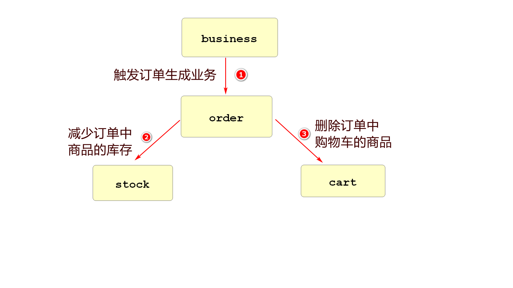
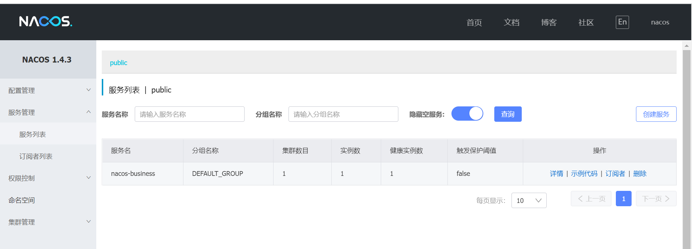
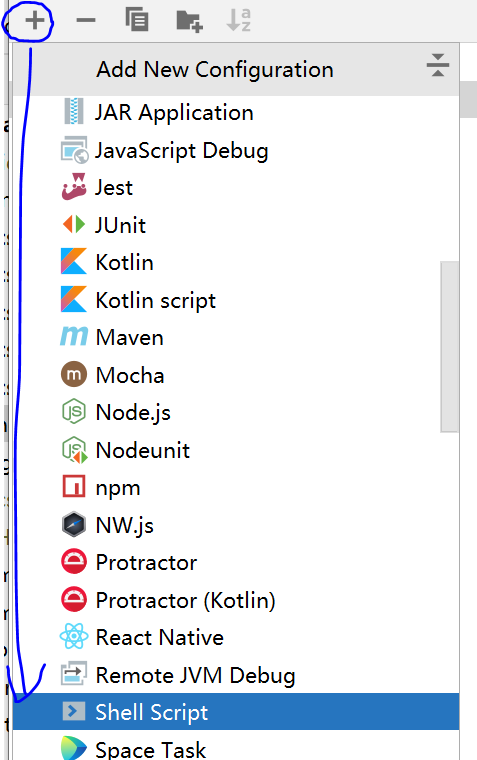
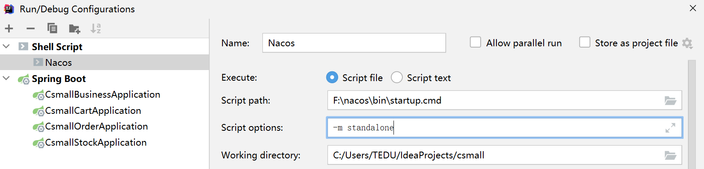

# 续 创建commons模块

## 创建实体类

创建包

pojo.cart.entity

包中创建类Cart

```java
@Data
public class Cart implements Serializable {
    private Integer id;
    // 商品编号
    private String commodityCode;
    // 价格
    private Integer price;
    // 数量
    private Integer count;
    // 用户id
    private Integer userId;

}
```

下面创建订单模块需要的类

pojo.order.dto.OrderAddDTO

```java
@ApiModel("新增订单的DTO")
@Data
public class OrderAddDTO implements Serializable {
    @ApiModelProperty(value = "用户id",name="userId",example = "UU100")
    private String userId;
    @ApiModelProperty(value = "商品编号",name="commodityCode",example = "PC100")
    private String commodityCode;
    @ApiModelProperty(value = "商品数量",name="count",example = "5")
    private Integer count;
    @ApiModelProperty(value = "总金额",name="money",example = "50")
    private Integer money;
}
```

pojo.order.entity.Order

```java
@Data
public class Order implements Serializable {
    private Integer id;
    private String userId;
    private String commodityCode;
    private Integer count;
    private Integer money;
}
```

最后是库存相关的类

pojo.stock.dto.StockReduceCountDTO

```java
@ApiModel("商品减少库存DTO")
@Data
public class StockReduceCountDTO implements Serializable {
    @ApiModelProperty(value = "商品编号",name="commodityCode",example = "PC100")
    private String commodityCode;
    @ApiModelProperty(value = "减库存数",name="reduceCount",example = "5")
    private Integer reduceCount;
}
```

pojo.stock.entity.Stock

```java
@Data
public class Stock implements Serializable {
    private Integer id;
    private String commodityCode;
    private Integer reduceCount;
}
```

## 创建异常相关类

commons项目除了实体类之外

项目使用到的所有异常相关类,也统一编写在这个类中

创建cn.tedu.csmall.commons.restful包

首先创建常见响应状态码的枚举

```java
/**
 * 错误代码枚举类型
 */
public enum ResponseCode {

    OK(200),
    BAD_REQUEST(400),
    UNAUTHORIZED(401),
    FORBIDDEN(403),
    NOT_FOUND(404),
    NOT_ACCEPTABLE(406),
    CONFLICT(409),
    INTERNAL_SERVER_ERROR(500);

    private Integer value;

    ResponseCode(Integer value) {
        this.value = value;
    }

    public Integer getValue() {
        return value;
    }

}
```

下面创建自定义异常类

创建包cn.tedu.csmall.commons.exception

包中创建类CoolSharkServiceException

```java
@Data
@EqualsAndHashCode(callSuper = false)
public class CoolSharkServiceException extends RuntimeException {

    private ResponseCode responseCode;

    public CoolSharkServiceException(ResponseCode responseCode, String message) {
        super(message);
        setResponseCode(responseCode);
    }

}
```

将restful包中用于控制器返回的JsonResult类复制

```java
@Data
public class JsonResult<T> implements Serializable {

    /**
     * 状态码
     */
    @ApiModelProperty(value = "业务状态码", position = 1, example = "200, 400, 401, 403, 404, 409, 500")
    private Integer state;
    /**
     * 消息
     */
    @ApiModelProperty(value = "业务消息", position = 2, example = "登录失败！密码错误！")
    private String message;
    /**
     * 数据
     */
    @ApiModelProperty(value = "业务数据", position = 3)
    private T data;

    /**
     * 创建响应结果对象，表示"成功"，不封装其它任何数据
     * @return 响应结果对象
     */
    public static JsonResult<Void> ok() {
        return ok("OK");
    }

    public static JsonResult ok(String message){
        JsonResult jsonResult=new JsonResult();
        jsonResult.setState(ResponseCode.OK.getValue());
        jsonResult.setMessage(message);
        jsonResult.setData(null);
        return jsonResult;
    }
    /**
     * 创建响应结果对象，表示"成功"，且封装客户端期望响应的数据
     * @param data 客户端期望响应的数据
     * @return 响应结果对象
     */
    public static <T> JsonResult<T> ok(String message,T data) {
        JsonResult<T> jsonResult = new JsonResult<>();
        jsonResult.setState(ResponseCode.OK.getValue());
        jsonResult.setData(data);
        return jsonResult;
    }
    /**
     * 创建响应结果对象，表示"失败"，且封装"失败"的描述
     *
     * @param e CoolSharkServiceException异常对象
     * @return 响应结果对象
     */
    public static JsonResult<Void> failed(CoolSharkServiceException e) {
        return failed(e.getResponseCode(), e);
    }

    /**
     * 创建响应结果对象，表示"失败"，且封装"失败"的描述
     *
     * @param responseCode "失败"的状态码
     * @param e            "失败"时抛出的异常对象
     * @return 响应结果对象
     */
    public static JsonResult<Void> failed(ResponseCode responseCode, Throwable e) {
        return failed(responseCode, e.getMessage());
    }

    /**
     * 创建响应结果对象，表示"失败"，且封装"失败"的描述
     *
     * @param responseCode "失败"的状态码
     * @param message      "失败"的描述文本
     * @return 响应结果对象
     */
    public static JsonResult<Void> failed(ResponseCode responseCode, String message) {
        JsonResult<Void> jsonResult = new JsonResult<>();
        jsonResult.setState(responseCode.getValue());
        jsonResult.setMessage(message);
        return jsonResult;
    }

}
```

exception包下最后创建复制统一异常处理类

```java
/**
 * 全局异常处理器
 */
@RestControllerAdvice
@Slf4j
public class GlobalControllerExceptionHandler {

    /**
     * 处理业务异常
     */
    @ExceptionHandler({CoolSharkServiceException.class})
    public JsonResult<Void> handleCoolSharkServiceException(CoolSharkServiceException e) {
        log.debug("出现业务异常，业务错误码={}，描述文本={}", e.getResponseCode().getValue(), e.getMessage());
        e.printStackTrace();
        JsonResult<Void> result = JsonResult.failed(e);
        log.debug("即将返回：{}", result);
        return result;
    }

    /**
     * 处理绑定异常（通过Validation框架验证请求参数时的异常）
     */
    @ExceptionHandler(BindException.class)
    public JsonResult<Void> handleBindException(BindException e) {
        log.debug("验证请求数据时出现异常：{}", e.getClass().getName());
        e.printStackTrace();
        String message = e.getBindingResult().getFieldError().getDefaultMessage();
        JsonResult<Void> result = JsonResult.failed(ResponseCode.BAD_REQUEST, message);
        log.debug("即将返回：{}", result);
        return result;
    }

    /**
     * 处理系统（其它）异常
     */
    @ExceptionHandler({Throwable.class})
    public JsonResult<Void> handleSystemError(Throwable e) {
        log.debug("出现系统异常，异常类型={}，描述文本={}", e.getClass().getName(), e.getMessage());
        e.printStackTrace();
        JsonResult<Void> result = JsonResult.failed(ResponseCode.INTERNAL_SERVER_ERROR, e);
        log.debug("即将返回：{}", result);
        return result;
    }
}
```

commons项目编写内容到此结束

# 创建business模块

## 搭建基本结构

business可以理解为业务的

我们创建这个模块是为了触发订单生成业务的



创建csmall-business

也要父子相认

最终子项目pom文件为:

```xml
<?xml version="1.0" encoding="UTF-8"?>
<project xmlns="http://maven.apache.org/POM/4.0.0" xmlns:xsi="http://www.w3.org/2001/XMLSchema-instance"
         xsi:schemaLocation="http://maven.apache.org/POM/4.0.0 https://maven.apache.org/xsd/maven-4.0.0.xsd">
    <modelVersion>4.0.0</modelVersion>
    <parent>
        <groupId>cn.tedu</groupId>
        <artifactId>csmall</artifactId>
        <version>0.0.1-SNAPSHOT</version>
    </parent>
    <groupId>cn.tedu</groupId>
    <artifactId>csmall-business</artifactId>
    <version>0.0.1-SNAPSHOT</version>
    <name>csmall-business</name>
    <description>Demo project for Spring Boot</description>

    <dependencies>
        <dependency>
            <groupId>org.springframework.boot</groupId>
            <artifactId>spring-boot-starter-web</artifactId>
        </dependency>
        <dependency>
            <groupId>com.github.xiaoymin</groupId>
            <artifactId>knife4j-spring-boot-starter</artifactId>
        </dependency>
        <dependency>
            <groupId>cn.tedu</groupId>
            <artifactId>csmall-commons</artifactId>
            <version>0.0.1-SNAPSHOT</version>
        </dependency>
    </dependencies>

</project>
```

创建application.yml文件

```yaml
server:
  port: 20000
#公共配置
mybatis:
  configuration:
    # 禁用缓存
    cache-enabled: false
    # 配置映射驼峰命名法,数据库中user_name的字段,会映射在java的userName属性上
    map-underscore-to-camel-case: true
    # 将运行的sql语句输出到控制台
    log-impl: org.apache.ibatis.logging.stdout.StdOutImpl
knife4j:
  # 开启增强配置
  enable: true
  # 生产环境屏蔽，开启将禁止访问在线API文档
  production: false
  # Basic认证功能，即是否需要通过用户名、密码验证后才可以访问在线API文档
  basic:
    # 是否开启Basic认证
    enable: false
    # 用户名，如果开启Basic认证却未配置用户名与密码，默认是：admin/123321
    username: root
    # 密码
    password: root
spring:
  profiles:
    active: dev
```

创建application-dev.yml文件以备后续配置使用,现在为空即可

删除项目中src下的test测试文件夹

创建config包,添加一些必要配置

创建CommonsConfiguration

```java
// 当前项目默认情况下不会扫描commons项目中的资源和内容,编写这个类,配置扫描commons
@Configuration // 所有配置Spring的配置类必须添加这个注解
@ComponentScan(basePackages = "cn.tedu.csmall.commons.exception")
public class CommonsConfiguration {
}
```

创建Knife4jConfiguration

(直接复制即可)

```java
@Configuration
@EnableSwagger2WebMvc
public class Knife4jConfiguration {

    /**
     * 【重要】指定Controller包路径
     */
    private String basePackage = "cn.tedu.csmall.business.controller";
    /**
     * 分组名称
     */
    private String groupName = "base-business";
    /**
     * 主机名
     */
    private String host = "http://java.tedu.cn";
    /**
     * 标题
     */
    private String title = "酷鲨商城项目案例在线API文档--基础business-web实例";
    /**
     * 简介
     */
    private String description = "构建基础business-web项目,实现购买";
    /**
     * 服务条款URL
     */
    private String termsOfServiceUrl = "http://www.apache.org/licenses/LICENSE-2.0";
    /**
     * 联系人
     */
    private String contactName = "项目研发部";
    /**
     * 联系网址
     */
    private String contactUrl = "http://java.tedu.cn";
    /**
     * 联系邮箱
     */
    private String contactEmail = "java@tedu.cn";
    /**
     * 版本号
     */
    private String version = "1.0-SNAPSHOT";

    @Autowired
    private OpenApiExtensionResolver openApiExtensionResolver;

    @Bean
    public Docket docket() {
        String groupName = "1.0-SNAPSHOT";
        Docket docket = new Docket(DocumentationType.SWAGGER_2)
                .host(host)
                .apiInfo(apiInfo())
                .groupName(groupName)
                .select()
                .apis(RequestHandlerSelectors.basePackage(basePackage))
                .paths(PathSelectors.any())
                .build()
                .extensions(openApiExtensionResolver.buildExtensions(groupName));
        return docket;
    }

    private ApiInfo apiInfo() {
        return new ApiInfoBuilder()
                .title(title)
                .description(description)
                .termsOfServiceUrl(termsOfServiceUrl)
                .contact(new Contact(contactName, contactUrl, contactEmail))
                .version(version)
                .build();
    }

}
```

## 编写业务

因为business是业务的触发者,不需要连接数据库,所以从业务逻辑层开始写即可

创建service包

包中创建接口IBusinessService

```java
public interface IBusinessService {
    // business业务触发购买下订单的方法声明
    void buy();
}
```

业务逻辑层实现

创建包service.impl

创建类BusinessServiceImpl

代码如下

```java
@Service
@Slf4j
public class BusinessServiceImpl implements IBusinessService {
    @Override
    public void buy() {
        // 暂时模拟一个下单业务
        // 创建OrderAddDTO类,赋值并输出信息
        OrderAddDTO orderAddDTO=new OrderAddDTO();
        orderAddDTO.setCommodityCode("PC100");
        orderAddDTO.setUserId("UU100");
        orderAddDTO.setMoney(500);
        orderAddDTO.setCount(5);
        // 因为没有持久层,只能输出一下,表示运行正常
        log.info("新增订单信息为:{}",orderAddDTO);
    }
}
```

控制层代码

创建controller包

包中创建BusinessController类

```java
@RestController
@RequestMapping("/base/business")
// knife4j介绍当前控制器作用
@Api(tags = "购买业务开始模块")
public class BusinessController {

    @Autowired
    private IBusinessService businessService;

    @PostMapping("/buy") // localhost:20000/base/business/buy
    @ApiOperation("发起购买")
    public JsonResult buy(){
        // 调用业务逻辑层方法即可
        businessService.buy();
        return JsonResult.ok("购买完成");
    }

}
```

可以启动当前项目

访问

http://localhost:20000/doc.html

点击测试,观察输出结果和控制台输出内容是否正常

## 注册到Nacos

我们的项目要想称为微服务项目必须注册到nacos

做具体配置之前,要明确,启动business之前,一定保证nacos在运行状态,否则启动business会报错的

首先在business的pom文件中添加依赖

```xml
<dependency>
    <groupId>com.alibaba.cloud</groupId>
    <artifactId>spring-cloud-starter-alibaba-nacos-discovery</artifactId>
</dependency>
```

然后再application-dev.yml文件中添加当前项目对nacos注册的配置

```yaml
spring:
  application:
    # 当前Springboot项目的名称,用作注册中心服务的名称
    name: nacos-business
  cloud:
    nacos:
      discovery:
        # 定义nacos运行的路径
        server-addr: localhost:8848
```

做完上面的配置

我们**在保证nacos已经启动的前提下**,我们启动business项目

启动之后,business一切功能正常,而且可以在nacos的服务列表中看到nacos-business的名称



## Nacos心跳机制

> 常见面试题

Nacos内部注册的服务分为两大类

1.临时实例(默认)

2.持久化实例(永久实例)

我们可以通过设置属性来确定它是临时还是永久

```yaml
cloud:
  nacos:
    discovery:
      # ephemeral设置当前项目启动时注册到nacos的类型 true(默认):临时实例 false:永久实例
      ephemeral: true 
```

临时实例和永久实例的区别

**临时实例**

默认情况下,启动服务后,每隔5秒会向nacos发送一个"心跳包",这个心跳包中包含了当前服务的基本信息

Nacos收到这个"心跳包"如果发现这个服务的信息不在注册列表中,就进行注册,如果这个服务的信息在注册列表中就表明这个服务还是健康的

如果Nacos15秒内没接收到某个服务的心跳包,Nacos会将这个服务标记为不健康的状态

如果30秒内没有接收到这个服务的心跳包,Nacos会将这个服务从注册列表中剔除

这些时间都是可以通过配置修改的

**持久化实例(永久实例)**

持久化实例启动时向nacos注册,nacos会对这个实例进行持久化处理

心跳包的规则和临时实例一致,只是不会将该服务从列表中剔除

## 各类型使用时机

一般情况下,我们创建的服务都是临时实例

只有项目的主干业务才会设置为永久实例

# 使用Idea启动Nacos

我们每次开机都要先启动nacos才能启动其他服务

我们使用dos窗口敲代码启动nacos还是比较麻烦的

我们可以使用idea提供的功能,简化nacos启动的过程






配置完成后,就可以在idea中启动nacos

# 创建cart子模块(项目)

## 项目配置

创建csmall-cart子项目

父项目pom文件修改

子项目pom文件最终为

```xml
<?xml version="1.0" encoding="UTF-8"?>
<project xmlns="http://maven.apache.org/POM/4.0.0" xmlns:xsi="http://www.w3.org/2001/XMLSchema-instance"
         xsi:schemaLocation="http://maven.apache.org/POM/4.0.0 https://maven.apache.org/xsd/maven-4.0.0.xsd">
    <modelVersion>4.0.0</modelVersion>
    <parent>
        <groupId>cn.tedu</groupId>
        <artifactId>csmall</artifactId>
        <version>0.0.1-SNAPSHOT</version>
    </parent>
    <groupId>cn.tedu</groupId>
    <artifactId>csmall-cart</artifactId>
    <version>0.0.1-SNAPSHOT</version>
    <name>csmall-cart</name>
    <description>Demo project for Spring Boot</description>
    <dependencies>
        <!--web实例-->
        <dependency>
            <groupId>org.springframework.boot</groupId>
            <artifactId>spring-boot-starter-web</artifactId>
        </dependency>
        <!--mybatis整合springboot-->
        <dependency>
            <groupId>org.mybatis.spring.boot</groupId>
            <artifactId>mybatis-spring-boot-starter</artifactId>
        </dependency>
        <!--alibaba 数据源德鲁伊-->
        <dependency>
            <groupId>com.alibaba</groupId>
            <artifactId>druid</artifactId>
        </dependency>
        <!--mysql驱动-->
        <dependency>
            <groupId>mysql</groupId>
            <artifactId>mysql-connector-java</artifactId>
        </dependency>
        <!--all-common依赖-->
        <dependency>
            <groupId>cn.tedu</groupId>
            <artifactId>csmall-commons</artifactId>
            <version>0.0.1-SNAPSHOT</version>
        </dependency>
        <!--在线api文档-->
        <dependency>
            <groupId>com.github.xiaoymin</groupId>
            <artifactId>knife4j-spring-boot-starter</artifactId>
        </dependency>
    </dependencies>

</project>
```

删除test文件夹

删除application.properties

创建application.yml内容如下

```yaml
server:
  port: 20001
#公共配置
mybatis:
  configuration:
    cache-enabled: false
    map-underscore-to-camel-case: true
    log-impl: org.apache.ibatis.logging.stdout.StdOutImpl
knife4j:
  # 开启增强配置
  enable: true
  # 生产环境屏蔽，开启将禁止访问在线API文档
  production: false
  # Basic认证功能，即是否需要通过用户名、密码验证后才可以访问在线API文档
  basic:
    # 是否开启Basic认证
    enable: false
    # 用户名，如果开启Basic认证却未配置用户名与密码，默认是：admin/123321
    username: root
    # 密码
    password: root
spring:
  profiles:
    active: dev
```

创建application-dev.yml文件

因为cart模块真连接数据库

所以dev文件中,添加连库配置信息

```yaml
spring:
  datasource:
    url: jdbc:mysql://localhost:3306/csmall_db?useSSL=false&useUnicode=true&characterEncoding=utf-8&serverTimezone=Asia/Shanghai&allowMultiQueries=true
    username: root
    password: root
```

## 准备数据

我们cart模块要操作数据库,首先保证要有数据

所以我们要创建需要的表和添加表中的数据

sql代码已经发送在项目的node文件夹中

运行其中的sql代码即可

```sql
CREATE DATABASE `csmall_db`;
USE `csmall_db`;

/*Table structure for table `cart_tbl` */

DROP TABLE IF EXISTS `cart_tbl`;

CREATE TABLE `cart_tbl` (
  `id` int NOT NULL AUTO_INCREMENT COMMENT '购物车id',
  `commodity_code` varchar(255) DEFAULT NULL COMMENT '商品编码',
  `price` int DEFAULT '0' COMMENT '商品单价',
  `count` int DEFAULT '0' COMMENT '购买数量',
  `user_id` varchar(255) DEFAULT NULL COMMENT '用户id',
  PRIMARY KEY (`id`),
  UNIQUE KEY `commodity_code` (`commodity_code`)
) ENGINE=InnoDB AUTO_INCREMENT=3 DEFAULT CHARSET=utf8mb3;

/*Data for the table `cart_tbl` */

insert  into `cart_tbl`(`id`,`commodity_code`,`price`,`count`,`user_id`) values 
(1,'PU201',500,10,'UU100');

/*Table structure for table `order_tbl` */

DROP TABLE IF EXISTS `order_tbl`;

CREATE TABLE `order_tbl` (
  `id` int NOT NULL AUTO_INCREMENT COMMENT '订单id',
  `user_id` varchar(255) DEFAULT NULL COMMENT '用户id',
  `commodity_code` varchar(255) DEFAULT NULL COMMENT '商品编码,也可以是商品id',
  `count` int DEFAULT '0' COMMENT '购买这个商品的数量',
  `money` int DEFAULT '0' COMMENT '订单金额',
  PRIMARY KEY (`id`)
) ENGINE=InnoDB AUTO_INCREMENT=27 DEFAULT CHARSET=utf8mb3;

/*Data for the table `order_tbl` */

insert  into `order_tbl`(`id`,`user_id`,`commodity_code`,`count`,`money`) values 
(22,'UU100','PU201',10,200),
(23,'UU100','PU201',10,200),
(24,'UU100','PU201',10,200),
(25,'UU100','PU201',10,200);

/*Table structure for table `stock_tbl` */

DROP TABLE IF EXISTS `stock_tbl`;

CREATE TABLE `stock_tbl` (
  `id` int NOT NULL AUTO_INCREMENT COMMENT '商品id',
  `commodity_code` varchar(255) DEFAULT NULL COMMENT '商品编码',
  `count` int DEFAULT '0' COMMENT '商品库存',
  PRIMARY KEY (`id`),
  UNIQUE KEY `commodity_code` (`commodity_code`)
) ENGINE=InnoDB AUTO_INCREMENT=3 DEFAULT CHARSET=utf8mb3;

/*Data for the table `stock_tbl` */

insert  into `stock_tbl`(`id`,`commodity_code`,`count`) values 
(1,'PU201',990);

/*Table structure for table `undo_log` */

DROP TABLE IF EXISTS `undo_log`;

CREATE TABLE `undo_log` (
  `id` bigint NOT NULL AUTO_INCREMENT,
  `branch_id` bigint NOT NULL,
  `xid` varchar(100) NOT NULL,
  `context` varchar(128) NOT NULL,
  `rollback_info` longblob NOT NULL,
  `log_status` int NOT NULL,
  `log_created` datetime NOT NULL,
  `log_modified` datetime NOT NULL,
  PRIMARY KEY (`id`),
  UNIQUE KEY `ux_undo_log` (`xid`,`branch_id`)
) ENGINE=InnoDB AUTO_INCREMENT=68 DEFAULT CHARSET=utf8mb3;


```

运行完毕之后,会出现csmall_db数据库

其中有4个表

表中有少量数据

后面会使用

## 编写配置类

和business模块一样,cart模块也需要config包中的类

可以直接从business模块的config包复制过来

```java
@Configuration // 所有配置Spring的配置类必须添加这个注解
@ComponentScan(basePackages = "cn.tedu.csmall.commons.exception")
public class CommonsConfiguration {
}
```

knife4j配置

```java
@Configuration
@EnableSwagger2WebMvc
public class Knife4jConfiguration {

    /**
     * 【重要】指定Controller包路径
     */
    private String basePackage = "cn.tedu.csmall.cart.controller";
    /**
     * 分组名称
     */
    private String groupName = "base-cart";
    /**
     * 主机名
     */
    private String host = "http://java.tedu.cn";
    /**
     * 标题
     */
    private String title = "酷鲨商城项目案例在线API文档--基础cart-web实例";
    /**
     * 简介
     */
    private String description = "构建基础cart-web项目,实现购物车维护";
    /**
     * 服务条款URL
     */
    private String termsOfServiceUrl = "http://www.apache.org/licenses/LICENSE-2.0";
    /**
     * 联系人
     */
    private String contactName = "项目研发部";
    /**
     * 联系网址
     */
    private String contactUrl = "http://java.tedu.cn";
    /**
     * 联系邮箱
     */
    private String contactEmail = "java@tedu.cn";
    /**
     * 版本号
     */
    private String version = "1.0-SNAPSHOT";

    @Autowired
    private OpenApiExtensionResolver openApiExtensionResolver;

    @Bean
    public Docket docket() {
        String groupName = "1.0-SNAPSHOT";
        Docket docket = new Docket(DocumentationType.SWAGGER_2)
                .host(host)
                .apiInfo(apiInfo())
                .groupName(groupName)
                .select()
                .apis(RequestHandlerSelectors.basePackage(basePackage))
                .paths(PathSelectors.any())
                .build()
                .extensions(openApiExtensionResolver.buildExtensions(groupName));
        return docket;
    }

    private ApiInfo apiInfo() {
        return new ApiInfoBuilder()
                .title(title)
                .description(description)
                .termsOfServiceUrl(termsOfServiceUrl)
                .contact(new Contact(contactName, contactUrl, contactEmail))
                .version(version)
                .build();
    }

}
```

当前cart模块除了上述配置之外还要添加一个Mybatis扫描的配置

config包中再创建一个MybatisConfiguration类代码如下

```java
@Configuration
// Mybatis扫描必须指定到mapper包
@MapperScan("cn.tedu.csmall.cart.mapper")
public class MybatisConfiguration {
    
}
```

配置nacos的pom

```xml
<dependency>
    <groupId>com.alibaba.cloud</groupId>
    <artifactId>spring-cloud-starter-alibaba-nacos-discovery</artifactId>
</dependency>
```

application-dev.yml配置注册到nacos的信息

```yaml
spring:
  datasource:
    url: jdbc:mysql://localhost:3306/csmall_db?useSSL=false&useUnicode=true&characterEncoding=utf-8&serverTimezone=Asia/Shanghai&allowMultiQueries=true
    username: root
    password: root
  application:
    name: nacos-cart
  cloud:
    nacos:
      discovery:
        server-addr: localhost:8848
```

在nacos启动的前提下,我们的cart模块就可以启动并注册到nacos了


# 编写cart项目的业务内容

cart模块能够正常启动,但是还没有任何业务

结合我们最终生成订单的业务

当前cart模块需要开发如下两个功能

1.新增购物车中商品

2.删除购物车中商品

### 开发持久层

创建mapper包

mapper包中创建CartMapper接口

```java
public interface CartMapper {
    // 新增购物车中商品的方法
    @Insert("insert into cart_tbl(commodity_code,user_id,price,count) " +
            "values(#{commodityCode},#{userId},#{price},#{count})")
    void insertCart(Cart cart);
    
    // 删除购物车中商品的方法
    @Delete("delete from cart_tbl where user_id=#{userId} and commodity_code=#{commodityCode}")
    void deleteCartByUserIdAndCommodityCode(@Param("userId") String userid,
                                            @Param("commodityCode") String commodityCode);

}
```

### 开发业务逻辑层

创建service包

先在包中创建接口ICartService

接口中应该包含新增和删除购物车的业务逻辑层方法声明

```java
public interface ICartService {
    // 新增购物车的业务逻辑层方法
    void cartAdd(CartAddDTO cartAddDTO);
    // 删除购物车的业务逻辑层方法
    void deleteUserCart(String userId,String commodityCode);
}
```

开发实现类

```java
@Service
@Slf4j
public class CartServiceImpl implements ICartService {

    @Autowired
    private CartMapper cartMapper;

    @Override
    public void cartAdd(CartAddDTO cartAddDTO) {
        // 实例化一个Cart对象
        Cart cart=new Cart();
        // 利用工具类,将cartAddDTO中的属性值赋值到cart对象的同名属性中
        BeanUtils.copyProperties(cartAddDTO,cart);
        // 调用cartMapper对象实现新增功能
        cartMapper.insertCart(cart);
        log.info("新增购物车商品成功!{}",cart);
    }

    @Override
    public void deleteUserCart(String userId, String commodityCode) {
        // 直接调用mapper删除购物车商品的方法即可
        cartMapper.deleteCartByUserIdAndCommodityCode(userId,commodityCode);
        log.info("购物车商品删除成功");
    }
}
```

### 开发控制层

创建controller包

包中创建CartController类

```java
@RestController
@RequestMapping("/base/cart")
@Api(tags="购物车模块")
public class CartController {

    @Autowired
    private ICartService cartService;

    @PostMapping("/add")
    @ApiOperation("新增购物车商品")
    public JsonResult cartAdd(CartAddDTO cartAddDTO){
        cartService.cartAdd(cartAddDTO);
        return JsonResult.ok("新增购物车商品完成");
    }

    @PostMapping("/delete")
    @ApiOperation("删除购物车中商品")
    @ApiImplicitParams({
            @ApiImplicitParam(value = "用户id",name="userId",
                    example = "UU100",required = true),
            @ApiImplicitParam(value = "商品编号",name="commodityCode",
                    example = "PC100",required = true)
    })
    public JsonResult deleteUserCart(String userId,String commodityCode){
        // 调用业务逻辑层删除购物车商品的方法
        cartService.deleteUserCart(userId,commodityCode);
        return JsonResult.ok("删除购物车商品成功");
    }

}
```

启动服务

测试新增和删除的方法


