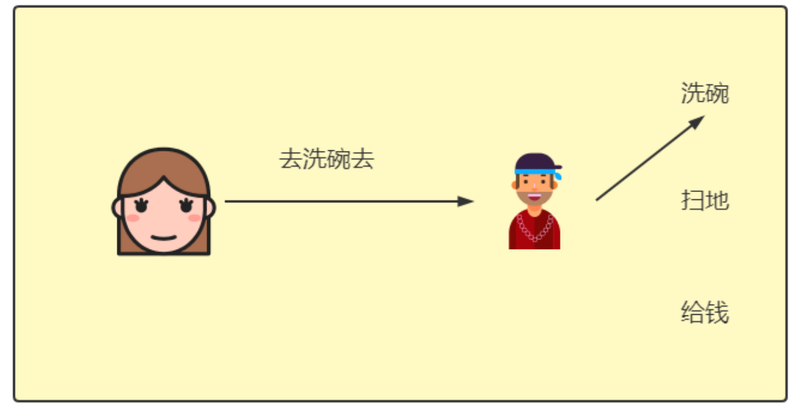
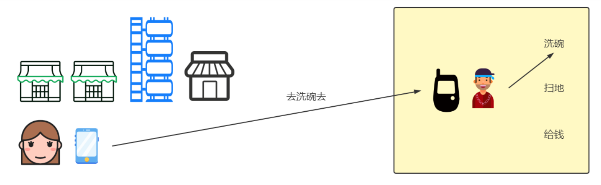
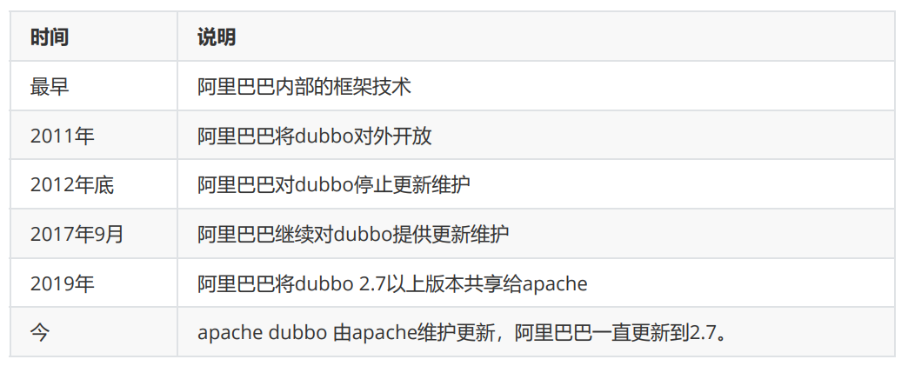
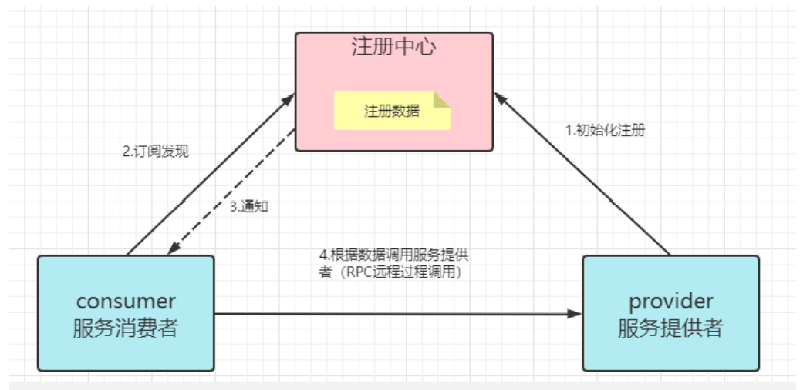
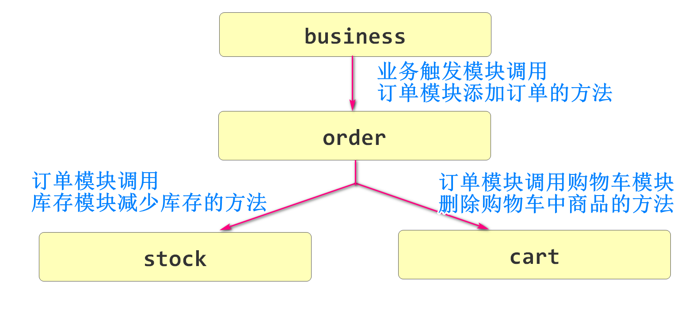
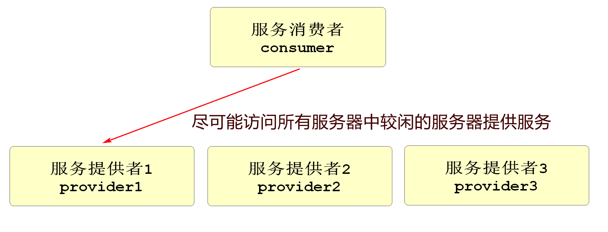

# 创建order模块

## 项目搭建

创建csmall-order

父子相认

子项目pom文件

```xml
<?xml version="1.0" encoding="UTF-8"?>
<project xmlns="http://maven.apache.org/POM/4.0.0" xmlns:xsi="http://www.w3.org/2001/XMLSchema-instance"
         xsi:schemaLocation="http://maven.apache.org/POM/4.0.0 https://maven.apache.org/xsd/maven-4.0.0.xsd">
    <modelVersion>4.0.0</modelVersion>
    <parent>
        <groupId>cn.tedu</groupId>
        <artifactId>csmall</artifactId>
        <version>0.0.1-SNAPSHOT</version>
    </parent>
    <groupId>cn.tedu</groupId>
    <artifactId>csmall-order</artifactId>
    <version>0.0.1-SNAPSHOT</version>
    <name>csmall-order</name>
    <description>Demo project for Spring Boot</description>
    <dependencies>
        <!--web实例-->
        <dependency>
            <groupId>org.springframework.boot</groupId>
            <artifactId>spring-boot-starter-web</artifactId>
        </dependency>
        <!--mybatis整合springboot-->
        <dependency>
            <groupId>org.mybatis.spring.boot</groupId>
            <artifactId>mybatis-spring-boot-starter</artifactId>
        </dependency>
        <!--alibaba 数据源德鲁伊-->
        <dependency>
            <groupId>com.alibaba</groupId>
            <artifactId>druid</artifactId>
        </dependency>
        <!--mysql驱动-->
        <dependency>
            <groupId>mysql</groupId>
            <artifactId>mysql-connector-java</artifactId>
        </dependency>
        <!--all-common依赖-->
        <dependency>
            <groupId>cn.tedu</groupId>
            <artifactId>csmall-commons</artifactId>
            <version>0.0.1-SNAPSHOT</version>
        </dependency>
        <!--在线api文档-->
        <dependency>
            <groupId>com.github.xiaoymin</groupId>
            <artifactId>knife4j-spring-boot-starter</artifactId>
        </dependency>
        <!-- nacos注册中心依赖 -->
        <dependency>
            <groupId>com.alibaba.cloud</groupId>
            <artifactId>spring-cloud-starter-alibaba-nacos-discovery</artifactId>
        </dependency>
    </dependencies>

</project>
```

删除test文件夹

删除application.properties文件

可以将cart模块的application.yml文件和application-dev.yml赋值过来

但是要修改需要变化的属性

application.yml端口号修改

```
server:
  port: 20002
```

application-dev.yml修改项目名称

```
application:
  name: nacos-order
```

## config配置

下面将cart模块的config包直接复制到order模块

knife4j配置主要修改:

```java
/**
 * 【重要】指定Controller包路径
 */
private String basePackage = "cn.tedu.csmall.order.controller";
/**
 * 分组名称
 */
private String groupName = "base-order";
```

Mybatis配置

```java
@Configuration
// Mybatis扫描必须指定到mapper包
@MapperScan("cn.tedu.csmall.order.mapper")
public class MybatisConfiguration {

}
```

## 编写新增订单功能

### 开发持久层

创建mapper包

创建OrderMapper接口

添加新增订单方法

```java
@Repository
public interface OrderMapper {
    // 新增订单的mapper方法
    @Insert("insert into order_tbl(user_id,commodity_code,count,money) " +
            "values(#{userId},#{commodityCode},#{count},#{money})")
    void insertOrder(Order order);
}
```

### 开发业务逻辑层

创建service包

包中创建IOrderService

```java
public interface IOrderService {

    // 新增订单到数据库的业务逻辑层方法
    void orderAdd(OrderAddDTO orderAddDTO);
}
```

创建service.impl包

包中创建OrderServiceImpl

```java
@Service
@Slf4j
public class OrderServiceImpl implements IOrderService {

    @Autowired
    private OrderMapper orderMapper;

    @Override
    public void orderAdd(OrderAddDTO orderAddDTO) {
        // 1.减少订单商品的库存(要调用stock模块的方法)
        // 2.删除订单中购物车商品的信息(要调用cart模块的方法)
        // 3.新增订单
        // 实例化订单对象
        Order order=new Order();
        // 赋值同名属性
        BeanUtils.copyProperties(orderAddDTO,order);
        // 调用持久层方法
        orderMapper.insertOrder(order);
        log.info("新增订单完成:{}",order);
    }
}
```

### 开发控制层

创建controller包

创建OrderController类

```java
@RestController
@RequestMapping("/base/order")
@Api(tags="订单模块")
public class OrderController {
    @Autowired
    private IOrderService orderService;
    @ApiOperation("新增订单")
    @PostMapping("/add")
    public JsonResult orderAdd(OrderAddDTO orderAddDTO){
        // 调用业务逻辑层方法
        orderService.orderAdd(orderAddDTO);
        return JsonResult.ok("新增订单完成");
    }
}
```

启动项目

检查nacos注册状态和knife4j测试新增订单效果

**先启动nacos**再启动order

#  创建stock模块

## 项目搭建

创建csmall-stock

修改父项目pom文件

子项目pom文件

```xml
<?xml version="1.0" encoding="UTF-8"?>
<project xmlns="http://maven.apache.org/POM/4.0.0" xmlns:xsi="http://www.w3.org/2001/XMLSchema-instance"
         xsi:schemaLocation="http://maven.apache.org/POM/4.0.0 https://maven.apache.org/xsd/maven-4.0.0.xsd">
    <modelVersion>4.0.0</modelVersion>
    <parent>
        <groupId>cn.tedu</groupId>
        <artifactId>csmall</artifactId>
        <version>0.0.1-SNAPSHOT</version>
    </parent>
    <groupId>cn.tedu</groupId>
    <artifactId>csmall-stock</artifactId>
    <version>0.0.1-SNAPSHOT</version>
    <name>csmall-stock</name>
    <description>Demo project for Spring Boot</description>
    <dependencies>
        <!--web实例-->
        <dependency>
            <groupId>org.springframework.boot</groupId>
            <artifactId>spring-boot-starter-web</artifactId>
        </dependency>
        <!--mybatis整合springboot-->
        <dependency>
            <groupId>org.mybatis.spring.boot</groupId>
            <artifactId>mybatis-spring-boot-starter</artifactId>
        </dependency>
        <!--alibaba 数据源德鲁伊-->
        <dependency>
            <groupId>com.alibaba</groupId>
            <artifactId>druid</artifactId>
        </dependency>
        <!--mysql驱动-->
        <dependency>
            <groupId>mysql</groupId>
            <artifactId>mysql-connector-java</artifactId>
        </dependency>
        <!--all-common依赖-->
        <dependency>
            <groupId>cn.tedu</groupId>
            <artifactId>csmall-commons</artifactId>
            <version>0.0.1-SNAPSHOT</version>
        </dependency>
        <!--在线api文档-->
        <dependency>
            <groupId>com.github.xiaoymin</groupId>
            <artifactId>knife4j-spring-boot-starter</artifactId>
        </dependency>
        <!-- nacos注册中心依赖 -->
        <dependency>
            <groupId>com.alibaba.cloud</groupId>
            <artifactId>spring-cloud-starter-alibaba-nacos-discovery</artifactId>
        </dependency>
    </dependencies>

</project>
```

删除test测试文件夹

删除application.properties文件

复制order\cart模块的application.yml和application-dev.yml文件

修改端口号和项目名称

## config配置

从order\cart模块复制config包

修改对应的包名

## 编写减少库存功能

### 开发持久层

mapper包下StockMapper

```java
@Repository
public interface StockMapper {
    // 减少指定商品库存的方法
    @Update("update stock_tbl set count=count-#{reduceCount} " +
            " where commodity_code=#{commodityCode} and count>=#{reduceCount}")
    void updateStockByCommodityCode(@Param("commodityCode") String commodityCode,
                                    @Param("reduceCount") Integer reduceCount);
}
```

### 开发业务层

在service包下创建IStockService

```java
public interface IStockService {
    // 减少库存数的业务逻辑层方法
    void reduceCommodityCount(StockReduceCountDTO stockReduceCountDTO);
}
```

service.impl包下

```java
@Service
@Slf4j
public class StockServiceImpl implements IStockService {

    @Autowired
    private StockMapper stockMapper;

    @Override
    public void reduceCommodityCount(StockReduceCountDTO stockReduceCountDTO) {
        stockMapper.updateStockByCommodityCode(
                stockReduceCountDTO.getCommodityCode(), // 第一个参数是商品编号
                stockReduceCountDTO.getReduceCount());  // 第二个参数是减少的库存数
        log.info("库存减少完成!");

    }
}
```

### 开发控制层

controller包

StockContrller类

```java
@RestController
@RequestMapping("/base/stock")
@Api(tags = "库存管理")
public class StockController {

    @Autowired
    private IStockService stockService;
    @PostMapping("/reduce/count")
    @ApiOperation("减少商品库存业务")
    public JsonResult reduceCommodityCount(StockReduceCountDTO stockReduceCountDTO){
        stockService.reduceCommodityCount(stockReduceCountDTO);
        return JsonResult.ok("商品库存减少完成!");
    }

}
```

启动服务测试成功即可

# Dubbo概述

## 什么是RPC

RPC是Remote Procedure Call的缩写 翻译为:远程过程调用

目标是为了实现两台(多台)计算机\服务器,互相调用方法\通信的解决方案

RPC的概念主要定义了两部分内容

1.序列化协议

2.通信协议

为了方便大家理解RPC,下面的图片帮助理解



上面图是老婆和老公在家的时,老婆让老公洗碗的调用流程

但这个流程是本地的,

我们再换成远程调用的图片



**通信协议**

通信协议指的就是远程调用的通信方式

再上面图片调用中,老婆使用手机信息的方法通知老公去洗碗

实际上这个通知的方式可以有多种

例如:写信,飞鸽传书,闪送等等

**序列化协议**

序列化协议指通信内容的格式,双方都要理解这个格式

上面的图片中,老婆给老公发信息,一定是双方都能理解的信息

发送信息是序列化过程,接收信息需要反序列化

## 什么是Dubbo

理解了RPC再学习Dubbo就会简单一些了

Dubbo是一套RPC框架。既然是框架，我们可以在框架结构高度，定义Dubbo中使用的通信协议，使用的序列化框架技术，而数据格式由Dubbo定义，我们负责配置之后直接通过客户端调用服务端代码。

简单来说,Dubbo就是RPC概念的实现

Dubbo是Spring Cloud Alibaba提供的一个框架

能够实现微服务项目的互相调用

## Dubbo的发展历程



2012年底dubbo停止更新后到2017年dubbo继续更新之前

2015SpringCloud开始兴起,当时没有阿里的框架

国内公司要从SpringCloud和Dubbo中抉择使用哪个微服务方案

在2012年dubbo停止更新后国内的当当网在dubbo的基础上开发了dubboX框架,并进行维护 

2019年后,SpringCloud和Dubbo才能共同使用

## Dubbo的协议支持

RPC框架分通信协议和序列化协议

Dubbo框架支持多种通信协议和序列化协议,可以通过配置文件进行修改

支持的通信协议有

* dubbo协议(默认)
* rmi协议
* hessian协议
* http协议
* webservice
* .....

支持的序列化协议

* hessian2(默认)
* java序列化
* compactedjava
* nativejava
* fastjson
* dubbo
* fst
* kryo

Dubbo默认情况下,协议的特征如下

* 采用NIO单一长连接
* 优秀的并发性能,但是大型文件的处理差
* Dubbo开发简单,有助于提升开发效率

## Dubbo服务的注册与发现

在Dubbo的调用过程中,必须包含注册中心的支持

注册中心推荐使用Nacos,但是如果使用其他软件也能实现例如(Redis,zookeeper等)

服务发现，即消费端自动发现服务地址列表的能力，是微服务框架需要具备的关键能力，借助于自动化的服务发现，微服务之间可以在无需感知对端部署位置与 IP 地址的情况下实现通信。

上面的示例中,老婆就是服务器的发现者,它能够获取老公的所有功能列表

老婆一旦调用公的服务就完成了Dubbo的调用



consumer服务的消费者,指服务的调用者(使用者)也就是老婆的位置

provider服务的提供者,指服务的拥有者(生产者)也就是老公的位置

在Dubbo中,远程调用依据是服务的提供者在Nacos中注册的服务名称

一个服务名称,可能有多个运行的实例,任何一个空闲的实例都可以提供服务

> 常见面试题:Dubbo的注册发现流程

1.首先服务的提供者启动服务到注册中心注册,包括各种ip端口信息,Dubbo会同时注册该项目提供的远程调用的方法

2.服务的消费者(使用者)注册到注册中心,订阅发现

3.当有新的远程调用方法注册到注册中心时,注册中心会通知服务的消费者有哪些新的方法,如何调用的信息

4.RPC调用,在上面条件满足的情况下,服务的调用者无需知道ip和端口号,只需要服务名称就可以调用到服务提供者的方法

# Dubbo实现微服务调用

## 确定调用关系



在上面的模型中,以order调用stock减少库存的业务举例

order模块是消费者stock模块是生产者

在代码调用时,首先要对项目进行必要的配置

我们调用时一般会在消费者项目的代码业务逻辑层中,编写调用生产者业务逻辑层方法的代码

这样做的好处

我们的生成者正常编写mapper>service>controller这个开发流程不会因为Dubbo的介入而变化

## 修改stock模块

### 创建csmall-stock-service项目

stock模块要新建一个项目单独保存要公开给其他微服务项目的方法接口

创建csmall-stock-service项目

删除test\删除resources\删除SpringBoot启动类

csmall-stock父项目pom文件添加必要配置

```xml
<groupId>cn.tedu</groupId>
<artifactId>csmall-stock</artifactId>
<version>0.0.1-SNAPSHOT</version>
<name>csmall-stock</name>
<description>Demo project for Spring Boot</description>
<!--  ↓↓↓↓↓↓↓↓↓↓↓↓↓↓↓↓↓↓↓↓↓-->
<packaging>pom</packaging>
<modules>
    <module>csmall-stock-service</module>
</modules>
```

子项目要编写最低限度的pom依赖

```xml
<?xml version="1.0" encoding="UTF-8"?>
<project xmlns="http://maven.apache.org/POM/4.0.0" xmlns:xsi="http://www.w3.org/2001/XMLSchema-instance"
         xsi:schemaLocation="http://maven.apache.org/POM/4.0.0 https://maven.apache.org/xsd/maven-4.0.0.xsd">
    <modelVersion>4.0.0</modelVersion>
    <parent>
        <groupId>cn.tedu</groupId>
        <artifactId>csmall-stock</artifactId>
        <version>0.0.1-SNAPSHOT</version>
    </parent>
    <groupId>cn.tedu</groupId>
    <artifactId>csmall-stock-service</artifactId>
    <version>0.0.1-SNAPSHOT</version>
    <name>csmall-stock-service</name>
    <description>Demo project for Spring Boot</description>
    <dependencies>
        <dependency>
            <groupId>cn.tedu</groupId>
            <artifactId>csmall-commons</artifactId>
            <version>0.0.1-SNAPSHOT</version>
        </dependency>
    </dependencies>

</project>
```

然后将原有的业务逻辑层接口复制到这个项目中即可

```java
public interface IStockService {
    // 减少库存数的业务逻辑层方法
    void reduceCommodityCount(StockReduceCountDTO stockReduceCountDTO);
}
```

### 创建csmall-stock-webapi项目

创建csmall-stock-webapi项目

删除test测试文件夹

父子相认

csmall-stock的pom文件最终为:

```xml
<?xml version="1.0" encoding="UTF-8"?>
<project xmlns="http://maven.apache.org/POM/4.0.0" xmlns:xsi="http://www.w3.org/2001/XMLSchema-instance"
         xsi:schemaLocation="http://maven.apache.org/POM/4.0.0 https://maven.apache.org/xsd/maven-4.0.0.xsd">
    <modelVersion>4.0.0</modelVersion>
    <parent>
        <groupId>cn.tedu</groupId>
        <artifactId>csmall</artifactId>
        <version>0.0.1-SNAPSHOT</version>
    </parent>
    <groupId>cn.tedu</groupId>
    <artifactId>csmall-stock</artifactId>
    <version>0.0.1-SNAPSHOT</version>
    <name>csmall-stock</name>
    <description>Demo project for Spring Boot</description>
    <packaging>pom</packaging>
    <modules>
        <module>csmall-stock-service</module>
        <module>csmall-stock-webapi</module>
    </modules>
    
</project>
```

修改子项目pom文件

```xml
<?xml version="1.0" encoding="UTF-8"?>
<project xmlns="http://maven.apache.org/POM/4.0.0" xmlns:xsi="http://www.w3.org/2001/XMLSchema-instance"
         xsi:schemaLocation="http://maven.apache.org/POM/4.0.0 https://maven.apache.org/xsd/maven-4.0.0.xsd">
    <modelVersion>4.0.0</modelVersion>
    <parent>
        <groupId>cn.tedu</groupId>
        <artifactId>csmall-stock</artifactId>
        <version>0.0.1-SNAPSHOT</version>
    </parent>
    <groupId>cn.tedu</groupId>
    <artifactId>csmall-stock-webapi</artifactId>
    <version>0.0.1-SNAPSHOT</version>
    <name>csmall-stock-webapi</name>
    <description>Demo project for Spring Boot</description>
    <dependencies>
        <!--web实例-->
        <dependency>
            <groupId>org.springframework.boot</groupId>
            <artifactId>spring-boot-starter-web</artifactId>
        </dependency>
        <!--mybatis整合springboot-->
        <dependency>
            <groupId>org.mybatis.spring.boot</groupId>
            <artifactId>mybatis-spring-boot-starter</artifactId>
        </dependency>
        <!--alibaba 数据源德鲁伊-->
        <dependency>
            <groupId>com.alibaba</groupId>
            <artifactId>druid</artifactId>
        </dependency>
        <!--mysql驱动-->
        <dependency>
            <groupId>mysql</groupId>
            <artifactId>mysql-connector-java</artifactId>
        </dependency>
        <!--all-common依赖-->
        <dependency>
            <groupId>cn.tedu</groupId>
            <artifactId>csmall-commons</artifactId>
            <version>0.0.1-SNAPSHOT</version>
        </dependency>
        <!--在线api文档-->
        <dependency>
            <groupId>com.github.xiaoymin</groupId>
            <artifactId>knife4j-spring-boot-starter</artifactId>
        </dependency>
        <!-- nacos注册中心依赖 -->
        <dependency>
            <groupId>com.alibaba.cloud</groupId>
            <artifactId>spring-cloud-starter-alibaba-nacos-discovery</artifactId>
        </dependency>
        <!-- Dubbo依赖 -->
        <dependency>
            <groupId>com.alibaba.cloud</groupId>
            <artifactId>spring-cloud-starter-dubbo</artifactId>
        </dependency>
        <!-- 添加camall-stock-service的依赖,以实现业务逻辑层接口 -->
        <dependency>
            <groupId>cn.tedu</groupId>
            <artifactId>csmall-stock-service</artifactId>
            <version>0.0.1-SNAPSHOT</version>
        </dependency>
    </dependencies>

</project>
```

将csmall-stock项目的application.yml和application-dev.yml复制到csmall-stock-webapi项目的resources文件夹下

修改application-dev.yml最终内容为

```yml
spring:
  datasource:
    url: jdbc:mysql://localhost:3306/csmall_db?useSSL=false&useUnicode=true&characterEncoding=utf-8&serverTimezone=Asia/Shanghai&allowMultiQueries=true
    username: root
    password: root
  application:
    name: nacos-stock
  cloud:
    nacos:
      discovery:
        server-addr: localhost:8848
dubbo:
  protocol:
    port: -1 # 设置Dubbo服务调用的端口 设置-1能够实现动态自动设置合适端口,生成规则是从20880开始递增
    name: dubbo # 设置端口名称,一般固定就叫dubbo
  registry:
    address: nacos://localhost:8848 # 配置当前Dubbo注册中心的类型和地址
  consumer:
    check: false # 设置为false表示当前项目启动时,不检查要调用的远程服务是否可用,避免报错
```

下面复制代码

我们可以先删除业务逻辑层接口

然后直接复制cn.tedu.....这个包中的所有内容

复制到webapi项目包下

注意impl包重命名的问题

然后就可以删除csmall-stock项目的src文件夹了

下面就可以调整webapi项目的中配置路径了

Knife4jConfiguration:

```java
/**
 * 【重要】指定Controller包路径
 */
private String basePackage = "cn.tedu.csmall.stock.webapi.controller";
```

MyBatisConfiguration:

```java
@Configuration
// Mybatis扫描必须指定到mapper包
@MapperScan("cn.tedu.csmall.stock.webapi.mapper")
public class MybatisConfiguration {

}
```

**将业务逻辑层实现类方法声明为Dubbo可调用的方法**

```java
// @DubboService注解表示当前业务逻辑层实现类中的所有方法
// 均会注册到Nacos,成为Dubbo可以被发现的业务逻辑层方法
@DubboService
@Service
@Slf4j
public class StockServiceImpl implements IStockService {

    @Autowired
    private StockMapper stockMapper;

    @Override
    public void reduceCommodityCount(StockReduceCountDTO stockReduceCountDTO) {
        stockMapper.updateStockByCommodityCode(
                stockReduceCountDTO.getCommodityCode(), // 第一个参数是商品编号
                stockReduceCountDTO.getReduceCount());  // 第二个参数是减少的库存数
        log.info("库存减少完成!");

    }
}
```

当前项目的Spring启动类要添加一个注解,表示当前项目有Dubbo服务提供

```java
@SpringBootApplication
// 如果当前项目是Dubbo服务的生产者,必须添加这个注解
@EnableDubbo
public class CsmallStockWebapiApplication {

    public static void main(String[] args) {
        SpringApplication.run(CsmallStockWebapiApplication.class, args);
    }

}
```

我们可以测试启动stockWebapi项目

## 修改cart模块

操作步骤和stock完全一致,参考stock模块即可


# 负载均衡

## 什么是负载均衡



在实际开发中,一个服务基本都是集群模式的,也就是多个功能相同的项目在运行,这样才能承受更高的并发

这时一个请求到这个服务,就需要确定访问哪一个服务器

Dubbo框架内部支持负载均衡算法,能够尽可能的让请求在相对空闲的服务器上运行

我们要实现设置好负载均衡的策略算法,并设置好每个服务器的运行权重

才能更好的实现负载均衡的效果

Loadbalance:就是负载均衡的意思

## Dubbo内置负载均衡策略算法

Dubbo内置4种负载均衡算法

- **random loadbalance:随机分配策略(默认)**
- round Robin Loadbalance:权重平均分配
- leastactive Loadbalance:活跃度自动感知分配
- consistanthash Loadbalance:一致性hash算法分配


