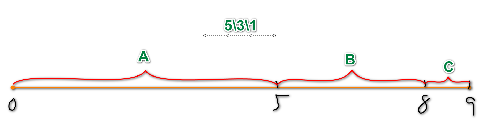
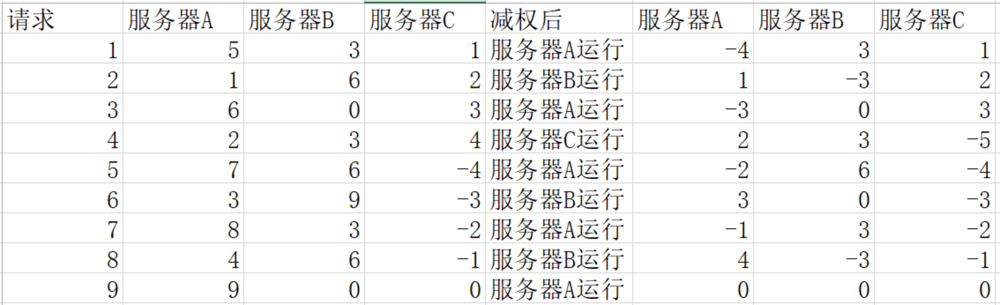
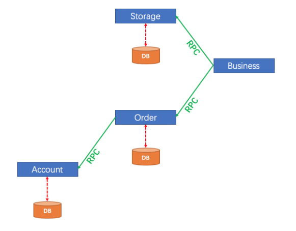
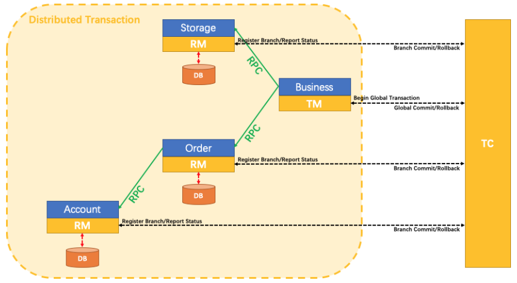
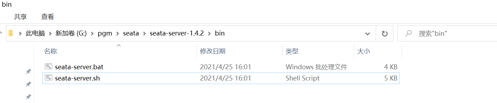

# 修改order模块支持Dubbo

因为order模块在Dubbo的调用关系中

既是生产者又是消费者

它消费cart和stock的服务

同时又为business模块提供服务

重构的过程和stock\cart有很多相似,但是也要注意不同

## 创建csmall-order-service项目

这个项目创建的过程和stock\cart模块service项目的步骤和注意事项完全一致

## 创建csmall-order-webapi项目

创建项目后父子相认正常

当时子项目的pom文件依赖需要添加下面内容

```xml
<!-- Dubbo依赖 -->
<dependency>
    <groupId>com.alibaba.cloud</groupId>
    <artifactId>spring-cloud-starter-dubbo</artifactId>
</dependency>
<!-- service接口项目依赖 -->
<dependency>
    <groupId>cn.tedu</groupId>
    <artifactId>csmall-order-service</artifactId>
    <version>0.0.1-SNAPSHOT</version>
</dependency>
<!-- order模块同时作为服务的消费者要将需要调用的服务所在的业务逻辑层接口依赖添加上 -->
<!-- 我们需要stock模块的减库存方法和cart模块删除购物车商品的方法 -->
<dependency>
    <groupId>cn.tedu</groupId>
    <artifactId>csmall-cart-service</artifactId>
    <version>0.0.1-SNAPSHOT</version>
</dependency>
<dependency>
    <groupId>cn.tedu</groupId>
    <artifactId>csmall-stock-service</artifactId>
    <version>0.0.1-SNAPSHOT</version>
</dependency>
```

yml文件的配置一致

代码也都正常从csmall-order复制到csmall-order-webapi中

```java
// 因为business模块要调用这个业务逻辑层中的方法
// 所以这个类中的方法也要注册到Nacos
@DubboService
@Service
@Slf4j
public class OrderServiceImpl implements IOrderService {

    @Autowired
    private OrderMapper orderMapper;
    // 当前order模块消费stock的业务逻辑层方法,以减少库存
    // 因为stock模块的减库存方法在Nacos中注册,所以可以使用Dubbo调用
    // 要想调用就必须使用@DubboReference,才能获得业务逻辑层实现类对象
    @DubboReference
    private IStockService dubboStockService;
    // order还需要cart模块的删除购物车商品的方法
    @DubboReference
    private ICartService dubboCartService;

    @Override
    public void orderAdd(OrderAddDTO orderAddDTO) {
        // 1.减少订单商品的库存(要调用stock模块的方法)
        StockReduceCountDTO stockReduceCountDTO=new StockReduceCountDTO();
        // 为减少库存的商品编号赋值
        stockReduceCountDTO.setCommodityCode(orderAddDTO.getCommodityCode());
        // 为减少库存的数量赋值
        stockReduceCountDTO.setReduceCount(orderAddDTO.getCount());
        dubboStockService.reduceCommodityCount(stockReduceCountDTO);
        // 2.删除订单中购物车商品的信息(要调用cart模块的方法)
        dubboCartService.deleteUserCart(orderAddDTO.getUserId(),
                                        orderAddDTO.getCommodityCode());
        // 3.新增订单
        // 实例化订单对象
        Order order=new Order();
        // 赋值同名属性
        BeanUtils.copyProperties(orderAddDTO,order);
        // 调用持久层方法
        orderMapper.insertOrder(order);
        log.info("新增订单完成:{}",order);
    }
}
```

因为order模块也是生产者@EnableDubbo注解仍然要写

```java
@SpringBootApplication
@EnableDubbo
public class CsmallOrderWebapiApplication {

    public static void main(String[] args) {
        SpringApplication.run(CsmallOrderWebapiApplication.class, args);
    }

}
```

我们可以测试这个Dubbo的功能

先启动nacos

然后再启动cart和stock

最后启动order

访问

http://localhost:20002/doc.html运行测试

注意运行前,数据库的数据状态和运行后的比较一下

# 续 负载均衡

## dubbo内置负载均衡策略算法

Dubbo内置4种负载均衡算法

- **random loadbalance:随机分配策略(默认)**
- round Robin Loadbalance:权重平均分配
- leastactive Loadbalance:活跃度自动感知分配
- consistanthash Loadbalance:一致性hash算法分配

实际运行过程中,每个服务器性能不同

在负载均衡时,都会有性能权重,这些策略算法都考虑权重问题

## 随机分配策略(默认)



随机生成随机数

在哪个范围内让哪个服务器运行

优点:

算法简单,效率高,长时间运行下,任务分配比例准确

缺点:

偶然性高,如果连续的几个随机请求发送到性能弱的服务器,会导致异常甚至宕机

## 权重平均分配

如果几个服务器权重一致,那么就是依次运行

3个服务器    1>1   2>2  3>3  4>1

但是服务器的性能权重一致的可能性很小

所以我们需要权重评价分配

Dubbo2.6.4之前平均分配权重算法是有问题的

如果3个服务器的权重比5:3:1

1>1    2>1     3>1     4>1    5>1   6>2     7>2     8>2     9>3  

10>1

Dubbo2.7之后更新了这个算法使用"**平滑加权算法**"优化权重平均分配策略



## 活跃度自动感知

记录每个服务器处理一次请求的时间

安装时间比例来分配任务数,运行一次需要时间多的分配的请求数较少

## 一致性Hash算法

根据请求的参数进行hash运算

以后每次相同参数的请求都会访问固定服务器

因为根据参数选择服务器,不能平均分配到每台服务器上

使用的也不多

# 修改business模块

business模块是我们设计的整体业务的起点

它是单纯的消费者

我们不需要像生产者一样去创建两个子项目

直接在原有项目上修改即可

直接到pom文件中添加dubbo和相关接口的依赖

```xml
<!-- dubbo依赖 -->
<dependency>
    <groupId>com.alibaba.cloud</groupId>
    <artifactId>spring-cloud-starter-dubbo</artifactId>
</dependency>
<!--  business模块消费order模块的生成订单的方法,所以添加order接口的依赖  -->
<dependency>
    <groupId>cn.tedu</groupId>
    <artifactId>csmall-order-service</artifactId>
    <version>0.0.1-SNAPSHOT</version>
</dependency>
```

application-dev.yml

```yaml
spring:
  application:
    # 当前Springboot项目的名称,用作注册中心服务的名称
    name: nacos-business
  cloud:
    nacos:
      discovery:
        # 定义nacos运行的路径
        server-addr: localhost:8848
        # ephemeral设置当前项目启动时注册到nacos的类型 true(默认):临时实例 false:永久实例
        ephemeral: true
dubbo:
  protocol:
    port: -1 # 设置Dubbo服务调用的端口 设置-1能够实现动态自动设置合适端口,生成规则是从20880开始递增
    name: dubbo # 设置端口名称,一般固定就叫dubbo
  registry:
    address: nacos://localhost:8848 # 配置当前Dubbo注册中心的类型和地址
  consumer:
    check: false # 设置为false表示当前项目启动时,不检查要调用的远程服务是否可用,避免报错
```

我们要在当前busindess模块的业务逻辑层实现类中

实现Dubbo调用order模块的生成订单方法

```java
@Service
@Slf4j
public class BusinessServiceImpl implements IBusinessService {

    // Dubbo在获取order模块的业务逻辑层实现类
    @DubboReference
    private IOrderService dubboOrderService;

    @Override
    public void buy() {
        // 暂时模拟一个下单业务
        // 创建OrderAddDTO类,赋值并输出信息
        OrderAddDTO orderAddDTO=new OrderAddDTO();
        orderAddDTO.setCommodityCode("PC100");
        orderAddDTO.setUserId("UU100");
        orderAddDTO.setMoney(500);
        orderAddDTO.setCount(8);
        // 因为没有持久层,只能输出一下,表示运行正常
        log.info("新增订单信息为:{}",orderAddDTO);
        // dubbo调用生成订单方法
        dubboOrderService.orderAdd(orderAddDTO);
    }
}
```

Springboot启动类不必要写@EnableDubbo因为business是单纯的消费者

```java
@SpringBootApplication
//@EnableDubbo
public class CsmallBusinessApplication {

    public static void main(String[] args) {
        SpringApplication.run(CsmallBusinessApplication.class, args);
    }

}
```

启动business项目(前提是cart\stock\order正在运行)

http://localhost:20000/doc.html运行测试

## Dubbo生产者消费者配置小结

Dubbo生产者消费者相同的配置

pom文件添加dubbo依赖,yml文件配置dubbo信息

**生产者**

* 要有service接口项目

* 提供服务的业务逻辑层实现类要添加@DubboService注解
* SpringBoot启动类要添加@EnableDubbo注解

**消费者**

* pom文件添加消费模块的service依赖
* 业务逻辑层远程调用前天模块时使用@DubboReference注解获取业务逻辑层实现类对象

## 下载Seata

 https://github.com/seata/seata/releases

https://github.com/seata/seata/releases/download/v1.4.2/seata-server-1.4.2.zip

最好能从项目经理老师处获取

# Seata概述

## 什么是Seata

Seata 是一款开源的分布式事务解决方案，致力于在微服务架构下提供高性能和简单易用的分布式事务服务

也是Spring Cloud Alibaba提供的组件

Seata官方文档

https://seata.io/zh-cn/

更多信息可以通过官方文档获取

## 为什么需要Seata

我们首先简单复习一下事务的概念

> 事务的4个特性:ACID特性

- 原子性
- 一致性
- 隔离性
- 永久性

我们再业务中,必须保证数据库操作的原子性,也就是当前业务的所有数据库操作要么都成功,要么都失败

之前我们使用Spring声明式事务来解决本地的事务问题

但是现在是微服务环境,一个业务可能涉及多个模块的数据库操作

这种情况就需要专门的微服务状态下解决事务问题的"分布式事务"解决方案

我们学习的Seata就是这样的产品

**Seata将为用户提供了 AT、TCC、SAGA 和 XA 事务模式,为用户打造一站式的分布式解决方案。**

## Seata的运行原理(AT模式)

观察下面事务模型



上面结构是比较典型的远程调用结构

如果account操作数据库失败需要让order模块和storage模块撤销(回滚)操作

声明式事务不能完成这个操作

需要Seata来解决

解决模型如下



Seata构成部分包含

* 事务协调器TC
* 事务管理器TM
* 资源管理器RM

我们项目使用AT(自动)模式完成分布式事务的解决

AT模式运行过程

1.事务的发起方(TM)会向事务协调器(TC)申请一个全局事务id,并保存

2.Seata会管理事务中所有相关的参与方的数据源,将数据操作之前和之后的镜像都保存在undo_log表中,这个表是seata框架规定的,方便提交(commit)或回滚(roll back)

3.事务的发起方(TM)会连同全局id一起通过远程调用运行资源管理器(RM)中的方法

4.资源管理器(RM)接收到全局id,并运行指定的方法,将运行的状态同步到事务协调器(TC)

5.如果运行整体没有发生异常,发起方(TM)会通过事务协调器通知所有分支,将本次事务所有对数据库的影响真正生效,反之如果任何一个RM运行发生异常,那么都会通知事务协调器,再由事务协调器通知所有分支,回滚数据中的数据

回滚时可以使用undo_log表中的数据来实现回滚

## 其他模式简介

AT模式运行有一个非常明显的条件

就是事务分支都必须是操作关系型数据库(mysql\MariaDB\Oracle)

但是如果一个事务中有操作例如Redis这样的非关系型数据库时就不能使用AT模式了

除了AT模式之外还有TCC、SAGA 和 XA 事务模式

**TCC模式**

这个模式简单来说就是自己编写代码进行事务的提交和回滚

我们需要在各个分支业务逻辑层代码中编写一组三个方法(prepare\commit\rollback)

prepare:准备   commit:提交   rollback:回滚

prepare方法是无论事务成功与否都会运行的代码

commit当整体事务运行成功时运行的方法

rollback当整体事务运行失败是运行的方法

优点:虽然代码是自己写的,但是事务整体提交或回滚的机制仍然可用

缺点:每个业务都要编写3个方法来对应,代码冗余,而且业务入侵量大

**SAGA模式**

SAGA模式的思想是编写一个类,当指定的事务发生问题时,运行SAGA编写的回滚类

这样编写代码不影响已经编写好的业务逻辑代码

一般用于修改已经编写完成的老代码

缺点是每个事务分支都要编写一个类来回滚业务,

类数量多,开发量大

XA模式

支持XA协议的数据库分布式事务,使用比较少

# 使用Seata

## 配置Seata

cart\stock\order都是具备数据库操作的模块配置过程如下

```xml
<!-- seata和SpringBoot整合依赖 -->
<dependency>
    <groupId>io.seata</groupId>
    <artifactId>seata-spring-boot-starter</artifactId>
</dependency>
<!-- Seata完成分布式事务需要的两个相关依赖(Seata需要下面两个依赖中的资源) -->
<dependency>
    <groupId>com.github.pagehelper</groupId>
    <artifactId>pagehelper-spring-boot-starter</artifactId>
</dependency>
<dependency>
    <groupId>com.alibaba</groupId>
    <artifactId>fastjson</artifactId>
</dependency>
```

下面修改application-dev.yml

代码如下

```yaml
seata:
  tx-service-group: csmall_group #定义分组名称
  service:
    vgroup-mapping:
      csmall_group: default  # 使用seata默认事务配置
    grouplist: 
      default: localhost:8091 # 8091是seata默认的地址
```

注意同一个事务必须在同一个tx-service-group中

同时指定相同的seata地址和端口

business模块配置更简单

因为它是服务的发起者,不需要数据库操作,所以配置更简单

但是它是TM的角色,不配置肯定是不行的

```xml
<dependency>
    <groupId>io.seata</groupId>
    <artifactId>seata-spring-boot-starter</artifactId>
</dependency>
```

application-dev.yml是一样的

```yaml
seata:
  tx-service-group: csmall_group #定义分组名称
  service:
    vgroup-mapping:
      csmall_group: default  # 使用seata默认事务配置
    grouplist:
      default: localhost:8091 # 8091是seata默认的地址
```

seata标记事务的开始有一个专用的注解

在事务模型中,TM(事务管理器)的业务逻辑层方法上添加这个注解即可

business的业务逻辑层buy方法上添加注解

```java
@Service
@Slf4j
public class BusinessServiceImpl implements IBusinessService {

    // Dubbo在获取order模块的业务逻辑层实现类
    @DubboReference
    private IOrderService dubboOrderService;

    // 一旦编写这个注解@GlobalTransactional
    // seata就会将这个方法当做一个分布式事务的起点
    // 之后所有远程Dubbo调用的数据库操作要么都成功,要么都失败
    @GlobalTransactional
    @Override
    public void buy() {
        // 暂时模拟一个下单业务
        // 创建OrderAddDTO类,赋值并输出信息
        OrderAddDTO orderAddDTO=new OrderAddDTO();
        orderAddDTO.setCommodityCode("PC100");
        orderAddDTO.setUserId("UU100");
        orderAddDTO.setMoney(500);
        orderAddDTO.setCount(8);
        // 因为没有持久层,只能输出一下,表示运行正常
        log.info("新增订单信息为:{}",orderAddDTO);
        // dubbo调用生成订单方法
        dubboOrderService.orderAdd(orderAddDTO);
        // 为了验证我们seata是有效果的
        // 在当前业务逻辑层方法中随机发生异常
        // 我们可以通过观察正常运行时数据是否提交和发生异常是数据是否回滚来判断seata是否工作
        if(Math.random()<0.5){
            throw new CoolSharkServiceException(ResponseCode.INTERNAL_SERVER_ERROR,
                                            "发生随机异常");
        }
    }
}
```

## 启动seata

seata也是java开发的,启动方式和nacos很像

只是启动命令不同

解压后路径不要用中文,不要用空格

也是解压之后的bin目录下



在路径上输入cmd进入dos窗口

```
G:\pgm\seata\seata-server-1.4.2\bin>seata-server.bat -h 127.0.0.1 -m file
```

要想启动,需要启动所有4个服务cart\stock\order\business

利用knife4j访问business模块,否则无法触发事务效果,business模块是seata事务的启动

**在windows系统中运行seata可能出现不稳定的情况,重启seata即可解决**

根据是否发生随机异常,来判断seata是否有效

# Sentinel 介绍

## 什么是Sentinel

Sentinel也是Spring Cloud Alibaba的组件

Sentinel英文翻译"哨兵\门卫"

随着微服务的流行，服务和服务之间的稳定性变得越来越重要。Sentinel 以流量为切入点，从流量控制、熔断降级、系统负载保护等多个维度保护服务的稳定性。

官网地址

https://sentinelguard.io/zh-cn/

下载地址

https://github.com/alibaba/Sentinel/releases

## 为什么需要Sentinel

- 丰富的应用场景

  双11,秒杀,12306抢火车票

- 完备的实时状态监控

  可以支持显示当前项目各个服务的运行和压力状态,分析出每台服务器处理的秒级别的数据

- 广泛的开源生态

  很多技术可以和Sentinel进行整合,SpringCloud,Dubbo,而且依赖少配置简单

- 完善的SPI扩展

  Sentinel支持程序设置各种自定义的规则

## 基本配置和限流效果

我们找一个相对简单的模块测试和观察限流效果

以csmall-stock-webapi模块为例

添加pom依赖如下

```xml
<dependency>
    <groupId>com.alibaba.cloud</groupId>
    <artifactId>spring-cloud-starter-alibaba-sentinel</artifactId>
</dependency>
```

application-dev.yml修改配置如下

```yaml
spring:
  cloud:
    nacos:
      discovery:
        server-addr: localhost:8848
    sentinel:
      transport:
        dashboard: localhost:8080 # 配置Sentinel仪表台的位置
        port: 8721 # 真正执行限流的端口也要设置一下,注意这个端口其他微服务项目不能相同
```

sentinel.transport.port每个微服务项目不能相同

下面进行限流操作

Sentinel限流针对控制层方法也就是说

我们要到Controller类中的方法上去做设置

```java
@PostMapping("/reduce/count")
@ApiOperation("减少商品库存业务")
// @SentinelResource标记的方法会被Sentinel监控
// ()里面的内容是这个监控的名称,我们可以在"仪表台"中看到
// ↓↓↓↓↓↓↓↓↓↓↓↓↓↓↓↓↓↓↓
@SentinelResource("减少库存方法(控制器)")
public JsonResult reduceCommodityCount(StockReduceCountDTO stockReduceCountDTO){
    stockService.reduceCommodityCount(stockReduceCountDTO);
    return JsonResult.ok("商品库存减少完成!");
}
```

