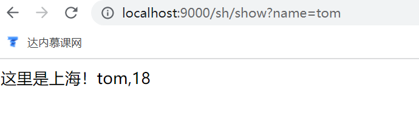
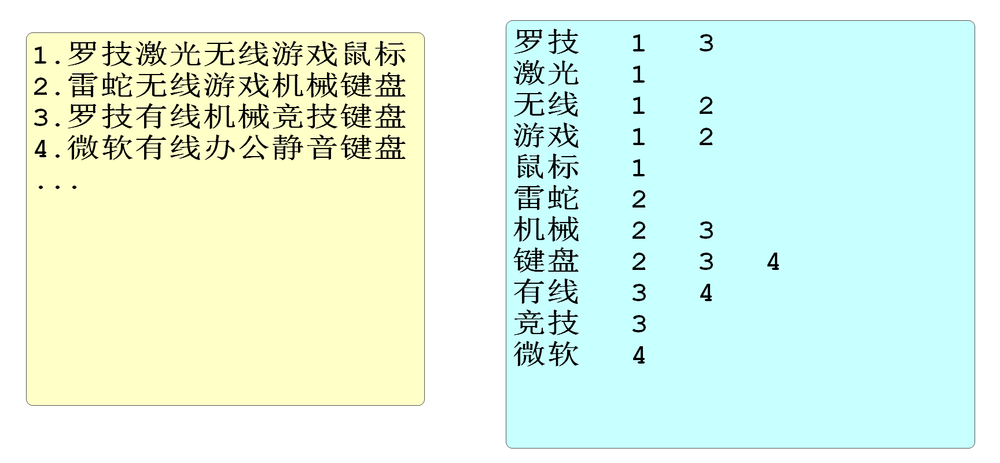

# 续 Sentinel

## 流控与降级

上次课我们完成了使用Sentinel实现QPS或并发线程数进行流控的操作

但是被流控的请求只有一个错误,没有错误提示,不方便给用户反馈

我们应该在开发时,对于被流控的请求给与相关提示

StockController中编写代码如下

```java
@Autowired
private IStockService stockService;
@PostMapping("/reduce/count")
@ApiOperation("减少商品库存业务")
// @SentinelResource标记的方法会被Sentinel监控
// value的值是这个监控的名称,我们可以在"仪表台"中看到
// blockHandler的值指定了请求被限流时运行的方法名称
@SentinelResource(value = "减少库存方法(控制器)",blockHandler = "blockError")
public JsonResult reduceCommodityCount(StockReduceCountDTO stockReduceCountDTO){
    stockService.reduceCommodityCount(stockReduceCountDTO);
    return JsonResult.ok("商品库存减少完成!");
}
// Sentinel 限流方法应该满足如下要求
// 1.必须是public修改
// 2.返回值类型必须和控制方法一致(JsonResult)
// 3.方法名称要和控制器方法限流注解中规定的名称一致(blockError)
// 4.参数列表必须和控制器一致,可以在所以参数后声明BlockException来获得限流异常
public JsonResult blockError(StockReduceCountDTO stockReduceCountDTO,
                             BlockException e){
    return JsonResult.failed(ResponseCode.BAD_REQUEST,"服务器忙,请稍后再试");
}
```

上面方法定义了被Sentinel限流时运行的方法

下面我们要学习降级的功能

降级功能和我们之前学习的统一异常处理类有相似的地方

但是降级是Sentinel的功能

```java
@PostMapping("/reduce/count")
@ApiOperation("减少商品库存业务")
// @SentinelResource标记的方法会被Sentinel监控
// value的值是这个监控的名称,我们可以在"仪表台"中看到
// blockHandler的值指定了请求被限流时运行的方法名称
@SentinelResource(value = "减少库存方法(控制器)",blockHandler = "blockError",
                    fallback = "fallbackError")
public JsonResult reduceCommodityCount(StockReduceCountDTO stockReduceCountDTO){
    // 生成随机出触发降级流程
    if(Math.random()<0.5){
        throw new 
          CoolSharkServiceException(ResponseCode.INTERNAL_SERVER_ERROR,"异常");
    }
    stockService.reduceCommodityCount(stockReduceCountDTO);
    return JsonResult.ok("商品库存减少完成!");
}
// 这个方法是Sentinel注解中fallback属性指定的降级方法
// 当前控制器方法运行发生异常时,Sentinel会运行下面的降级方法
// 降级方法中,可以不直接结束请求,而去运行一些代替代码或者补救措施
// 让用户获得最低限度的响应
public JsonResult fallbackError(StockReduceCountDTO stockReduceCountDTO){
    return JsonResult.failed(ResponseCode.BAD_REQUEST,"因为运行异常,服务降级");
}
```

> **blockHandler和fallback的区别**

两者都是不能正常调用资源返回值的顶替处理逻辑.

blockHander只能处理BlockException 流控限制之后的逻辑.

fallback处理的是资源调用异常的降级逻辑.

**课堂作业**

为business模块控制器的buy方法添加Sentinel流控和降级的功能

流控时输出"服务器忙",降级时输出"服务降级"

1.pom文件

2.yml(port属性不能和stock模块的相同8722)

3.修改控制器代码(注解,流控和降级方法)

# SpringGateway 网关

## 奈非框架简介

早期(2020年前)奈非提供的微服务组件和框架受到了很多开发者的欢迎

这些框架和Spring Cloud Alibaba的对应关系我们要知道

Nacos对应Eureka 都是注册中心

Dubbo对应ribbon+feign都是实现微服务间调用

Sentinel对应Hystrix都是项目限流熔断降级组件

Gateway对应zuul都是项目的网关

Gateway不是阿里巴巴的而是Spring提供的

## 什么是网关

"网关"网是网络,关是关口\关卡

关口\关卡的意思就是"统一入口"

网关:就是网络中的统一入口

程序中的网关就是微服务项目提供的外界所有请求统一访问的微服务项目

因为提供了统一入口之后,方便对所有请求进行统一的检查和管理


网关的主要功能有

* 将所有请求统一由经过网关
* 网关可以对这些请求进行检查
* 网关方便记录所有请求的日志
* 网关可以统一将所有请求路由到正确的模块\服务上

路由的近义词就是"分配"

## Spring Gateway简介

我们使用Spring Gateway作为当前项目的网关框架

Spring Gateway是Spring自己编写的,也是SpringCloud中的组件

SpringGateway官网

https://docs.spring.io/spring-cloud-gateway/docs/current/reference/html/

网关项目git地址

https://gitee.com/jtzhanghl/gateway-demo.git

## 简单网关演示

网关是一个我们创建的项目,不是一个需要安装的软件

网关也是当前微服务项目的一员,也要注册到Nacos,所以保证Nacos的运行

运行之前,我们看一下网关演示项目已经存在的基本结构

beijing和shanghai是编写好的两个项目

gateway没有编写yml文件配置

要想实现网关的路由效果需要修改yml文件如下

```yml
server:
  port: 9000
spring:
  application:
    name: gateway
  cloud:
    nacos:
      discovery:
        server-addr: localhost:8848
    gateway:
      routes:  # gateway开始配置路由信息
        - id: gateway-shanghai
          uri: lb://shanghai
          predicates:
            - Path=/sh/**
        # 如果java访问这个数字元素的方式:spring.cloud.gateway.routes[0].predicates[0]
        # routes属性实际上是一个数组,yml文件中出现 "- ...."配置时表示当前配置时一个数组元素
        - id: gateway-beijing # 这个配置指定这个路由的名称,这个名称和其他任何位置没有关联
                              # 只需要注意不能再和其他路由名称重复
          # uri设置路由的目标
          # lb是LoadBalance(负载均衡)的缩写,beijing是注册到nacos的服务名称
          uri: lb://beijing
          # 我们需要设置一个条件,当访问路径满足特定条件是,使用当前路由规则
          predicates:
            # predicates翻译为断言,所谓断言就是判断一个条件是否满足
            # Path 是路径断言,意思是满足路径为XXX时使用这个路由
            - Path=/bj/**
            # http://localhost:9000/bj/show 会路由到 9001/bj/show
```

## 内置断言

断言就是判断一个条件,如果条件满足就执行某个操作

predicates就是断言的意思

我们前面章节使用的Path就是内置断言中的一种,指访问的路径是否满足条件

除了路径断言之外,还有很多内置断言常见的内置断言列表

- after
- before
- between
- cookie
- header
- host
- method
- path
- query
- remoteaddr

**时间相关**

after,before,between

在指定时间之后,之前或之间

判断是否满足时间条件,如果满足才允许访问

我们先使用下面代码获得当前包含时区的系统时间表

```java
ZonedDateTime.now()
```

使用After设置必须在指定时间之后访问

```yaml
- id: gateway-shanghai
  uri: lb://shanghai
  predicates:
    - Path=/sh/**
    - After=2022-06-24T15:30:30.999+08:00[Asia/Shanghai]
```

使用Before设置必须在指定时间之后访问

```yaml
- id: gateway-shanghai
  uri: lb://shanghai
  predicates:
    - Path=/sh/**
    - Before=2022-06-24T15:34:00.999+08:00[Asia/Shanghai]
```

使用Between设置必须在指定时间之间访问

```yaml
- id: gateway-shanghai
  uri: lb://shanghai
  predicates:
    - Path=/sh/**
    - Between=2022-06-24T15:34:00.999+08:00[Asia/Shanghai],2022-06-24T15:36:20.999+08:00[Asia/Shanghai]
```

**要求指定参数**

Query断言,要求必须包含指定的参数才能访问资源

```yaml
- id: gateway-shanghai
  uri: lb://shanghai
  predicates:
    - Path=/sh/**
    - Query=name
```

## 内置过滤器

Gateway还提供的内置过滤器

不要和我们学习的filter混淆

内置过滤器允许我们在路由请求到目标资源的同时,对这个请求进行一些加工或处理

下面我们使用AddRequestParameter过滤器,想请求中添加参数

```yaml
- id: gateway-shanghai
  uri: lb://shanghai
  predicates:
    - Path=/sh/**
    - Query=name
  filters:
    - AddRequestParameter=age,80
```

shanghai项目的控制器接收这个参数

```java
@GetMapping("/show")
public String show(String name,Integer age){
    return "这里是上海！"+name+","+age;
}
```

重启网关和shanghai项目

例如输入如下路径

http://localhost:9000/sh/show?name=tom

因为过滤器的存在,控制可以获取网关过滤器添加的参数值



其他内置过滤器和自定义过滤器的使用,同学们可以查阅相关文档自己了解

## 动态路由

如果项目微服务数量多

那么gateway项目yml文件配置也会越来越冗余,维护的工作量也会越来越大

所谓我们希望能够根据固定特征自动的路由到每个微服务模块

这个功能就是SpringGateway的动态路由功能

只需要在配置文件中配置开启动态路由功能即可

```yaml
spring:
  application:
    name: gateway
  cloud:
    nacos:
      discovery:
        server-addr: localhost:8848
    gateway:
      discovery:
        locator:
          # 开启Spring Gateway的动态路由功能
          # 规则是根据注册到Nacos的项目名称作为路径的前缀,就可以访问到指定项目了
          enabled: true
```

开启之后访问项目的格式以beijing为例

localhost:9000/beijing/bj/show

# csmall项目网关

## 创建gateway网关子项目

父子相认

子项目pom文件为

```xml
<?xml version="1.0" encoding="UTF-8"?>
<project xmlns="http://maven.apache.org/POM/4.0.0" xmlns:xsi="http://www.w3.org/2001/XMLSchema-instance"
         xsi:schemaLocation="http://maven.apache.org/POM/4.0.0 https://maven.apache.org/xsd/maven-4.0.0.xsd">
    <modelVersion>4.0.0</modelVersion>
    <parent>
        <groupId>cn.tedu</groupId>
        <artifactId>csmall</artifactId>
        <version>0.0.1-SNAPSHOT</version>
    </parent>
    <groupId>cn.tedu</groupId>
    <artifactId>gateway</artifactId>
    <version>0.0.1-SNAPSHOT</version>
    <name>gateway</name>
    <description>Demo project for Spring Boot</description>

    <dependencies>
        <dependency>
            <groupId>org.springframework.boot</groupId>
            <artifactId>spring-boot-starter-web</artifactId>
        </dependency>
        <dependency>
            <groupId>com.alibaba.cloud</groupId>
            <artifactId>spring-cloud-starter-alibaba-nacos-discovery</artifactId>
        </dependency>
        <!-- 网负载均衡支持  -->
        <dependency>
            <groupId>org.springframework.cloud</groupId>
            <artifactId>spring-cloud-starter-loadbalancer</artifactId>
        </dependency>
        <!-- Spring Gateway 网关依赖 -->
        <dependency>
            <groupId>org.springframework.cloud</groupId>
            <artifactId>spring-cloud-starter-gateway</artifactId>
        </dependency>
        <!--聚合网关 knife4j-->
        <dependency>
            <groupId>com.github.xiaoymin</groupId>
            <artifactId>knife4j-spring-boot-starter</artifactId>
        </dependency>
    </dependencies>
</project>
```

也删除test测试文件夹

application.yml文件内容如下

```yaml
spring:
  application:
    name: gateway-server
  cloud:
    nacos:
      discovery:
        server-addr: localhost:8848
    gateway:
      discovery:
        locator:
          # 开启网关动态路由
          enabled: true
  main:
    web-application-type: reactive
server:
  port: 10000
```

## knife4j网关配置

我们希望配置网关之后,在使用knife4j测试时

就不来回切换端口号了

我们需要配置Knife4j才能实现

创建包cn.tedu.gateway.config包

SwaggerProvider

```java
@Component
public class SwaggerProvider implements SwaggerResourcesProvider {
    /**
     * 接口地址
     */
    public static final String API_URI = "/v2/api-docs";
    /**
     * 路由加载器
     */
    @Autowired
    private RouteLocator routeLocator;
    /**
     * 网关应用名称
     */
    @Value("${spring.application.name}")
    private String applicationName;

    @Override
    public List<SwaggerResource> get() {
        //接口资源列表
        List<SwaggerResource> resources = new ArrayList<>();
        //服务名称列表
        List<String> routeHosts = new ArrayList<>();
        // 获取所有可用的应用名称
        routeLocator.getRoutes().filter(route -> route.getUri().getHost() != null)
                .filter(route -> !applicationName.equals(route.getUri().getHost()))
                .subscribe(route -> routeHosts.add(route.getUri().getHost()));
        // 去重，多负载服务只添加一次
        Set<String> existsServer = new HashSet<>();
        routeHosts.forEach(host -> {
            // 拼接url
            String url = "/" + host + API_URI;
            //不存在则添加
            if (!existsServer.contains(url)) {
                existsServer.add(url);
                SwaggerResource swaggerResource = new SwaggerResource();
                swaggerResource.setUrl(url);
                swaggerResource.setName(host);
                resources.add(swaggerResource);
            }
        });
        return resources;
    }
}
```

cn.tedu.gateway.controller

SwaggerController类

```java
@RestController
@RequestMapping("/swagger-resources")
public class SwaggerController {
    @Autowired(required = false)
    private SecurityConfiguration securityConfiguration;
    @Autowired(required = false)
    private UiConfiguration uiConfiguration;
    private final SwaggerResourcesProvider swaggerResources;
    @Autowired
    public SwaggerController(SwaggerResourcesProvider swaggerResources) {
        this.swaggerResources = swaggerResources;
    }
    @GetMapping("/configuration/security")
    public Mono<ResponseEntity<SecurityConfiguration>> securityConfiguration() {
        return Mono.just(new ResponseEntity<>(
                Optional.ofNullable(securityConfiguration).orElse(SecurityConfigurationBuilder.builder().build()), HttpStatus.OK));
    }
    @GetMapping("/configuration/ui")
    public Mono<ResponseEntity<UiConfiguration>> uiConfiguration() {
        return Mono.just(new ResponseEntity<>(
                Optional.ofNullable(uiConfiguration).orElse(UiConfigurationBuilder.builder().build()), HttpStatus.OK));
    }
    @GetMapping("")
    public Mono<ResponseEntity> swaggerResources() {
        return Mono.just((new ResponseEntity<>(swaggerResources.get(), HttpStatus.OK)));
    }
}
```

cn.tedu.gateway.filter

SwaggerHeaderFilter类

```java
@Component
public class SwaggerHeaderFilter extends AbstractGatewayFilterFactory {
    private static final String HEADER_NAME = "X-Forwarded-Prefix";

    private static final String URI = "/v2/api-docs";

    @Override
    public GatewayFilter apply(Object config) {
        return (exchange, chain) -> {
            ServerHttpRequest request = exchange.getRequest();
            String path = request.getURI().getPath();
            if (!StringUtils.endsWithIgnoreCase(path,URI )) {
                return chain.filter(exchange);
            }
            String basePath = path.substring(0, path.lastIndexOf(URI));
            ServerHttpRequest newRequest = request.mutate().header(HEADER_NAME, basePath).build();
            ServerWebExchange newExchange = exchange.mutate().request(newRequest).build();
            return chain.filter(newExchange);
        };
    }
}
```

启动Nacos\Seata\Sentinel

启动cart\stock\order\business

在保证一般访问正常的情况下

再启动gateway

可以通过下面路径访问之前的各个模块的业务

http://localhost:10000/nacos-stock/doc.html

http://localhost:10000/nacos-cart/doc.html

http://localhost:10000/nacos-order/doc.html

http://localhost:10000/nacos-business/doc.html

如果不使用网关一切正常,但是启动网关访问失败的话,就是gateway项目配置问题


## Gateway和SpringMvc依赖冲突问题和解决

网关依赖

```xml
<dependency>
    <groupId>org.springframework.cloud</groupId>
    <artifactId>spring-cloud-starter-gateway</artifactId>
</dependency>
```

SpringMvc依赖

```xml
<dependency>
    <groupId>org.springframework.boot</groupId>
    <artifactId>spring-boot-starter-web</artifactId>
</dependency>
```

这两个依赖在同一个项目中时,默认情况下启动会报错

SpringMvc依赖中自带一个Tomcat服务器

而Gateway依赖中自带一个Netty服务器

因为在启动服务时这个两个服务器都想启动,会因为争夺端口号和主动权而发生冲突

我们需要在yml文件中添加配置解决

```yml
spring:
  main:
    web-application-type: reactive
```


# Elasticsearch概述

## 什么是Elasticsearch

elastic:富有弹性的

search:搜索

在计算机开发界简称ES

这个软件不是SpringCloud的组件,甚至其他语言都可以使用它

是一个java开发的软件,所以启动需要java环境变量

功能是从大量数据中根据指定的关键字搜索出匹配的结果

这样的软件有一个名称**全文搜索引擎**

使用它的方式是访问它提供的控制器方法,它开发了多种控制器方法

访问不同方法实现对数据的增删改查

ES也是将数据保存在硬盘上的

> 常见面试题ES的实现结构

java有一套名为Lucene的API

是搜索引擎的核心支持,Elasticsearch在Lucene的基础上开发出了一个功能全面的开箱即用的全文搜索引擎

市面上ES的竞品有

Solr/MongoDB

## 为什么使用Elasticsearch

因为我们之前学习的所有关系型数据库都有一个严重的性能缺陷

mysql\mariaDB\oracle\DB2等

就是前模糊的模糊查询不能使用索引

```
select * from spu where spu_name like '%鼠标%'
```

测试证明**一张千万级别的数据库表进行模糊查询需要20秒以上**

当今需求"三高"的需求下,不能接受这样的性能

我们使用ES来优化后同样的查询我们能将效率提高100倍

将大型的查询也能控制在毫秒级别

## Elasticsearch查询原理

如果不使用ES让数据库查询,没有索引加持的模糊查询就是全表搜索性能差

但是Elasticsearch可以利用添加数据库完成对数据的分词倒排索引形成索引库

在查询时直接查询索引库,获得符合查询条件的数据信息




