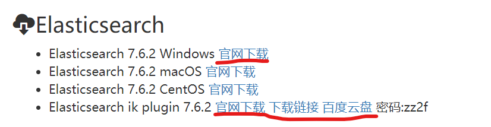
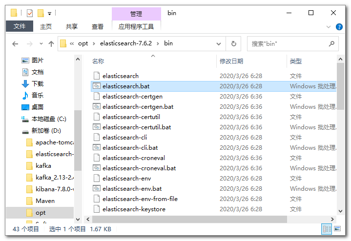
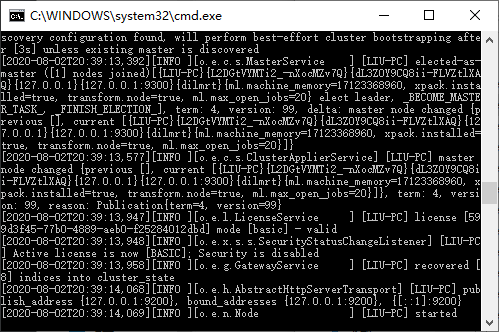
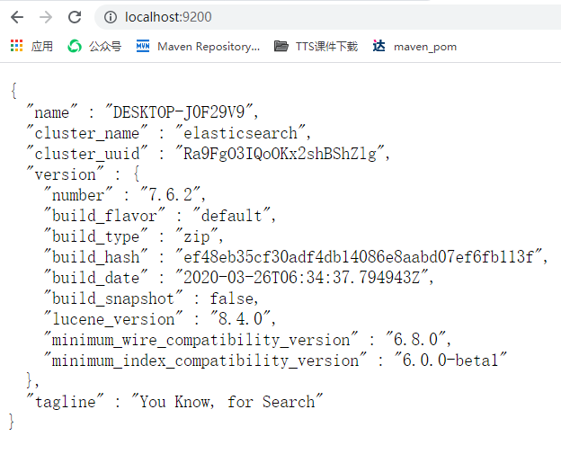
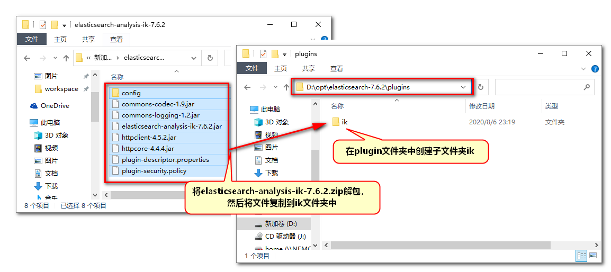
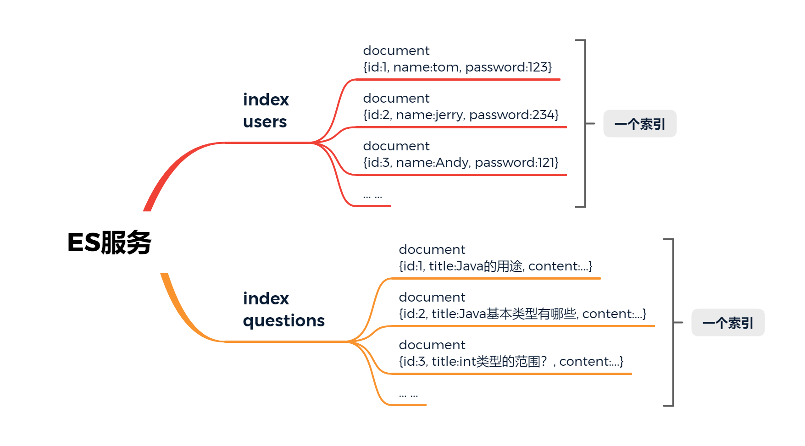
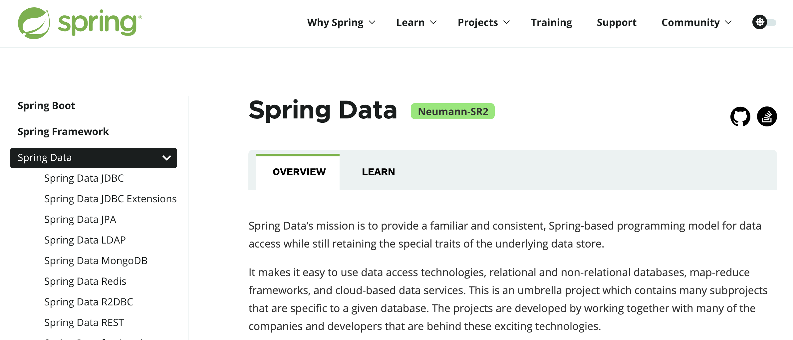

# 续 Elasticsearch

## 关于数据库的索引

所谓索引其实就是数据库中数据的目录

目的是能够提高查询的效率

数据库索引分类

* 聚集索引
* 非聚集索引

聚集索引就是数据库保存数据的物理顺序,一般都是id,所以按物理顺序查询也就是按id查询效率非常高

如果再定义其他索引,就是非聚集索引了

如果数据表中有一个姓名列,我们为姓名列创建索引

例如有"张三"这个姓名,添加索引后,查询的话效率会明显提升

但是如果不创建索引,去查询张三,就只能逐行检索姓名列是否为张三,查询效率低

> 常见面试题:索引的使用规则和注意事项
>
> 1. 索引会占用数据库空间
> 2. 对数据进行增删改操作,可能会引起索引的更新,效率会低
> 3. 操作数据库时先添加数据,再创建索引
> 4. 不要对数据样本少的列添加索引
> 5. 每次查询从数据库中查询结果越多,索引的效果越低
> 6. 使用where字句查询时,将具有索引的列放在第一个条件

经过我们对索引的简单了解,我们需要知道索引的基本概念和使用

所有关系型数据库都有一个缺陷,就是模糊查询时(查询条件前模糊),是不能利用索引进行查询的

一定会引起全表搜索,查询效率非常低



## Elasticsearch的启动

官方下载链接

https://www.elastic.co/cn/downloads/past-releases#elasticsearch

课程中使用7.6.2版本

压缩包280M左右,复制到没有中文,没有空格的目录下解压

双击elasticsearch.bat运行



运行之后可能看到下面界面



这个界面不能关闭,一旦关闭ES就停止了

我们启动ES双击这个bat文件即可,当然也可以设置Idea的shell script

验证ES是否在运行

浏览器输入地址:localhost:9200看到如下内容即可



mac系统启动

```
tar -xvf elasticsearch-7.6.2-darwin-x86_64.tar.gz 
cd elasticsearch-7.6.2/bin 
./elasticsearch
```

linux:

```
tar -xvf elasticsearch-7.6.2-linux-x86_64.tar.gz
cd elasticsearch-7.6.2/bin
./elasticsearch
```

# ES基本使用

ES启动完成后,我们要学习如何操作它

我们已经讲过,操作ES是对es发送请求

我们创建一个子项目search,在这个子项目中创建一个专门发送各种类型请求的文件来操作ES

创建search项目也要父子相认

然后子项目pom文件如下

```xml
<?xml version="1.0" encoding="UTF-8"?>
<project xmlns="http://maven.apache.org/POM/4.0.0" xmlns:xsi="http://www.w3.org/2001/XMLSchema-instance"
   xsi:schemaLocation="http://maven.apache.org/POM/4.0.0 https://maven.apache.org/xsd/maven-4.0.0.xsd">
   <modelVersion>4.0.0</modelVersion>
   <parent>
        <groupId>cn.tedu</groupId>
        <artifactId>csmall</artifactId>
        <version>0.0.1-SNAPSHOT</version>
   </parent>
   <groupId>cn.tedu</groupId>
   <artifactId>search</artifactId>
   <version>0.0.1-SNAPSHOT</version>
   <name>search</name>
   <description>Demo project for Spring Boot</description>

   <dependencies>
      <dependency>
         <groupId>org.springframework.boot</groupId>
         <artifactId>spring-boot-starter</artifactId>
      </dependency>
   </dependencies>

</project>
```

下面创建这个能够发送各种请求的文件


文件类型叫HTTP Request文件

行业中有人将它称之为http client(http客户端)

创建完毕之后,我们向ES发送一个最简单的请求

GET http://localhost:9200

获得的结果和之前浏览器响应结果一致,表示当前http client文件正常运行

```js
### 注释和分隔符,每次编写请求前,都要先编写3个#
GET http://localhost:9200

### ES分词测试  analyze(分析)
POST http://localhost:9200/_analyze
Content-Type: application/json

{
  "text": "罗技激光无线游戏鼠标",
  "analyzer": "standard"
}
```


我们代码中编写的"analyzer": "standard"是默认分词器

如果不写出这行,也时默认这个分词器得

这个分词器只能对英文等西文字符(有空格的),进行分词

但是中文分词不能按空格分

下面我们要安装中文分词插件,实现中文分词效果

我们使用开源的分词词库IK实现中文分词



安装插件之后要重启ES才能生效

关闭ES窗口之后再启动ES即可

ES启动之后,将中文分词器插件设置完成,在运行分词

```js
{
  "text": "罗技激光无线游戏鼠标",
  "analyzer": "ik_smart"
}
```

再次运行分词测试,应该看到正常的中文分词效果

## ik分词插件的使用

我们安装的ik实际上不只一个分词器

实际上除了ik_smart之外还有ik_max_word

```js
### ES分词测试  analyze(分析)
POST http://localhost:9200/_analyze
Content-Type: application/json

{
  "text": "北京顺利举办了冬季奥林匹克运动会",
  "analyzer": "ik_smart"
}
```

```js
### ES分词测试  analyze(分析)
POST http://localhost:9200/_analyze
Content-Type: application/json

{
  "text": "北京顺利举办了冬季奥林匹克运动会",
  "analyzer": "ik_max_word"
}
```

上面的运行会有不同的分词效果

总体来说区别如下

**ik_smart**

* 优点:特征是粗略快速的将文字进行分词,占用空间小,查询速度快
* 缺点:分词的颗粒度大,可能跳过一些分词,导致查询结果不全面

**ik_max_word**

* 优点:特征是详细的文字片段进行分词,查询时查全率高,不容易遗漏数据
* 缺点:因为分词太过详细,导致有一些无用分词,占用空间较大,查询速度慢

## 使用ES操作数据

我们先了解一下ES保存数据的结构



* ES启动后,可以创建多个index(索引),index相当于数据库中表的概念
* 一个index可以创建保存多个document(文档),一个document相当于表中的一行数据

* 一个document中可以有多个属性和对应的值,相当于一行数据中字段和字段的值

项目node文件夹下共享了ES文档,命令都在里面,可以测试

# Spring Boot操作 Elasticsearch

## Spring Data简介

原生状态下,我们使用JDBC连接数据库,因为代码过于繁琐,所以改为使用Mybatis框架

在ES的原生状态下,我们java代码需要使用socket访问ES,但是也是过于繁琐,我们可以使用SpringData框架简化

Spring Data是Spring提供的一套连接各种第三方数据源的框架集

我们需要使用的是其中连接ES的Spring Data Elasticseatrch

官方网站:https://spring.io/projects/spring-data



官网中列出了它可以操作的数据源列表

每个列表中都包含一些使用的介绍

要想实现Spring Boot操作ES添加依赖后,按照要求编写代码即可

## 添加依赖

在上面章节中,我们创建的search模块中添加依赖如下

```xml
<?xml version="1.0" encoding="UTF-8"?>
<project xmlns="http://maven.apache.org/POM/4.0.0" xmlns:xsi="http://www.w3.org/2001/XMLSchema-instance"
   xsi:schemaLocation="http://maven.apache.org/POM/4.0.0 https://maven.apache.org/xsd/maven-4.0.0.xsd">
   <modelVersion>4.0.0</modelVersion>
   <parent>
        <groupId>cn.tedu</groupId>
        <artifactId>csmall</artifactId>
        <version>0.0.1-SNAPSHOT</version>
   </parent>
   <groupId>cn.tedu</groupId>
   <artifactId>search</artifactId>
   <version>0.0.1-SNAPSHOT</version>
   <name>search</name>
   <description>Demo project for Spring Boot</description>

   <dependencies>
      <dependency>
         <groupId>org.springframework.boot</groupId>
         <artifactId>spring-boot-starter</artifactId>
      </dependency>
      <dependency>
         <groupId>org.springframework.boot</groupId>
         <artifactId>spring-boot-starter-test</artifactId>
      </dependency>
      <!-- Spring Data Elasticsearch依赖 -->
      <dependency>
         <groupId>org.springframework.boot</groupId>
         <artifactId>spring-boot-starter-data-elasticsearch</artifactId>
      </dependency>
   </dependencies>

</project>
```

application.properties添加配置

```properties
# 设置连接ES的ip地址和端口号
spring.elasticsearch.rest.uris=http://localhost:9200

# 为了观察运行状态信息,将日志输出门槛设置为debug
logging.level.cn.tedu.search=debug
logging.level.org.elasticsearch.client.RestClient=debug
```

 下面开始具体操作演示

## 创建一个操作ES的数据类

和数据库一样

我们操作ES时也需要一个类似实体类的数据类,作为操作ES的数据载体

search项目创建entity包

在包中创建Item(商品)类

```java
@Data
@Accessors(chain = true)    // 生成和链式赋值的set方法
@AllArgsConstructor         // 自动生成包含全部参数的构造方法
@NoArgsConstructor          // 自动生成无参构造方法
// SpringData要求我们在"实体类"中使用特定注解标记
// @Document注解标记当前类和ES关联
// indexName指定索引名称,我们这里叫items,当操作这个索引时,如果索引不存在,会自动创建
@Document(indexName = "items")
public class Item  implements Serializable {

    // SpingData标记这个字段为当前类主键
    @Id
    private Long id;
    // SpringData使用@Field标记文档中属性的类型和各种特征
    @Field(type = FieldType.Text,
            analyzer = "ik_max_word",
            searchAnalyzer = "ik_max_word")
    private String title;     //商品名称
    @Field(type = FieldType.Keyword)
    private String category;  //分类
    @Field(type = FieldType.Keyword)
    private String brand;     //品牌
    @Field(type = FieldType.Double)
    private Double price;     //价格
    // 图片地址不会称为搜索条件,所以设置index=false
    // 效果是imgPath字段不会生成索引库,节省空间
    @Field(type = FieldType.Keyword,index = false)
    private String imgPath;   //图片地址

    // images/hjdsf-ahsa-qwezx-jashjdas.png
    // Text和Keyword都是字符串类型,只是Text会分词,而Keyword不会!
}
```

## 创建操作ES的持久层

我们使用SpringData连接操作ES

需要使用SpringData框架对持久层的命名规则

创建repository包,在包中创建接口ItemRepository

代码如下

```java
// Spring 家族下持久层名称都叫repository
@Repository
public interface ItemRepository extends ElasticsearchRepository<Item,Long> {
    // 当前接口继承ElasticsearchRepository父接口后
    // 会自动在类中生成基本的增删改查方法,直接可以使用
    // 它自动识别或自动生成的规则,是我们定义的两个泛型ElasticsearchRepository<[实体类名],[主键类型]>

}
```

## 测试操作ES

打开test测试类进行测试

```java
@SpringBootTest
class SearchApplicationTests {

   // 注入SpringData操作Es的持久层对象
   @Autowired
   private ItemRepository itemRepository;

   // 单增
   @Test
   void addOne() {
      // 实例化Item对象,赋值并新增到ES
      Item item=new Item()
            .setId(1L)
            .setTitle("罗技激光无线游戏鼠标")
            .setCategory("鼠标")
            .setBrand("罗技")
            .setPrice(128.0)
            .setImgPath("/1.jpg");
      // 利用自动生成的方法将item新增到ES,索引不存在会自动创建
      itemRepository.save(item);
      System.out.println("ok");
   }

   // 按id查询
   @Test
   void getOne(){
      // SpringData框架自带的按id查询的方法
      // Optional是一个类似包装类的概念,查询的结果封装到了这个类型中
      Optional<Item> optional=itemRepository.findById(1L);
      // 需要使用查询内容时使用optional.get()即可
      System.out.println(optional.get());
   }

   // 批量增
   @Test
   void addList(){
      // 实例化一个List集合
      List<Item> list=new ArrayList<>();
      // 将要新增的Item对象保存到这个List中
      list.add(new Item(2L,"罗技激光有线办公鼠标","鼠标",
            "罗技",89.0,"/2.jpg"));
      list.add(new Item(3L,"雷蛇机械无线游戏键盘","键盘",
            "雷蛇",299.0,"/3.jpg"));
      list.add(new Item(4L,"微软有线静音办公鼠标","鼠标",
            "微软",208.0,"/4.jpg"));
      list.add(new Item(5L,"罗技有线机械背光键盘","键盘",
            "罗技",266.0,"/5.jpg"));
      // 下面使用SpringData提供的方法执行批量新增
      itemRepository.saveAll(list);
      System.out.println("ok");

   }

   // 全查
   @Test
   void getAll(){
      // 利用SpringData的方法从ES中查询所有数据
      Iterable<Item> items=itemRepository.findAll();
//    for(Item item: items){
//       System.out.println(item);
//    }
      items.forEach(item -> System.out.println(item));

   }


}
```

## SpringData自定义查询

SpringData框架提供基本增删改查方法

但是如果有具体的针对性的查询逻辑,一定还是需要我们自己编写代码

例如实现类似数据库中的模糊查询

### 单条件查询

我们的查询需求是查询title属性中包含"游戏"这个分词的商品信息

> 参考模糊查询代码
>
> ```sql
> select * from item where title like '%游戏%'
> ```

我们使用ES查询,本质上运行的就是我们在es.http文档中编写的查询语句

但是SpringData框架下,编写查询语句更加简单

我们在ItemRepository接口中添加如下代码

```java
// SpringData自定义查询
// 遵循SpringData框架规定的格式的前提下,编写方法名会自动生成查询逻辑
// query: 表示当前方法是一个查询功能,类似sql中的select
// Item\Items: 表示查询结果的实体类,带s的返回集合
// By:标识开始设置条件,类似sql的where
// Title: 要查询的字段名称
// Matches: 是要执行的查询操作,这里是分词查询,类似sql的like
Iterable<Item> queryItemsByTitleMatches(String title);
```

再测试类中进行测试

```java
//单条件自定义查询
@Test
void queryOne(){
   // 查询 ES中title字段包含"游戏"分词的数据
   Iterable<Item> items=itemRepository.queryItemsByTitleMatches("游戏");
   items.forEach(item -> System.out.println(item));
}
```

上面代码运行时底层运行的查询语句为:

```js
### 单条件搜索
POST http://localhost:9200/items/_search
Content-Type: application/json

{
  "query": {"match": { "title":  "游戏" }}
}
```

### 多条件查询

在相对复杂的查询逻辑下

经常使用多个条件来定位查询需要的数据

这样就需要逻辑运算符"and"/"or"

ItemRepository接口中添加多条件的查询方法

```java
// 多条件查询
// 两个或多个条件之间直接编写And或Or表示查询逻辑
// 参数名称实际上没有要求必须和字段名称匹配,底层代码是按照参数顺序赋值的
Iterable<Item> queryItemsByTitleMatchesAndBrandMatches(String title,String brand);
```

上面的查询添加了品牌作为条件

逻辑关系是and(与)

测试代码如下

```java
// 多条件自定义查询
@Test
void queryTwo(){
   Iterable<Item> items=itemRepository
         .queryItemsByTitleMatchesAndBrandMatches("游戏","雷蛇");
   items.forEach(item -> System.out.println(item));
}
```

底层运行的请求

```js
### 多字段搜索
POST http://localhost:9200/items/_search
Content-Type: application/json

{
  "query": {
    "bool": {
      "must": [
        { "match": { "title": "游戏"}},
        { "match": { "brand": "雷蛇"}}
      ]
    }
  }
}
```

当查询条件关系为And时,查询语句关键字为must

当查询条件关系为Or时,查询语句关键字为should


