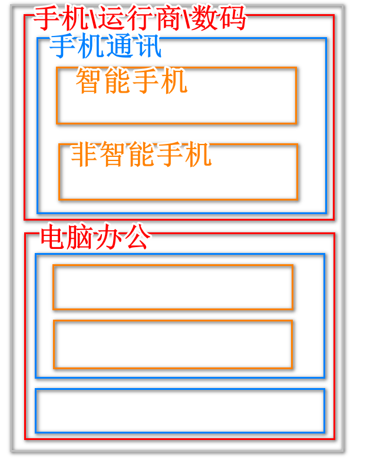
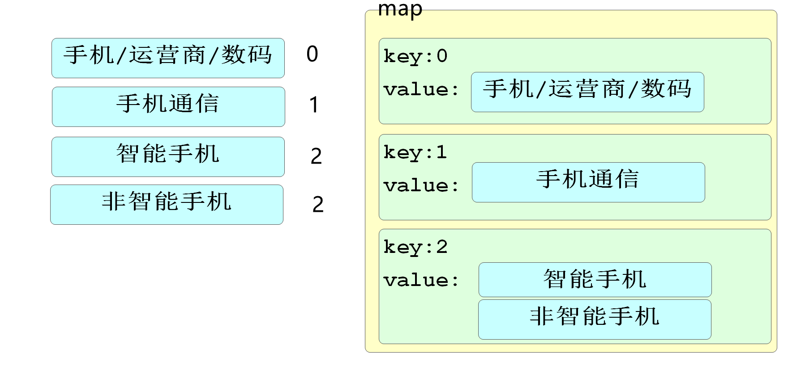

项目git地址

https://gitee.com/jtzhanghl/csmall-repo-class.git

# 续 SpringBoot操作ES

## 自定义查询

### 排序查询

上次课我们完成了单条件查询和多条件查询

但是条件的变化只是查询的需求之一

我们还需要像排序等需求的查询

如果实施排序需求,就在Repository接口中添加方法如下

```java
// 排序查询
// 默认情况下,ES查询结果按score排序,如果想按其他的规则排序可以加OrderBy
// 和数据库一样,默认升序排序 Desc结尾会降序
Iterable<Item> queryItemsByTitleMatchesOrBrandMatchesOrderByPriceDesc(
                                String title, String brand);
```

测试代码如下

```java
// 排序查询
@Test
void queryOrder(){
   Iterable<Item> items=itemRepository
      .queryItemsByTitleMatchesOrBrandMatchesOrderByPriceDesc("游戏","罗技");
   items.forEach(item -> System.out.println(item));
}
```

底层代码逻辑

```json
### 多字段搜索
POST http://localhost:9200/items/_search
Content-Type: application/json

{
  "query": {
    "bool": {
      "should": [
        { "match": { "title": "游戏"}},
        { "match": { "brand": "罗技"}}
      ]
    }
  },"sort":[{"price":"desc"}]
}
```

### 分页查询

SpringData框架支持分页查询

只需要修改参数和返回值就能实现自动分页的效果

修改ItemRepository接口代码如下

```java
// 分页查询
// 当查询数据较多时,我们可以利用SpringData的分页功能,按用户要求的页码查询需要的数据
// 返回值修改为Page类型,这个类型对象除了包含Iterable能够包含的集合信息之外,还包含分页信息
Page<Item> queryItemsByTitleMatchesOrBrandMatchesOrderByPriceDesc(
        String title, String brand, Pageable pageable);
```

测试代码如下

```java
// 分页查询
@Test
void queryPage(){
   int pageNum=1;  //页码
   int pageSize=2; //每页条数
   Page<Item> page= itemRepository
      .queryItemsByTitleMatchesOrBrandMatchesOrderByPriceDesc(
            "游戏","罗技", PageRequest.of(pageNum-1,pageSize));
   page.forEach(item -> System.out.println(item));
   // page对象中还包含了一些基本的分页信息
   System.out.println("总页数:"+page.getTotalPages());
   System.out.println("当前页:"+page.getNumber());
   System.out.println("每页条数:"+page.getSize());
   System.out.println("当前页是不是首页:"+page.isFirst());
   System.out.println("当前页是不是末页:"+page.isLast());
}
```

# 酷鲨商城概述

## 项目进程

三阶段:酷鲨商城引流平台

SSM基本增删改查,完成的一个广告性质的展示页面

四阶段:酷鲨商城后台管理系统

单体管理项目的经典实现,完成商城的后台管理系统

五阶段:酷鲨商城前台访问页面(移动端)

微服务架构的项目,完成支持"高并发,高可用,高性能"的前台访问

## 项目工作常识

java语言是开发大型项目的语言

所以java项目开发人较多,开发周期长是特征

一般情况下一个项目组6~8个人

一个项目经理(架构师)    25k     

一个技术大拿                  25k

两个技术骨干                  20k

2个初级工程师                10k

1个实习生

**开发周期**

6~8月

1.设计,一个月

2.开发,两个月

3.迭代测试(修改bug)

4.上线调试一到两个月

 **面试过程其实就是测试你对项目的熟悉程度**

所谓实际开发经验就是就是你敲代码的多少

## 酷鲨商城项目文档

已经发送给项目经理老师

需要文档的向项目经理老师索取

<<酷鲨商城数据库设计>>

## 开发计划

1.分类搜索

2.商品详情

3.购物车管理

4.订单生成

5.搜索

6.秒杀

## 开发模式

现在市面上开发模式主要分"传统开发模式"和"敏捷开发模式"

**传统开发模式**最经典的模型就是"瀑布模型"

严格的在项目开发开始时,定制计划,分析\设计\开发\测试\部署都有严格的时间线,规定好了每个阶段的输入和产出,每一个阶段都依赖上个阶段的产出才能进行,重视标准化和文档的规范

* 优点:

  文档详细,通过文档可以更简单的理解业务

  每个阶段值只关注下个阶段的对接和物料产出

  每个阶段验收和检查有具体指标

* 缺点

  不适应项目需求的变化(严重缺点)

  文档输出量大,因为文档导致的工作量也大

  出效果的周期长

**敏捷开发模式**

将项目开发的核心转为用户的需求,根据用户需求的变化不断完善项目,强调的是更新迭代,每个迭代可以是非常短的开发周期

* 优点

  实时追踪用户需求,开发周期短,交付快,应对变化能力强

  开发风险低,根据市场变化随时变化需求

* 缺点

  文档详细程度远不如传统开发

  很多代码会在项目迭代的过程中完全弃用,变成无用功

  

# 开发分类功能

## 数据导入

在给大家提供的项目的doc文件夹下的sql文件夹中

有多个sql语句文件

分别去运行它们,我们可以可以获得酷鲨商城前台的数据库信息了

## 分类功能实现逻辑

1. 先从数据库中查询出所有分类信息,一次性全查
2. 将查询出的分类信息保存在Redis,以备后续用户直接获取
3. 如果是第一次访问,我们就要将所有分类级别按照层级关联关系,进行关联,最后返回包含层级关联关系的分类列表

## 业务分析

查询返回分类列表实际上最终得到的是一个具有分类关联结构的集合

下面简单描述一下它的数据结构

```json
[
    {id:1,name:"手机/运行商/数码",parentId:0,depth:1,children:[
        {id:2,name:"手机通讯",parentId:1,depth:2,children:[
            {id:3,name:"智能手机",parentId:2,depth:3,children:null},
            {id:4,name:"非智能手机",parentId:2,depth:3,children:null}
        ]}
    ]},
    {id:5,name:"电脑/办公",parentId:0,depth:1,children:[....]}
]
```

上面是我们需要获得的对象的结构

可以理解为下图



数据库中格列的含义

数据库中分类数据的列的含义基本解释

id:主键

name:显示在页面上的分类名称

parentId:父分类的id   如果是一级分类父分类id为0

depth:分类深度,当前项目就是3级分类,1\2\3 分别代表它的等级

keyword:搜索关键字

sort:排序依据 正常查询时,根据此列进行排序,数字越小越出现在前面(升序)

icon:图标地址

enable:是否可用

isparent:是否为父分类  0 假  1真

isdisplay:是否显示在导航栏  0不显示  1显示

## 实施开发

在csmall-front-webapi项目中

创建service.impl包

编写业务逻辑层方法完成查询分类树的业务

创建FrontCategoryServiceImpl

```java
@DubboService
@Service
@Slf4j
public class FrontCategoryServiceImpl implements IFrontCategoryService {

    // 项目中涉及Redis的信息读取,定义这个常量,降低拼写错误风险
    public static final String CATEGORY_TREE_KEY="category_tree";
    // 利用Dubbo获得可以连接数据库获得所有分类信息的业务逻辑层方法
    @DubboReference
    private IForFrontCategoryService dubboCategoryService;
    @Autowired
    private RedisTemplate redisTemplate;

    @Override
    public FrontCategoryTreeVO categoryTree() {
        // 凡是有Redis读取检查的都是这个模式
        if(redisTemplate.hasKey(CATEGORY_TREE_KEY)){
            // 如果Redis中包含分类树信息,直接从Redis中获取返回即可
            FrontCategoryTreeVO<FrontCategoryEntity> treeVO=
                    (FrontCategoryTreeVO<FrontCategoryEntity>)
                            redisTemplate.boundValueOps(CATEGORY_TREE_KEY).get();
            return treeVO;
        }
        // 如果Redis中没有数据,证明本次运行需要从数据库查询所有分类,拼接从三级分类树并返回
        // 首先一定是先要从数据库中查询所有分类对象
        List<CategoryStandardVO> categoryStandardVOs=
                                    dubboCategoryService.getCategoryList();
        // 将所有分类对象关联成三级分类树返回
        FrontCategoryTreeVO<FrontCategoryEntity> treeVO=initTree(categoryStandardVOs);
        // 将确定好的三级分类树保存到Redis
        redisTemplate.boundValueOps(CATEGORY_TREE_KEY)
                        .set(treeVO, 24 , TimeUnit.HOURS);
        // 千万别忘了返回!!!
        return treeVO;
    }

    private FrontCategoryTreeVO<FrontCategoryEntity> initTree(List<CategoryStandardVO> categoryStandardVOs) {
        // 第一部分,确定所有分类对象的父分类
        // 声明一个Map,这个map的Key是父分类的Id,这个Map的Value是当前父分类的所有子分类对象
        Map<Long,List<FrontCategoryEntity>> map=new HashMap<>();
        // 日志输出分类对象个数
        log.info("当前分类对象总数:{}",categoryStandardVOs.size());
        // 下面编写for循环,遍历categoryStandardVOs集合,将其中的所有元素保存到父分类id值对应的Map中
        // 根分类parentId是0
        for(CategoryStandardVO categoryStandardVO : categoryStandardVOs){
            // 因为CategoryStandardVO类型中没有children属性保存子分类对象
            // 所以我们要使用FrontCategoryEntity来保存同名属性
            FrontCategoryEntity frontCategoryEntity=new FrontCategoryEntity();
            // 利用BeanUtils将categoryStandardVO同名属性赋值给frontCategoryEntity
            BeanUtils.copyProperties(categoryStandardVO,frontCategoryEntity);
            // 提取当前分类对象的父级id(parentId)
            Long parentId=frontCategoryEntity.getParentId();
            // 判断当前的父级Id是否在Map中已经存在
            if(!map.containsKey(parentId)){
                // 如果parentId是第一次出现,就要向map中添加一个元素
                List<FrontCategoryEntity> value=new ArrayList<>();
                value.add(frontCategoryEntity);
                map.put(parentId,value);
            }else{
                // 如果当前以parentId值作为key的map元素已经存在,
                // 我们就向当前map元素的List集合中添加当前分类对象即可
                map.get(parentId).add(frontCategoryEntity);
            }
        }
        log.info("当前map中包含父级id的个数为:{}",map.size());
        // 第二部分,将每个分类对象关联到正确父分类对象中
        // 我们已经获得了每个父分类包含了内些子分类的数据
        // 下面就可以从根分类开始,通过循环遍历将每个分类对象包含的子分类添加到children属性中
        // 因为根分类id为0,所以先key为0的获取
        List<FrontCategoryEntity> firstLevels=map.get(0L);
        //判断根分类是否为null
        if(firstLevels==null){
            throw new CoolSharkServiceException(ResponseCode.BAD_REQUEST,"当前项目没有根分类");
        }
        // 首先遍历我们从Map中获取的所有根分类
        for(FrontCategoryEntity oneLevel: firstLevels){
            // 获得当前根分类对象的id
            Long secondLevelParentId=oneLevel.getId();
            // map中获取当前分类对象的所有子分类的集合
            List<FrontCategoryEntity> secondLevels=map.get(secondLevelParentId);
            // 判断二级分类是否为null
            if(secondLevels==null){
                log.warn("当前分类缺少二级分类内容:{}",secondLevelParentId);
                // 为了防止空集合遍历发生异常,我们直接跳过本次循环,运行下次循环
                continue;
            }
            // 遍历当前根分类的所有二级分类
            for(FrontCategoryEntity twoLevel : secondLevels){
                // 获得当前二级分类对象id,作为三级分类的父id保存
                Long thirdLevelParentId = twoLevel.getId();
                // 获得当前二级分类的所有子元素
                List<FrontCategoryEntity> thirdLevels=map.get(thirdLevelParentId);
                if(thirdLevels==null){
                    log.warn("当前分类缺少三级分类内容:{}",thirdLevelParentId);
                    continue;
                }
                // 将三级分类对象集合赋值给二级分类对象的children属性
                twoLevel.setChildrens(thirdLevels);
            }
            // 将二级分类对象集合赋值给一级分类对象的children属性
            oneLevel.setChildrens(secondLevels);
        }
        // 将转换完成的所有一级分类对象,按方法要求返回
        FrontCategoryTreeVO<FrontCategoryEntity> treeVO=new FrontCategoryTreeVO<>();
        // 向对象中属性赋值
        treeVO.setCategories(firstLevels);
        // 别忘了修改返回treeVO
        return treeVO;

    }

}
```




mall-leaf项目的leaf-server模块

src下leaf.properties文件

修改如下

```properties
# 本地虚拟机                 ↓↓↓↓↓↓↓↓↓↓↓
leaf.jdbc.url=jdbc:mysql://localhost:3306/leafdb?useUnicode=true&characterEncoding=utf8&useSSL=false&allowPublicKeyRetrieval=true

leaf.jdbc.username=root
#                  ↓↓↓↓
leaf.jdbc.password=root
```


mall-product项目mall-product-webapi模块

application-test.yml文件

```yml
my:
  server:
    #     ↓↓↓↓↓↓↓↓↓↓
    addr: localhost
    
spring:
  # 数据源配置
  datasource:
    url: jdbc:mysql://${my.server.addr}:3306/mall_pms?useSSL=false&useUnicode=true&characterEncoding=utf-8&serverTimezone=Asia/Shanghai&allowMultiQueries=true&allowPublicKeyRetrieval=true
    username: root
    #         ↓↓↓↓
    password: root
```


启动服务

Nacos\seata\Redis都要启动

必须先启动Leaf

然后启动Product

最后是font

http://localhost:10004/doc.html路径进行测试


# 随笔

66开发人工

90

180


二线城市人工成本7折

中台(由后台操作触发的,前台用户接收的信息,典型例子就是推送信息和数据的中台项目)


项目半成品,只负责自己模块

我们的项目就是有了架构,但是没有业务的状态


演示静态资源


