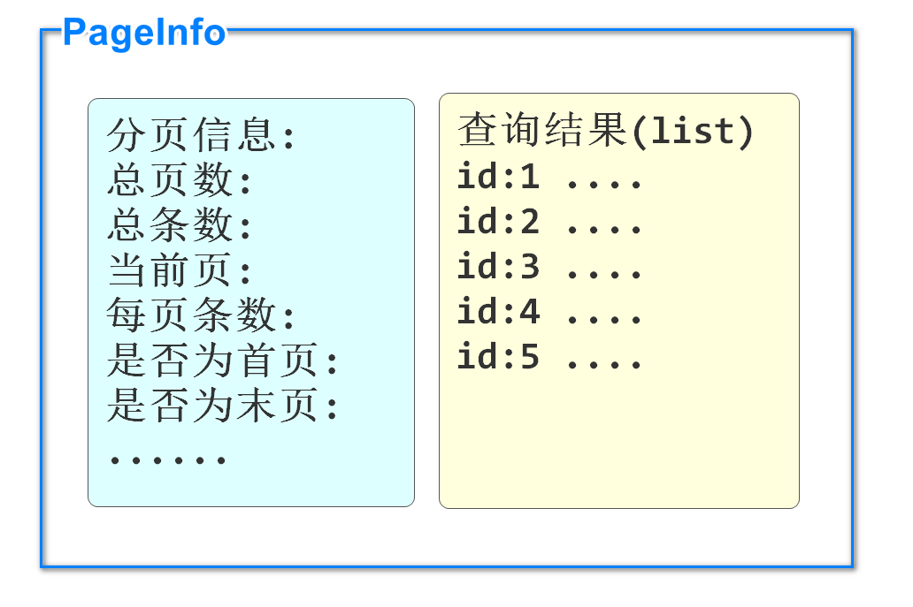

# 分页查询

## 分页查询的优点

所谓分页,就是查询结果数据较多时,采用按页显示的方法,而不是一次性全部显示

分页的优点:

1. 服务器:一次性查询所有信息,服务器压力大,分页查询服务器压力小
2. 客户端:一次性显示所有信息,需要更多流量,加载时间也会更长,分页显示没有这个问题
3. 用户体验上:一般最有价值的信息都会在前几页显示,也方便用户记忆,多查询出来的数据使用几率很低

## PageHelper实现分页查询

我们可以使用sql语句中添加limit关键字的方法实现分页查询

但是查询分页内容时,我们要自己计算相关的分页信息和参数

分页逻辑无论什么业务都是类似的,所以有框架帮助我们高效实现分页功能

PageHelper框架可以实现我们提供页码和每页条数,自动实现分页效果,收集分页信息

PageHelper的分页原理就是在程序运行时,在sql语句尾部添加limit关键字,并按照分页信息向limit后追加分页数据

要想使用,首先还是添加依赖

我们在之前搭建的微服务项目中先编写学习,建议使用csmall-order模块

```xml
<dependency>
    <groupId>com.github.pagehelper</groupId>
    <artifactId>pagehelper-spring-boot-starter</artifactId>
</dependency>
```

在添加seata支持时已经添加了pagehepler依赖

## PageHelper的基本使用

我们在使用PageHelper框架进行分页查询时,先编写持久层代码(Mybatis框架将sql写在注解中或xml文件中效果相同)

例如我们在OrderMapper接口中添加查询订单的方法

```java
@Select("select id,user_id,commodity_code,count,money from order_tbl")
List<Order> findAllOrders();
```

注意这个方法并不需要任何分页的参数或返回值,sql也不需要编写limit

都是在业务逻辑层中由PageHelper框架处理的

下面就转到业务逻辑层实现类,先编写一个方法使用PageHelper的功能

```java
// 分页查询所有订单的方法
// pageNum是要查询的页码
// pageSize是每页的条数
public PageInfo<Order> getAllOrdersByPage(Integer pageNum,Integer pageSize){

    // 利用PageHelper框架的功能,指定分页的查询的页码和每页条数
    // pageNum为1时,就是查询第一页,和SpringData的分页不同(SpringData分页0表示第一页)
    PageHelper.startPage(pageNum,pageSize);
    // 调用查询所有订单的方法
    // 因为上面设置了分页查询的条件,所以下面的查询就会自动在sql语句后添加limit关键字
    // 查询出的list就是需要查询的页码的数据
    List<Order> list=orderMapper.findAllOrders();
    // 我们完成了分页数据的查询,但是当前方法要求返回分页信息对象PageInfo
    // PageInfo中可以包含分页数据和各种分页信息,这些信息都是自定计算出来的
    // 要想获得这个对象,可以在执行分页查询后实例化PageInfo对象,所有分页信息会自动生成
    return new PageInfo<>(list);
}
```

PageInfo对象既包含查询数据结果,又包含分页信息

数据结构如下图



PageInfo具体的属性功能见下面列表

## PageInfo类中的分页信息解释

```
//当前页
private int pageNum;
//每页的数量
private int pageSize;
//当前页的行数量
private int size;
//当前页面第一个元素在数据库中的行号
private int startRow;
//当前页面最后一个元素在数据库中的行号
private int endRow;
//总页数
private int pages;
//前一页页号
private int prePage;
//下一页页号
private int nextPage;
//是否为第一页
private boolean isFirstPage;
//是否为最后一页
private boolean isLastPage;
//是否有前一页
private boolean hasPreviousPage;
//是否有下一页
private boolean hasNextPage;
//导航条中页码个数
private int navigatePages;
//所有导航条中显示的页号
private int[] navigatepageNums;
//导航条上的第一页页号
private int navigateFirstPage;
//导航条上的最后一页号
private int navigateLastPage;
```

## 控制层调用分页功能

在OrderController类中添加调用分页方法

```java
@GetMapping("/page")
@ApiOperation("分页查询订单")
@ApiImplicitParams({
        @ApiImplicitParam(value = "页码",name="pageNum",example = "1"),
        @ApiImplicitParam(value = "每页条数",name="pageSize",example = "10")
})
public JsonResult<PageInfo<Order>> pageOrders(Integer pageNum,Integer pageSize){
    // 分页调用
    PageInfo<Order> pageInfo=orderService.getAllOrdersByPage(pageNum,pageSize);
    return JsonResult.ok("查询完成",pageInfo);
}
```

启动Nacos\Seata

启动order

进行knife4j测试

可以观察控制台输出的运行的sql语句(会自动添加limit关键字)

## 使用JsonPage返回结果

当前我们分页查询返回的类型是PageInfo

如果用这个类型就会出现任何调用这个方法的模块都需要添加PageHelper的依赖,这是不合理的

所以我们可以在commons模块中,添加一个专门返回分页结果的类,代替PageInfo

我们定义一个JsonPage类型代替PageInfo,并编写一个PageInfo转换成JsonPage对象的方法在需要时使用

commons模块添加依赖

```xml
<dependency>
    <groupId>com.github.pagehelper</groupId>
    <artifactId>pagehelper</artifactId>
    <version>5.2.0</version>
</dependency>
```

在restful包中新建一个JsonPage类

代码如下

```java
// 通用支持分页查询的结果对象类型
@Data
public class JsonPage<T> implements Serializable {

    // 按照实际需求,定义这个类中的属性
    @ApiModelProperty(value = "当前页码",name = "pageNum")
    private Integer pageNum;
    @ApiModelProperty(value = "每页条数",name = "pageSize")
    private Integer pageSize;
    @ApiModelProperty(value = "总条数",name = "totalCount")
    private Long totalCount;
    @ApiModelProperty(value = "总页数",name = "totalPages")
    private Integer totalPages;
    // 声明一个属性,来承载查询到的分页数据结果
    @ApiModelProperty(value = "分页数据",name = "list")
    private List<T> list;

    // 所有属性写完了,下面要编写将其他框架的分页结果转换成当前类对象的方法
    // SpringDataElasticsearch或PageHelper等具有分页功能的框架,均有类似PageInfo的对象
    // 我们可以分别编写方法,将它们转换成JsonPage对象,我们先只编写PageHelper的转换
    public static <T> JsonPage<T> restPage(PageInfo<T> pageInfo){
        // 下面开始将pageInfo对象的属性赋值给JsonPage对象
        JsonPage<T> result=new JsonPage<>();
        result.setPageNum(pageInfo.getPageNum());
        result.setPageSize(pageInfo.getPageSize());
        result.setTotalCount(pageInfo.getTotal());
        result.setTotalPages(pageInfo.getPages());
        result.setList(pageInfo.getList());
        // 返回赋值完毕的JsonPage对象
        return result;
    }


}
```

下面去使用这个类

csmall-order-service业务逻辑层接口项目添加方法

返回值使用JsonPage

```java
// 分页查询所有订单的方法
JsonPage<Order> getAllOrdersByPage(Integer pageNum,Integer pageSize);
```

csmall-order-webapi项目实现类中进行修改

```java
//     ↓↓↓↓↓↓↓↓
public JsonPage<Order> getAllOrdersByPage(Integer pageNum, Integer pageSize){

    // 利用PageHelper框架的功能,指定分页的查询的页码和每页条数
    // pageNum为1时,就是查询第一页,和SpringData的分页不同(SpringData分页0表示第一页)
    PageHelper.startPage(pageNum,pageSize);
    // 调用查询所有订单的方法
    // 因为上面设置了分页查询的条件,所以下面的查询就会自动在sql语句后添加limit关键字
    // 查询出的list就是需要查询的页码的数据
    List<Order> list=orderMapper.findAllOrders();
    // 我们完成了分页数据的查询,但是当前方法要求返回分页信息对象PageInfo
    // PageInfo中可以包含分页数据和各种分页信息,这些信息都是自定计算出来的
    // 要想获得这个对象,可以在执行分页查询后实例化PageInfo对象,所有分页信息会自动生成
    //     ↓↓↓↓↓↓↓↓↓↓↓↓↓↓↓↓↓↓↓↓↓↓↓↓↓↓↓↓↓↓↓↓↓↓↓↓↓
    return JsonPage.restPage(new PageInfo<>(list));
}
```

业务逻辑层返回值的修改影响控制器方法的调用

再去修改OrderController中方法调用的位置

```java
@Autowired
//      ↓↓↓↓↓↓↓↓↓↓↓↓
private IOrderService orderService;

//...
//                ↓↓↓↓↓↓↓↓
public JsonResult<JsonPage<Order>> pageOrders(Integer pageNum, Integer pageSize){
      // 分页调用
      //↓↓↓↓↓↓        ↓↓↓↓↓↓↓↓↓  
      JsonPage<Order> jsonPage=orderService.getAllOrdersByPage(pageNum,pageSize);
      //                            ↓↓↓↓↓↓↓↓↓↓
      return JsonResult.ok("查询完成",jsonPage);
}
```

# 开发酷鲨商城Front模块

## 按分类id分页查询Spu列表

用户会根据分类树中的分类的名称,查询它需要的商品类别

点击商品分类名称时,实际上我们获得了它的分类id(categoryId)

我们可以根据这个id到pms_spu表中查询商品信息

并进行分页显示

这个查询还是编写在front模块,但是查询spu的代码已经在product模块中完成了

下面就在业务逻辑层中创建FrontProductServiceImpl

```java
@Service
public class FrontProductServiceImpl implements IFrontProductService {

    @DubboReference
    private IForFrontSpuService dubboSpuService;

    @Override
    public JsonPage<SpuListItemVO> listSpuByCategoryId(Long categoryId, Integer page, Integer pageSize) {
        // IForFrontSpuService实现类中完成了分页步骤,所以我们直接调用即可
        JsonPage<SpuListItemVO> spuListItemVOJsonPage=
                dubboSpuService.listSpuByCategoryId(categoryId,page,pageSize);
        // 千万别忘了返回spuListItemVOJsonPage
        return spuListItemVOJsonPage;
    }

    @Override
    public SpuStandardVO getFrontSpuById(Long id) {
        return null;
    }

    @Override
    public List<SkuStandardVO> getFrontSkusBySpuId(Long spuId) {
        return null;
    }

    @Override
    public SpuDetailStandardVO getSpuDetail(Long spuId) {
        return null;
    }

    @Override
    public List<AttributeStandardVO> getSpuAttributesBySpuId(Long spuId) {
        return null;
    }
}
```

转到控制层编写调用

创建FrontSpuController

代码如下

```java
@RestController
@RequestMapping("/front/spu")
@Api(tags = "前台商品spu模块")
public class FrontSpuController {

    @Autowired
    private IFrontProductService frontProductService;
    // localhost:10004/front/spu/list/3
    @GetMapping("/list/{categoryId}")
    @ApiOperation("根据分类id查询spu列表")
    @ApiImplicitParams({
            @ApiImplicitParam(value = "分类id",name = "categoryId",required = true,
                    dataType = "long"),
            @ApiImplicitParam(value = "页码",name = "page",required = true,
                    dataType = "int"),
            @ApiImplicitParam(value = "每页条数",name = "pageSize",required = true,
                    dataType = "int")
    })
    public JsonResult<JsonPage<SpuListItemVO>> listSpuByPage(
            @PathVariable Long categoryId,Integer page,Integer pageSize){
        JsonPage<SpuListItemVO> jsonPage=
                frontProductService.listSpuByCategoryId(categoryId,page,pageSize);
        return JsonResult.ok(jsonPage);
    }
}
```

将前面章节启动的Order模块停止

然后再Nacos\Seata\Redis启动的前提下

顺序启动Leaf\Product\Front

进行测试

http://localhost:10004/doc.html

## 实现查询商品详情页

上面章节完成了查询spu列表

在商品列表中选中商品后,会显示这个商品的详情信息

我们需要显示的信息包括

* 根据spuId查询spu信息
* 根据spuId查询spuDetail详情
* 根据spuId查询当前Spu包含的所有属性
* 根据spuId查询对应的sku列表

继续编写FrontProductServiceImpl其他没有实现的方法

```java
@Service
public class FrontProductServiceImpl implements IFrontProductService {

    @DubboReference
    private IForFrontSpuService dubboSpuService;
    // 声明消费Sku相关的业务逻辑
    @DubboReference
    private IForFrontSkuService dubboSkuService;
    // 声明消费商品参数选项(attribute)的业务逻辑
    @DubboReference
    private IForFrontAttributeService dubboAttributeService;


    @Override
    public JsonPage<SpuListItemVO> listSpuByCategoryId(Long categoryId, Integer page, Integer pageSize) {
        // IForFrontSpuService实现类中完成了分页步骤,所以我们直接调用即可
        JsonPage<SpuListItemVO> spuListItemVOJsonPage=
                dubboSpuService.listSpuByCategoryId(categoryId,page,pageSize);
        // 千万别忘了返回spuListItemVOJsonPage
        return spuListItemVOJsonPage;
    }

    // 根据spuId查询Spu详情
    @Override
    public SpuStandardVO getFrontSpuById(Long id) {
        // dubbo调用spu的方法即可
        SpuStandardVO spuStandardVO=dubboSpuService.getSpuById(id);
        return spuStandardVO;
    }

    // 根据spuId查询当前spu对应的所有sku商品列表
    @Override
    public List<SkuStandardVO> getFrontSkusBySpuId(Long spuId) {
        List<SkuStandardVO> list=dubboSkuService.getSkusBySpuId(spuId);
        return list;
    }

    // 根据spuId查询spuDetail详情
    @Override
    public SpuDetailStandardVO getSpuDetail(Long spuId) {
        SpuDetailStandardVO spuDetailStandardVO=
                dubboSpuService.getSpuDetailById(spuId);
        return spuDetailStandardVO;
    }

    // 根据spuId查询当前商品的所有参数选项集合
    @Override
    public List<AttributeStandardVO> getSpuAttributesBySpuId(Long spuId) {
        // dubbo调用Product模块编写好的方法
        // 这个方法的sql语句是一个5表联查,需要额外注意
        List<AttributeStandardVO> list=
                dubboAttributeService.getSpuAttributesBySpuId(spuId);
        return list;
    }
}
```

根据spuid查询商品属性选项的sql语句

思路

1.根据spu_id去pms_spu表查询category_id

2.根据category_id去pms_category表查询分类对象

3.根据category_id去pms_category_attribute_template表查询attribute_template_id

4.根据attribute_template_id去pms_attribute_template表查询attribute_template数据行

5.根据attribute_template_id去pms_attribute表查询对应所有属性信息行

```sql
SELECT
	pa.id , pa.template_id , pa.name , pa.description,
	pa.`type` , pa.input_type , pa.value_list,
	pa.unit , pa.sort , pa.is_allow_customize
FROM pms_spu ps 
JOIN pms_category pc ON ps.category_id=pc.id
JOIN pms_category_attribute_template pcat 
							ON pc.id=pcat.category_id
JOIN pms_attribute_template pat 
							ON pat.id=pcat.attribute_template_id
JOIN pms_attribute pa ON pa.template_id=pat.id
WHERE ps.id=4	
```

编写控制层代码

在FrontSpuController类中继续编写上面业务逻辑层方法的调用即可

```java
@RestController
@RequestMapping("/front/spu")
@Api(tags = "前台商品spu模块")
public class FrontSpuController {

    @Autowired
    private IFrontProductService frontProductService;
    // localhost:10004/front/spu/list/3
    @GetMapping("/list/{categoryId}")
    @ApiOperation("根据分类id查询spu列表")
    @ApiImplicitParams({
            @ApiImplicitParam(value = "分类id",name = "categoryId",required = true,
                    dataType = "long"),
            @ApiImplicitParam(value = "页码",name = "page",required = true,
                    dataType = "int"),
            @ApiImplicitParam(value = "每页条数",name = "pageSize",required = true,
                    dataType = "int")
    })
    public JsonResult<JsonPage<SpuListItemVO>> listSpuByPage(
            @PathVariable Long categoryId,Integer page,Integer pageSize){
        JsonPage<SpuListItemVO> jsonPage=
                frontProductService.listSpuByCategoryId(categoryId,page,pageSize);
        return JsonResult.ok(jsonPage);
    }

    // 根据spuId查询spu详情
    // localhost:10004/front/spu/4
    @GetMapping("/{id}")
    @ApiOperation("根据spuId查询spu详情")
    @ApiImplicitParams({
            @ApiImplicitParam(value = "spuId",name = "id",required = true,
                    dataType = "long")
    })
    public JsonResult<SpuStandardVO> getFrontSpuById(@PathVariable Long id){
        SpuStandardVO spuStandardVO=frontProductService.getFrontSpuById(id);
        return JsonResult.ok(spuStandardVO);
    }
    // 根据spuId查询所有参数选项属性
    @GetMapping("/template/{id}")
    @ApiOperation("根据spuId查询所有参数选项属性")
    @ApiImplicitParams({
            @ApiImplicitParam(value = "spuId",name="id",required = true,
                              dataType = "long")
    })
    public JsonResult<List<AttributeStandardVO>> getAttributeBySpuId(
                        @PathVariable Long id){
        List<AttributeStandardVO> list=frontProductService.getSpuAttributesBySpuId(id);
        return JsonResult.ok(list);
    }


}
```

新建sku控制器

FrontSkuController

```java
@RestController
@RequestMapping("/front/sku")
@Api(tags = "商品前台sku模块")
public class FrontSkuController {
    @Autowired
    private IFrontProductService frontProductService;
    // 根据spuId查询sku列表
    @GetMapping("/{spuId}")
    @ApiOperation("根据spuId查询sku列表")
    @ApiImplicitParam(value = "spuId",name="spuId",required = true,
                    dataType = "long")
    public JsonResult<List<SkuStandardVO>> getSkuListBySpuId(
                    @PathVariable Long spuId){
        List<SkuStandardVO> list=frontProductService.getFrontSkusBySpuId(spuId);
        return JsonResult.ok(list);
    }


}
```

新建spu详情控制器

FrontSpuDetailController

```java
@RestController
@RequestMapping("/front/spu/detail")
@Api(tags = "前台spuDetail模块")
public class FrontSpuDetailController {
    @Autowired
    private IFrontProductService frontProductService;
    // 根据spuId查询spu的detail详情信息
    @GetMapping("/{spuId}")
    @ApiOperation("根据spuId查询spu的detail详情信息")
    @ApiImplicitParam(value = "spuId", name = "spuId", required = true, dataType = "long")
    public JsonResult<SpuDetailStandardVO> getSpuDetail(@PathVariable Long spuId){
        SpuDetailStandardVO spuDetailStandardVO=frontProductService.getSpuDetail(spuId);
        return JsonResult.ok(spuDetailStandardVO);
    }


}
```

重启front

测试成功即可!


