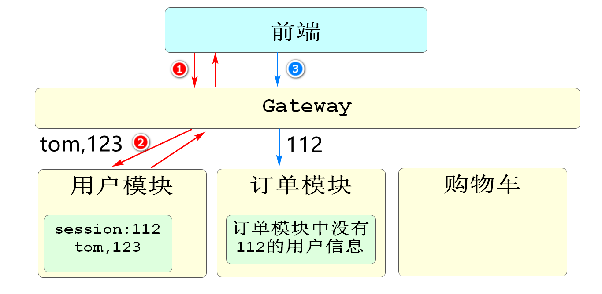
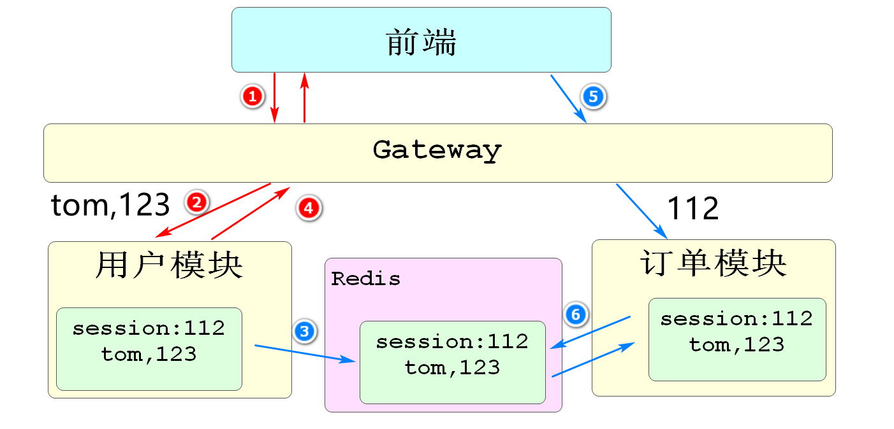
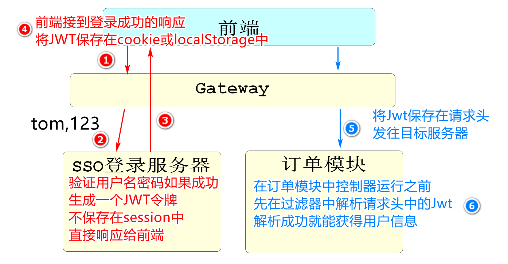
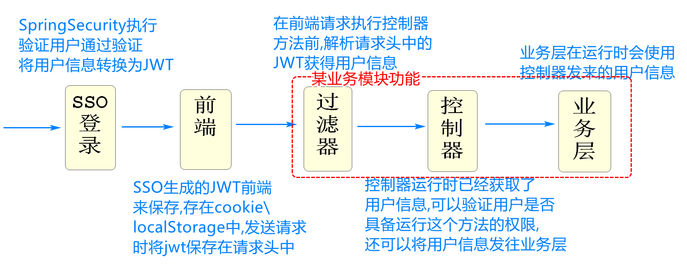
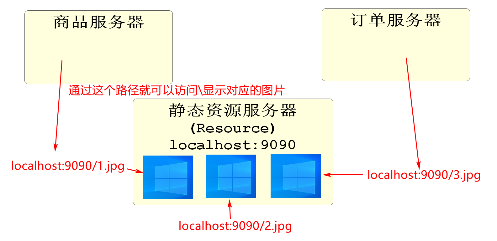
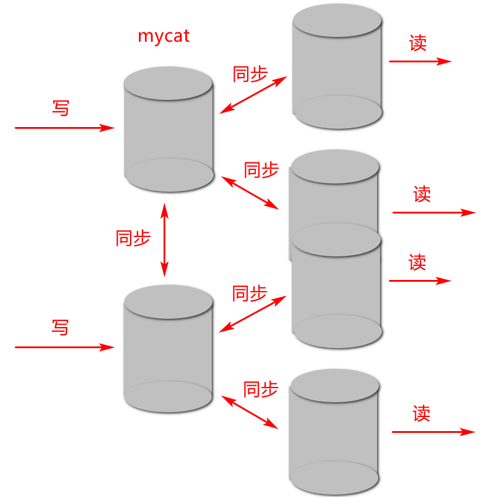
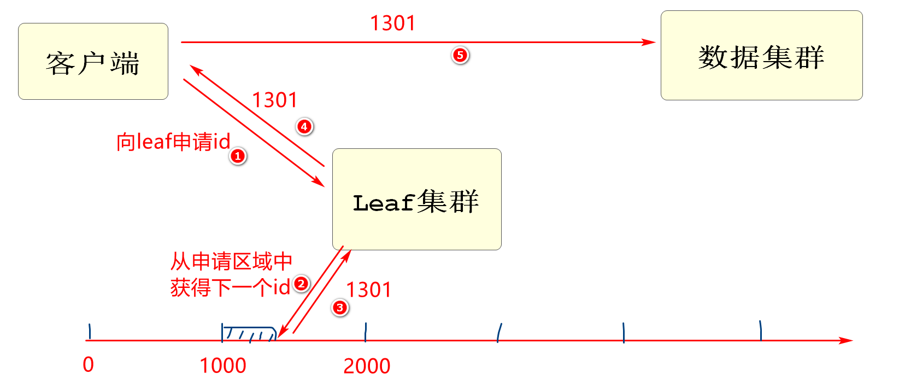

前端项目Git地址

https://gitee.com/mingxuchn/csmall-mobile-repo.git

# 用户\角色\权限

用户是一个基本的单位

我们登录时都是在登录用户的

我们再登录后需要明确这个用户具有哪些角色

用户和角色的关系是多对多

用户是一张表,角色也是一张表,因为它们是多对多的关系所以要有一张保存用户和角色关系的中间表

角色也不能直接决定这个用户能做什么操作,有哪些权限

需要再关联权限表决定

角色和权限也是多对多的关系,也要有中间表

如果项目开发的权限比较全面,可能会出现临时用户权限关系表


# Spring Security

Spring Security框架用于实现登录

同时还可以将当前登录用户的权限信息保存


我们需要花费一些精力将Spring Security的登录过程要记忆,应对面试提问

我们在项目中要验证当前用户是否具备某个权限时

可以再控制器方法代码前添加@PreAuthorize("[权限名称]")SpringSecurity在运行该方法之前进行核查

如果不具备这个权限会返回403状态码

# 关于单点登录

## 微服务的会话保持问题

我们在微服务的架构下,完成登录,和单机模式的登录是有很大区别的

首先我们分析一下普通登录和微服务登录的区别



上面的图片,表示我们在微服务系统中登录时遇到的问题

我们在用户模块中登录,只是将用户信息保存在用户模块的session中

而这个session不会和其他模块共享

所以在我们访问订单模块或其他模块时,通过sessionid并不能获得在用户模块中登录成功的信息

这样就丢失的用户信息,不能完成业务

市面上现在大多使用JWT来实现微服务架构下的会话保持

也就是在一个服务器上登录成功后,微服务的其他模块也能识别用户的登录信息

这个技术就是单点登录

## 单点登录解决方案

### Session共享

这种方式的核心思想是将用户的登录信息共享给其他模块

适用于小型的,用户量不大的微服务项目



将登录成功的用户信息共享给Redis

其他模块根据sessionId获得Redis中保存的用户信息即可

* 这样做最大的缺点就是内存严重冗余,不适合大量用户的微服务项目

### JWT令牌

这种登录方式,最大的优点就是不占用内存



生成的JWT由客户端自己保存,不占用服务器内存

在需要表明自己用户身份\信息时,将JWT信息保存到请求头中发送请求即可

## Jwt登录流程图



# 搭建前端项目

前端项目Git地址

https://gitee.com/mingxuchn/csmall-mobile-repo.git

首先要修改一个位置

```js
前端
src/views/product/Detail.vue
loadCurrentSpuDetail方法末尾约309行

// 加载规格默认数据
this.sku.price = this.spuDetailInfo.listPrice;
this.goods.picture=this.spuDetailInfo.pictureUrls[0];  // 这行是新加的
```

运行前可以参考项目的README.md文件

要运行项目首先需要在Idea的Terminal中输入

```
npm install
```

```
C:\Users\TEDU\IdeaProjects\csmall-mobile-repo>npm install
```

运行过程中有警告无视掉

运行完毕之后启动项目

```
npm run serve
```

```
C:\Users\TEDU\IdeaProjects\csmall-mobile-repo>npm run serve
```

之后就可以使用localhost:8080访问了

# 静态资源服务器

## 什么是静态资源服务器

我们无论做什么项目,都会有一些页面中需要显示的静态资源,例如图片,视频文档等

我们一般会创建一个单独的项目,这个项目中保存静态资源

其他项目可以通过我们保存资源的路径访问



## 为什么需要静态资源服务器

原因是静态资源服务器可以将项目需要的所有图片统一管理起来

当其他模块需要图片时,可以从数据库中直接获得访问静态资源的路径即可

方便管理所有静态资源

# Leaf

## 什么Leaf

leaf是叶子的意思

我们使用的Leaf是美团公司开源的一个分布式序列号(id)生成系统

我们可以在Github网站上下载项目直接使用

## 为什么需要Leaf



上面的图片中

是一个实际开发中常见的读写分离的数据库部署格式

专门进行数据更新(写)的有两个数据库节点

它们同时新增数据可能产生相同的id

一旦生成相同的id,数据同步就会有问题

会产生id冲突,甚至引发异常

我们为了在这种多数据库节点的环境下能够产生唯一id

可以使用Leaf来生成

## Leaf的工作原理

Leaf底层通过雪花算法生成不相同的id

在Leaf的数据库中

设置了每个模块申请id的数量

一旦一个模块申请了这个区域的id,其他模块就不能再申请了,默认自增申请下一个区域的id



# 开发购物车功能

## 新增sku到购物车

上次课我们开发到了显示商品详情

有点击"添加到购物车"的按钮

但是没有反应,我们完成添加购物车的功能就能实现这个效果了

打开mall-order-webapi模块

创建mapper\service.impl\controller包

当前mall-order模块,管理的数据库是mall-oms数据库

业务逻辑中一些基本的注意事项

* 判断用户是否登录,只有登录后才能将商品新增到购物车
* 验证购物车信息的完整性
* 业务逻辑层要判断新增的sku是否在当前用户的购物车表中已经存在
  * 如果不存在是新增sku流程
  * 如果已经存在,是修改数量的流程

### 开发持久层

持久层要按上面分析的业务逻辑,开发多个方法

1.判断当前登录用户购物车中是否包含指定skuid商品的方法

2.新增sku到购物车表中

3.修改购物车指定sku数量的方法

mapper包创建OmsCartMapper接口,编写代码如下

```java
@Repository
public interface OmsCartMapper {
    // 判断当前用户的购物车列表中是否包含指定sku商品的方法
    OmsCart selectExistsCart(@Param("userId") Long userId,@Param("skuId") Long skuId);

    // 新增商品到购物车表中
    void saveCart(OmsCart omsCart);

    // 修改指定购物车商品的数量的方法
    void updateQuantityById(OmsCart omsCart);

}
```

对应的Mapper.xml文件

```xml
<?xml version="1.0" encoding="UTF-8"?>
<!DOCTYPE mapper PUBLIC "-//mybatis.org//DTD Mapper 3.0//EN" "http://mybatis.org/dtd/mybatis-3-mapper.dtd">
<mapper namespace="cn.tedu.mall.order.mapper.OmsCartMapper">

    <!-- 通用查询映射结果 -->
    <resultMap id="BaseResultMap" type="cn.tedu.mall.pojo.order.model.OmsCart">
        <id column="id" property="id" />
        <result column="user_id" property="userId" />
        <result column="sku_id" property="skuId" />
        <result column="title" property="title" />
        <result column="main_picture" property="mainPicture" />
        <result column="price" property="price" />
        <result column="quantity" property="quantity" />
        <result column="gmt_create" property="gmtCreate" />
        <result column="gmt_modified" property="gmtModified" />
        <result column="bar_code" property="barCode"/>
        <result column="data" property="data"/>
    </resultMap>
    <!--  声明一个全字符sql片段   -->
    <sql id="SimpleQueryFields">
        <if test="true">
            id,
            user_id,
            sku_id,
            title,
            main_picture,
            price,
            quantity,
            gmt_create,
            gmt_modified
        </if>
    </sql>
    <!-- 判断当前用户的购物车列表中是否包含指定sku商品的方法  -->
    <select id="selectExistsCart" resultType="cn.tedu.mall.pojo.order.model.OmsCart">
        select
            <include refid="SimpleQueryFields" />
        from
            oms_cart
        where
            user_id=#{userId}
        and
            sku_id=#{skuId}
    </select>
    <!-- 新增购物车信息 -->
    <insert id="saveCart" useGeneratedKeys="true" keyProperty="id">
        insert into oms_cart(
            user_id,
            sku_id,
            title,
            main_picture,
            price,
            quantity
        ) values(
            #{userId},
            #{skuId},
            #{title},
            #{mainPicture},
            #{price},
            #{quantity}
        )
    </insert>
    <!--  根据购物车id修改数量  -->
    <update id="updateQuantityById" >
        update
            oms_cart
        set
            quantity=#{quantity}
        where
            id=#{id}

    </update>
    
</mapper>
```

### 开发业务逻辑层

创建OmsCartServiceImpl类实现IOmsCartService接口

实现其中方法,先实现新增购物车的方法即可

需要注意,我们在业务逻辑层中需要使用用户的信息

要单独编写一个方法获取用户信息,

```java
@Service
public class OmsCartServiceImpl implements IOmsCartService {

    @Autowired
    private OmsCartMapper omsCartMapper;

    @Override
    public void addCart(CartAddDTO cartDTO) {
        // 获取当前登录用户的userId
        Long userId=getUserId();
        // 查询这个userId的用户是否已经将指定的sku添加到购物车
        OmsCart omsCart=omsCartMapper.selectExistsCart(userId,cartDTO.getSkuId());
        // 判断查询结果是否为null
        if(omsCart!=null){
            // 不等于null,表示当前用户这个sku已经添加在购物车列表中
            // 我们需要做的就是修改它的数量,根据cartDTO对象的quantity属性值添加
            omsCart.setQuantity(omsCart.getQuantity()+cartDTO.getQuantity());
            // 调用持久层方法修改数量
            omsCartMapper.updateQuantityById(omsCart);
        }else{
            // 如果omsCart是null 会运行else代码块
            // 去完成购物车对象的新增,先实例化OmsCart对象
            OmsCart newOmsCart=new OmsCart();
            // 将参数cartDTO的同名属性赋值给newOmsCart
            BeanUtils.copyProperties(cartDTO,newOmsCart);
            // cartDTO对象中没有userId属性,需要单独赋值
            newOmsCart.setUserId(userId);
            // 执行新增
            omsCartMapper.saveCart(newOmsCart);
        }
    }

    @Override
    public JsonPage<CartStandardVO> listCarts(Integer page, Integer pageSize) {
        return null;
    }

    @Override
    public void removeCart(Long[] ids) {

    }

    @Override
    public void removeAllCarts() {

    }

    @Override
    public void removeUserCarts(OmsCart omsCart) {

    }

    @Override
    public void updateQuantity(CartUpdateDTO cartUpdateDTO) {

    }

    // 业务逻辑层获得用户信息的方法,因为多个方法需要获得用户信息,所以单独编写一个方法
    // 这个方法的实现是SpringSecurity提供的登录用户的容器
    // 方法的目标是获得SpringSecurity用户容器,从容器中获得用户信息
    public CsmallAuthenticationInfo getUserInfo(){
        // 获得SpringSecurity容器对象
        UsernamePasswordAuthenticationToken authenticationToken=
                (UsernamePasswordAuthenticationToken)SecurityContextHolder.
                        getContext().getAuthentication();
        // 判断获取的容器信息是否为空
        if(authenticationToken!=null){
            // 如果容器中有内容,证明当前容器中有登录用户信息
            // 我们获取这个用户信息并返回
            CsmallAuthenticationInfo csmallAuthenticationInfo=
                    (CsmallAuthenticationInfo)authenticationToken.getCredentials();
            return csmallAuthenticationInfo;
        }
        throw new CoolSharkServiceException(ResponseCode.UNAUTHORIZED,"没有登录信息");
    }
    // 业务逻辑层中大多数方法都是获得用户id,所以编写一个返回用户id的方法
    public Long getUserId(){
        return getUserInfo().getId();
    }


}
```

### 开发控制层

创建OmsCartController

```java
@RestController
@RequestMapping("/oms/cart")
@Api(tags = "购物车管理模块")
public class OmsCartController {
    @Autowired
    private IOmsCartService omsCartService;

    // 新增购物车信息的控制层方法
    @PostMapping("/add")
    @ApiOperation("新增购物车信息")
    // 判断当前用户是否具有普通用户权限ROLE_user
    // sso模块登录时,会在用户的权限列表中添加ROLE_user权限
    @PreAuthorize("hasRole('ROLE_user')")
    // cartAddDTO参数是需要经过SpringValidation框架验证的
    // @Validated就是激活框架验证功能,如果cartAddDTO不满足验证要求,会自动运行
    // 统一由异常处理类中的BingingException异常处理
    public JsonResult addCart(@Validated CartAddDTO cartAddDTO){
        omsCartService.addCart(cartAddDTO);
        return JsonResult.ok("成功添加到购物车");
    }

}
```

先注意sso模块application-test.yml的地址和端口号(密码有两个)

也要注意order模块application-test.yml的地址和端口号

都保证正确的前提下

启动 leaf    passport    order

sso:10002

order:10005


先访问10002登录获得JWT 用户名jackson密码123456

先登录看到JWT   然后复制JWT

转到10005 order模块 文档管理->全局参数设置->添加参数

参数名:Authorization

参数值:Bearer     [粘贴JWT] 

然后刷新当前10005的界面

然后进行发送请求即可成功! 

```
<dependency>
    <groupId>javax.xml.bind</groupId>
    <artifactId>jaxb-api</artifactId>
    <version>2.3.0</version>
</dependency>
```

## SpringSecurity验证规则

SpringSecurity框架登录后,一定会有一个权限列表

在userDetails对象中

我们登录用户的这个对象的值可能是

{"authorities":["ROLE_user"],"id":1,"userType":"USER","username":"jackson"}

sso模块前台用户登录时,会authorities属性中添加ROLE_user权限

而后台管理用户登录时会向authorities属性中添加下面属性

["/pms/product/read","/pms/product/update","/pms/product/delete"]

所以想要在控制器运行前判断权限时就可以使用下面的写法

@PreAuthorize("hasAuthority('ROLE_user')")

hasRole判断是专用于判断当前用户角色的指令

hasRole会自动在我们判断的内容前添加ROLE_

@PreAuthorize("hasRole('ROLE_user')")

## 开发查询购物车功能

### 开发持久层

OmsCartMapper添加方法如下

```java
// 根据当前用户id查询购物车列表
List<CartStandardVO> selectCartsByUserId(Long userId);
```

OmsCartMapper.xml添加对应内容

```xml
<!--  根据用户id查询购物车信息  -->
<select id="selectCartsByUserId"
        resultType="cn.tedu.mall.pojo.order.vo.CartStandardVO">
    select
        <include refid="SimpleQueryFields" />
    from
        oms_cart
    where
        user_id=#{id}
</select>
```

### 开发业务逻辑层

OmsCartServiceImpl业务实现

返回值支持分页结果,按分页条件查询

```java
// 根据用户id分页查询当前用户的购物车列表
@Override
public JsonPage<CartStandardVO> listCarts(Integer page, Integer pageSize) {
    // 获得用户id
    Long userId=getUserId();
    // 执行查询前设置分页条件
    PageHelper.startPage(page,pageSize);
    // 执行分页查询
    List<CartStandardVO> list=omsCartMapper.selectCartsByUserId(userId);
    // 实例化PageInfo对象获得分页信息后将它转换为JsonPage返回
    return JsonPage.restPage(new PageInfo<>(list));
}
```


