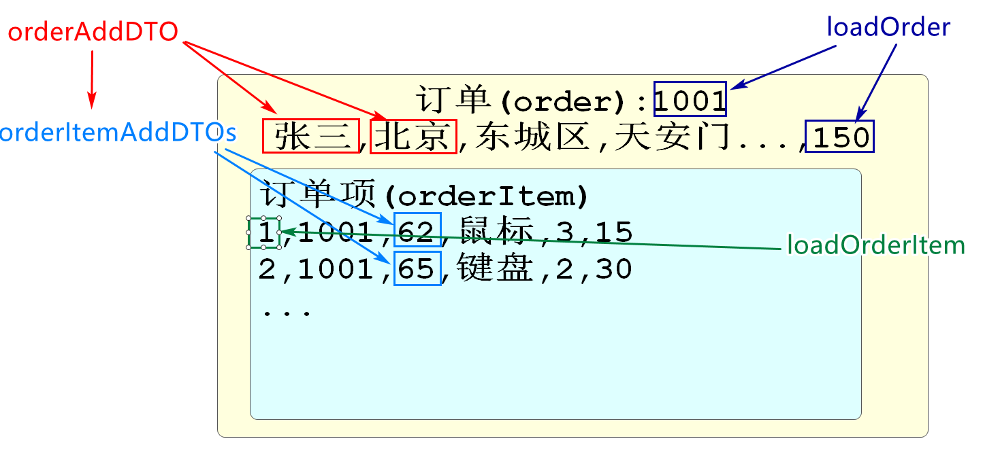

# 续开发购物车功能

## 查询购物车功能

### 开发控制层

上次课我们完成了开发持久层和业务逻辑层的代码

下面开发控制层,调用方法进行测试

OmsCartController添加方法如下

```java
// 分页查询当前用户购物车中的信息
@GetMapping("/list")
@ApiOperation("分页查询当前用户购物车中的信息")
@ApiImplicitParams({
        @ApiImplicitParam(value = "页码",name = "page",dataType = "int",example = "1"),
        @ApiImplicitParam(value = "每页条数",name = "pageSize",
                                    dataType = "int",example = "5")
})
@PreAuthorize("hasRole('ROLE_user')")
public JsonResult<JsonPage<CartStandardVO>> listCartByPage(
        // 当控制器参数可能为空,当空时,我们要给它赋默认值时,可以用下面的格式
        @RequestParam(required = false,defaultValue = WebConsts.DEFAULT_PAGE)
                                                                    Integer page,
        @RequestParam(required = false,defaultValue = WebConsts.DEFAULT_PAGE_SIZE)
                                                                    Integer pageSize
){
    // 控制层调用业务逻辑层代码
    JsonPage<CartStandardVO> jsonPage=omsCartService.listCarts(page,pageSize);
    return JsonResult.ok(jsonPage);

}
```

启动nacos\seata

启动leaf\sso\order模块

测试http://localhost:10005/doc.html

## 删除\清空购物车

### 删除购物车的持久层

我们删除购物车的功能支持同时删除一个或多个购物车中的商品

基本思路就是将一个要删除的购物车商品的id数组传入到Mapper中进行删除

在OmsCartMapper接口中添加放方法

```java
// 根据购物车的id删除商品(支持删除多个商品)
int deleteCartsByIds(Long[] ids);
```

对应的mapper.xml

```xml
<!--  根据id删除购物车信息  -->
<delete id="deleteCartsByIds">
    delete from
        oms_cart
    where 
        id in 
    <foreach collection="ids" item="id" separator="," open="(" close=")">
        #{id}
    </foreach>
</delete>
```

### 删除购物车的业务逻辑层

OmsCartServiceImpl添加方法

```java
// 按ids数组中的id值删除cart表中信息
@Override
public void removeCart(Long[] ids) {
    // 删除是包含返回值的
    int rows=omsCartMapper.deleteCartsByIds(ids);
    if(rows==0){
        throw new CoolSharkServiceException(ResponseCode.NOT_FOUND,
                "购物车中没有您要删除的商品");
    }
}
```

### 开发控制层代码

OmsCartController

```java
@PostMapping("/delete")
@ApiOperation("根据用户选择的购物车商品删除(支持批量)")
@ApiImplicitParam(value = "删除购物车的id",name="ids",required = true,
                                dataType = "array")
@PreAuthorize("hasRole('ROLE_user')")
public JsonResult removeCartsByIds(Long[] ids){
    omsCartService.removeCart(ids);
    return JsonResult.ok();
}
```

课上作业:

开发清空当前登录用户购物车的功能

```xml
<delete id="deleteCartsByUserId">
    delete from
        oms_cart
    where
        user_id=#{userId}
</delete>
```

```
@Override
public void removeAllCarts() {

}
```

### 清空购物车功能

Mapper接口

```java
// 删除当前用户购物车中所有内容
int deleteCartsByUserId(Long userId);
```

mapper.xml

```xml
<!-- 删除当前用户购物车中所有内容  -->
<delete id="deleteCartsByUserId">
    delete from
        oms_cart
    where
        user_id=#{userId}
</delete>
```

OmsCartServiceImpl

```java
// 清空当前登录用户购物车
@Override
public void removeAllCarts() {
    Long userId=getUserId();
    int rows=omsCartMapper.deleteCartsByUserId(userId);
    if(rows==0){
        throw new CoolSharkServiceException(ResponseCode.NOT_FOUND,"您的购物车中没有商品");
    }
}
```

OmsCartController

```java
// 根据用户id清空购物车
@PostMapping("/delete/all")
@ApiOperation("根据用户id清空购物车")
@PreAuthorize("hasRole('ROLE_user')")
public JsonResult removeCartsByUserId(){
    omsCartService.removeAllCarts();;
    return JsonResult.ok("购物车已清空");
}
```

## 修改购物车商品数量

### 开发业务逻辑层

因为前面我们已经完成了修改购物车数量的持久层,所以不需要再编写了,直接从业务层开始

```java
// 修改购物车商品数量的方法
@Override
public void updateQuantity(CartUpdateDTO cartUpdateDTO) {
    // 持久层中已经包含了修改数量的方法,但是参数是OmsCart
    // 将本方法的cartUpdateDTO参数值赋值给OmsCart再调用持久层方法即可
    OmsCart omsCart=new OmsCart();
    BeanUtils.copyProperties(cartUpdateDTO,omsCart);
    // 调用持久层实施修改
    omsCartMapper.updateQuantityById(omsCart);
}
```

控制层OmsCartController

```java
// 修改购物车数量
@PostMapping("/update/quantity")
@ApiOperation("修改购物车数量")
@PreAuthorize("hasRole('ROLE_user')")
public JsonResult updateQuantity(@Validated CartUpdateDTO cartUpdateDTO){
    omsCartService.updateQuantity(cartUpdateDTO);
    return JsonResult.ok("修改完成");
}
```

重启order测试清空和修改购物车数量的功能

# 订单功能

## 订单功能业务逻辑

用户选中购物车中的商品后,点击添加订单

我们要收集订单信息(sku商品信息,价格信息,优惠和运费信息等)然后才能执行生成订单操作

具体步骤如下

1.首先将用户选中的sku库存减少响应的数量

2.用户购物车要删除对应的商品

3.对应oms_order表执行新增,也就是创建一个订单

4.在新增订单成功后,我们还要将订单中的每种商品和订单关系添加在oms_order_item表中

这个业务中注意的事项或使用的技术有

整体是多个模块的数据操作所以需要seata分布式事务保证数据完整性

修改库存是mallProduct的功能,删除购物车和新增订单时mallOrder模块的功能

## 开发删除购物车商品功能

因为本次删除是要根据用户的id和skuid进行删除

之前没有开发过,所以要新编写方法

OmsCartMapper添加方法

```java
// 根据用户id和skuId删除商品
void deleteCartByUserIdAndSkuId(OmsCart omsCart);
```

对应的mapper.xml

```xml
<!--  根据userId和skuId删除购物车中商品   -->
<delete id="deleteCartByUserIdAndSkuId">
    delete from
        oms_cart
    where
        user_id=#{userId}
    and
        sku_id=#{skuId}
</delete>
```

当前删除购物车商品的功能是为生成订单准备的

所以只需要开发出业务逻辑层即可不需要控制层的代码

```java
// 生成订单时,删除购物车中信息的方法
@Override
public void removeUserCarts(OmsCart omsCart) {
    // 根据omsCart的userId和skuId删除购物车信息
    omsCartMapper.deleteCartByUserIdAndSkuId(omsCart);
}
```

## 开发新增订单功能

### 开发新增order_Item的持久层

order_item表中保存每张订单包含什么商品的信息

我们新增这个表,要包含订单号,商品id和相关信息

mapper下创建OmsOrderItemMapper

编写新增的方法如下

```java
@Repository
public interface OmsOrderItemMapper {

    // 新增订单业务时,需要一个能够新增oms_order_item表信息的方法
    // 因为一个订单中的商品可能有多个,所以我们新增方法的参数是List
    // 在Xml中试下list的遍历,实现连接一次数据库新增多条数据
    void insertOrderItems(List<OmsOrderItem> omsOrderItems);

}
```

OmsOrderItemMapper.xml文件添加内容

```xml
<!--  批量新增OmsOrderItem对象到数据库的方法  -->
<insert id="insertOrderItems" >
    insert into oms_order_item(
             id,
             order_id,
             sku_id,
             title,
             bar_code,
             data,
             main_picture,
             price,
             quantity
    ) values
    <foreach collection="omsOrderItems" item="ooi" separator=",">
        (
        #{ooi.id},
        #{ooi.orderId},
        #{ooi.skuId},
        #{ooi.title},
        #{ooi.barCode},
        #{ooi.data},
        #{ooi.mainPicture},
        #{ooi.price},
        #{ooi.quantity}
        )
    </foreach>
</insert>
```

### 开发新增Order的持久层

mapper包下再创建OmsOrderMapper

添加新增Order的方法

```java
@Repository
public interface OmsOrderMapper {
    // 新增订单对象到数据库的方法
    void insertOrder(OmsOrder order);
    
}
```

OmsOrderMapper.xml中添加方法

```xml
<insert id="insertOrder">
    insert into oms_order(
        id,
        sn,
        user_id,
        contact_name,
        mobile_phone,
        telephone,
        province_code,
        province_name,
        city_code,
        city_name,
        district_code,
        district_name,
        street_code,
        street_name,
        detailed_address,
        tag,
        payment_type,
        state,
        reward_point,
        amount_of_original_price,
        amount_of_freight,
        amount_of_discount,
        amount_of_actual_pay,
        gmt_pay,
        gmt_order,
        gmt_create,
        gmt_modified
    )  VALUES (
          #{id},
          #{sn},
          #{userId},
          #{contactName},
          #{mobilePhone},
          #{telephone},
          #{provinceCode},
          #{provinceName},
          #{cityCode},
          #{cityName},
          #{districtCode},
          #{districtName},
          #{streetCode},
          #{streetName},
          #{detailedAddress},
          #{tag},
          #{paymentType},
          #{state},
          #{rewardPoint},
          #{amountOfOriginalPrice},
          #{amountOfFreight},
          #{amountOfDiscount},
          #{amountOfActualPay},
          #{gmtPay},
          #{gmtOrder},
          #{gmtCreate},
          #{gmtModified}
      )
</insert>
```

### 开发新增订单的业务逻辑层

所有的业务都需要在业务逻辑层中完成判断和解析以及赋值

OmsOrderServiceImpl类中编写代码如下

```java
@DubboService
@Service
@Slf4j
public class OmsOrderServiceImpl implements IOmsOrderService {
    // 利用Dubbo获得product模块修改库存的功能
    @DubboReference
    private IForOrderSkuService dubboSkuService;
    @Autowired
    private IOmsCartService cartService;
    @Autowired
    private OmsOrderMapper orderMapper;
    @Autowired
    private OmsOrderItemMapper orderItemMapper;

    // 根据提供的订单信息,生成订单
    // Seata约束的分布式事务起点
    @GlobalTransactional
    @Override
    public OrderAddVO addOrder(OrderAddDTO orderAddDTO) {
        // 在连接数据库操作前,一定要先把所有数据准备好
        // 1.将订单实体的所有属性赋值OmsOrder
        OmsOrder omsOrder=new OmsOrder();
        // 将参数orderAddDTO所有同名属性赋值给omsOrder
        BeanUtils.copyProperties(orderAddDTO,omsOrder);
        // orderAddDTO中数据并不全面,我们需要更详细的信息才能新增订单
        // 因为收集信息代码较多,单独编写一个方法实现
        loadOrder(omsOrder);
        // 2.遍历订单中包含的所有商品的集合,也保证所有属性被赋值OmsOrderItem
        // 获得orderAddDTO对象中的所有商品sku集合,判断是否为空
        List<OrderItemAddDTO> orderItemAddDTOs=orderAddDTO.getOrderItems();
        if(orderItemAddDTOs==null || orderItemAddDTOs.isEmpty()){
            // 如果为null或集合中没有元素,抛出异常,终止新增订单
            throw new CoolSharkServiceException(ResponseCode.BAD_REQUEST,"订单中必须有商品");
        }
        // 我们的目标是将订单中的商品增到oms_order_item表中
        // 我们持有的持久层方法参数是List<OmsOrderItem>
        // 我们先在获得的是List<OrderItemAddDTO>,类型不一致,
        // 我们需要讲OrderItemAddDTO转换成OmsOrderItem,保存到一个新的集合里
        List<OmsOrderItem> omsOrderItems=new ArrayList<>();
        // 遍历参数中包含的所有商品列表
        for(OrderItemAddDTO addDTO: orderItemAddDTOs){
            // 先是转换我们的OrderItemAddDTO为OmsOrderItem
            OmsOrderItem orderItem=new OmsOrderItem();
            // 同名属性赋值
            BeanUtils.copyProperties(addDTO,orderItem);
            // 和Order一样OrderItem也有属性要单独复制
            loadOrderItem(orderItem);
            // 根据上面方法获得的omsOrder的订单id,给当前订单项的订单id属性赋值
            orderItem.setOrderId(omsOrder.getId());
            // 到此为止,我们的订单和循环遍历的订单中的订单项都已经赋好值,下面就要开始进行数据库操作了!
            // 将收集好信息的orderItem对象添加到omsOrderItems集合中
            omsOrderItems.add(orderItem);
            // 3.遍历中所有值被赋值后,修改集合中所有商品的库存,并从购物车中删除这些商品
            // 减少库存数
            // 获得skuId
            Long skuId=orderItem.getSkuId();
            // 获取减少的商品的数量
            Integer quantity=orderItem.getQuantity();
            // dubbo调用减少库存的方法
            int rows=dubboSkuService.reduceStockNum(skuId,quantity);
            // 如果rows值为0,表示这次修改没有修改任何行,一般因为库存不足导致的
            if(rows==0){
                log.warn("商品skuId:{},库存不足",skuId);
                // 抛出异常,Seata组件可以另之前循环过程中已经新增到数据库的信息回滚
                throw new CoolSharkServiceException(ResponseCode.BAD_REQUEST,"库存不足");
            }
            // 删除购物车中商品
            // 删除购物车商品的方法需要OmsCart实体类
            OmsCart omsCart=new OmsCart();
            omsCart.setSkuId(skuId);
            omsCart.setUserId(omsOrder.getUserId());
            cartService.removeUserCarts(omsCart);
        }
        // 4.将订单信息新增到数据(包括OrderItem和Order)
        // 新增OrderItem对象,利用mapper中批量新增的方法
        orderItemMapper.insertOrderItems(omsOrderItems);
        // 新增订单表
        orderMapper.insertOrder(omsOrder);

        // 最后要保证用户能够看到订单详情
        // 我们不需要返回订单的所有信息,因为前端包含大部分订单信息
        // 我们只需要返回后端生成的一些数据即可
        // OrderAddVO完成这个功能
        OrderAddVO addVO=new OrderAddVO();
        addVO.setId(omsOrder.getId());
        addVO.setSn(omsOrder.getSn());
        addVO.setCreateTime(omsOrder.getGmtCreate());
        addVO.setPayAmount(omsOrder.getAmountOfActualPay());
        // 别忘了返回正确的对象
        return addVO;
    }

    private void loadOrderItem(OmsOrderItem orderItem) {
        if(orderItem.getId()==null){
            Long id=IdGeneratorUtils.getDistributeId("order_item");
            orderItem.setId(id);
        }
        // 必须包含skuid信息,才能确定商品信息
        if(orderItem.getSkuId()==null){
            throw new CoolSharkServiceException(ResponseCode.BAD_REQUEST,
                                            "订单中商品必须包含skuId");
        }
    }


    // 新增订单业务中需要的收集Order信息的方法
    private void loadOrder(OmsOrder omsOrder) {
        // 针对OmsOrder对象为空的值进行收集或生成
        // 判断id是否为空
        if(omsOrder.getId()==null){
            // Leaf获得分布式id
            Long id= IdGeneratorUtils.getDistributeId("order");
            omsOrder.setId(id);
        }
        // 判断userId是否为空
        if(omsOrder.getUserId()==null){
            // 从SpringSecurity容器中获得jwt解析而来的用户id
            omsOrder.setUserId(getUserId());
        }
        // 判断sn
        if(omsOrder.getSn()==null){
            omsOrder.setSn(UUID.randomUUID().toString());
        }
        // 判断state
        if (omsOrder.getState()==null){
            // 如果订单状态为null默认是新生成的订单,状态为0:未支付
            omsOrder.setState(0);
        }
        // 下面要保证订单的生成实际,订单数据的创建实际和最后修改时间一致
        // 我们手动获取当前系统时间,统一给他们赋值
        if(omsOrder.getGmtOrder()==null){
            LocalDateTime now=LocalDateTime.now();
            omsOrder.setGmtOrder(now);
            omsOrder.setGmtCreate(now);
            omsOrder.setGmtModified(now);
        }
        // 下面是系统计算金额,前端实际上有基本计算显示,但是前安全性相对差,后端还要计算
        // 计算基本逻辑 原价+运费-优惠=最终价格
        // 判断运费,默认为0
        if(omsOrder.getAmountOfFreight()==null){
            // 默认运费为0
            omsOrder.setAmountOfFreight(new BigDecimal(0.0));
        }
        // 判断优惠,默认为0
        if(omsOrder.getAmountOfDiscount()==null){
            omsOrder.setAmountOfDiscount(new BigDecimal(0.0));
        }
        // 获取传递过来的原价信息,如果原价为空,抛出异常
        if(omsOrder.getAmountOfOriginalPrice()==null){
            throw new CoolSharkServiceException(ResponseCode.BAD_REQUEST,"没有提供订单原价");
        }
        // 计算实际支付金额
        // 原价+运费-优惠=最终价格
        BigDecimal originalPrice=omsOrder.getAmountOfOriginalPrice();
        BigDecimal freight=omsOrder.getAmountOfFreight();
        BigDecimal discount=omsOrder.getAmountOfDiscount();
        BigDecimal actualPay=originalPrice.add(freight).subtract(discount);
        // 赋值给实际支付属性
        omsOrder.setAmountOfActualPay(actualPay);


    }

    @Override
    public void updateOrderState(OrderStateUpdateDTO orderStateUpdateDTO) {

    }

    @Override
    public JsonPage<OrderListVO> listOrdersBetweenTimes(OrderListTimeDTO orderListTimeDTO) {
        return null;
    }

    @Override
    public OrderDetailVO getOrderDetail(Long id) {
        return null;
    }


    public CsmallAuthenticationInfo getUserInfo(){
        // 获得SpringSecurity容器对象
        UsernamePasswordAuthenticationToken authenticationToken=
                (UsernamePasswordAuthenticationToken) SecurityContextHolder.
                        getContext().getAuthentication();
        // 判断获取的容器信息是否为空
        if(authenticationToken!=null){
            // 如果容器中有内容,证明当前容器中有登录用户信息
            // 我们获取这个用户信息并返回
            CsmallAuthenticationInfo csmallAuthenticationInfo=
                    (CsmallAuthenticationInfo)authenticationToken.getCredentials();
            return csmallAuthenticationInfo;
        }
        throw new CoolSharkServiceException(ResponseCode.UNAUTHORIZED,"没有登录信息");
    }
    // 业务逻辑层中大多数方法都是获得用户id,所以编写一个返回用户id的方法
    public Long getUserId(){
        return getUserInfo().getId();
    }
}
```





* 新增oms_order_item的持久层参数是一个集合

* 订单生成时,时间是统一的(gmt_order,gmt_create,gmt_modified)

