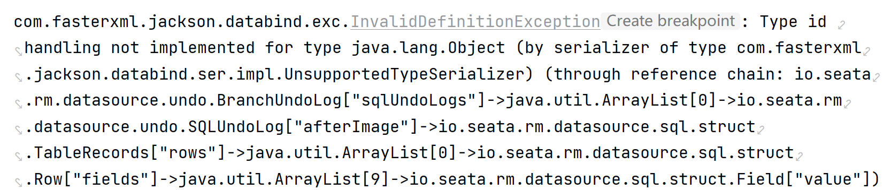

# 续 订单功能

## 新增订单的控制层

上次课完成了新增订单的业务逻辑层代码

下面开始编写控制层

新建OmsOrderController

```java
@RestController
@RequestMapping("/oms/order")
@Api(tags="订单功能")
public class OmsOrderController {
    
    @Autowired
    private IOmsOrderService orderService;
    
    @PostMapping("/add")
    @ApiOperation("生成订单的方法")
    @PreAuthorize("hasRole('ROLE_user')")
    public JsonResult<OrderAddVO> addOrder(@Validated OrderAddDTO orderAddDTO){
        OrderAddVO orderAddVO=orderService.addOrder(orderAddDTO);
        return JsonResult.ok(orderAddVO);
    }
    
}
```

启动Nacos\seata

依次启动服务Leaf\product\passport\order

访问10005执行新增


### Seata使用常见错误

 Seata在开始工作时,会将方法相关对象序列化后保存在对应数据库的undo_log表中

但是Seata我们序列化的方式支持很多中,常见的jackson格式序列化的情况下,不支持java对象LocalDataTime类型的序列化,序列化运行时会发送错误:



如果见到这样的错误, 就是因为jackson不能序列化LocalDataTime导致的

要想解决,两方面思路,

1.将序列化过程中LocalDataTime类型转换为Date

2.将Seata序列化转换为kryo类型,但是需要在pom文件中添加依赖(我们的项目中有)

```xml
<!--解决seata序列化问题-->
<dependency>
    <groupId>io.seata</groupId>
    <artifactId>seata-serializer-kryo</artifactId>
</dependency>
```

yml文件配置

```yml
#seata服务端
seata:
  tx-service-group: csmall_group
  service:
    vgroup-mapping:
      csmall_group: default
    grouplist:
      default: ${my.server.addr}:8091
  client:
    undo:
      log-serialization: kryo
```

## 查询订单功能

在新增订单成功之后,用户会看到订单列表

可以按时间查询一段时间范围内的订单列表

我们默认当前时间一个月以内的所有订单信息

订单信息要包括oms_order和oms_order_item两个表的信息

所以是一个连表查询

### 确定关联查询语句

```sql
SELECT 
	oo.id,
	oo.sn,
	oo.user_id,
	oo.contact_name,
	oo.state,
	oo.amount_of_actual_pay,
	oo.gmt_order,
	oo.gmt_create,
	oo.gmt_modified,
	oo.gmt_pay,
	ooi.id ooi_id,
	ooi.order_id,
	ooi.sku_id,
	ooi.title,
	ooi.main_picture,
	ooi.price,
	ooi.quantity
FROM oms_order oo
JOIN oms_order_item ooi ON oo.id=ooi.order_id
WHERE 
	oo.user_id=1
AND 
	oo.gmt_create > '2022-2-4 10:00:00'
AND
   oo.gmt_create < NOW()	
ORDER BY oo.gmt_modified DESC		
```

### 开发查询订单持久层

确定了sql语句之后,要使用在xml文件中

OmsOrderMapper添加方法

```java
// 查询当前用户指定时间范围内的所有订单
List<OrderListVO> selectOrdersBetweenTimes(OrderListTimeDTO orderListTimeDTO);
```

OmsOrderMapper.xml文件添加对应的内容

因为我们这次查询是一个连接查询,而且返回值是两张表的数据

所以要想正确将数据赋值到java对应的对象中,必须编写正确的关联关系

```xml
<resultMap id="OrderListMap" type="cn.tedu.mall.pojo.order.vo.OrderListVO">
    <id column="id" property="id" />
    <result column="sn" property="sn" />
    <result column="user_id" property="userId" />
    <result column="contact_name" property="contactName" />
    <result column="state" property="state" />
    <result column="amount_of_actual_pay" property="amountOfActualPay" />
    <result column="gmt_order" property="gmtOrder" />
    <result column="gmt_pay" property="gmtPay" />
    <result column="gmt_create" property="gmtCreate" />
    <result column="gmt_modified" property="gmtModified" />
    <collection property="orderItems"
                ofType="cn.tedu.mall.pojo.order.vo.OrderItemListVO">
        <id column="ooi_id" property="id" />
        <result column="order_id" property="orderId" />
        <result column="sku_id" property="skuId" />
        <result column="title" property="title" />
        <result column="main_picture" property="mainPicture" />
        <result column="price" property="price" />
        <result column="quantity" property="quantity" />
    </collection>
</resultMap>
<!--  当前用户指定时间范围内查询所有订单  -->
<select id="selectOrdersBetweenTimes" resultMap="OrderListMap">
    SELECT
    oo.id,
    oo.sn,
    oo.user_id,
    oo.contact_name,
    oo.state,
    oo.amount_of_actual_pay,
    oo.gmt_order,
    oo.gmt_create,
    oo.gmt_modified,
    oo.gmt_pay,
    ooi.id ooi_id,
    ooi.order_id,
    ooi.sku_id,
    ooi.title,
    ooi.main_picture,
    ooi.price,
    ooi.quantity
    FROM oms_order oo
    JOIN oms_order_item ooi ON oo.id=ooi.order_id
    WHERE
    oo.user_id=#{userId}
    AND
    oo.gmt_create &gt; #{startTime}
    AND
    oo.gmt_create &lt; #{endTime}
    ORDER BY oo.gmt_modified DESC

</select>
```

### 开发查询订单的业务逻辑层

OmsOrderServiceImpl添加查询订单的方法

```java
// 查询当前登录用户在指定时间范围内(默认一个月内)所有订单
// 订单包含订单信息和订单项信息两个方面(xml的sql语句是关联查询)
@Override
public JsonPage<OrderListVO> listOrdersBetweenTimes(OrderListTimeDTO orderListTimeDTO) {
    // 因为默认为最近一个月内,如果没有起始和结束时间,需要我们自动添加
    // 要检查起始时间和结束时间是否合理,我们单独编写方法校验上面业务
    validaTimeAndLoadTimes(orderListTimeDTO);
    // 时间验证通过,开始进程查询
    // 获得当前用户id
    Long userId=getUserId();
    // 将userId赋值给参数
    orderListTimeDTO.setUserId(userId);
    // 设置分页条件
    PageHelper.startPage(orderListTimeDTO.getPage(),orderListTimeDTO.getPageSize());
    // 执行查询
    List<OrderListVO> list=orderMapper.selectOrdersBetweenTimes(orderListTimeDTO);
    // 别忘了返回
    return JsonPage.restPage(new PageInfo<>(list));

}

private void validaTimeAndLoadTimes(OrderListTimeDTO orderListTimeDTO) {
    // 取出起始和结束时间对象
    LocalDateTime start=orderListTimeDTO.getStartTime();
    LocalDateTime end=orderListTimeDTO.getEndTime();
    // 如果start和end中有任何一个为null,默认查询一个月内
    if(start==null || end==null){
        // 起始时间是当前时间减一个月minusMonths就是减月份的意思,1就是一个月
        start=LocalDateTime.now().minusMonths(1);
        // 默认结束时间是当前时间
        end=LocalDateTime.now();
        // 赋值给orderListTimeDTO参数
        orderListTimeDTO.setStartTime(start);
        orderListTimeDTO.setEndTime(end);
    }else{
        // 如果是国际的时间判断,需要添加时区修正来判断时间
        // 判断结束时间大于起始时间,否则发生异常
        if(end.toInstant(ZoneOffset.of("+8")).toEpochMilli()<
            start.toInstant(ZoneOffset.of("+8")).toEpochMilli()){
            throw new CoolSharkServiceException(ResponseCode.BAD_REQUEST,
                    "结束时间应该大于起始时间");
        }
    }

}
```

### 开发查询订单的控制层代码

OmsOrderController

```java
// 查询订单的方法
@GetMapping("/list")
@ApiOperation("分页查询当前登录用户指定时间范围的订单信息")
@PreAuthorize("hasRole('ROLE_user')")
public JsonResult<JsonPage<OrderListVO>> listUserOrders(
        OrderListTimeDTO orderListTimeDTO){
    JsonPage<OrderListVO> list=orderService.listOrdersBetweenTimes(orderListTimeDTO);
    return JsonResult.ok(list);
}
```

重启order服务测试查询订单功能

## 更新订单状态

### 更新订单的状态码

我们电商上面订单的状态修改是非常普通的业务

随着商品的购买流程,订单的状态有

0=未支付  (订单默认状态)

1=已关闭（超时未支付）

2=已取消

3=已支付

4=已签收

5=已拒收

6=退款处理中

7=已退款

### 开发更新订单状态的持久层

修改订单状态就是根据订单id修改订单的state

我们随着业务的发展,订单可能需要更多修改的需求

订单的列(字段)比较多,如果每个字段修改,都需要编写一个方法的话,那么方法的数量会非常多

如果我们编写一个方法,能够接收订单对象的实体类参数(OmsOrder)

想修改哪个列,就给哪个对应的数据赋值即可

Mybatis中可以通过编写动态修改sql语句完成这个需求

OmsOrderMapper接口添加方法

```java
// 动态修改订单的sql,根据给定的id值,修改各列的值
void updateOrderById(OmsOrder omsOrder);
```

下面转到对应的xml文件编写动态sql

```xml
<!--  动态修改sql,能够根据OmsOrder对象的值来修改指定的字段\列  -->
<!--  在sql语句中,判断OmsOrder的属性是否为空,如果为空,不修改,如果不为空,生成修改语句  -->
<!--  sql语句中使用set标签
        1.能生成set关键字
        2.能够将动态生成的所有语句中,最后一个","(逗号)删除
    -->
<update id="updateOrderById">
    update oms_order
    <set>
        <if test="contactName!=null">
            contact_name=#{contactName},
        </if>
        <if test="mobilePhone!=null">
            mobile_phone=#{mobilePhone},
        </if>
        <if test="telephone!=null">
            telephone=#{telephone},
        </if>
        <if test="streetCode!=null">
            street_code=#{streetCode},
        </if>
        <if test="streetName!=null">
            street_name=#{streetName},
        </if>
        <if test="detailedAddress!=null">
            detailed_address=#{detailedAddress},
        </if>
        <if test="tag!=null">
            tag=#{tag},
        </if>
        <if test="paymentType!=null">
            payment_type=#{paymentType},
        </if>
        <if test="state!=null">
            state=#{state},
        </if>
        <if test="rewardPoint!=null">
            reward_point=#{rewardPoint},
        </if>
        <if test="amountOfOriginalPrice!=null">
            amount_of_original_price=#{amountOfOriginalPrice},
        </if>
        <if test="amountOfFreight!=null">
            amount_of_freight=#{amountOfFreight},
        </if>
        <if test="amountOfDiscount!=null">
            amount_of_discount=#{amountOfDiscount},
        </if>
        <if test="amountOfActualPay!=null">
            amount_of_actual_pay=#{amountOfActualPay},
        </if>
        <if test="gmtPay!=null">
            gmt_pay=#{gmtPay},
        </if>
    </set>
    where id=#{id}
</update>
```

### 开发修改订单状态的业务逻辑层

OmsOrderServiceImpl

```java
// 根据订单id 修改订单状态
@Override
public void updateOrderState(OrderStateUpdateDTO orderStateUpdateDTO) {
    // 参数orderStateUpdateDTO包含订单id和状态码
    // 我们修改订单的方法参数是OmsOrder,所以需要实例化这个类型对象并赋值
    OmsOrder omsOrder=new OmsOrder();
    BeanUtils.copyProperties(orderStateUpdateDTO,omsOrder);
    // 指定修改订单的方法
    // 因为现在OmsOrder中只有id和state属性,所以不会修改其他列
    orderMapper.updateOrderById(omsOrder);
}
```

### 开发控制层

OmsOrderController

```java
// 修改订单状态的方法
@PostMapping("/update/state")
@ApiOperation("修改订单状态的方法")
@PreAuthorize("hasRole('ROLE_user')")
public JsonResult updateOrderState(@Validated OrderStateUpdateDTO orderStateUpdateDTO){
    orderService.updateOrderState(orderStateUpdateDTO);
    return JsonResult.ok();
}
```

重启Order

测试功能

测试时根据实际数据库订单id,修改knife4j的数据然后再运行

# 搜索功能

## Elasticsearch加载数据

我们要想完成高效的搜索任务,需要ES的支持

因为数据库的模糊查询效率太低了

我们就是说,我们再前端页面中完成的搜索是从ES中搜索数据

这样就要求,我们再查询之前,需要先将商品信息(spu)保存到ES中

### 准备实体类

我们搜索功能编写在mall-search模块中

找到cn.tedu.mall.pojo.search.entity下的SpuforElastic

这个类有四个需要分词的属性

```java
/**
 * SPU名称
 */
@Field(name = "name",type = FieldType.Text,
        analyzer = "ik_max_word",searchAnalyzer = "ik_max_word")
@ApiModelProperty(value="SPU名称")
private String name;

//.....

/**
     * 标题
     */
@Field(name="title",type = FieldType.Text,
       analyzer = "ik_max_word",searchAnalyzer = "ik_max_word")
@ApiModelProperty(value="标题")
private String title;

/**
     * 简介
     */
@Field(name="description",type = FieldType.Text,
       analyzer = "ik_max_word",searchAnalyzer = "ik_max_word")
@ApiModelProperty(value="简介")
private String description;

//.....

/**
     * 类别名称（冗余）
     */
    @Field(name="category_name",type = FieldType.Text,
            analyzer = "ik_max_word",searchAnalyzer = "ik_max_word")
    @ApiModelProperty(value="类别名称（冗余）")
    private String categoryName;

//.....
```

### 创建ES的持久层

连接ES的持久层的包名repository(SpringData的规范名称)

创建SpuForElasticRepository代码如下

```java
public interface SpuForElasticRepository extends
                        ElasticsearchRepository<SpuForElastic,Long> {
}
```

这个接口提供了批量新增到ES数据的方法

但是要想获得数据库中的所有pms_spu表的数据,必须连接数据库查询这些数据

但是search模块是负责管理ES的,所以需要Dubbo调用Product模块获取所有数据

### Product模块查询所有数据

product查询所有spu的持久层代码SpuMapper

```java
// 全查所有spu
@Select("select * from pms_spu")
List<Spu> findAllList();
```

业务逻辑层用分页进行查询

ForFrontSpuServiceImpl添加方法

```java
@Override
public JsonPage<Spu> getSpuByPage(Integer pageNum, Integer pageSize) {
    PageHelper.startPage(pageNum,pageSize);
    List<Spu> list=spuMapper.findAllList();
    return JsonPage.restPage(new PageInfo<>(list));
}
```

因为一般加载到ES中的数据量非常大(几十万上百万条),

我们不可能一次性将所有数据查询出来,增到ES中,必须分批分次

分页查询就是典型的分批查询,每次查询一部分数据,通过循环遍历,将每页数据都新增到ES中

### Search模块执行加载

mall-search模块 创建service.impl包

包中创建ServiceLocalServiceImpl类,用于本地ES新增和使用

业务逻辑层代码如下

```java
@Service
@Slf4j
public class ServiceLocalServiceImpl implements ISearchService {

    @DubboReference // Dubbo消费模块
    private IForFrontSpuService dubboSpuService;
    @Autowired
    private SpuForElasticRepository spuRepository;
    // 利用Dubbo从product模块中分页查询所有spu数据,并新增到ES的操作
    @Override
    public void loadSpuByPage() {
        // 先要查询一次,才能知道分页信息,制定循环条件,是典型的先运行后判断
        // 所以推荐大家使用do-while循环
        int i=1;     //循环次数,也是页码
        int pages=0; // 总页数初始值为0即可
        do{
            // Dubbo查询当前页spu信息
            JsonPage<Spu> spus=dubboSpuService.getSpuByPage(i,2);
            // 实例化一个SpuForElastic泛型的集合,以备spus集合中的数据转换后赋值添加
            List<SpuForElastic> esSpus=new ArrayList<>();
            // 遍历从数据库中查询出的spus
            for(Spu spu:spus.getList()){
                // 实例化一个ES的实体类
                SpuForElastic esSpu=new SpuForElastic();
                // 将spu对象的同名属性赋值给esSpu
                BeanUtils.copyProperties(spu,esSpu);
                // 将赋好值的esSpu对象,新增到esSpus集合中
                esSpus.add(esSpu);
            }
            // 利用SpringData框架提供的批量新增方法执行新增操作
            spuRepository.saveAll(esSpus);
            pages=spus.getTotalPage();
            log.info("成功新增第{}页数据",i);
            i++;
        }while (i<=pages);// 循环条件是当前页码不超过总页数

    }

    @Override
    public JsonPage<SpuEntity> search(String keyword, Integer page, Integer pageSize) {
        return null;
    }
}
```

下面进行测试

```java
@SpringBootTest
public class TestSearch {

    @Autowired
    private ISearchService searchService;

    @Test
    void loadData(){
        searchService.loadSpuByPage();
        System.out.println("ok");
    }

}
```

运行测试前保证

Nacos\Seata\\**ES**

Leaf\product\

运行测试,没有报错即可

### 验证数据加载

我们可以继续在测试类中编写全查当前ES的方法

遍历输出

验证当前数据加载成功

```java
@Autowired
private SpuForElasticRepository elasticRepository;

@Test
void getAll(){
    Iterable<SpuForElastic> es=elasticRepository.findAll();
    es.forEach(e-> System.out.println(e));

}
```


# 随笔

\&gt; 在html或xml中表示">"    g:grate t:than 

\&lt; 在html或xml中表示"<"     l:less  t:than


