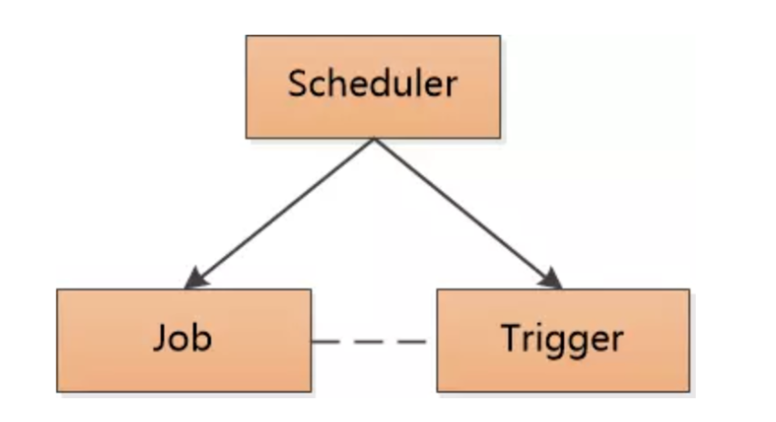
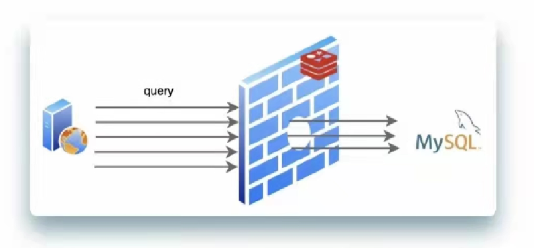
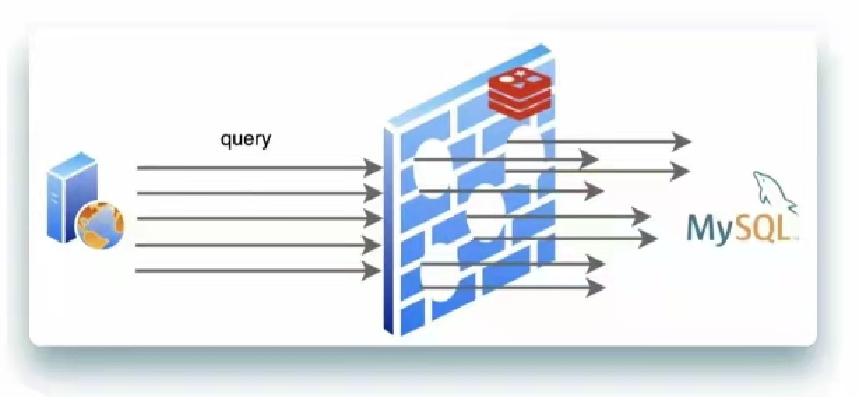
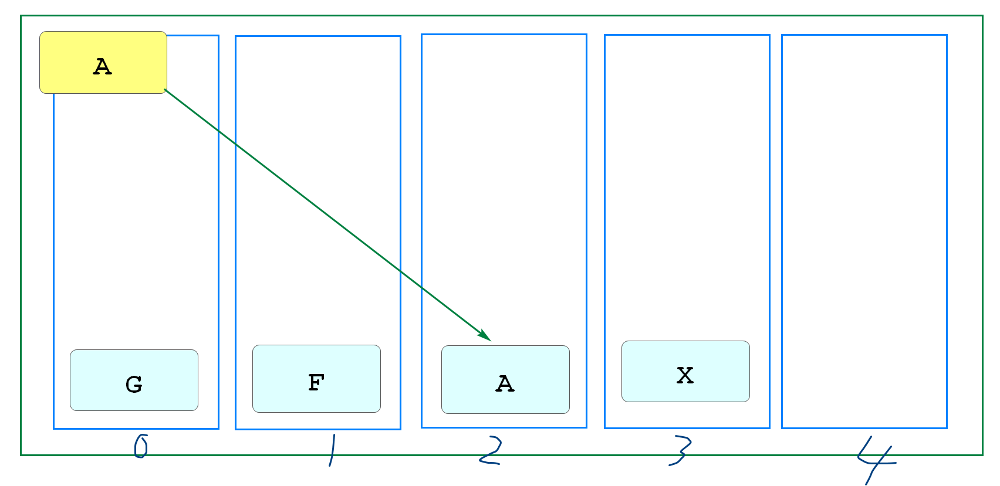
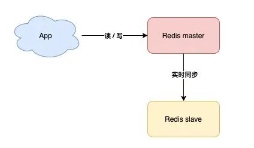
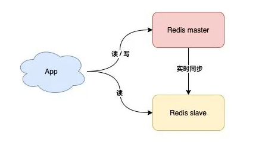
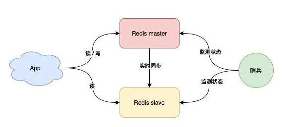
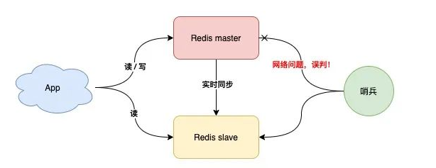

# 搜索功能实现

## 测试自定义条件查询

上次课我们已经将数据库中的spu保存到了ES中,并能够全查出来

我们现在可以在Repository接口中新增自定义方法查询包含"手机"的商品信息

SpuForElasticRepository

```java
@Repository
public interface SpuForElasticRepository extends
                        ElasticsearchRepository<SpuForElastic,Long> {

    // 自定义查询方法
    Iterable<SpuForElastic> querySpuForElasticsByTitleMatches(String title);

}
```

测试类添加方法测试

```java
@Test
void getSpu(){
    Iterable<SpuForElastic> it=elasticRepository
                    .querySpuForElasticsByTitleMatches("手机");
    it.forEach(e-> System.out.println(e));
}
```

保证Nacos\Redis\ES启动

不需要其他项目,直接启动测试即可

下面完成多条件查询

SpringData也支持我们再代码中编写查询语句

```java
@Query("{\n" +
        "    \"bool\": {\n" +
        "      \"should\": [\n" +
        "        { \"match\": { \"name\": \"?0\"}},\n" +
        "        { \"match\": { \"title\": \"?0\"}},\n" +
        "        { \"match\": { \"description\": \"?0\"}},\n" +
        "        { \"match\": { \"category_name\": \"?0\"}}\n" +
        "        ]\n" +
        "     }\n" +
        "}")
Iterable<SpuForElastic> querySearch(String keyword);
```

测试代码

```java
@Test
void getKeyword(){
    Iterable<SpuForElastic> it=elasticRepository.querySearch("手机");
    it.forEach(e-> System.out.println(e));
}
```

再实际开发中

我们ES数据还有更新问题

所有对Spu数据库表进行增删改操作时,都需要将操作同步到ES

也就是在业务逻辑层中,更新完spu表后,还要更新ES,这会有很多问题,不但业务复杂,而且还有事务问题

我们会在后面学习Linux系统中有更好的解决办法

最后添加支持分页查询的持久层方法

```java
@Query("{\n" +
        "    \"bool\": {\n" +
        "      \"should\": [\n" +
        "        { \"match\": { \"name\": \"?0\"}},\n" +
        "        { \"match\": { \"title\": \"?0\"}},\n" +
        "        { \"match\": { \"description\": \"?0\"}},\n" +
        "        { \"match\": { \"category_name\": \"?0\"}}\n" +
        "        ]\n" +
        "     }\n" +
        "}")
Page<SpuForElastic> querySearch(String keyword, Pageable pageable);
```

## 开发搜索功能的业务逻辑层

首先修改一下原有的业务逻辑层接口返回值的泛型

ISearchService

```java
public interface ISearchService {

    // ES分页查询spu的方法
    //       ↓↓↓↓↓↓↓↓↓↓↓↓↓
    JsonPage<SpuForElastic> search(String keyword, Integer page, Integer pageSize)

    //......
}
```

ServiceLocalServiceImpl实现类添加方法

```java
@Override
public JsonPage<SpuForElastic> search(String keyword, Integer page, Integer pageSize) {
    // SpringData分页,参数0表示第一页,需要将page-1才能查询正确页码
    Page<SpuForElastic> spus=spuRepository.querySearch(
                        keyword, PageRequest.of(page-1,pageSize));
    // 业务逻辑层要求返回JsonPage类型,我们目前最简单的办法就是实例化JsonPage对象给它赋值
    JsonPage<SpuForElastic> jsonPage=new JsonPage<>();
    // 当前页码
    jsonPage.setPage(page);
    jsonPage.setPageSize(pageSize);
    // 赋值总页数
    jsonPage.setTotalPage(spus.getTotalPages());
    // 赋值总条数
    jsonPage.setTotal(spus.getTotalElements());
    // 赋值分页数据
    jsonPage.setList(spus.getContent());
    // 别忘了返回JsonPage!!!
    return jsonPage;
}
```

## 开发控制层代码

创建controller包

包中创建搜索方法,代码如下

```java
@RestController
@RequestMapping("/search")
@Api(tags = "搜索模块")
public class SearchController {
    @Autowired
    private ISearchService searchService;

    // 搜索模块最主要的功能就是实现搜索
    // 面对这种功能对应的控制器方法,可以不写任何路径
    // 按下面@GetMapping注解表示当前控制路径为localhost:10008/search
    @GetMapping
    @ApiOperation("根据关键字查询ES中的信息")
    @ApiImplicitParams({
            @ApiImplicitParam(value = "搜索关键字",name = "keyword",dataType = "string",
                    required = true),
            @ApiImplicitParam(value = "页码",name = "page",dataType = "int",
                    required = true),
            @ApiImplicitParam(value = "每页条数",name = "pageSize",dataType = "int",
                    required = true)
    })
    public JsonResult<JsonPage<SpuForElastic>> searchByKeyword(
            String keyword,
            @RequestParam(value = "page",defaultValue = "1")Integer page,
            @RequestParam(value = "pageSize",defaultValue = "5") Integer pageSize
            ){
        JsonPage<SpuForElastic> list=searchService.search(keyword,page,pageSize);
        return JsonResult.ok(list);

    }

}
```

继续保证Nacos\Redis\ES正在运行

启动seata

依次启动相关服务(因为代码没有对搜索功能放行,所以必须登录才能访问,如果需要生成JWT,还需启动passport)

Leaf\Product\search\passport

按登录流程先访问10002获得jwt

再测试http://localhost:10008/doc.html

全局参数设置完成后测试搜索


# Quartz

## 什么是Quartz

quartz:石英钟的意思

是一个当今市面上流行的高效的任务调用管理工具

由OpenSymphony开源组织开发

Symphony:交响乐

是java编写的,我们使用费时需要导入依赖即可

## 为什么需要Quartz

什么是任务调度

所谓任务调用,就是执行某些具体动作的时间计划

我们使用过的最简单的调度方法就是Timer

但是Timer的调度功能过于单一,只能是指定时间的延时调用和周期运行

而Quartz可以更详细的指定时间,进行计划调用

## Quartz核心组件



调度器:Scheduler

任务:Job

触发器:Trigger

调度器来配置\计划什么时间触发什么任务

简单来说就是调度器规定什么时间做什么事情

- job(工作\任务):Quartz 实现过程中是一个接口,接口中有一个方法execute(执行的意思)

​	我们创建一个类,实现这个接口,在方法中编写要进行的操作(执行具体任务)

​    我们还需要一个JobDetail的类型的对象,Quartz每次执行job时

​	会实例化job类型对象,去调用这个方法,JobDetail是用来描述Job实现类

​	的静态信息,	比如任务运行时在Quartz中的名称

- Trigger(触发器):能够描述触发指定job的规则,分为简单触发和复杂触发

  简单触发可以使用SimplTrigger实现类.功能类似timer

  复杂触发可以使用CronTrigger实现类,内部利用cron表达式描述各种复杂的时间调度计划

- Scheduler(调度器):一个可以规定哪个触发器绑定哪个job的容器

  在调度器中保存全部的Quartz 保存的任务

  SpringBoot框架下,添加Quartz依赖后,调度器由SpringBoot管理,我们不需要编写

## Cron表达式


- \* 表示任何值,如果在分的字段上编写*,表示每分钟都会触发

- , 是个分割符如果秒字段我想20秒和40秒时触发两次就写  20,40

- \- 表示一个区间 秒字段5-10 表示 5,6,7,8,9,10

- / 表示递增触发 秒字段 5/10表示5秒开始每隔10秒触发一次

  日字段编写1/3表示从每月1日起每隔3天触发一次

- ? 表示不确定值, 因为我们在定日期时,一般确定日期就不确定是周几,相反确定周几时就不确定日期

- L 表示last最后的意思,我们可以设置当月的最后一天,就会在日字段用L表示,

  周字段使用L表示最后一周,一般会和1-7的数字组合

  例如6L表示本月最后一周的周五

- W 表示最近的工作日(单纯的周一到周五) 如果日字段编写15W表示

  每月15日最近的工作日触发,如果15日是周六就14日触发,如果15日是周日就16日触发

​	LW通常一起使用,表示本月的最后一个工作日

- \# 表示第几个,只能使用在周字段上 6#3表示每月的第三个周五

  如果#后面数字写大了,是一个不存在的日期,那就不运行了

  适合设计在母亲节或父亲节这样的日期运行

双11的触发

如果是11月11日0时触发

"0 0 0 11 11 ?"

每个月10日最近的工作日早上9点发工资

0 0 9 10W * ?

网络上可用的Cron表达式生成器很多

推荐一个http://cron.ciding.cc/

0 0 0 5/3 * ?

## SpringBoot使用Quartz

SpringBoot框架下使用Quartz格式还是非常固定的

我们选用之前学习微服务的项目csmall减少对大项目的影响

首先添加依赖

我们选项csmall-stock-webapi模块pom文件

```xml
<!--  SpringBoot Quartz依赖  -->
<dependency>
    <groupId>org.springframework.boot</groupId>
    <artifactId>spring-boot-starter-quartz</artifactId>
</dependency>
```

先编写要执行的任务

当前项目模块中创建quartz包

包中创建一个QuartzJob的类,实现Job接口

代码如下

```java
public class QuartzJob implements Job {
    
    @Override
    public void execute(JobExecutionContext jobExecutionContext) throws JobExecutionException {
        //输出当前时间
        System.out.println("--------------"+ LocalDateTime.now() +"---------------");
    }
}
```

在quartz包下,继续创建一个类QuartzConfig

这个类是一个SpringBoot配置类,它实际上是Quartz调度器的配置

代码的编写基本格式个固定的,同学们需要使用时直接套用这个格式

```java
// 这个配置类就是在配置已经保存在Spring容器中的调度器Scheduler
// 我们需要按下面格式进行配置,才能让Scheduler正常工作
@Configuration
public class QuartzConfig {
    // 创建一个JobDetail(工作详情)类对象,保存到Spring容器中,这个类用于封装我们编写的job接口实现类
    // @Bean注解标记的方法的返回值会自动保存到Spring容器中(方法名随意)
    @Bean
    public JobDetail showTime(){
        System.out.println("showTime方法运行");
        return JobBuilder.newJob(QuartzJob.class)   // 绑定要运行的任务类的反射
                .withIdentity("date")               // 设置这个job的名称
                .storeDurably()                     //
                .build();
    }

    // 下面要声明触发器,Trigger,触发器决定我们的工作\任务何时触发
    @Bean
    public Trigger showTimeTrigger(){
        System.out.println("showTime触发器运行");
        // 定义Cron表达式   每分钟触发一次的定义
        CronScheduleBuilder cronScheduleBuilder=
                CronScheduleBuilder.cronSchedule("0 0/1 * * * ?");
        return TriggerBuilder.newTrigger()
                .forJob(showTime())        // 绑定JobDetail JobDetail对象已经在Spring容器中
                .withIdentity("dateTrigger")       // 定义触发器名称
                .withSchedule(cronScheduleBuilder) // 绑定Cron表达式
                .build();
    }

}
```

Nacos\Seata需要启动

其他服务和软件都可以关闭

然后启动csmall-stock模块

观察控制台输出


## 课上作业

利用Quart实现

每隔2分钟运行一次添加库存的操作,PC100号商品的库存添加10

创建StockJob类代码如下

```java
// 从Spring容器中获得业务逻辑层对象,然后PC100商品新增库存数10
public class StockJob implements Job {

    @Autowired
    private IStockService stockService;

    @Override
    public void execute(JobExecutionContext jobExecutionContext) throws JobExecutionException {
        StockReduceCountDTO stockReduceCountDTO=new StockReduceCountDTO();
        stockReduceCountDTO.setCommodityCode("PC100");
        // 业务本身是减少库存,我们赋值减少库存数为-10,就是增加库存数10
        stockReduceCountDTO.setReduceCount(-10);
        stockService.reduceCommodityCount(stockReduceCountDTO);
    }
}
```

可以继续在QuartzConfig类中配置JobDetail和Trigger

```java
@Bean
public JobDetail addStock(){
    return JobBuilder.newJob(StockJob.class)
            .withIdentity("addStock")
            .storeDurably()
            .build();
}
@Bean
public Trigger addStockTrigger(){
    CronScheduleBuilder cronScheduleBuilder=
            CronScheduleBuilder.cronSchedule("0 0/2 * * * ?");
    return TriggerBuilder.newTrigger()
            .forJob(addStock())
            .withIdentity("addStockTrigger")
            .withSchedule(cronScheduleBuilder)
            .build();
}
```

# Redis 强化

## 缓存淘汰策略

Redis服务器繁忙时,有大量信息要保存

 如果Redis服务器内存全满,再要往Redis中保存新的数据,就需要淘汰老数据,才能保存新数据

noeviction：返回错误**(默认)**
allkeys-random：所有数据中随机删除数据
volatile-random：有过期时间的数据库中随机删除数据
volatile-ttl：删除剩余有效时间最少的数据
allkeys-lru：所有数据中删除上次使用时间最久的数据
volatile-lru：有过期时间的数据中删除上次使用时间最久的数据
allkeys-lfu：所有数据中删除使用频率最少的
volatile-lfu：有过期时间的数据中删除使用频率最少的

## 缓存穿透

正常业务下,从数据库查询出的数据可以保存在Redis中

下次查询时直接从Redis中获得,大幅提高响应速度,提高系统性能

所谓缓存穿透,就是查询了一个数据库中都不存在的数据

我们Redis中没有这个数据,它到数据库查,也没有

如果这样的请求多了,那么数据库压力就会很大

前面阶段我们使用向Redis中保存null值,来防止一个查询反复穿透

但是这样的策略有问题

如果用户不断更换查询关键字,反复穿透,也是对数据库性能极大的威胁

使用布隆过滤器来解决这个问题

事先创建好布隆过滤器,它可以在进入业务逻辑层时判断用户查询的信息数据库中是否存在,如果不存在于数据库中,直接终止查询返回

## 缓存击穿

正常运行的情况,我们设计的应该在Redis中保存的数据,如果有请求访问到Redis而Redis没有这个数据

导致请求从数据库中查询这种现象就是缓存击穿

但是这个情况也不是异常情况,因为我们大多数数据都需要设置过期时间,而过期时间到时这些数据一定会从数据库中同步

击穿只是这个现象的名称,并不是不允许的



## 缓存雪崩

上面讲到击穿现象

同一时间发生少量击穿是正常的

但是如果出现同一时间大量击穿现象就会如下图



这种情况下,Mysql会短时间出现很多新的查询请求,这样就会发生性能问题

如何避免这样的问题?

因为出现这个问题的原因通常是同时加载的数据设置了相同的有效期

我们需要在设置有效期时添加一个随机数,大量数据就不会同时失效了,

## Redis持久化

Redis将信息保存在内存

内存的特征就是一旦断电,所有信息都丢失,Redis来讲,所有数据丢失,就需要从数据库从新查询所有数据,这个是慢的

更有可能,Redis本身是有新数据的,还没有和数据库同步就断电了

所以Redis支持了持久化方案,在当前服务器将Redis中的数据保存在当地硬盘上

Redis恢复策略有两种

**RDB:**(Redis Database Backup)

数据库快照,(将当前数据库转换为二进制的数据保存在硬盘上),Redis生成一个dump.rdb的文件

我们可以在Redis安装程序的配置文件中进行配置

空白位置编写如下内容

```
save 60 5
```

60表示秒数,既1分钟

5表示key被修改的次数

配置效果:1分钟内如果有5个key以上被修改,就启动rdb数据库快照程序

优点:

​	因为是整体Redis数据的二进制格式,数据恢复是整体恢复的

缺点:

​	生成的rdb文件是一个硬盘上的文件,读写效率是较低的

​	如果突然断电,只能恢复最后一次生成的rdb中的数据


**AOF**(Append Only File):

AOF策略是将Redis运行过的所有命令(日志)备份下来

这样即使信息丢失,我们也可能根据运行过的日志,恢复为断电前的样子

它的配置如下

```
appendonly yes
```

特点:只保存命令不保存数据

理论上Redis运行过的命令都可以保存下来

但是实际情况下,Redis非常繁忙时,我们会将日志命令缓存之后,整体发送给备份,减少io次数以提高备份的性能和对Redis性能的影响

实际开发中,配置一般会采用每秒将日志文件发送一次的策略,断电最多丢失1秒数据

为了减少日志的大小

Redis支持AOF rewrite

将一些已经进行删除的数据的新增命令也从日志中移除,达到减少日志容量的目的

## Redis存储原理

Redis将内存划分为16384个槽(类似hash槽)

将数据(key)使用CRC16算法计算出一个在0~16383之间的值

将数据存到这个槽中

当再次使用这个key计算时,直接从这个槽获取,大幅提高查询效率



实际上这就是最基本"散列算法"

## Redis集群

最小状态Redis是一台服务器

这台服务器的状态直接决定的Redis的运行状态

如果它宕机了,那么Redis服务就没了

系统面临崩溃风险

我们可以在主机运行时使用一台备机

**主从复制**



也就是主机(master)工作时,安排一台备用机(slave)实时同步数据,万一主机宕机,我们可以切换到备机运行

缺点,这样的方案,slave节点没有任何实质作用,只要master不宕机它就和没有一样,没有体现价值

**读写分离**



这样slave在master正常工作时也能分担Master的工作了

但是如果master宕机,实际上主备机的切换,实际上还是需要人工介入的,这还是需要时间的

那么如果想实现故障是自动切换,一定是有配置好的固定策略的

**哨兵模式**:故障自动切换



哨兵节点每隔固定时间向所有节点发送请求

如果正常响应认为该节点正常

如果没有响应,认为该节点出现问题,哨兵能自动切换主备机

如果主机master下线,自动切换到备机运行

但是这样的模式存在问题



但是如果哨兵判断节点状态时发生了误判,那么就会错误将master下线,降低整体运行性能


# 随笔

schedule:日程表

tigger:触发器

Cron:玉米


