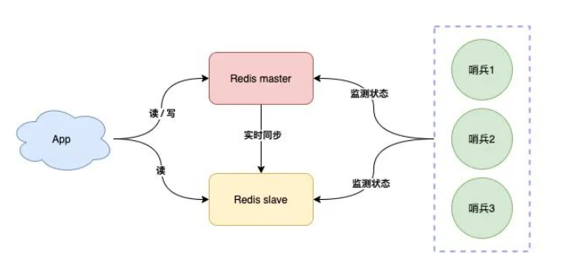
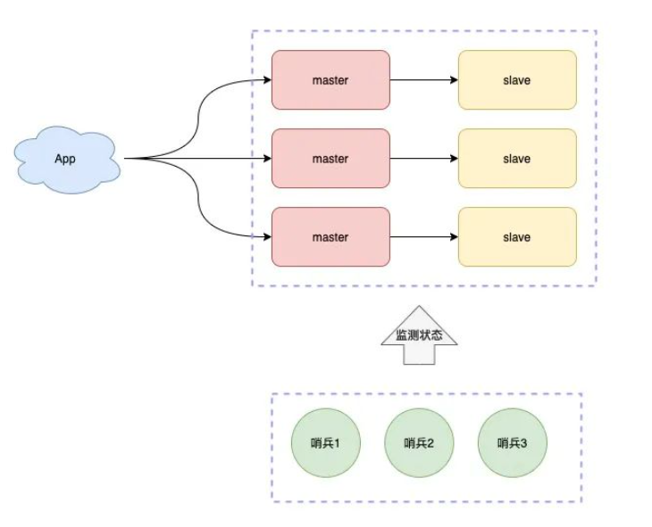

# 续Redis加强

## Redis集群

**哨兵集群**

上次课我们说了哨兵

如果哨兵服务器是一个节点,它误判master节点出现了故障,将master节点下线

但是master其实是正常工作的,整体系统效率就会大打折扣

我们可以将哨兵节点做成集群,由多个哨兵投票决定是否下线某一个节点



哨兵集群中,每个节点都会定时向master和slave发送ping请求

如果ping请求有2个(集群的半数节点)以上的哨兵节点没有收到正常响应,会认为该节点下线

**分片集群**

当业务不断扩展,并发不断增高时

有可能一个Master节点做写操作性能不足,称为了系统性能的瓶颈

这时,就可以部署多个Master节点,每个节点也支持主从复制

只是每个节点负责不同的分片

Redis0~16383号槽,

例如MasterA复制0~5000

MasterB复制5001~10000

MasterC复制10001~16383

一个key根据CRC16算法只能得到固定的结果,一定在指定的服务器上找到数据



有了这个集群结构,我们就能更加稳定和更加高效的处理业务请求了

**为了节省哨兵服务器的成本,有些工作在Redis集群中直接添加哨兵功能,既master/slave节点完成数据读写任务的同时也都互相检测它们的健康状态**


# 秒杀业务准备

## 准备工作概述

商城秒杀业务的性质是高并发

我们的基本数据

并发1~2万

同时在线4~5万用户

日活跃用户10万

学习完秒杀业务,我们能具备处理一般高并发业务的基本逻辑

下面我们要做的是准备工作

除了基本的CRUD之外

我们还要做一些缓存预热工作

秒杀模块是mall-seckill,这个模块操作的数据库是mall-seckill

数据库中包含秒杀spu信息和秒杀sku信息以及秒杀成功记录

我们要利用Quartz周期性的将每个批次的秒杀商品,预热到Redis

所谓"预热"就是将即将出现高并发查询的数据提前保存在Redis中

我们的业务只是将每个商品的库存数保存在Redis即可

## 查询秒杀商品列表

mall-seckill-webapi项目

### 开发持久层

创建mapper包,创建SeckillSpuMapper

代码如下

```java
@Repository
public interface SeckillSpuMapper {
    
    // 查询秒杀商品列表
    List<SeckillSpu> findSeckillSpus();
    
}
```

SeckillSpuMapper.xml文件添加内容

```xml
<!--  查询秒杀spu的sql片段  -->
<sql id="SimpleField">
    <if test="true">
        id,
        spu_id,
        list_price,
        start_time,
        end_time,
        gmt_create,
        gmt_modified
    </if>
</sql>
<!--  查询秒杀商品列表spu的方法   -->
<select id="findSeckillSpus" resultType="cn.tedu.mall.pojo.seckill.model.SeckillSpu">
    select
        <include refid="SimpleField" />
    from
        seckill_spu
</select>
```

### 开发业务逻辑层

创建包service.impl

包中创建SeckillSpuServiceImpl实现ISeckillSpuService

代码如下

```java
@Service
@Slf4j
public class SeckillSpuServiceImpl implements ISeckillSpuService {

    // 查询秒杀spu表的数据
    @Autowired
    private SeckillSpuMapper seckillSpuMapper;
    // 秒杀spu表中没有商品详细介绍,需要根据spuid借助Dubbo查询product模块
    // pms数据库中的spu表,获得商品信息
    @DubboReference
    private IForSeckillSpuService dubboSeckillSpuService;

    @Override
    public JsonPage<SeckillSpuVO> listSeckillSpus(Integer page, Integer pageSize) {
        // 分页查询秒杀表中spu信息
        PageHelper.startPage(page,pageSize);
        List<SeckillSpu> seckillSpus=seckillSpuMapper.findSeckillSpus();
        // 我们返回给页面的,应该是包含商品详细信息的对象,不能只是SeckillSpu中的信息
        // 业务逻辑层返回值泛型类型SeckillSpuVO中包含秒杀信息和商品详细信息,返回它的集合可以满足查询需要
        List<SeckillSpuVO> seckillSpuVOs=new ArrayList<>();
        // 循环遍历秒杀列表,根据秒杀商品列表中元素的spuId查询spu详情
        for(SeckillSpu seckillSpu: seckillSpus){
            // 获得SpuId
            Long spuId=seckillSpu.getSpuId();
            // dubbo调用查询商品详情
            SpuStandardVO spuStandardVO=dubboSeckillSpuService.getSpuById(spuId);
            // 实例化包含秒杀信息和商品信息的对象
            SeckillSpuVO seckillSpuVO=new SeckillSpuVO();
            // 将商品详情信息赋值给同名属性
            BeanUtils.copyProperties(spuStandardVO,seckillSpuVO);
            // 为了防止已有的值被意外覆盖,我们剩下的属性单独赋值
            // 赋值秒杀价
            seckillSpuVO.setSeckillListPrice(seckillSpu.getListPrice());
            // 赋值秒杀的开始时间和结束时间
            seckillSpuVO.setStartTime(seckillSpu.getStartTime());
            seckillSpuVO.setEndTime(seckillSpu.getEndTime());
            // 将包含商品详情和秒杀信息的seckillSpuVO对象保存在循环前定义的集合中
            seckillSpuVOs.add(seckillSpuVO);
            
        }
        // 翻页返回查询结果
        return JsonPage.restPage(new PageInfo<>(seckillSpuVOs));
    }

    @Override
    public SeckillSpuVO getSeckillSpu(Long spuId) {
        return null;
    }

    @Override
    public SeckillSpuDetailSimpleVO getSeckillSpuDetail(Long spuId) {
        return null;
    }
}
```

### 开发控制层

创建controller包

创建SeckillSpuController类

代码如下

```java
@RestController
@RequestMapping("/seckill/spu")
@Api(tags = "秒杀Spu模块")
public class SeckillSpuController {
    @Autowired
    private ISeckillSpuService seckillSpuService;

    @GetMapping("/list")
    @ApiOperation("分页查询秒杀列表Spu信息")
    @ApiImplicitParams({
            @ApiImplicitParam(value = "页码",name="page",required = true,dataType = "int"),
            @ApiImplicitParam(value = "每页条数",name="pageSize",required = true
                                                                    ,dataType = "int")
    })
    // 查询秒杀列表不需要登录
    public JsonResult<JsonPage<SeckillSpuVO>> listSeckillSpus(
                                        Integer page,Integer pageSize){
        JsonPage<SeckillSpuVO> list=seckillSpuService.listSeckillSpus(page,pageSize);
        return JsonResult.ok(list);
    }

}
```

下面可以测试

Nacos\Redis\Seata

服务需要依次启动

Leaf\Product\passport\seckill

测试10007秒杀端口号

正常配置登录JWT

## 查询秒杀商品的Sku列表(开发持久层)

我们将秒杀的商品Spu列表查询出来

当用户选择一个商品时

我们要将这个商品的sku也查询出来

也就是根据SpuId查询Sku的列表

创建SeckillSkuMapper

```java
@Repository
public interface SeckillSkuMapper {

    // 根据SpuId查询Sku列表
    List<SeckillSku> findSeckillSkusBySpuId(Long spuId);


}
```

SeckillSkuMapper.xml文件添加内容

```xml
<sql id="SimpleFields">
    <if test="true">
        id,
        sku_id,
        spu_id,
        seckill_stock,
        seckill_price,
        gmt_create,
        gmt_modified,
        seckill_limit
    </if>
</sql>
<select id="findSeckillSkusBySpuId" 
        resultType="cn.tedu.mall.pojo.seckill.model.SeckillSku">
    select 
        <include refid="SimpleFields" />
    from
        seckill_sku
    where
        spu_id=#{spuId}
</select>
```

## 根据时间查询正在进行秒杀的商品(开发持久层)

根据给定时间查询出正在进行秒杀的商品列表

首先保证数据库中的seckill_spu表的数据正在秒杀时间段(检查数据,如果不在秒杀时间段,将结束时间后移如2024年)

SeckillSpuMapper添加方法

```java
// 根据给定的时间查询正在秒杀的商品
List<SeckillSpu> findSeckillSpusByTime(LocalDateTime time);
```

SeckillSpuMapper.xml

```xml
<!--  根据给定时间查询秒杀商品列表  -->
<select id="findSeckillSpusByTime"
                     resultType="cn.tedu.mall.pojo.seckill.model.SeckillSpu">
    select
        <include refid="SimpleField" />
    from
        seckill_spu
    where
        start_time &lt; #{time}
    and
        end_time &gt; #{time}
</select>
```

## 查询所有秒杀商品的SpuId(开发持久层)

这次查询主要是因为后面我们要学习的布隆过滤器,方式缓存穿透使用的

SeckillSpuMapper,添加一个方法

```java
// 查询所有秒杀商品的SpuId数据
Long[] findAllSeckillSpuIds();
```

SeckillSpuMapper.xml

```xml
<!--  查询所有SpuId   -->
<select id="findAllSeckillSpuIds" resultType="long">
    select spu_id from seckill_spu
</select>
```

## 缓存预热思路

我们要使用Quartz调度工具完成任务调度

按照秒杀的批次在秒杀开始前很短的时间内进行进行缓存预热工作

例如每天的12:00 14:00 16:00 18:00进行秒杀

那么就在 11:55    13:55  15:55  17:55 进行预热

1.我们预热的内容是将参与秒杀商品的sku查询出来,根据skuid将该商品的库存保存在Redis中

2.在秒杀开始后,当有用户查询秒杀商品后,将该商品保存在Redis中,还要注意防止雪崩(有效时间添加随机数)

3(待完善).在秒杀开始前,生成布隆过滤器,访问时先判断布隆过滤器,如果判断商品存在,再继续访问

## 设置定时任务

### 将库存和随机码保存到Redis

利用Quartz将库存和随机码保存到Redis

1.创建Job接口实现类

2.创建配置类,配置JobDetail和Trigger

在seckill包下创建timer.job包

包中创建SeckillInitialJob类

代码如下

```java
@Slf4j
public class SeckillInitialJob implements Job {

    @Autowired
    private SeckillSpuMapper spuMapper;
    @Autowired
    private SeckillSkuMapper skuMapper;
    // 查询出来的数据要保存到Redis中
    @Autowired
    private RedisTemplate redisTemplate;

    // 上面的RedisTemplate对象是向Redis中保存对象用的,内部会将数据序列化后,
    // 以二进制的格式保存在Redis中,读写速度确实快,但是数据无法修改
    // 这种设计无法在Redis内部完成对象属性或值的修改
    // 我们的库存是一个数字,Redis支持直接在Redis内部对数字进行增减,减少java操作
    // 而前提是必须保存字符串格式数据,而不是二进制格式
    // 我们需要声明一个用字符串操作Redis的对象
    @Autowired
    private StringRedisTemplate stringRedisTemplate;


    @Override
    public void execute(JobExecutionContext jobExecutionContext) throws JobExecutionException {
        //我们做的是预热,在秒杀还没有开始的时候,将要开始参与秒杀的商品库存保存到redis
        // 这个方法运行时,距离下次秒杀开始还有5分钟
        // 所以我们创建一个5分钟之后的时间,查询5分钟后要参与秒杀的商品
        LocalDateTime time=LocalDateTime.now().plusMinutes(5);
        // 查询这个时间的所有秒杀商品
        List<SeckillSpu> seckillSpus=spuMapper.findSeckillSpusByTime(time);
        // 遍历seckillSpus(查询到的所有秒杀商品)
        // 目标是将这些商品对应的sku库存保存到Redis
        // 为了方便随机数生成定一个对象
        Random ran=new Random();
        for(SeckillSpu spu:seckillSpus){
            // spu 是一个商品品类,库存不在spu中,而是sku保存库存
            // 所以要根据spuId查询Sku集合
            List<SeckillSku> seckillSkus=skuMapper
                        .findSeckillSkusBySpuId(spu.getSpuId());
            // 遍历当前spu的所有sku列表
            for(SeckillSku sku: seckillSkus){
                log.info("开始将{}号商品的库存保存到Redis",sku.getSkuId());
                // 在编程过程中,涉及RedisKey值时,最好声明常量,如果再业务中使用大量Key值
                // 建议创建一个保存RedisKey值常量的类,SeckillCacheUtils类就是
                // mall:seckill:sku:stock:1
                //      ↑↑↑↑↑
                String skuStockKey=
                    SeckillCacheUtils.getStockKey(sku.getSkuId());
                // 检查当前Redis中是否已经包含这个Key
                if(redisTemplate.hasKey(skuStockKey)){
                    // 如果Redis已经包含了这个key(可能是前一场秒杀就包含的商品)
                    log.info("{}号商品已经在缓存中",sku.getSkuId());
                }else{
                    // 不在缓存中的,就要将库存数据保存到Redis中
                    // 利用stringRedisTemplate保存,方便减少库存数
                    stringRedisTemplate.boundValueOps(skuStockKey)
                            .set(sku.getSeckillStock()+"",
                                    60*60*4+ran.nextInt(60*30),
                                    TimeUnit.SECONDS);
                    log.info("成功为{}号商品添加库存",sku.getSkuId());
                }
            }
            // 仍然在遍历所有Spu对象的集合中
            // 将当前Spu包含所有sku保存到Redis之后
            // 我们要为Spu生成随机码
            // 无论任何请求都是访问控制器的路径,秒杀购买商品也是
            // 正常情况下我们输入的路径中,包含要购买商品的id即可
            // 例如 /seckill/spu/,如果这个商品的id已经暴露,
            // 那么就可能有人在秒杀未开始前就访问这个路径
            // 如果不断访问,数据库就需要反复查询这个商品是否在秒杀时间段内,反复查询数据库影响性能
            // 我们要防止这个事情,就要做到秒杀购买商品的路径,平时就不存在
            // 而在秒杀开始5分钟前,生成随机码,有了随机码,购买秒杀商品的路径才出现
            // 我们的随机码生成后也是保存在Redis中
            // 获得随机码key
            String randomCodeKey=SeckillCacheUtils.getRandCodeKey(spu.getSpuId());
            // 判断随机码是否已经生成过
            // 如果没有生成过再生成
            if(!redisTemplate.hasKey(randomCodeKey)){
                // 生成随机数,随机数越大越不好猜
                int randCode=ran.nextInt(900000)+100000;
                redisTemplate.boundValueOps(randomCodeKey)
                        .set(randCode,1,TimeUnit.DAYS);
                log.info("spuId为{}的商品随机码为{}",spu.getSpuId(),randCode);
            }
        }
    }
}
```

### 配置Quartz触发

上面的类中的代码只是编写了

我们需要在Quartz中触发才能生效

我们创建time.config包

包中创建QuartzConfig类编写Job的触发

```java
@Configuration
@Slf4j
public class QuartzConfig {

    // 声明JobDetail保存到Spring容器
    @Bean
    public JobDetail initJobDetail(){
        log.info("预热任务绑定!");
        return JobBuilder.newJob(SeckillInitialJob.class)
                .withIdentity("initSeckill")
                .storeDurably()
                .build();
    }

    // 定义Quartz的触发,保存到Spring容器
    @Bean
    public Trigger initSeckillTrigger(){
        log.info("预热触发器运行");
        // 学习过程中,每分钟加载一次方便测试,实际开发时,根据业务编写正确Cron表达式即可
        // Cron表达式
        CronScheduleBuilder cronScheduleBuilder=
                CronScheduleBuilder.cronSchedule("0 0/1 * * * ?");
        return TriggerBuilder.newTrigger()
                .forJob(initJobDetail())
                .withIdentity("initSeckillTrigger")
                .withSchedule(cronScheduleBuilder)
                .build();
    }


}
```

启动Nacos\Redis\Seata

项目启动Leaf\product\seckill

# 显示秒杀商品详情

上面章节我们完成了缓存预热

下面要根据SpuId查询正在秒杀的商品

和普通的SpuId查询商品详情相比

它的业务判断更复杂

1.布隆过滤器判断(后期完成)

2.判断商品是否在Redis中

3.判断要购买的商品是否在秒杀时间段内

4.如果一切正常在返回详情信息前,要为url属性赋值,其实就是固定路径+随机码

### 完成根据SpuId查询商品detail详情

在SeckillSpuServiceImpl类中编写新的方法

```java
@Override
public SeckillSpuVO getSeckillSpu(Long spuId) {
    return null;
}

// 常量类中每没有定义Detail用的常量Key,我们声明一个
public static final String
        SECKILL_SPU_DETAIL_VO_PREFIX="seckill:spu:detail:vo:";
@Autowired
private RedisTemplate redisTemplate;
// 根据SpuId查询detail详细信息
@Override
public SeckillSpuDetailSimpleVO getSeckillSpuDetail(Long spuId) {
    // 将spuId拼接在常量后返回
    String seckillDetailKey=SECKILL_SPU_DETAIL_VO_PREFIX+spuId;
    // 声明返回值类型对象,初值为null即可
    SeckillSpuDetailSimpleVO seckillSpuDetailSimpleVO=null;
    // 判断Redis中是否已经有这个Key
    if(redisTemplate.hasKey(seckillDetailKey)){
        // 如果Redis中已经有这个key,就获得这个key的值赋值给上面声明的实体类
        seckillSpuDetailSimpleVO=(SeckillSpuDetailSimpleVO)redisTemplate
                .boundValueOps(seckillDetailKey).get();
    }else{
        // 如果Redis中没有这个key,我们就需要从数据库中查询后新增到Redis中
        // dubbo调用根据spuId查询detail的方法
        SpuDetailStandardVO spuDetailStandardVO=
                dubboSeckillSpuService.getSpuDetailById(spuId);
        // 判断当前SpuId查询的对象不能为空
        if(spuDetailStandardVO==null){
            // 可以将null保存到Redis中
            // 抛出异常
            throw new CoolSharkServiceException(
                    ResponseCode.NOT_FOUND,"您查找的商品不存在");
        }
        // 确认商品存在实例化返回值类型的对象
        seckillSpuDetailSimpleVO=new SeckillSpuDetailSimpleVO();
        // 同名属性赋值
        BeanUtils.copyProperties(spuDetailStandardVO,seckillSpuDetailSimpleVO);
        // 保存到Redis中
        redisTemplate.boundValueOps(seckillDetailKey)
                .set(seckillSpuDetailSimpleVO,
                        60*60*24+ RandomUtils.nextInt(60*60*2),
                        TimeUnit.SECONDS);
    }
    // 返回查询出的对象
    return seckillSpuDetailSimpleVO;
}
```


