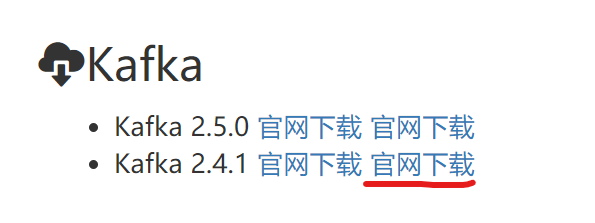
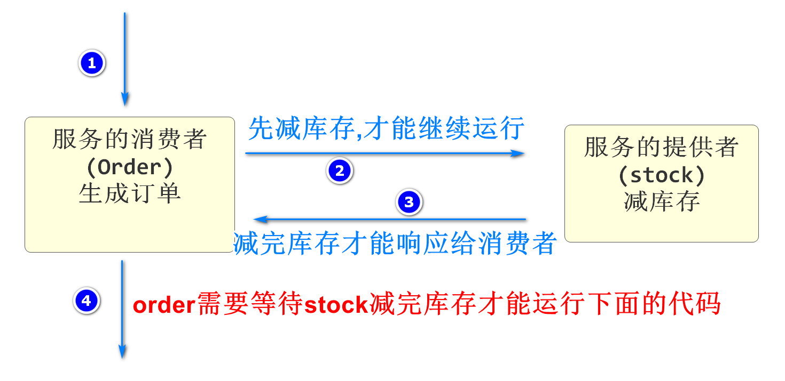
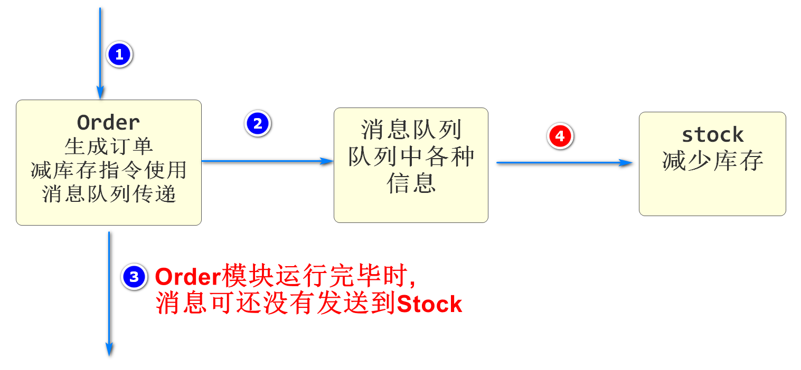
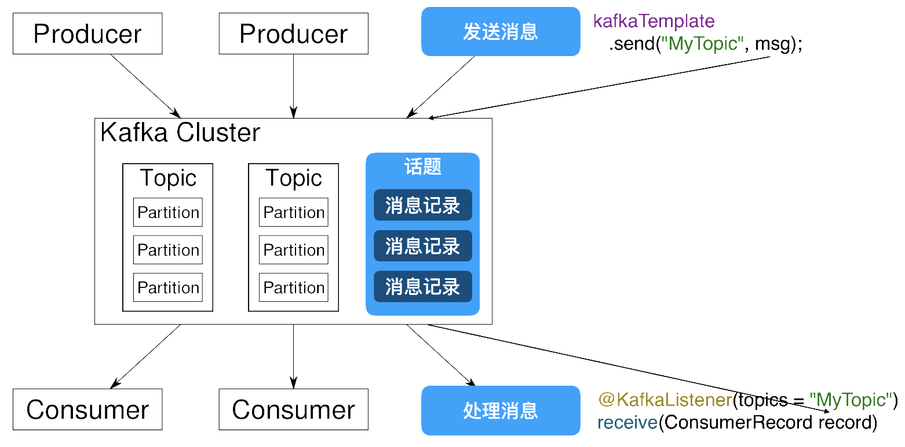
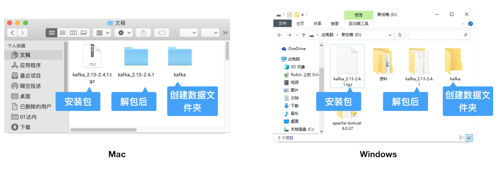

# 续 显示秒杀商品详情

## 根据SpuId查询Detail详情

上次课完成了查询根据SpuId查询Detail详情的业务逻辑层

下面开发控制层

### 开发控制层代码

SeckillSpuController添加方法

```java
@GetMapping("/{spuId}/detail")
@ApiOperation("根据SpuId查询Detail详情")
@ApiImplicitParam(value = "spuId", name="spuId",required = true,
        dataType = "long",example = "1")
public JsonResult<SeckillSpuDetailSimpleVO> getSeckillDetail(
        @PathVariable Long spuId){
    SeckillSpuDetailSimpleVO detailSimpleVO=seckillSpuService
            .getSeckillSpuDetail(spuId);
    return JsonResult.ok(detailSimpleVO);
}
```

启动测试

Nacos\Seata\Redis

Leaf\Product\Seckill\passport

http://localhost:10007/doc.html测试根据spuId查询Detail的功能

## 根据SpuId查询秒杀商品详情

1.布隆过滤器判断(后期完成)

2.判断商品是否在Redis中

3.判断要购买的商品是否在秒杀时间段内

4.如果一切正常在返回详情信息前,要为url属性赋值,其实就是固定路径+随机码

### 开发持久层

SeckillSpuMapper添加方法

```java
// 根据SpuId查询秒杀Spu实体
SeckillSpu findSeckillSpuById(Long spuId);
```

SeckillSpuMapper.xml添加内容

```xml
<!--  根据SpuId查询秒杀Spu实体  -->
<select id="findSeckillSpuById" resultMap="BaseResultMap">
    select
        <include refid="SimpleField" />
    from
        seckill_spu
    where
        spu_id=#{spuId}
</select>
```

### 开发业务逻辑层

SeckillSpuServiceImpl业务逻辑层实现类

```java
// 根据SpuId查询Spu详情
@Override
public SeckillSpuVO getSeckillSpu(Long spuId) {
    // 先判断参数spuId是否在布隆过滤器中
    // 如果不在直接返回/抛出异常(后期会实现)
	
    // 声明一个返回值用于返回
    SeckillSpuVO seckillSpuVO=null;
    // 获取当前SpuId对应的Redis的Key
    // mall:seckill:spu:vo:1
    String seckillSpuKey= SeckillCacheUtils.getSeckillSpuVOKey(spuId);
    // 执行判断这个Key是否已经保存在Redis中
    if(redisTemplate.hasKey(seckillSpuKey)){
        // 如果在redis中,直接获取
        seckillSpuVO=(SeckillSpuVO)redisTemplate
                        .boundValueOps(seckillSpuKey).get();
    }else{
        // 如果Redis中没有个这个Key
        // 先按spuId查询秒杀spu信息
        SeckillSpu seckillSpu=seckillSpuMapper.findSeckillSpuById(spuId);
        // 当前商品是否存在
        if(seckillSpu==null){
            throw new CoolSharkServiceException(ResponseCode.NOT_FOUND,
                    "您访问的商品不存在");
        }
        // 上面SeckillSpu对象只有秒杀信息,没有商品信息
        // 商品信息需要根据Dubbo来查询pms数据库
        SpuStandardVO spuStandardVO=dubboSeckillSpuService
                                                .getSpuById(spuId);
        // 将商品详情赋值给seckillSpuVO,先实例化
        seckillSpuVO=new SeckillSpuVO();
        BeanUtils.copyProperties(spuStandardVO,seckillSpuVO);
        // 秒杀信息手动赋值
        seckillSpuVO.setSeckillListPrice(seckillSpu.getListPrice());
        seckillSpuVO.setStartTime(seckillSpu.getStartTime());
        seckillSpuVO.setEndTime(seckillSpu.getEndTime());
        // 查询出的对象保存在Redis中
        redisTemplate.boundValueOps(seckillSpuKey)
                .set(seckillSpuVO,60*60*24*1000+
                        RandomUtils.nextInt(1000*60*60*2),
                        TimeUnit.MILLISECONDS);
    }
    // 判断当前Spu是否在秒杀时间段内
    // 获得当前时间
    LocalDateTime nowTime= LocalDateTime.now();
    // 判断当前时间是否在秒杀开始之后
    // between比较两个时间参数
    // 前大后小返回negative
    Duration afterTime=Duration.between(nowTime,seckillSpuVO.getStartTime());
    // 判断当前时间是否在秒杀结束之前
    Duration beforeTime=Duration.between(seckillSpuVO.getEndTime(),nowTime);
    // 判断两个Duration是否同时为"negative",
    // 如果是,表示当前时间确实再当前spu商品的秒杀时间段内
    if(afterTime.isNegative() && beforeTime.isNegative()){
        //从Redis中获得随机码赋值给seckillSpuVO的url属性
        String randCodeKey=SeckillCacheUtils.getRandCodeKey(spuId);
        seckillSpuVO.setUrl("/seckill/"+redisTemplate
                            .boundValueOps(randCodeKey).get());
    }
    // 别忘了返回
    // 前端根据seckillSpuVO对象的url属性是否为null判断是否可以进行秒杀购买操作
    // 如果为空,提示无法购买,如果有值并赋值了随机码,就可以进行下一步提交操作
    return seckillSpuVO;
}
```

### 开发控制层

SeckillSpuController添加方法

```java
@GetMapping("/{spuId}")
@ApiOperation("根据SpuId查询秒杀Spu详情")
@ApiImplicitParam(value = "spuId",name="spuId",required = true,
                    dataType = "long",example = "2")
public JsonResult<SeckillSpuVO> getSeckillSpuVO(
        @PathVariable Long spuId){
    SeckillSpuVO seckillSpuVO=seckillSpuService.getSeckillSpu(spuId);
    return JsonResult.ok(seckillSpuVO);
}
```

重启Seckill模块

测试10007端口功能

## 根据SpuId查询秒杀Sku列表

之前编写加载数据的Mapper时,完成了根据SpuId查Sku列表的功能

下面我们从业务逻辑层开始编写

### 开发业务逻辑层

我们也需要讲SpuId对应的Sku信息保存到Redis

在service.impl包中创建SeckillSkuServiceImpl类中编写代码如下

```java
@Service
@Slf4j
public class SeckillSkuServiceImpl implements ISeckillSkuService {
    @Autowired
    private SeckillSkuMapper skuMapper;
    // Dubbo查询sku详细信息的生产者
    @DubboReference
    private IForSeckillSkuService dubboSkuService;
    // 保存到Redis的支持
    @Autowired
    private RedisTemplate redisTemplate;


    // 根据SpuId查询秒杀Sku列表
    @Override
    public List<SeckillSkuVO> listSeckillSkus(Long spuId) {
        // 调用根据spuId查询所有Sku列表的方法
        List<SeckillSku> seckillSkus=skuMapper.findSeckillSkusBySpuId(spuId);
        // 声明包含sku详情和秒杀信息类型泛型的List
        List<SeckillSkuVO> seckillSkuVOs=new ArrayList<>();
        // 遍历数据库查询出来的所有sku列表
        for(SeckillSku sku:seckillSkus){
            // 声明既包含秒杀信息,又包含详情的sku对象
            SeckillSkuVO seckillSkuVO= null;
            // 获取skuId保存在变量中
            Long skuId= sku.getSkuId();
            // 在检查Redis是否包含对象前,先准备Key
            String seckillSkuVOKey= SeckillCacheUtils.getSeckillSkuVOKey(skuId);
            // 判断Redis是否包含Key
            if(redisTemplate.hasKey(seckillSkuVOKey)){
                seckillSkuVO=(SeckillSkuVO)redisTemplate
                        .boundValueOps(seckillSkuVOKey).get();
            }else{
                // Redis中没有这个key,需要我们从数据库查询后,保存在Redis中
                // Dubbo根据skuId查询sku详情信息
                SkuStandardVO skuStandardVO=dubboSkuService.getById(skuId);
                // 将seckillSkuVO实例化后,将详情赋值给它
                seckillSkuVO=new SeckillSkuVO();
                BeanUtils.copyProperties(skuStandardVO,seckillSkuVO);
                // 将秒杀信息也赋值给seckillSkuVO,这样它就包含详情信息和秒杀信息了
                seckillSkuVO.setStock(sku.getSeckillStock());
                seckillSkuVO.setSeckillPrice(sku.getSeckillPrice());
                seckillSkuVO.setSeckillLimit(sku.getSeckillLimit());
                // 将对象保存到Redis中
                redisTemplate.boundValueOps(seckillSkuVOKey).set(
                        seckillSkuVO,
                        60*60*24*1000+ RandomUtils.nextInt(2*60*60*1000),
                        TimeUnit.MILLISECONDS);
            }
            seckillSkuVOs.add(seckillSkuVO);
        }
        // 别忘了返回!!
        return seckillSkuVOs;
    }
}
```

### 开发控制层

新建SeckillSkuController添加方法

```java
@RestController
@RequestMapping("/seckill/sku")
@Api(tags = "秒杀sku模块")
public class SeckillSkuController {
    @Autowired
    private ISeckillSkuService seckillSkuService;
    @GetMapping("/list/{spuId}")
    @ApiOperation("根据SpuId查询秒杀Sku列表")
    @ApiImplicitParam(value = "spuId",name = "spuId",required = true,
                dataType = "long",example = "2")
    public JsonResult<List<SeckillSkuVO>> listSeckillSkus(
            @PathVariable Long spuId){
        List<SeckillSkuVO> list=seckillSkuService.listSeckillSkus(spuId);
        return JsonResult.ok(list);
    }


}
```

# 消息队列

## 软件下载

doc.canglaoshi.org



## Dubbo远程调用的性能问题

Dubbo调用在微服务项目中普遍存在

这些Dubbo调用都是同步的

"同步"指:A(消费者)调用B(生产者)的服务A在发起调用后,在B返回之前只能等待

直到B返回结果后A才能运行



Dubbo消费者发送调用后进入阻塞状态,这个状态表示改线程仍占用内存资源,但是什么动作都不做

如果生产者运行耗时较久,消费者就一直等待,如果消费者利用这个时间,那么可以处理更多请求,业务整体效率

实际情况下,Dubbo有些必要的返回值必须等待,但是不必要等待的服务返回值,我们可以不等待去做别的事情

这种情况下我们就要使用消息队列

## 什么是消息队列

消息队列(Message Queue)简称MQ

消息队列是采用"异步(两个微服务项目并不需要同时完成请求)"的方式来传递数据完成业务操作流程的业务处理方式

## 消息队列的特征



> 常见面试题:消息队列的特征

* 利用异步的特性,提高服务器的运行效率,减少因为远程调用出现的线程等待\阻塞
* 削峰填谷:在并发峰值超过当前系统处理能力时,我们将没处理的信息保存在消息队列中,在后面出现的较闲的时间中去处理,直到所有数据依次处理完成,能够防止在并发峰值时短时间大量请求而导致的系统不稳定
* 消息队列的延时:因为是异步执行,请求的发起者并不知道消息何时能处理完,如果业务不能接收这种延迟,就不要使用消息队列

### 常见消息队列

* Kafka:性能好\功能弱:适合大数据量,高并发的情况,大数据领域使用较多
* RabbitMQ:功能强\性能一般:适合发送需求复杂的消息队列,java业务中使用较多
* RocketMQ:阿里的
* ActiveMQ:前几年流行的,老项目可能用到

> 常见面试题:消息队列异常处理

如果我们真的将上面生成订单业务里,减少库存的操作从正常流程中剥离到消息队列

那么如果库存减少过程中发送异常,就不能由Seata接收了,因为异步的处理无法和Seata通信

意思是如果使用了消息队列,队列中处理数据过程发送异常,那么就要用特殊的方法处理问题

处理方式就是手写代码进行回滚,一般情况就是在stock,模块再向order模块发送消息,order模块接收到消息后进行进一步处理

如果order模块进一步处理时又发生异常,我们可以再向一个实现设置好的消息队列中发送消息

这个消息队列没有处理者,我们称之为"死信队列",一个正常运行的程序,会定期有人处理死信队列信息

# Kafka

## 什么是Kafka

Kafka是由Apache软件基金会开发的一个开源流处理平台，由Scala和Java编写。该项目的目标是为处理实时数据提供一个统一、高吞吐、低延迟的平台。Kafka最初是由LinkedIn开发，并随后于2011年初开源。

kafka软件结构



Kafka Cluster(Kafka集群)

Partition(分片)

Producer:消息的发送方,也就是消息的来源,Kafka中的生产者

​					order就是消息的发送方

Consumer:消息的接收方,也是消息的目标,Kafka中的消费者

​					stock就是消息的接收方法

Topic:话题或主题的意思,消息的收发双方要依据同一个话题名称,才不会将信息错发给别人

Record:消息记录,就是生产者和消费者传递的信息内容,保存在指定的Topic中

## Kafka的特征与优势

Kafka作为消息队列,它和其他同类产品相比,突出的特点就是性能强大

Kafka将消息队列中的信息保存在硬盘中

Kafka对硬盘的读取规则进行优化后,效率能够接近内存

硬盘的优化规则主要依靠"顺序读写,零拷贝,日志压缩等技术"

Kafka处理队列中数据的默认设置:

* Kafka队列信息能够一直向硬盘中保存(理论上没有大小限制)

* Kafka默认队列中的信息保存7天,可以配置这个时间,缩短这个时间可以减少Kafka的磁盘消耗

## Kafka的安装和配置

最好将我们kafka软件的解压位置设置在一个根目录

然后路径不要有空格和中文



我们要创建一个空目录用于保存Kafka运行过程中产生的数据

本次创建名称为data的空目录

下面开始配置启动信息

先到G:\kafka\config下配置有文件zookeeper.properties

找到dataDir属性修改如下

```
dataDir=G:/data
```

注意G盘和data文件夹名称,匹配自己电脑的真实路径和文件夹名称

还要修改server.properties配置文件

```
log.dirs=G:/data
```

修改注意事项和上面相同

## Zookeeper简介

我们在启动kafka前必须先启动Zookeeper

zoo:动物园

keeper:园长

可以引申为管理动物的人

早期,每个服务器系统中的软件在安装后运行都需要一些配置

那么软件多了,配置会比较复杂

我们使用Zookeeper之后,可以创建一个新的管理各种软件配置的文件管理系统

在Zookeeper中,可以修改服务器系统中的所有软件配置

长此以往,很多软件就删除了自己写配置文件的功能,而直接从Zookeeper中获取

Kafka就是需要将配置编写在Zookeeper中的软件之一

## Kafka的启动

**启动Zookeeper**

进入路径G:\kafka\bin\windows

输入cmd进入dos命令行

```
G:\kafka\bin\windows>zookeeper-server-start.bat ..\..\config\zookeeper.properties
```

**启动kafka**

总体方式一样,输入不同指令

```
G:\kafka\bin\windows>kafka-server-start.bat ..\..\config\server.properties
```

**附录**

Mac系统启动Kafka服务命令（参考）：

```
# 进入Kafka文件夹
cd Documents/kafka_2.13-2.4.1/bin/
# 动Zookeeper服务
./zookeeper-server-start.sh -daemon ../config/zookeeper.properties 
# 启动Kafka服务
./kafka-server-start.sh -daemon ../config/server.properties 
```

Mac系统关闭Kafka服务命令（参考）：

```
# 关闭Kafka服务
./kafka-server-stop.sh 
# 启动Zookeeper服务
./zookeeper-server-stop.sh
```

在启动kafka时有一个常见错误

```
wmic不是内部或外部命令
```

这样的提示,需要安装wmic命令,安装方式参考

https://zhidao.baidu.com/question/295061710.html

## Kafka使用Demo

不要关闭Zookeeper和Kafka的dos窗口

我们再csmall项目中编写一个简单的Demo学习Kafka的使用

在csmall-cart-webapi模块中

添加依赖

```xml
<dependency>
    <groupId>com.google.code.gson</groupId>
    <artifactId>gson</artifactId>
</dependency>
<dependency>
    <groupId>org.springframework.kafka</groupId>
    <artifactId>spring-kafka</artifactId>
</dependency>
```

修改yml文件配置

```yml
spring:
  kafka:
    # 定义kafka的位置
    bootstrap-servers: localhost:9092
    # 话题的分组名称,是必须配置的
    # 为了区分当前项目和其他项目使用的,防止了不同项目相同话题的干扰或错乱
    # 本质是在话题名称前添加项目名称为前缀来防止的
    consumer:
      group-id: csmall
```

SpringBoot启动类中添加注解

```java
@SpringBootApplication
@EnableDubbo
// 启动kafka的功能
@EnableKafka
// 为了测试kafka,我们可以周期性的发送消息到消息队列
// 使用SpringBoot自带的调度工具即可
@EnableScheduling
public class CsmallCartWebapiApplication {

    public static void main(String[] args) {
        SpringApplication.run(CsmallCartWebapiApplication.class, args);
    }

}
```

下面我们就可以实现周期性的向kafka发送消息并接收的操作了

编写消息的发送

cart-webapi包下创建kafka包

包中创建Producer类来发送消息

```java
// 我们需要周期性的向Kafka发送消息
// 需要将具备SpringBoot调度功能的类保存到Spring容器才行
@Component
public class Producer {

    // 能够实现将消息发送到Kafka的对象
    // 只要Kafka配置正确,这个对象会自动保存到Spring容器中,我们直接装配即可
    // KafkaTemplate<[话题名称的类型],[传递消息的类型]>
    @Autowired
    private KafkaTemplate<String,String> kafkaTemplate;

    // 每隔10秒向Kafka发送信息
    int i=1;
    // fixedRate是周期运行,单位毫秒 10000ms就是10秒
    @Scheduled(fixedRate = 10000)
    // 这个方法只要启动SpringBoot项目就会按上面设置的时间运行
    public void sendMessage(){
        // 实例化一个Cart类型对象,用于发送消息
        Cart cart=new Cart();
        cart.setId(i++);
        cart.setCommodityCode("PC100");
        cart.setPrice(RandomUtils.nextInt(100)+200);
        cart.setCount(RandomUtils.nextInt(5)+1);
        cart.setUserId("UU100");
        // 将cart对象转换为json格式字符串
        Gson gson=new Gson();
        // 执行转换
        String json=gson.toJson(cart);
        System.out.println("本次发送的消息为:"+json);
        // 执行发送
        // send([话题名称],[发送的消息]),需要遵循上面kafkaTemplate声明的泛型类型
        kafkaTemplate.send("myCart",json);

    }

}
```

创建一个叫Consumer的类来接收消息

```java
// 因为Kafka接收消息是自动的,所以这个类也必须交由Spring容器管理0
@Component
public class Consumer {

    // SpringKafka框架接收Kafka中的消息使用监听机制
    // SpringKafka框架提供一个监听器,专门负责关注指定的话题名称
    // 只要该话题名称中有消息,会自动获取该消息,并调用下面方法
    @KafkaListener(topics = "myCart")
    // 上面注解和下面方法关联,方法的参数就是接收到的消息
    public void received(ConsumerRecord<String,String> record){
        // 方法参数类型必须是ConsumerRecord
        // ConsumerRecord<[话题名称类型],[消息类型]>
        // 获取消息内容
        String json=record.value();
        // 要想在java中使用,需要转换为java对象
        Gson gson=new Gson();
        // 将json转换为java对象,需要提供转换目标类型的反射
        Cart cart=gson.fromJson(json,Cart.class);
        System.out.println("接收到对象为:"+cart);
    }


}
```

课堂作业

在csmall-stock-webapi模块中模仿cart模块中消息队列的形式

实现每隔20秒对商品编号为PC100的数据库存减少3

提交功能等价于cart模块的Producer类和Consumer类即可


