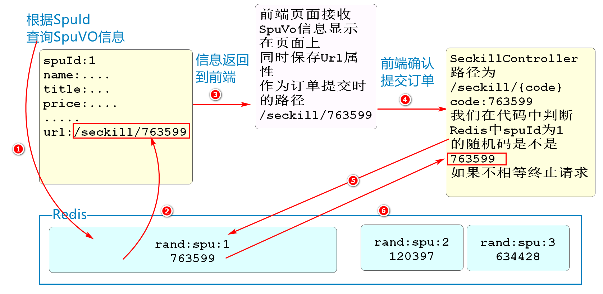

# RabbitMQ

## 什么是RabbitMQ

RabbitMQ 是一个由 Erlang 语言开发的 AMQP 的开源实现。  AMQP ：Advanced Message Queue，高级消息队列协议。它是应用层协议的一个开放标准，为面向消息的中间件设计，基于此协议的客户端与消息中间件可传递消息，并不受产品、开发语言等条件的限制。  RabbitMQ 最初起源于金融系统，用于在分布式系统中存储转发消息，在易用性、扩展性、高可用性等方面表现不俗。

## RabbitMQ特征

1.可靠性（Reliability）  RabbitMQ 使用一些机制来保证可靠性，如持久化、传输确认、发布确认。

2.灵活的路由（Flexible Routing）  在消息进入队列之前，通过 Exchange 来路由消息的。对于典型的路由功能，RabbitMQ已经提供了一些内置的 Exchange 来实现。针对更复杂的路由功能，可以将多个Exchange 绑定在一起，也通过插件机制实现自己的 Exchange 。

3.消息集群（Clustering）  多个 RabbitMQ 服务器可以组成一个集群，形成一个逻辑 Broker

4.高可用（Highly Available Queues）  队列可以在集群中的机器上进行镜像，使得在部分节点出问题的情况下队列仍然可用。

5.多种协议（Multi-protocol）  RabbitMQ 支持多种消息队列协议，比如 STOMP、MQTT 等等。

6.多语言客户端（Many Clients）  RabbitMQ 几乎支持所有常用语言，比如 Java、.NET、Ruby 等等。

7.管理界面（Management UI）  RabbitMQ 提供了一个易用的用户界面，使得用户可以监控和管理消息 Broker 的许多方面。

8.跟踪机制（Tracing）  如果消息异常，RabbitMQ 提供了消息跟踪机制，使用者可以找出发生了什么。

9.插件机制（Plugin System）  RabbitMQ 提供了许多插件，来从多方面进行扩展，也可以编写自己的插件。

## 下载软件

RabbitMQ是Erlang语言开发的,所以要先安装Erlang语言的运行环境

下载Erlang的官方路径

https://erlang.org/download/otp_versions_tree.html


安装的话就是双击

**不要安装在中文路径和有空格的路径下!!!**

下载RabbitMQ

https://www.rabbitmq.com/install-windows.html


安装也是双击即可

**不要安装在中文路径和有空格的路径下!!!**

## RabbitMQ的结构


和Kafka不同,Kafka是使用话题名称来收发信息,结构简单

RabbitMQ是使用交换机\路由key指定要发送消息的队列

消息的发送者发送消息时,需要指定交换机和路由key名称

消息的接收方接收消息时,只需要指定队列的名称

在编写代码上,相比于Kafka,每个业务要编写一个配置类

这个配置类中要绑定交换机和路由key的关系,以及路由Key和队列的关系

## 配置Erlang的环境变量

要想运行RabbitMQ必须保证系统有Erlang的环境变量

配置Erlang环境变量

把安装Erlang的bin目录配置在环境变量Path的属性中


## 启动RabbitMQ

找到RabbitMQ的安装目录

可能是:

```
G:\pgm\rabbit\rabbitmq_server-3.10.1\sbin
```

具体路径根据自己的情况寻找

地址栏运行cmd

输入启动指令如下

```
G:\pgm\rabbit\rabbitmq_server-3.10.1\sbin>rabbitmq-plugins enable rabbitmq_management
```

```
rabbitmq-plugins enable rabbitmq_management
```

结果如下


运行完成后

可以在Window任务管理器中的服务选项卡里找到RabbitMQ的服务(Ctrl+Shift+ESC)

另外的验证方法:

打开浏览器访问http://localhost:15672

登录界面用户名密码

guest

guest

登录成功后看到RabbitMQ运行的状态

如果启动失败,需要重新安装

参考路径如下

https://baijiahao.baidu.com/s?id=1720472084636520996&wfr=spider&for=pc

## 利用RabbitMQ完成消息的收发

csmall-stock-webapi项目中测试RabbitMQ

可以利用之前我们使用Quartz实现的每隔一段时间输出当前日期信息的方法改为发送消息

**添加依赖**

```xml
<dependency>
    <groupId>org.springframework.boot</groupId>
    <artifactId>spring-boot-starter-amqp</artifactId>
</dependency>
```

**yml文件配置**

```yml
spring:
  rabbitmq:
    host: localhost
    port: 5672
    username: guest
    password: guest
    virtual-host: /
```

**交换机\路由Key\队列的配置类**

RabbitMQ要求我们再java代码级别设置交换机\路由Key\队列的关系

我们再quartz包下,创建config包

包中创建配置信息类

```java
// SpringBoot整合RabbitMQ之后
// 这些配置信息要保存在Spring容器中,所以这些配置也要交给SpringBoot管理
@Configuration
public class RabbitMQConfig {
    // 声明需要使用的交换机\路由Key\队列的名称
    public static final String STOCK_EX="stock_ex";
    public static final String STOCK_ROUT="stock_rout";
    public static final String STOCK_QUEUE="stock_queue";

    // 声明交换机,需要几个声明几个,这里就一个
    // 方法中实例化交换机对象,确定名称,保存到Spring容器
    @Bean
    public DirectExchange stockDirectExchange(){
        return new DirectExchange(STOCK_EX);
    }

    // 声明队列,需要几个声明几个,这里就一个
    // 方法中实例化队列对象,确定名称,保存到Spring容器
    @Bean
    public Queue stockQueue(){
        return new Queue(STOCK_QUEUE);
    }

    // 声明路由Key(交换机和队列的关系),需要几个声明几个,这里就一个
    // 方法中实例化路由Key对象,确定名称,保存到Spring容器
    @Bean
    public Binding stockBinding(){
        return BindingBuilder.bind(stockQueue()).to(stockDirectExchange())
                .with(STOCK_ROUT);
    }

}
```

**RabbitMQ发送消息**

我们再QuartzJob类中输出时间的代码后继续编写代码

实现RabbitMQ消息的发送

```java
public class QuartzJob implements Job {


    // RabbitTemplate就是amqp框架提供的发送消息的对象
    @Autowired
    private RabbitTemplate rabbitTemplate;

    @Override
    public void execute(JobExecutionContext jobExecutionContext) throws JobExecutionException {
        //输出当前时间
        System.out.println("--------------"+ LocalDateTime.now() +"---------------");
        // 先简单的发送一个字符串
        rabbitTemplate.convertAndSend(RabbitMQConfig.STOCK_EX,
                RabbitMQConfig.STOCK_ROUT,"接收到减少库存的消息");

    }
}
```

**我们可以通过修改QuartzConfig类中的Cron表达式修改调用的周期**

```java
CronScheduleBuilder cronScheduleBuilder=
        CronScheduleBuilder.cronSchedule("0/10 * * * * ?");
```

**接收RabbitMQ的消息**

quartz包下再创建一个新的类用于接收信息

RabbitMQConsumer代码如下

```java
// 这个对象也是需要交由Spring容器管理的,才能实现监听Spring容器中保存的队列的效果
@Component
// 和Kafka不同的是Kafka在一个方法上声明监听器
// 而RabbitMQ是在类上声明,监听具体的队列名称
@RabbitListener(queues = {RabbitMQConfig.STOCK_QUEUE})
public class RabbitMQConsumer {

    // 监听了类,但是运行代码的一定是个方法
    // 框架要求这个类中只允许一个方法包含下面这个注解
    // 表示这个方法是处理消息的方法
    // 方法的参数就是消息的值
    @RabbitHandler
    public void process(String str){
        System.out.println("接收到的消息为:"+str);
    }


}
```

启动Nacos\RabbitMQ\Seata

启动stock-webapi

根据Cron表达式,消息会在0/10/20/30/40/50秒数时运行

测试成功表示一切正常

# 开发酷鲨秒杀执行流程

## 准备流控和降级的处理类

Sentinel是阿里提供的SpringCloud组件,主要用于限制外界访问当前服务器的控制器方法

之前的课程中,我们已经比较详细的学习的Sentinel使用的方式

下面我们要先编写Sentinel限流和服务降级时,运行的自定义异常处理类

我们酷鲨前台项目seckill-webapi模块

创建一个exception包,包中新建SeckillBlockHandler代码如下

```java
// 秒杀执行业务限流异常处理类
@Slf4j
public class SeckillBlockHandler {

    // 声明的限流方法,返回值必须和控制器方法一致
    // 参数是包含控制器方法参数前提下,额外添加BlockException异常参数
    // 这个方法我们定义为静态方法,方便调用者不实例化对象,直接用类名调用
    public static JsonResult seckillBlock(String randCode,
                 SeckillOrderAddDTO seckillOrderAddDTO, BlockException e){
        log.error("请求被限流");
        return JsonResult.failed(ResponseCode.INTERNAL_SERVER_ERROR,
                "服务器忙");
    }


}
```

再创建降级类SeckillFallBack

```java
// Sentinel秒杀降级方法
@Slf4j
public class SeckillFallBack {

    // 参数和返回值的要求基本和秒杀限流方法一致
    // 只是降级方法是因为控制器发生了异常才会运行的,我们使用Throwable类型类接收
    public static JsonResult seckillFall(String randCode,
              SeckillOrderAddDTO seckillOrderAddDTO,Throwable throwable){
        log.error("秒杀业务降级");
        return JsonResult.failed(ResponseCode.INTERNAL_SERVER_ERROR,
                throwable.getMessage());
    }

}
```

## 提交秒杀订单

### 开发业务逻辑层

我们之前完成了缓存预热的准备工作

用户也可以在秒杀开始后访问当前的商品信息了

如果用户选择商品规格(sku)提交订单,那么就要按照提交秒杀订单的业务流程处理

秒杀提交订单和普通订单的区别

1.从Redis中判断是否有库存

2.要判断当前用户是否为重复购买

3.秒杀订单转换成普通订单,需要使用dubbo在order模块完成

4.用消息队列(RabbitMQ)的方式将秒杀成功信息保存在success表中

创建一个SeckillServiceImpl业务逻辑层实现类,完成上面的业务

```java
@Service
@Slf4j
public class SeckillServiceImpl implements ISeckillService {

    // 需要普通订单生成的方法,dubbo调用
    @DubboReference
    private IOmsOrderService dubboOrderService;
    // 减少Redis库存,是操作Redis字符串类型的数据
    @Autowired
    private StringRedisTemplate stringRedisTemplate;
    // 秒杀订单提交成功,需要发送到消息队列后续处理
    @Autowired
    private RabbitTemplate rabbitTemplate;

    /**
     *
     * 1.从Redis中判断是否有库存
     * 2.要判断当前用户是否为重复购买
     * 3.秒杀订单转换成普通订单,需要使用dubbo在order模块完成
     * 4.用消息队列(RabbitMQ)的方式将秒杀成功信息保存在success表中
     */

    @Override
    public SeckillCommitVO commitSeckill(SeckillOrderAddDTO seckillOrderAddDTO) {
        // 第一阶段 从Redis中判断是否有库存和检查重复购买
        // 防止超卖:Redis中预热了sku的库存,判断用户请求的skuid是否有库存
        // 如果有可以购买,如果没有阻止购买
        Long skuId=seckillOrderAddDTO.getSeckillOrderItemAddDTO().getSkuId();
        // 获得秒杀用户的Id
        Long userId=getUserId();
        // 获得skuId和userId就能明确知道谁买了什么商品
        // 秒杀业务规定,一个用户只能购买一个sku一次
        // 我们将该用户和sku的购买关系保存到Redis中,以防止重复购买
        // 生成用户和此sku关联的key
        String reSeckillKey= SeckillCacheUtils.
                        getReseckillCheckKey(skuId,userId);
        // mall:seckill:reseckill:2:1
        // 向这个key中保存一个数据(一般保存一个1表示购买了一次),可以使用自增的方式
        // increment()我们调用这个方法实现两个功能
        // 1.如果key为空,会自动将这个key保存值为1
        // 2.如果key不为空,会自增当前的值 1->2   2->3   3->4
        // 最后将这个数值返回给seckillTimes
        Long seckillTimes=stringRedisTemplate
                                .boundValueOps(reSeckillKey).increment();
        if(seckillTimes>1){
            // 购买次数超过1,证明不是第一次购买,抛出异常,终止业务
            throw new CoolSharkServiceException(
                            ResponseCode.FORBIDDEN,"您已经购买过该商品");
        }
        // 运行到此处证明用户符合购买资格(之前没买过)
        // 下面检查是否有库存,先确定库存的Key
        String seckillSkuCountKey=SeckillCacheUtils.getStockKey(skuId);
        // 从Redis中获得库存
        // 调用decrement()方法,将库存数减1,返回的数值,就是减1后的库存数
        Long leftStock=stringRedisTemplate
                        .boundValueOps(seckillSkuCountKey).decrement(1);
        // leftStock表示当前用户购买完之后剩余的库存数
        // 如果是0表示次用户购买完库存为0,所以只有返回值小于0时才是没有库存了
        if(leftStock<0){
            throw new CoolSharkServiceException(ResponseCode.NOT_ACCEPTABLE,
                                            "对不起您购买的商品已经无货");
        }
        // 运行到此处,表示用户可以生成订单,进入第二阶段
        // 第二阶段 开始生成订单秒杀订单转换成普通订单
        // 我们现获得的秒杀订单参数seckillOrderAddDTO
        // 这个参数信息也是前端收集并发送到后端的,它的信息量和普通订单发送的内容基本相同
        // 我们可以直接dubbo调用order模块新订单的业务来完成
        // 通过调用转换方法将seckillOrderAddDTO转换为OrderAddDTO类型对象
        OrderAddDTO orderAddDTO=convertSeckillOrderToOrder(seckillOrderAddDTO);
        // 转换过程中没有UserId需要手动赋值
        orderAddDTO.setUserId(userId);
        // 信息全了,发送Dubbo请求调用Order模块新增订单
        OrderAddVO orderAddVO=dubboOrderService.addOrder(orderAddDTO);
        // 订单生成完毕下面进入第三阶段
        // 第三阶段 消息队列(RabbitMQ)发送消息
        // 我们的目的是将购买成功的信息保存到success表中
        // 但是这个业务并不需要立即完成,可以将它发送给消息队列,
        // 异步完成,减轻当前业务的运行压力
        Success success=new Success();
        // Success主要保存秒杀成功的信息,或者描述为秒杀卖出的商品
        // 具体到商品是Sku信息,所以它的属性和SeckillOrderItemAddDTO更相似
        // 所以用SeckillOrderItemAddDTO给Success同名属性赋值
        BeanUtils.copyProperties(
                seckillOrderAddDTO.getSeckillOrderItemAddDTO(),success);
        // 缺少的其他属性后面赋值
        success.setUserId(userId);
        success.setOrderSn(orderAddVO.getSn());
        // Success信息收集完成,将消息发送给RabbitMQ
        rabbitTemplate.convertAndSend(
                RabbitMqComponentConfiguration.SECKILL_EX,
                RabbitMqComponentConfiguration.SECKILL_RK,
                success);
        // 消息队列会处理后续的操作
        // 最终返回值SeckillCommitVO和OrderAddVO属性一致,实例化后赋值返回即可
        SeckillCommitVO seckillCommitVO=new SeckillCommitVO();
        BeanUtils.copyProperties(orderAddVO,seckillCommitVO);
        return seckillCommitVO;
    }

    // 将秒杀订单转换为普通订单的方法
    private OrderAddDTO convertSeckillOrderToOrder(SeckillOrderAddDTO seckillOrderAddDTO) {
        // 实例化OrderAddDTO
        OrderAddDTO orderAddDTO=new OrderAddDTO();
        // 先将属性一致的值赋值到orderAddDTO
        BeanUtils.copyProperties(seckillOrderAddDTO,orderAddDTO);
        // SeckillOrderAddDTO秒杀订单中只可能对应一个OrderItem对象
        // 但是普通订单OrderAddDTO对象中可能包含多个OrderItem对象
        // 所以OrderAddDTO对象中的OrderItem是一个List,而秒杀订单是单个对象
        // 我们需要讲秒杀订单的单个对象添加到OrderAddDTO对象中OrderItem的集合里
        // 实例化OrderItemAddDTO
        OrderItemAddDTO orderItemAddDTO=new OrderItemAddDTO();
        // 将SeckillOrderItemAddDTO同名属性赋值给orderItemAddDTO
        BeanUtils.copyProperties(
            seckillOrderAddDTO.getSeckillOrderItemAddDTO(),orderItemAddDTO);
        // 要想将赋好值的orderItemAddDTO对象添加到orderAddDTO的集合中
        // 需要先实例化这个类型的集合
        List<OrderItemAddDTO> orderItemAddDTOs=new ArrayList<>();
        // 将orderItemAddDTO添加到集合中
        orderItemAddDTOs.add(orderItemAddDTO);
        // 再将集合赋值到orderAddDTO对象中
        orderAddDTO.setOrderItems(orderItemAddDTOs);
        // 最终返回转换完成的orderAddDTO对象
        return orderAddDTO;
    }

    public CsmallAuthenticationInfo getUserInfo(){
        // 获得SpringSecurity容器对象
        UsernamePasswordAuthenticationToken authenticationToken=
                (UsernamePasswordAuthenticationToken) SecurityContextHolder.
                        getContext().getAuthentication();
        // 判断获取的容器信息是否为空
        if(authenticationToken!=null){
            // 如果容器中有内容,证明当前容器中有登录用户信息
            // 我们获取这个用户信息并返回
            CsmallAuthenticationInfo csmallAuthenticationInfo=
                    (CsmallAuthenticationInfo)authenticationToken.getCredentials();
            return csmallAuthenticationInfo;
        }
        throw new CoolSharkServiceException(ResponseCode.UNAUTHORIZED,"没有登录信息");
    }
    // 业务逻辑层中大多数方法都是获得用户id,所以编写一个返回用户id的方法
    public Long getUserId(){
        return getUserInfo().getId();
    }
}
```


### 开发控制层

随机码判断逻辑



controller包下创建SeckillController

代码如下

```java
@RestController
@RequestMapping("/seckill")
@Api(tags = "提交秒杀模块")
public class SeckillController {

    @Autowired
    private ISeckillService seckillService;
    @Autowired
    private RedisTemplate redisTemplate;

    @PostMapping("/{randCode}")
    @ApiOperation("验证随机码并提交秒杀订单")
    @ApiImplicitParam(value = "随机码",name = "randCode",required = true,
            dataType = "string")
    @PreAuthorize("hasRole('ROLE_user')")
    // Sentinel限流和降级的配置
    @SentinelResource(value = "seckill",
    blockHandlerClass = SeckillBlockHandler.class,blockHandler = "seckillBlock",
    fallbackClass = SeckillFallBack.class,fallback = "seckillFall")
    public JsonResult<SeckillCommitVO> commitSeckill(
         @PathVariable String randCode, SeckillOrderAddDTO seckillOrderAddDTO){
        // 先获取spuId
        Long spuId=seckillOrderAddDTO.getSpuId();
        // 确定spuId对应随机码的key
        String randCodeKey= SeckillCacheUtils.getRandCodeKey(spuId);
        // 判断Redis中是否有randCodeKey
        if(redisTemplate.hasKey(randCodeKey)){
            // 如果有这个Key 判断随机码是否正确
            // 获取随机码
            String redisRandCode=redisTemplate
                                .boundValueOps(randCodeKey).get()+"";
            //判断redisRandCode是否为null
            if (redisRandCode==null){
                // Redis中随机码丢失,服务器内部错误
                throw new CoolSharkServiceException(
                        ResponseCode.INTERNAL_SERVER_ERROR,
                        "服务器内部异常,请联系管理员");
            }
            // 判断Redis的随机码和参数随机码是否一致,防止投机购买
            if(!redisRandCode.equals(randCode)){
                // 如果不一致,认为是投机购买,抛出异常
                throw new CoolSharkServiceException(ResponseCode.NOT_FOUND,
                        "没有这个商品");
            }
            // 调用业务逻辑层提交订单
            SeckillCommitVO seckillCommitVO=
                    seckillService.commitSeckill(seckillOrderAddDTO);
            return JsonResult.ok(seckillCommitVO);
        }else{
            // 没有Key对应随机码,秒杀列表中没有这个商品
            throw new CoolSharkServiceException(ResponseCode.NOT_FOUND,
                    "没有指定商品");
        }
    }


}
```

为了knife4j测试顺利,我们在SeckillInitialJob类的最后位置输出一下spuId为2的随机码用于测试

修改后代码如下

```java
if(!redisTemplate.hasKey(randomCodeKey)){
    // 生成随机数,随机数越大越不好猜
    int randCode=ran.nextInt(900000)+100000;
    redisTemplate.boundValueOps(randomCodeKey)
            .set(randCode,1,TimeUnit.DAYS);
    log.info("spuId为{}的商品随机码为{}",spu.getSpuId(),randCode);
}else{
    // 输出spuId对应的随机码用于测试
    String code=redisTemplate.boundValueOps(randomCodeKey).get()+"";
    log.info("spuId为{}的商品随机码为{}",spu.getSpuId(),code);
}
```

启动Nacos\Seata\Redis\Sentinel\RabbitMQ

项目 Leaf\product\passport\order\seckill

 注意yml配置文件中的RabbitMQ的用户名和密码

如果说已经购买过,就修改允许购买的数量 >1    >100

如果说没有库存,可以吧判断库存的if注释掉

测试成功即可

还可以测试sentinel的限流


