# 续 秒杀业务执行流程

## success成功信息的处理

我们再上次课提交秒杀信息业务最后

向RabbitMQ队列中,输出了添加秒杀成功信息的消息

但是我们没有任何处理

将秒杀成功信息发送到消息队列的原因:

秒杀成功信息用于统计秒杀数据,是秒杀结束后才需要统计的

所以在秒杀并发高时,消息队列的发送可以延缓,在服务器不忙时,再运行(削峰填谷)

### 开发持久层

秒杀数据库中有success表

其中的信息就是保存秒杀成功的数据(userId,skuId等)

我们要连接数据库,对这个表进行新增

还有对秒杀数据库sku库存的修改

SeckillSkuMapper接口中添加方法来修改指定skuId的库存数

```java
// 根据skuId修改库存数
void updateReduceStockBySkuId(@Param("skuId") Long skuId,
                              @Param("quantity") Integer quantity);
```

SeckillSkuMapper.xml

```xml
<!--  根据SkuId修改数量-->
<update id="updateReduceStockBySkuId">
    update
        seckill_sku
    set
        seckill_stock=seckill_stock - #{quantity}
    where
        sku_id=#{skuId}
</update>
```

下面编写新增Success的方法

```java
@Repository
public interface SuccessMapper {
    
    // 新增Success对象到数据库的方法
    void saveSuccess(Success success);
    
}
```

SuccessMapper.xml

```xml
<insert id="saveSuccess">
    insert into
        success(
                user_id,
                user_phone,
                sku_id,
                title,
                main_picture,
                seckill_price,
                quantity,
                bar_code,
                data,
                order_sn
    ) values(
             #{userId},
             #{userPhone},
             #{skuId},
             #{title},
             #{mainPicture},
             #{seckillPrice},
             #{quantity},
             #{barCode},
             #{data},
             #{orderSn}
                    )
</insert>
```

## 开发消息的接收

我们当前触发新增Success的方法并不是常规的业务逻辑层

而是由RabbitMQ消息收发机制中接收消息的对象来调用

所有我们编写一个接收消息的监听器类来完成这个操作

创建consumer包,包中创建类SekillQueueConsumer代码如下

```java
// 必须交由Spring容器管理
@Component
// RabbitMQ监听器声明
@RabbitListener(queues = {RabbitMqComponentConfiguration.SECKILL_QUEUE})
public class SeckillQueueConsumer {

    // 将业务需要的对象都装配过来
    @Autowired
    private SuccessMapper successMapper;
    @Autowired
    private SeckillSkuMapper skuMapper;
    // 编写监听队列调用的方法
    // 保证方法的参数和发送时参数类型一致
    @RabbitHandler
    public void process(Success success){
        // 扣库存
        // 扣库存操作不会在并发高时和数据库同步,只会在服务器较闲时,影响数据库
        // 真正的实时库存保存在Redis中
        skuMapper.updateReduceStockBySkuId(success.getSkuId(),
                                            success.getQuantity());
        // 新增success
        successMapper.saveSuccess(success);

        // 如果上面方法有失败情况
        // 需要在下面发送异常消息,可能发送给秒杀模块处理
        // 也可以直接发送给死信队列,让人工处理
    }


}
```

环境方面

Nacos\Sentinel\Seata\redis\RabbitMQ

服务方面

Leaf\product\order\passport\seckill

# 酷鲨商城前台业务总结

## "我负责的功能"

登录,注册

显示商品分类(自关联三级分类树)

显示商品列表

显示商品详情

购物车管理(添加购物车,删除购物车,修改购物车数量)

生成订单(减少库存,删除购物车,新增订单,新增订单项)

搜索商品(使用ES完成根据关键字完成全文搜索)

商品秒杀功能(缓存预热库存\随机码,检查重复购买和防止超卖,生成订单,消息队列)

## "我负责的模块"

分类信息模块和商品显示模块(front)

购物车和订单(order)

搜索模块(search)

秒杀模块(seckill)

单点登录SSO(passport)

没做的模块(不建议写):

支付模块,

物流模块,

客服模块,

评论模块,

## 三级分类树

本项目使用固定的三级分类树

是自关联分类(所有分类信息在一张表中)

实习思路

1.一次性查询出所有分类对象(List集合)

2.遍历集合将当前分类对象以父分类id为Key,以当前对象作为值,保存在一个Map中,这个Map对象

​	的Key(父级分类ID)对应的Key,会包含它的所有子分类对象

3.遍历所有分类对象,以当前分类对象id为key,从Map中获取它的子分类,关联到三级分类树对象中

最后返回包含三级分类树结构的集合

## 如何实现spu列表

可能是通过分类id查询出spu列表

也可能是搜索功能搜索出的spu列表

显示它们的注意事项就是分页(JsonPage)

分类id查询数据库,分页是PageHelper

搜索查询是ES,分页SpringData

## 如何显示一个商品的详情

商品详情页面有4个查询

1.SpuId查询spu表中信息显示的内容有默认价格title\name\默认图片等

2.SpuId查询spu_detail表中信息,内容是商品详情大图片

3.根据SpuId查询商品的所有属性

​	是先用spuid关联到分类id,再由分类id关联到属性id,在获得属性id包含的所有属性,是一个关联查询

​	如果是一个智能手机分类下的spu,能够查询到例如内存\处理器\颜色等规格属性

4.根据spuId查询Sku列表

​	只有查询到Sku列表,才知道具体的真实价格\图片\库存的情况

​	才选择对应规格属性时,才能知道有货无货

## 如何实现购物车的管理

用户在商品详情页选择属性之后,能够确定sku

将用户选中的sku保存在购物车中,

需要用户登录,因为所有购物车操作都需要用户身份

在控制器方法前添加@PreAuthorize("hasRole('ROLE_user')") SpringSecurity单点登录

我们新增到购物车中的商品要检查是否已经在购物车中,如果不在新增到购物车,如果在的话,修改数量即可

删除或清空购物车功能就是按照购物车id进行操作即可

修改购物车中商品数量时,可以判断一下库存是否允许,如果没有库存就修改失败

## 生成订单功能如何实现

用户选好了商品,或勾选了购物车中购买的商品

就可以进行订单的生成了,在用户已经登录的前提下

首先减少库存数,如果用户从购物车勾选,删除用户勾选购物车的商品

然后开始收集各种数据,单价和购买的数量,生成订单对象同时也生成订单详情对象

一个订单中可能包含多个商品,计算总价,包含运费和优惠的处理

所有数据收集完毕之后,新增到数据库

我们利用Dubbo去修改sku库存信息,其他修改都是本模块的功能

任何数据库操作失败都要抛出发生异常

我们可以利用分布式事务seata来根据运行状态决定最终要提交还是回滚

保证订单生成之后数据的完整性

## 搜索功能如何实现

我们使用Elasticsearch全文搜索引擎实现搜索功能

先创建关联Es的实体类

我们可以使用logstash实现数据库和Es信息的同步

也可以编写代码分页查询所有表中信息在分批增到ES中

只是后续同步数据比较麻烦

搜索功能本身使用SpringDataElasticsearch实现

将用户输入的关键字获取到Es中进行查询

将查询到的Spu列表返回给前端即可

## 如何实现秒杀

对于秒杀业务,我们首先要考虑的是怎么能够在有限的设备上达到最高的并发

因为秒杀是典型的高并发高性能的业务需求

所以我们要尽可能的使用能够提升性能和并发的组件或功能

同时保证服务器的稳定运行

例如:Redis,Sentinel,消息队列等

具体实现秒杀分为几个步骤

### 秒杀前准备

我们可以利用任务调度工具Quartz在指定的时间进行缓存准备工作

主要两方面

1.在秒杀开始前指定的时间,Redis缓存预热,将每个sku参与秒杀的库存数保存在Redis中

​	而且为了避免有人恶意访问还可以生成一个随机码,也保存在Redis中,用于验证是否为正常链接购买秒杀商品

2.在每个批次秒杀开始前,将本批次所有秒杀商品的spuid保存在布隆过滤器中,减少缓存穿透的情况

### 秒杀信息的查询

秒杀开始,用户在秒杀商品的规定时间内可以查询秒杀商品详情

所有秒杀商品spu查询时,都先查询布隆过滤器是否包含这个spuid,如果包含允许访问,如果不包含抛出异常,也要考虑布隆过滤器误判的情况,

每当业务中查询spu和sku时,都需要先检查redis中是否包含这个数据,如果包含直接从redis中获得,如果不包含再从数据库中查,但是同时也注意,查询完了要保存到Redis中,以便之后的查询直接从redis中获取,在保存到Redis时,为了减少缓存雪崩的几率,我们为每个Spu和Sku对象都添加了过期时间随机数

查询返回前,可以在判断一下当前时间是否在可秒杀该商品的时间段内,如果不在秒杀时间段内,抛出异常

只有返回了完整信息,前端才可能获得包含随机码的提交路径,否则是无法完成正常连接购买的

### 提交秒杀信息

在用户购买秒杀商品时,保证用户登录的前提下

验证用户是否重复秒杀(业务要求秒杀相同商品只能购买一次),我们使用userId和skuId,向Redis中保存一个key,如果没有这个key就是用户没有秒杀过,否则发生异常提示

我们要保证用户购买时,这个商品有库存,减少库存后,获得剩余库存信息

只要剩余库存不小于0,就可以为当前用户生成订单,否则发生异常

生成订单直接Dubbo调用Order模块完成的生成订单的方法即可

订单提交后,还需要修改秒杀库存和生成秒杀生成记录保存在数据库

但是这个业务非迫切运行,我们可以将信息发送给消息队列,

然后在编写接收消息队列的代码,完成修改秒杀库存和生成秒杀生成记录的操作

在控制层方法上添加注解实现Sentinel的限流,保证这个业务在非常大的并发下,也能正常运行

控制器方法中还要判断用户请求路径中的随机码,是否和Redis中保存的随机码一致,防止非正常连接购买

# 布隆过滤器介绍

## 什么是布隆过滤器

布隆过滤器能够实现使用较少的空间来判断一个指定的元素是否包含在一个集合中

布隆过滤器并不保存这些数据,所以只能判断是否存在,而并不能取出改元素

布隆过滤器常见使用场景

1. idea中编写代码,一个单词是否包含在正确拼写的词库中(拼写不正确划绿线的提示)
2. 公安系统,根据身份证号\人脸信息,判断该人是否在追逃名单中
3. 爬虫检查一个网址是否被爬取过

.....

宗旨凡是判断一个元素是否在一个集合中的操作,都可以使用它

## 为什么使用布隆过滤器

常规的检查一个元素是否在一个集合中的思路是遍历集合,判断元素是否相等

这样的查询效率非常低下

要保证快速确定一个元素是否在一个集合中,我们可以使用HashMap

因为HashMap内部的散列机制,保证更快更高效的找到元素

所以当数据量较小时,用HashMap或HashSet保存对象然后使用它来判定元素是否存在是不错的选择

但是如果数据量太大,每个元素都要生成哈希值来保存,我们也要依靠哈希值来判定是否存在,一般情况下,我们为了保证尽量少的哈希值冲突需要8字节哈希值做保存

long取值范围:-9223372036854775808-----9223372036854775807

5亿条数据 每条8字节计算后结果为需要3.72G内存,随着内存数增长,这个数字可能更大

所以Hash散列或类似算法可以保证高效判断元素是否存在,但是消耗内存较多

所以我们使用布隆过滤器实现,高效判断是否存在的同时,还能节省内存的效果

但是布隆过滤器的算法天生会有误判情况,需要能够容忍,才能使用

## 布隆过滤器原理

- 巴顿.布隆于⼀九七零年提出
- ⼀个很长的⼆进制向量（位数组）
- ⼀系列随机函数 (哈希)
- 空间效率和查询效率⾼
- 有⼀定的误判率（哈希表是精确匹配）


semlinker

我们使用不同的3个hash算法为例

算法1:semlinker-->2

算法2:semlinker-->6

算法3:semlinker-->4 

会在布隆过滤器中产生如下影响

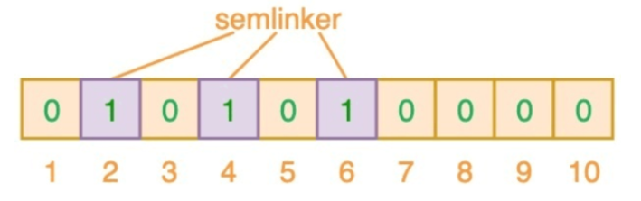

查询"Good"在不在布隆过滤器中

算法1:Good-->7

算法2:Good-->3

算法3:Good-->6

我们判断Good单词生成的3,6,7三个位置,只要有一个位置是0

就表示当前集合中没有Good这个单词

一个布隆过滤器不可能存一个单词,一般布隆过滤器都是保存大量数据的

如果有新的元素保存在布隆过滤器中

kakuqo

算法1:kakuqo-->3

算法2:kakuqo-->4

算法3:kakuqo-->7

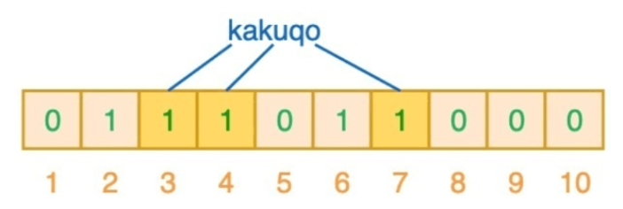

新的单词生成3,4,7个位置

那么现在这个布隆过滤器中2,3,4,6,7都是1了

如果又有单词bad

bad

算法1:bad-->2

算法2:bad-->3

算法3:bad-->6

判断布隆过滤器2,3,6都是1,所以布隆过滤器会认为bad是存在于这个集合中的

**误判就是这样产生的**

布隆过滤器误判的效果:

* 布隆过滤器判断不存在的,一定不在集合中
* 布隆过滤器判断存在的,有可能不在集合中

过短的布隆过滤器如果保存了很多的数据,可能造成二进制位置值都是1的情况,一旦发送这种情况,布隆过滤器就会判断任何元素都在当前集合中,布隆过滤器也就失效了

所以我们要给布隆过滤器一个合适的大小才能让它更好的为程序服务

- 优点

​	空间效率和查询效率⾼，

- 缺点
  - 有⼀定误判率即可（在可接受范围内）。
  - 删除元素困难(不能将该元素hash算法结果位置修改为0,因为可能会影响其他元素)
  - 极端情况下,如果布隆过滤器所有为位置都是1,那么任何元素都会被判断为存在于集合中

## 设计布隆过滤器

我们在启动布隆过滤器时,需要给它分配一个合理大小的内存

这个大小应该满足

1.一个可接受范围的大小

2.不能有太高的误判率

内存约节省,误判率越高

内存越大,误判率越低

数学家已经给我们了公式计算误判率

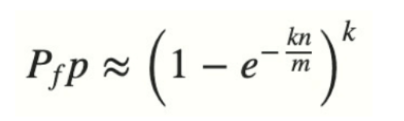


上面是根据误判率计算布隆过滤器长度的公式

n 是已经添加元素的数量；

k 哈希的次数；

m 布隆过滤器的长度(位数的大小)

计算结果就是误判率

如果我们已经确定可接受的误判率,想计算需要多少 布隆过滤器的长度

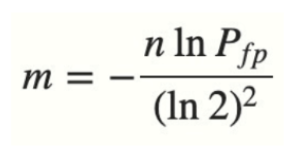

布隆过滤器计算器

https://hur.st/bloomfilter

windows安装redisbloom布隆过滤器

https://blog.csdn.net/weixin_44770915/article/details/107918770

# 虚拟机基本使用

## Virtualbox安装流程

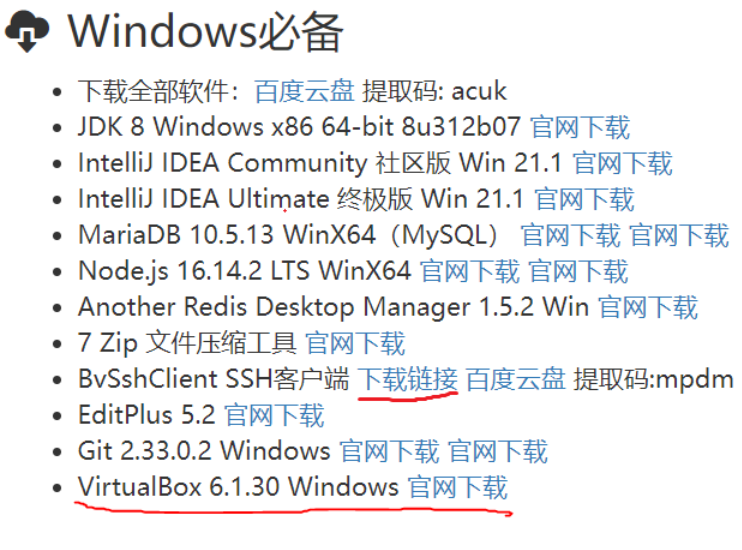

RockyLinux

VirtualBox清华大学个版本下载路径

https://mirrors.tuna.tsinghua.edu.cn/virtualbox/

安装失败的同学可以尝试下载5.2.38以上的版本

**VirtualBox安装过程正常,各种下一步即可**

配置网络共享连接

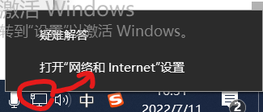

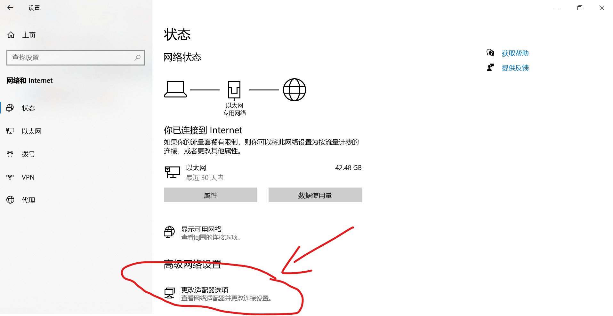

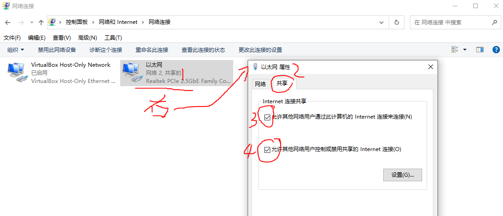

如果共享中出现下拉框,一定要选择Virtualbox的网卡选项

## 虚拟机镜像文件的安装和加载

解压RockyLinux_8.5_VBM.7z

获得1.78GB的文件及

打开这个文件夹

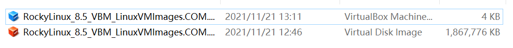

双击蓝色图标

会自动开启virtualbox虚拟机,并加载当前镜像

**必须保证当前镜像文件所在全部路径都没有中文**

选中镜像,点击设置

修改usb设置

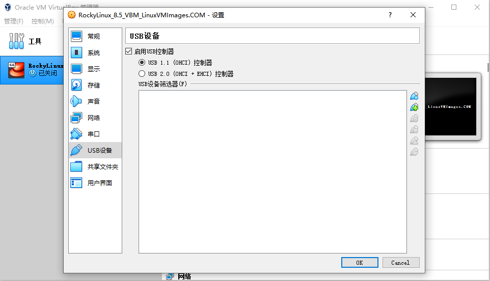

修改网络设置

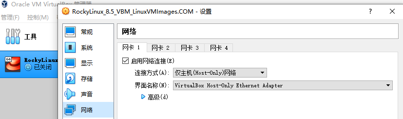

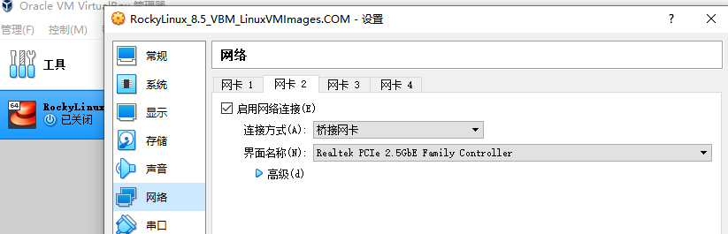

# 启动虚拟机

上面配置完成之后

可以启动虚拟机

启动虚拟机之后,等待出现登录页面

用户名密码默认都是rockylinux

登录之后,我们的用户是rockylinux用户

这个用户并不是系统最高权限的用户

我们需要登录系统最高权限的用户root才能畅通无阻的配置和安装系统软件

输入

```
sudo su -
```

就能切换到root用户

然后为root用户设置一个密码,方便今后登录

```
passwd
```

可以进入设置密码的流程

设置完成之后,我们尝试连接网络

```
ping www.baidu.com
```

Ctrl+C可以随时退出当前运行的程序 返回到命令符

如果能够有周期响应表示当前虚拟机可以使用网络

如果没有响应,尝试重新调整网卡网络共享配置和虚拟机的网卡桥接配置

虚拟机启动后,如果想使用宿主机访问,必须有一个ip地址

宿主机是当前windows系统,如果windows想访问虚拟机需要一个IP地址

```
ifconfig
```

或

```
ifconfig | more 
```

分页显示

通过上面的命令可以看到自己虚拟机的ip地址

这个ip地址可能是

```
192.168.56.101
```

记住这个IP


