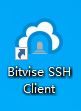
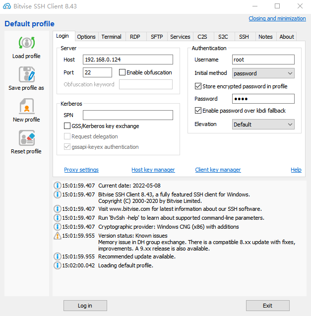
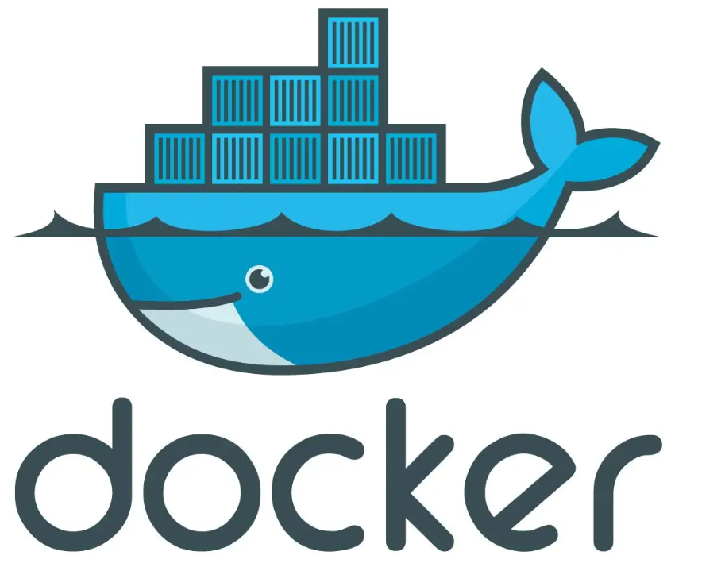
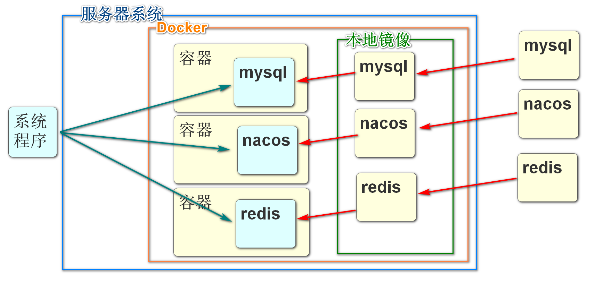

# 续 虚拟机操作

## 客户端软件连接Linux

苍老师网站下载Bitvise SSH Client软件

安装各种下一步即可

安装后桌面出现下面图标



双击这个图标进入虚拟机连接界面



我们使用这个软件连接成功后

就可以用这个软件提供的界面来操作Linux了

无论是虚拟机还是实际的物理服务器

我们想远程的控制这个机器的话,都需要使用专门的客户端连接服务器,并向服务器发送指令

这个软件就能完成这个功能

# Docker 简介

## Linux简介

Linux和windows一样,都是操作系统

只不过windows更易用,适合家庭和非编程人员使用

如果用作服务器,尤其是java项目的服务器,Linux会更加合适

Linux有更全面的权限系统,更安全,更稳定,速度也更快

原生Linux功能较少,有很多功能都不具备,使用起来不方便

所以市面上出现很多Linux的加强版,对Linux进行了一些加强,或默认安装了很多工具

例如

CentOS

ubuntu

RockyLinux

RedHatLinux

等

甚至有的Linux系统都配置了类似windows系统的桌面界面

## 什么是Docker

我们要学习在Linux(RockyLinux)中安装使用Docker来配置软件的功能

Docker是一个用来开发、运输和运行应用程序的开放平台。使用Docker可以将应用程序与基础结构分离，以便快速交付软件。使用Docker，您可以以管理应用程序的方式管理基础架构。通过利用Docker的方法快速传送、测试和部署代码，可以显著减少编写代码和在生产中运行代码之间的延迟。



## 为什么使用Docker

- 更快速的应用交付和部署：

传统的应用开发完成后，需要提供一堆安装程序和配置说明文档，安装部署后需根据配置文档进行繁杂的配置才能正常运行。Docker化之后只需要交付少量容器镜像文件，在正式生产环境加载镜像并运行即可，应用安装配置在镜像里已经内置好，大大节省部署配置和测试验证时间。

- 更便捷的升级和扩缩容：

随着微服务架构和Docker的发展，大量的应用会通过微服务方式架构，应用的开发构建将变成搭乐高积木一样，每个Docker容器将变成一块“积木”，应用的升级将变得非常容易。当现有的容器不足以支撑业务处理时，可通过镜像运行新的容器进行快速扩容，使应用系统的扩容从原先的天级变成分钟级甚至秒级。

- 更简单的系统运维：

应用容器化运行后，生产环境运行的应用可与开发、测试环境的应用高度一致，容器会将应用程序相关的环境和状态完全封装起来，不会因为底层基础架构和操作系统的不一致性给应用带来影响，产生新的BUG。当出现程序异常时，也可以通过测试环境的相同容器进行快速定位和修复。

- 更高效的计算资源利用：

Docker是内核级虚拟化，其不像传统的虚拟化技术一样需要额外的Hypervisor [管理程序] 支持，所以在一台物理机上可以运行很多个容器实例，可大大提升物理服务器的CPU和内存的利用率。

**Docker运行架构图**



## Docker相关资料

Docker官网：http://www.docker.com

Docker Hub官网（镜像仓库）：https://hub.docker.com

所有步骤，均参考官方文档：https://docs.docker.com/engine/install/centos/

## 安装Docker

官方网站提供的3种安装方式

- 设置docker仓库，并且从仓库安装所需内容。
- 下载RPM安装包，手动更新安装。
- 为测试和开发环境使用自定义脚本安装。

三种方式中第一种,从docker仓库中安装是比较简单的

这种方式需要当前虚拟机有网络环境

确定具备网络环境再运行下面命令

RockyLinux支持使用yum命令安装各种程序

> yum命令安装程序类似手机中的应用商店一样

先安装yum-utils包,实现更方便的安装"应用商店"中提供的程序

```
yum install -y yum-utils
```

指定docker仓库路径

```
yum-config-manager \
    --add-repo \
    https://download.docker.com/linux/centos/docker-ce.repo
```

阿里仓库路径

http://mirrors.aliyun.com/docker-ce/linux/centos/docker-ce.repo

执行安装Docker

也是使用yum命令

```
yum -y install docker-ce docker-ce-cli containerd.io
```

下载和安装需要一些时间,如果下载慢,配置上面的阿里Docker仓库地址

运行完成后,当前Linux系统就安装好的Docker

我们需要输入启动Docker的命令,真正让Docker运作起来

```
systemctl start docker
```

## 测试Docker

为了保证我们Docker运行的正常

Docker提供了一个专门测试Docker功能的镜像

```
docker run hello-world
```

运行可能需要较短时间

运行结果中出现如下内容,表示一切正常

>Hello from Docker!
>This message shows that your installation appears to be working correctly.

## docker名词解释

- 容器（container）

首先需要了解什么是容器，容器就是一个进程，内部是独立运行的一个或者是一组应用。它可以被启动、开始、停止、删除。每个容器都是相互隔离的，保证安全的平台。

- 镜像（image）

镜像（Image）就是一个只读的模板文件。镜像可以用来创建 Docker 容器，一个镜像可以创建很多容器。 就好似 Java 中的 类和对象，类就是镜像，容器就是对象！也可以把镜像看成是模具，而镜像创建出来的容器就是通过这个模具创建的一个一个的实际产品。

- 宿主机（host）

宿主机就是我们调用命令使用镜像创建容器的服务器。

- 镜像仓库（repository）

一个用来容纳多个镜像的仓库，可以链接仓库获取你想要的内部镜像，一般一个镜像仓库中包含多个不同tag的镜像。

- 镜像服务器（registry）

镜像仓库占用的服务器，这里注意一个镜像服务器未必只有一个仓库，可以有很多仓库，每个仓库又保管的是不同镜像。

- 客户端（docker-client）

调用docker命令，操作镜像，容器的进程。只要能链接宿主机，操作docker的进程都是docker-client。

# Docker基础命令

## Docker命令格式

Docker命令的语法结构

```
docker 子命令 [选项]
```

docker都有哪些子命令呢,我们可以使用docker的helper子命令查看

```
docker --help
```

如果想查询具体的子命令的使用方式

```
docker 子命令 --help
```

我们最常用的子命令之一:启动docker容器的run的相关帮助可以

```
docker run --help
```

当然也可以查询官方文档或百度了解更多内容

https://docs.docker.com/reference/

## images命令

docker images命令主要能够完成查看当前本地镜像仓库的功能

```
docker images
```

这个命令的返回结果显示：

- REPOSITORY:镜像仓库名，也叫作镜像名。
- TAG：标签，常用版本号标识仓库，如果是latest就是最新版本。
- IMAGE ID：镜像id。
- CREATED:创建镜像时间。
- SIZE:大小。

docker images命令的常用选项如下

* -a: 显示所有信息
* -q: 只显示镜像id,在镜像较多的时候比较常用

## search命令

在拉取镜像之前,我们要先明确正确的镜像名称

我们可以输入查询关键字,对镜像仓库进行搜索

search命令,可以搜索当前系统绑定的远程镜像服务器中的内容

```
docker search mysql
```

这个命令的返回结果显示：

- NAME:镜像名称。
- DESCRIPTION:镜像描述。
- STARS：镜像星级，越高表示越热，使用人越多。
- OFFICIAL:是否官方镜像。
- AUTOMATED：是否支持自动化部署。

## pull命令

根据我们上面搜索得到的结果

确认关键字之后

我们就可以使用pull命令将我们查询出的软件拉取到本地仓库了

```
docker pull [镜像名称]
```

```
docker pull mysql
```

默认下载最新版本

如果要指定版本号可以在名称后指定

```
docker pull mysql:5.7.35
```

至于要指定的版本号有什么

可以在相关的官方网站查询

## rmi命令

删除本地镜像的命令

一般当本地镜像较多,过多的占用空间时,可以删除一些不会再使用的镜像文件,节省空间

删除镜像需要明确镜像的id,所以一般都会配置docker images使用

```
docker rmi feb5d9fea6a5
```

如果当前要删除的镜像有实例正在运行,使用上面命令删除会有报错

意思就是正在使用的镜像无法删除

我们如果需要强制将当前镜像删除,并同时停止这个服务的话,就需要加-f选项

```
docker rmi feb5d9fea6a5 -f
```

rmi命令的选项：

- -f:强制删除这个镜像，无论是否正在使用。

## run命令

docker run命令,可以指定当前本地镜像文件启动,

启动镜像文件会在Docker中生成新的容器,容器中来运行镜像中包含的软件

docker run的命令,选项比较多,例如设置端口号,设置运行模式,调整运行参数,运行位置等

```
docker run --name mysql -d -p 3306:3306 -e MYSQL_ROOT_PASSWORD=123456 -v /root/data:/var/lib/mysql mysql
```

1: --name mysql:该容器启动后的名字：（自定义命名）如果没有设置，系统会自动设置一个，毕竟如果开启太多的容器，记不住就很尴尬，建议加上见名知意。

2：-d 代表后台启动该服务

3：-p 3306(这是liunx的端口号，我习惯说成宿主机，如果我们想要远程服务的话，访问的端口就是这个端口):3306（docker容器的端口，每一个容器都是独立的，可理解成操作系统层面的系统），访问这个端口就是先通过远程访问宿主机的端口，再映射到docker容器的端口访问mysql。

4：-e MYSQL_ROOT_PASSWORD=123456  这是说mysql启动需要的开机密码，默认的账号是root ，密码就是上面设置的：123456

5：-v  /root/data:/var/lib/mysql  /root/data/:这是宿主机的数据存放路径（你也可以自定义），   /var/lib/mysql:这是mysql容器存放数据的地方。也是为了同步数据，防止，容器被删除以后，数据就不存在了。

6：启动成功后就返回一个容器ID

启动之后,我们就可以使用数据库连接工具访问数据库了


## ps命令

docker ps 

可以查看当前docker中运行的所有容器的状态

```
docker ps
```

- container id：容器id，很多操作容器命令都需要用到的参数。
- image：容器创建使用的镜像。
- command：容器中在运行的进程或者命令。
- created：创建时间。
- status：容器状态。
- ports：容器的端口映射情况，这里没有用到端口。
- names：容器的名字，启动没有指定--name选项，会默认使用一个名字。

**ps命令中常见的选项如下：**

- -a：显示所有容器，如果不加只显示正在启动运行的容器，停止的不会显示。
- -l：显示最近的启动创建的容器。
- -n=[数字]：显示最近n个容器。
- -q：只显示容器id。经常和-a一起使用，获得当前宿主机所有容器id参数集合。

## stop\rm命令

docker stop 可以停止正在运行的容器

stop只是停止容器.并不会删除容器

如果想删除容器需要使用rm命令

注意:**这里rm删除的是容器,不是本地镜像,和rmi命令要区分**

首先使用docker ps命令查询所有正在运行的容器

```
docker stop [容器id]
```

```
docker rm [容器id]
```

rm的选项有：

-f:强制删除容器，无论是否运行，如果不加，运行的容器无法删除。


课堂作业 自己用docker安装运行一个redis

建议从search开始

自己搜docker启动Redis的命令

```
docker run -itd --name redis-test -p 6379:6379 redis
```

```
docker exec -it redis-test redis-cli
```

## 关闭防火墙

如果当前windows系统要连接Linux中的资源

一般都要关闭Linux的防火墙

实际开发中,不会彻底关闭防火墙,而是开发指定的端口号

```
systemctl stop firewalld
```

system系统

ctl:control:控制


# 酷鲨商城虚拟机镜像

给大家的大压缩包

Virtualbox   4.xxG

VMware    3.xxG

解压之后启动

用户名:root

密码:12345678(不要用小键盘)

启动后使用

```
ifconfig | more
```

观察ip地址

可以利用HS尝试连接虚拟机的数据库

一般情况下ip地址为:192.168.137.150

密码是:

tarena2017Up;

注意分号也是密码的一部分,不写连不上

注意如果需要停止虚拟机,选择快速休眠,不要关机

## 酷鲨商城前台项目对虚拟机的配置

front

```
addr: 192.168.137.150
```

mall-leaf

leaf.properties

```
leaf.jdbc.url=jdbc:mysql://192.168.137.150:3306/leafdb?useUnicode=true&characterEncoding=utf8&useSSL=false&allowPublicKeyRetrieval=true

leaf.jdbc.password=tarena2017Up;
```

mall-order

```
addr: 192.168.137.150

password: tarena2017Up;
```

mall-product

```
addr: 192.168.137.150

password: tarena2017Up;
```

mall-search

```
addr: 192.168.137.150
```

mall-seckill

```
addr: 192.168.137.150

password: tarena2017Up;

rabbitmq:
    host: ${my.server.addr}
    port: 5672
    username: user
    password: 123456
    virtual-host: /
```


mall-sso

```
addr: 192.168.137.150
# 有两个密码要改!!!!
	admin
      password: tarena2017Up;
    user
      password: tarena2017Up;
```

# 布隆过滤器的测试

因为上面我们启用了虚拟机

我们再虚拟机中安装的redis是一个特殊版本的Redis

这个版本内置了lua脚本,支持布隆过滤的方法

我们可以直接使用,实现布隆过滤器

csmall-stock-webapi的pom文件 添加依赖

```xml
<dependency>
    <groupId>org.springframework.boot</groupId>
    <artifactId>spring-boot-starter-data-redis</artifactId>
</dependency>
```

添加yml文件的支持

```yaml
spring:
  redis:
    host: 192.168.137.150
    port: 6379
    password: 
```

然后可以将酷鲨前台大项目中seckill-webapi下utils包下

RedisBloomUtils类复制到需要使用布隆过滤器的项目中

当前Stock模块

有一个周期输出时间的方法

我们可以借助这个运行,测试测试布隆过滤器的功能(如果这个方法已经编写了别的代码可以先注释掉)

quartz包下QuartzJob

```java
@Autowired
private RedisBloomUtils redisBloomUtils;

@Override
public void execute(JobExecutionContext jobExecutionContext) throws JobExecutionException {
    //输出当前时间
    System.out.println("--------------"+ LocalDateTime.now() +"---------------");

    //  首先确定要向布隆过滤器中保存的元素
    String[] colors={"red","origin","yellow","green","blue","pink","white"};
    //  使用RedisBloomUtils类将上面的数组元素保存在Redis(布隆过滤器)中
    redisBloomUtils.bfmadd("colorBloom",colors);
    // 下面就可以判断一个元素是否在这个布隆过滤器中了
    String elm="yellow";
    System.out.println("布隆过滤器判断"+elm+"是否存在:"+
            redisBloomUtils.bfexists("colorBloom",elm));

}
```


