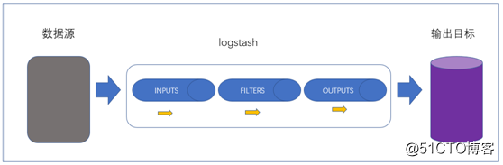
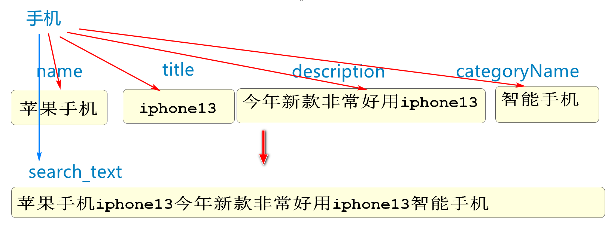
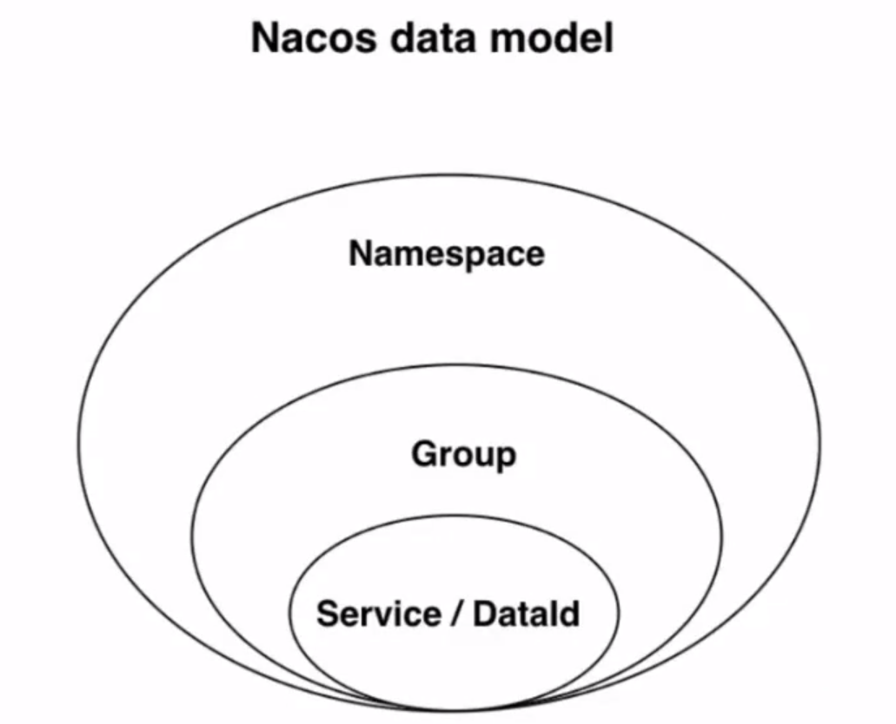
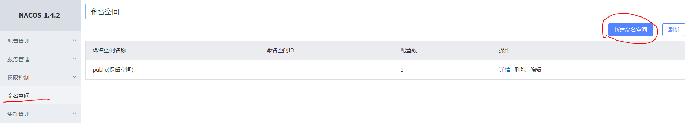
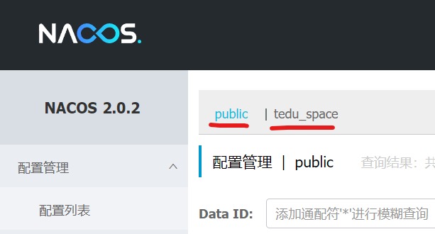
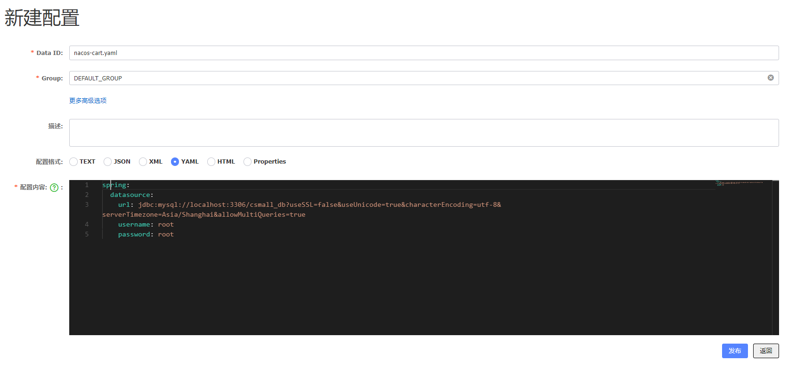
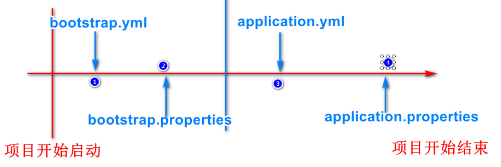

# 秒杀业务完善

## 秒杀准备时加载布隆过滤器

我们再开发秒杀业务时先进行了准备工作

在秒杀开始前5分钟,预热了sku的库存数和随机码

但是没有将当前批次的spuId保存在布隆过滤器中

导致业务有漏洞

现在,我们准备了支持布隆过滤器的Redis

我们可以将允许用户查询到的秒杀商品,保存到布隆过滤器中

这样非当前秒杀商品,用户就不能查询数据库了,防止缓存穿透

在seckill-webapi模块中

seckill.timer.job包中,新建SeckillBloomInitialJob

```java
public class SeckillBloomInitialJob implements Job {

    @Autowired
    private RedisBloomUtils redisBloomUtils;
    @Autowired
    private SeckillSpuMapper seckillSpuMapper;

    // 我们设计加载两批秒杀商品,防止瞬间的空档期
    // 也是能够让用户查询下一批秒杀商品的需求
    @Override
    public void execute(JobExecutionContext jobExecutionContext) throws JobExecutionException {
        // 先确定两个批次的Key
        // 我们的设计是每天一批秒杀,所以用日期做Key就可以
        String bloomTodayKey=
             SeckillCacheUtils.getBloomFilterKey(LocalDate.now());
        String bloomTomorrowKey=
             SeckillCacheUtils.getBloomFilterKey(LocalDate.now().plusDays(1));
        // 实际开发中按秒杀时间去查询此批次的SpuId集合
        // 但是学习过程中,因为无法频繁修改数据库秒杀开始结束时间,
        // 所以我们将所有的spuId都保存在布隆过滤器里
        // 查询当前秒杀表中所有信息
        Long[] spuIds=seckillSpuMapper.findAllSeckillSpuIds();
        // 创建布隆过滤器(将Long[]转换成String[]再添加到布隆过滤器中)
        // 创建长度相同的String数组
        String[] spuIdStrs=new String[spuIds.length];
        // 将spuIds中的值赋值到spuIdStrs
        for(int i=0;i<spuIdStrs.length;i++){
            spuIdStrs[i]=spuIds[i]+"";
        }
        // 保存到布隆过滤器中
        // 实际开发保存的是当前Key对应的批次的
        redisBloomUtils.bfmadd(bloomTodayKey,spuIdStrs);
        redisBloomUtils.bfmadd(bloomTomorrowKey,spuIdStrs);
        System.out.println("两个批次的布隆过滤器加载完成");

    }
}
```

下面在seckill.timer.config包中添加布隆过滤器相关的调度配置

```java
// 布隆过滤器的注册
@Bean
public JobDetail seckillBloomInitialJobDetail(){
    log.info("加载布隆过滤器");
    return JobBuilder.newJob(SeckillBloomInitialJob.class)
            .withIdentity("SeckillBloomInitial")
            .storeDurably()
            .build();
}
// 布隆过滤器的触发器
@Bean
public Trigger seckillBloomInitialTrigger(){
    log.info("加载布隆过滤器触发器");
    // 实际开发需要修改这个Cron表达式为实际需求的设计,这里也是每分钟运行,方便测试
    CronScheduleBuilder cronScheduleBuilder=
            CronScheduleBuilder.cronSchedule("0 0/1 * * * ?");
    return TriggerBuilder.newTrigger()
            .forJob(seckillBloomInitialJobDetail())
            .withIdentity("seckillBloomInitialTrigger")
            .withSchedule(cronScheduleBuilder)
            .build();
}
```

下面可以测试布隆过滤器的运行

保证虚拟机启动正常

启动Leaf\product\seckill

如果没有虚拟机的同学,敲一遍代码熟悉即可


## 布隆过滤器判断spuID是否存在

现在Redis中保存了布隆过滤器

我们需要用户根据SpuId查询商品时,进行判断和过滤

如果spuId不存在,就应该发生异常,给出提示

SeckillSpuServiceImpl类中getSeckillSpu进行修改,添加布隆过滤器的判断

```java
@Autowired
private RedisBloomUtils redisBloomUtils;
// 根据SpuId查询Spu详情
@Override
public SeckillSpuVO getSeckillSpu(Long spuId) {
    // 先判断参数spuId是否在布隆过滤器中
    // 如果不在直接返回/抛出异常(后期会实现)
    // 获得今天日期(是本批次秒杀的key)
    String bloomTodayKey=SeckillCacheUtils
                        .getBloomFilterKey(LocalDate.now());
    log.info("当前批次布隆过滤器的key为:{}",bloomTodayKey);
    // 判断布隆过滤器中是否包含这个spuId
    if(!redisBloomUtils.bfexists(bloomTodayKey,spuId+"")){
        // 如果spuId不在布隆过滤器中,为了防止缓存穿透,直接抛出异常
        throw new CoolSharkServiceException(ResponseCode.NOT_FOUND,
                "您访问的商品不存在(布隆过滤器拦截)");
    }
    ....
}
```

重启Seckill模块

访问10007

查询SpuId如果不存在于秒杀表中,是否能被过滤器拦截

# ELK简介

## 什么是ELK

ELK:

E:Elasticsearch         全文搜索引擎

L:logstash		   日志采集工具

K:Kibana	           ES的可视化工具		

ELK是当今业界非常流行的日志采集保存和查询的系统

我们编写的程序,会有很多日志信息,但是日志信息的保存和查询是一个问题

idea控制台是临时显示的位置,我们可以将它保存在文件中

但是即使保存在文件中,海量日志信息要想查询需要的条目也是问题

所以我们使用ELK来保存

## 为什么需要ELK

保存并能够快速便捷的查询查看日志信息就是新出现的需求了

ELK这个组合可以完成这个任务

Elasticsearch负责将日志信息保存,查询时可以按关键字快速查询

那么这些日志怎么收集呢?

利用logstash这个软件可以监听一个文件,将这个文件中出现的内容经过处理发送到指定端口

我们就可以监听我们程序输出的日志文件,然后将新增的日志信息保存到ES中

Kibana来负责进行查询和查看结果

> 日志的管理工具还有一套叫链路追踪
>
> 和ELK有类似的效果,感兴趣的同学可以自己搜索

# Logstash

## 什么是logstash

Logstash是一款开源的日志采集,处理,输出的软件,每秒可以处理数以万计条数据,可以同时从多个来源采集数据,转换数据,然后将数据输出至自己喜欢的存储库中(官方推荐的存储库为Elasticsearch)



上面图片数据源可以是任何产生数据的介质,数据库,redis,java的日志文件均可

输出目标一般也是能够保存数据的媒体,数据库,redis,ES等

LogStash内部有3个处理数据的步骤

- input    将数据源的数据采集到Logstash
- filter     (非必要)如果需要可以对采集到的数据进行处理
- output 将处理好的数据保存到目标(一般就是ES)

其中采集数据的用法比较多样,还支持各种插件

## logstash实现数据库和ES数据的同步

logstash还有一个非常常用的功能

就是能够自动完成数据库数据和ES中数据的同步问题

实现原理

我们可以配置logstash监听数据库中的某个表

一般设计为监听表中数据的变化,在规范的数据表结构中,logstash可能监听gmt_modified列

只要gmt_modified列数据有变化,就收集变化的数据行,将这行数据的信息更新到ES

下面我们就在虚拟机环境下实现搜索操作

# 实现虚拟机搜索功能

之前我我们已经修改了yml文件,将搜索的目标更换为虚拟机中的ES

在虚拟机的连接环境中,我们使用SpuEntity来实现ES的连接

我们可以看到SpuEntity类中没有任何编写分词的属性

原因是为了更高效的实现分词,logstash将所有需要分词的列拼接组合成了一个新列search_text



当需要查询时只需要查询search_text字段即可

### 修改持久层

我们需要修改一下SpuForElasticRepository的代码

```java
@Repository
public interface SpuForElasticRepository extends
                        ElasticsearchRepository<SpuEntity,Long> {

    // 所有更新数据的操作都由Logstash负责,这里无需编写数据更新代码

    // 方法名查询
    Page<SpuEntity> querySpuEntitiesBySearchTextMatches(
                                String keyword,Pageable pageable);
    // 或者调用查询语句的方法
    @Query("{\"match\":{\"search_text\":{\"query\":\"?0\"}}}")
    Page<SpuEntity> querySearchByText(String keyword,Pageable pageable);
}
```

### 业务逻辑层接口

因为实体类泛型类型的变化

ISearchService接口中的返回值泛型也要修改一下

```java
public interface ISearchService {

    // ES分页查询spu的方法
    //      ↓↓↓↓↓↓↓↓↓↓↓
    JsonPage<SpuEntity> search(String keyword, Integer page, Integer pageSize);

    // 向ES中加载数据的方法
    void loadSpuByPage();
}
```

原来的业务逻辑层实现类,要废弃,可以删除

如果不想删除也要把之前代码注释,还是必须删除@Service注解

原有Service(Search)LocalServiceImpl修改为

```java
//@Service
//@Slf4j
@Deprecated
public class ServiceLocalServiceImpl {
}
```

新建SearchRemoteServiceImpl实现类代码如下

```java
// 实现查询远程服务器ES的业务逻辑层实现类
@Service
@Slf4j
public class SearchRemoteServiceImpl implements ISearchService {

    //注入查询ES的Repository
    @Autowired
    private SpuForElasticRepository spuForElasticRepository;
    @Override
    public JsonPage<SpuEntity> search(String keyword, Integer page, Integer pageSize) {
        Page<SpuEntity> spuEntities=spuForElasticRepository
                .querySearchByText(keyword, PageRequest.of(page-1,pageSize));
        JsonPage<SpuEntity> jsonPage=new JsonPage<>();
        //赋值分页参数
        jsonPage.setPage(page);
        jsonPage.setPageSize(pageSize);
        // 总页数
        jsonPage.setTotalPage(spuEntities.getTotalPages());
        // 总条数
        jsonPage.setTotal(spuEntities.getTotalElements());
        // 赋值数据
        jsonPage.setList(spuEntities.getContent());
        // 别忘了返回jsonPage
        return jsonPage;
    }

    @Override
    public void loadSpuByPage() {

    }
}
```

### 修改控制层代码

修改SearchController中的代码

```java
@GetMapping
@ApiOperation("根据关键字查询ES中的信息")
@ApiImplicitParams({
        @ApiImplicitParam(value = "搜索关键字",name = "keyword",dataType = "string",
                                                required = true),
        @ApiImplicitParam(value = "页码",name = "page",dataType = "int",
                required = true),
        @ApiImplicitParam(value = "每页条数",name = "pageSize",dataType = "int",
                required = true)
})
//                        ↓↓↓↓↓↓↓↓↓↓↓
public JsonResult<JsonPage<SpuEntity>> searchByKeyword(
        String keyword,
        @RequestParam(value = "page",defaultValue = "1")Integer page,
        @RequestParam(value = "pageSize",defaultValue = "5") Integer pageSize
        ){
   	//     ↓↓↓↓↓↓↓↓↓↓↓
   JsonPage<SpuEntity> list=searchService.search(keyword,page,pageSize);
    return JsonResult.ok(list);

}
```

如果测试包test中的类报错,把他们注释或删除即可

执行查询

leaf\product\\[passport]\search

启动虚拟机

如果不能查询出数据库中正确的对应的信息

需要在数据库工具软件中运行下面代码

```sql
USE mall_pms;

UPDATE pms_spu SET gmt_modified=now() WHERE  1=1;
```

以激活logstash对spu表的监听,并向ES中保存数据

这个操作可能有些延迟,稍等即可

再次查询,就有能够正确搜索信息了!

## Logstash下ES的运行流程

安装配置好相关软件后

logstash会自动监听指定的表(一般指定监听gmt_modified列)

当gmt_modified列值变化时,logstash就会收集变化的行的信息

周期性的向ES进行提交

ES中的数据就会自动和数据库中的变化同步了

这样,我们再程序中,就无需编写任何同步ES和数据库的代码

# 配置中心

## 什么是配置中心

所谓配置中心:将项目需要的配置信息保存在配置中心,需要读取时直接从配置中心读取,方便配置管理的微服务工具

我们可以将部分yml文件的内容保存在配置中心

一个微服务项目有很多子模块,这些子模块可能在不同的服务器上,如果有一些统一的修改,我们要逐一修改这些子模块的配置,由于它们是不同的服务器,所以修改起来很麻烦

如果将这些子模块的配置集中在一个服务器上,我们修改这个服务器的配置信息,就相当于修改了所有子模块的信息,这个服务器就是配置中心

**使用配置中心的原因就是能够达到高效的修改各模块配置的目的**

## 配置中心的使用

Nacos既可以做注册中心,也可以做配置中心

Nacos做配置中心,支持各种格式\类型的配置文件

properties\yaml(yml)\txt\json\xml等

## Nacos数据结构



namespace:命名空间

group:分组

Service/DataId:具体数据

**命名空间**

namespace是Nacos提供的最大的数据结构

一个Nacos可以创建多个命名空间

一个命名空间能够包含多个group

在nacos中创建命名空间



在上图连接的位置可以新增命名空间,填写命名空间名称和描述即可

Nacos有默认的命名空间public不能删除和修改

添加命名空间后,我们在Nacos中注册的服务或添加的配置就可以指定命名空间了

因为多个命名空间可以隔离项目,每个项目使用自己的命名空间,互不干扰




**分组**

一个命名空间中可以有多个分组,进行进一步分离

我们使用时,如果不需要进一步分组,推荐使用group名称:DEFAULF_GROUP

**服务或配置**

确定了命名空间和分组之后

我们就可以添加服务或配置了

之前我们启动的各种模块都是服务,之前都是默认保存在public命名空间中

下面我们主要使用配置中心的功能,在命名空间中添加配置

添加配置就是设置DataId

实际在Nacos中定位一个配置的结构为

Namespace>Group>DataId

## Nacos添加配置

Nacos首页->配置管理->配置列表->添加配置(右侧的大"＋"号)


添加cart模块数据库连接配置



点击发布,nacos就保存这个配置了

## 项目读取配置

如果要读取配置中心的信心,首先要添加依赖

```xml
<!--  配置中心的依赖  -->
<dependency>
    <groupId>com.alibaba.cloud</groupId>
    <artifactId>spring-cloud-starter-alibaba-nacos-config</artifactId>
</dependency>
<!--  支持SpringCloud加载系统配置文件的依赖   -->
<dependency>
    <groupId>org.springframework.cloud</groupId>
    <artifactId>spring-cloud-starter-bootstrap</artifactId>
</dependency>
```

像其他程序一样,在添加完依赖之后,还需要添加yml文件的配置

我们使用过application.properties和application.yml两种配置文件添加配置

实际上这两个配置文件加载是有顺序的

先加载yml

后加载properties

如果两个配置文件同时设置了同一个属性,后加载的覆盖掉先加载的

在SpringCloud环境下,实际上可以再多出一组配置文件

它们是bootstarp.yml和bootstarp.properties

这一组的加载时机整体早于application这一组

所以一个SpringCloud项目加载配置文件的顺序最终可能如下图



bootstrap这组配置文件,一般用于配置加载一些系统级别的配置,这些配置的特征是一般不会轻易修改

我们再后面的学习过程中,会将配置中心的信息,加载到这组配置文件中

**必须是SpringCloud项目,才能支持bootstrap这组配置文件的加载**

支持这组配置的依赖就是上面我们添加的依赖

```xml
<!--  支持SpringCloud加载系统配置文件的依赖   -->
<dependency>
    <groupId>org.springframework.cloud</groupId>
    <artifactId>spring-cloud-starter-bootstrap</artifactId>
</dependency>
```

注意SpringCloud版本早于2020之前,添加的不是这个依赖,可以自行查询

下面我们就在cart-webapi项目中resources文件夹中添加bootstarp.yml文件

```yaml
spring:
  cloud:
    nacos:
      config:
        #  指定配置中心的位置
        server-addr: 192.168.137.150:8848
        # 指定配置文件所在的组名(命名空间默认public不需要指定)
        group: DEFAULT_GROUP
        # 设置配置文件的后缀名
        # 默认情况下会加载[服务器名].[后缀名]为DataId的配置
        # 当前项目名称为nacos-cart所以默认加载的DataId为:nacos-cart.yaml
        file-extension: yaml
```

如果一切顺利,那么cart模块是可以通过knife4j测试操作连接数据库的

我们可以新增购物车信息,或删除购物车信息后简单数据库是否有对应操作

因为我们已经删除了本地yml文件中数据库的配置,所以,它能连接操作数据库一定是配置中心生效了!

# 使用RestTemplate调用远程控制层方法

我们现在项目中使用的RPC远程调用技术是Dubbo

实际上除了Dubbo技术之外,还有很多远程调用的方法

它们有些调用的思想都和Dubbo完全不同

Dubbo是SpringCloudAlibaba提供的功能强大的RPC框架

但是Dubbo功能也有限制,如果我们想调用的方法不是我们当前项目的组件或功能,甚至想调用的方法不是java编写的,那么Dubbo就无能为力了

我们可以使用RestTemplate来调用任何语言编写的公开的控制器路径

也就是只要能够使用浏览器访问的路径,我们都可以使用RestTemplate发送请求,接收响应

使用步骤如下

步骤1:

先在调用的发起方,也就是使用RestTemplate发起请求的项目配置文件中,向Spring容器注入一个该类型对象

的类型,SpringBoot配置类都可以添加下面代码,我们选择SpringBoot启动类添加如下代码

```java
@Bean
// 负载均衡的注解,编写之后采用负载均衡算法
@LoadBalanced
public RestTemplate restTemplate(){
    return new RestTemplate();
}
```

步骤2:

我们要确定要调用的控制器方法,这个方法必须是GetMapping

我们修改CartController中删除购物车的方法为@GetMapping 为了测试

我们本地stock模块减少库存的方法中使用RestTemplate调用删除购物车商品的方法

在StockController类中编写代码如下

```java
@Autowired
private RestTemplate restTemplate;
//.....
public JsonResult reduceCommodityCount(StockReduceCountDTO stockReduceCountDTO){

        // 这里发送RestTemplate请求
        // 调用cart模块的删除购物车的方法
        // 先确定要调用的路径
        String url="http://localhost:20001/base/cart/delete" +
                "?userId={1}&commodityCode={2}";
        // 再发起调用
        // getForObject参数1请求的路径   参数2返回类型的反射
        // 从参数3开始是url中{1} 占位符的值 参数4是{2}的值 以此类推
        JsonResult jsonResult=restTemplate.getForObject(url,JsonResult.class,
                "UU100",
                stockReduceCountDTO.getCommodityCode());
        System.out.println(jsonResult);
        stockService.reduceCommodityCount(stockReduceCountDTO);
        return JsonResult.ok("商品库存减少完成!");
    }
```

步骤3:

发送测试

将相关的模块都启动

cart\stock

调用stock模块减少库存的方法

运行后检查购物车中减少库存的商品是否会被删除

如果删除了证明调用成功了


