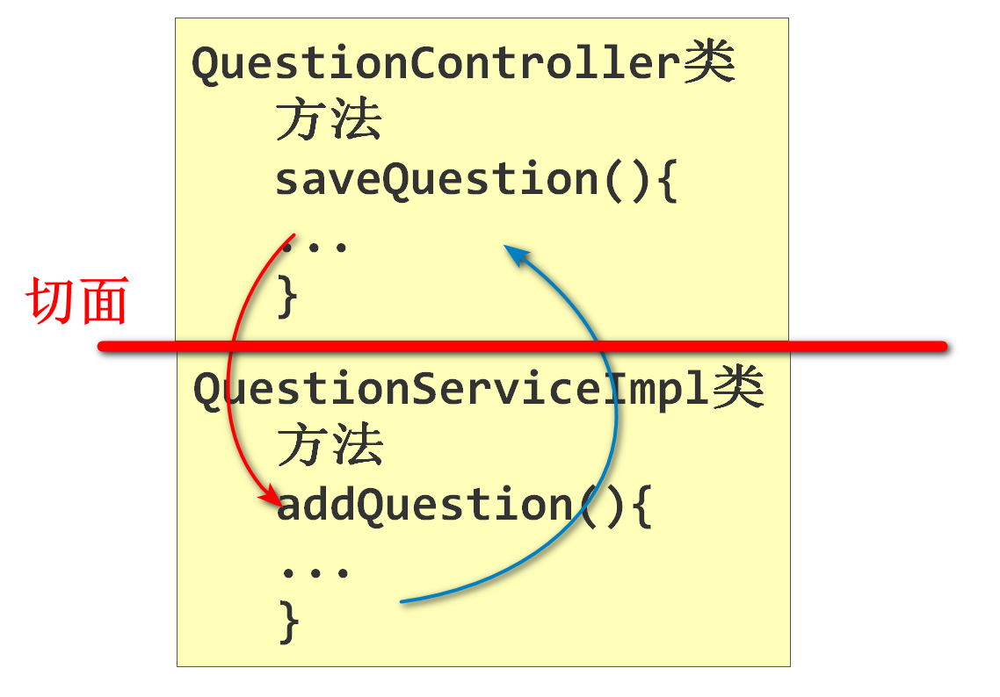
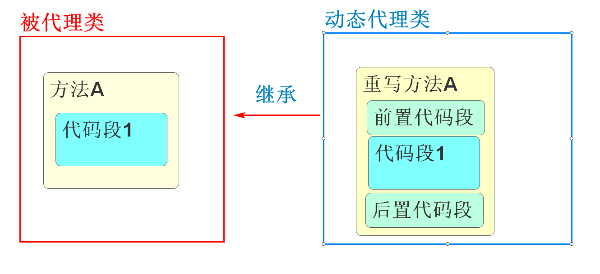
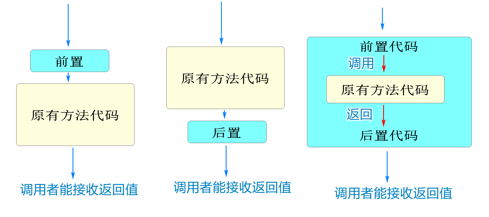
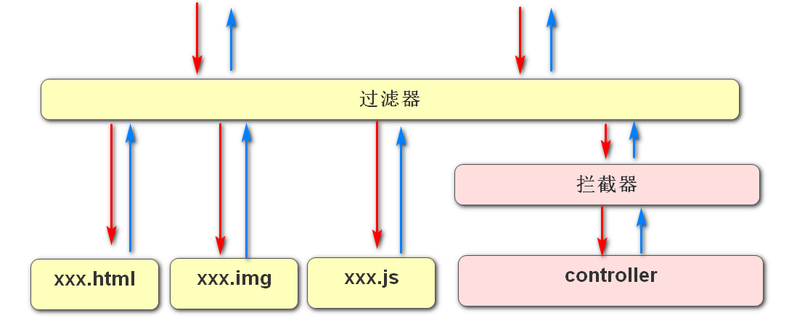
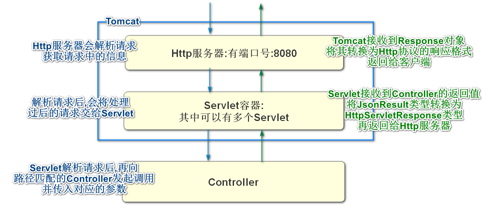
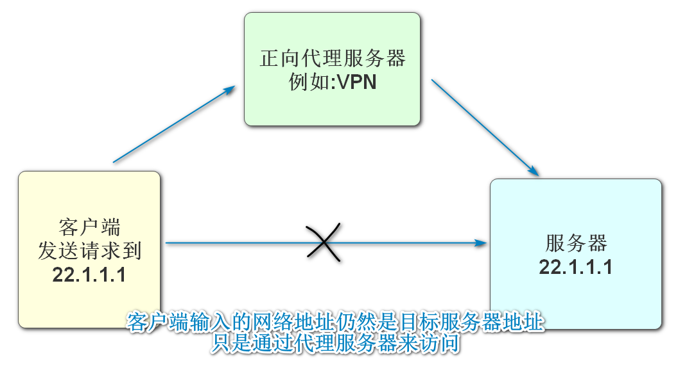
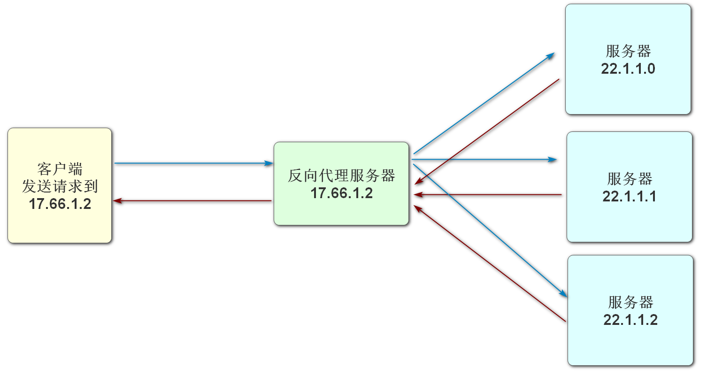
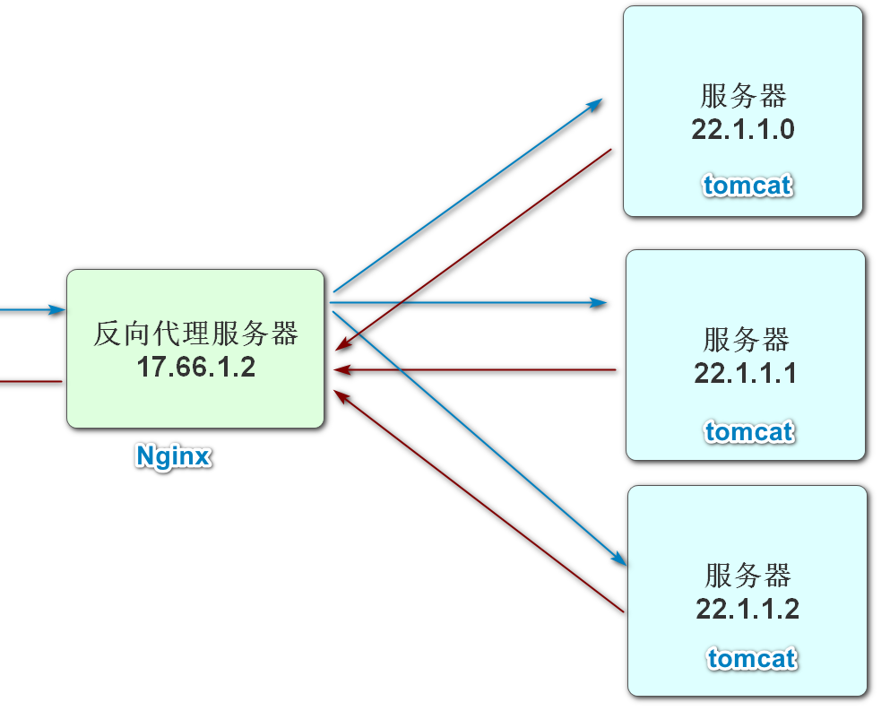

# Aop面向切面编程

## 什么是Aop

面向切面的程序设计(Aspect Oriented Programming)又译作**剖面导向程序设计**

和OOP(Object Oriented Programming)一样,也是计算机开发的一种程序设计思想

一句话概括面向切面编程

**就是在不修改现有程序代码的前提下,可以设置某个方法运行之前或运行之后新增额外代码的操作**

目标是将**横切关注点**与业务主体进行进一步分离，以提高程序代码的模块化程度。通过在现有代码基础上增加额外的**通知**（Advice）机制，能够对被声明为“**切点**（Pointcut）”的代码块进行统一管理与扩展

什么是切面

程序中的切面指的就是程序中方法的相互调用



名词解释

- 切面(aspect):是一个可以加入额外代码运行的特定位置,一般指方法之间的调用,可以在不修改原代码的情况下,添加新的代码,对现有代码进行升级维护和管理
- 织入(weaving):选定一个切面,利用动态代理技术,为原有的方法的持有者生成动态对象,然后将它和切面关联,在运行原有方法时,就会按照织入之后的流程运行了



* 通知(advice)

  通知要织入的代码的运行时机

  * 前置通知(before advice)
  * 后置通知(after advice)
  * 环绕通知(around advice)
  * 异常通知(after throwing advice)

## Spring实现Aop

之前我们明确了Spring框架的两大功能

- Ioc\DI
- AOP

实际上我们在项目开发的过程中,多处多次用到了AOP思想

它们都可以实现不修改代码就能新增各种功能

例如

- 过滤器
- Spring-Security(底层通过过滤器实现)
- SpringMvc统一异常处理类
- SpringValidation
- .....

实际上Spring只是实现Aop的方式之一

下面我们就使用Spring来实现Aop的功能

不必新建项目,使用任何SpringBoot项目都可以

我们使用csmall-business项目来测试Spring的AOP

```xml
<!--  支持SpringAop注解的依赖   -->
<dependency>
    <groupId>org.springframework</groupId>
    <artifactId>spring-aspects</artifactId>
</dependency>
```

SpringAop的优势是通用性更强

项目中的任何由Spring保存的对象的方法都可以是Aop的目标

包括不限于控制层\业务层\持久层\其他类

我们首先来确定我们要aop的目标

我们可以在BusinessController类中新增一个方法用于测试aop

```java
@GetMapping("/test")
@ApiOperation("Aop测试方法")
public JsonResult aopTest(){
    System.out.println("控制器方法运行");
    return JsonResult.ok("运行完成!");
}
```

要想添加aop的效果

我们可以新建一个包aspect

包中新建类DemoAspect

```java
// 当前DemoAspect类的功能是为指定的方法进行aop实现
// 必须将当前切面设置类也交由Spring管理
@Component
// 表示当前类不是普通类,是做切面功能设计的
@Aspect
public class DemoAspect {

    // 1.定义切面
    //  @Pointcut是指定切面方法的注解
    //  注解中通过固定的格式指定或统配添加切面的方法
    @Pointcut("execution(public * cn.tedu.csmall.business.controller" +
            ".BusinessController.aopTest(..))")
    // 我们需要在注解下定义一个方法,代表这个切面的定义
    // 这个方法不需要任何内容,方法名足矣
    public void pointCut(){}

    // 2.织入内容
    //   向确定好的切面中添加需要运行的额外代码
    //   我们需要设计它的运行时机,这里以前置运行为例
    //   在注解中配置上面切面的方法名,pointCut()是上面方法名,带()是固定要求
    @Before("pointCut()")
    public void before(){
        // 这个代码就会在aopTest方法运行之前运行
        System.out.println("前置advice运行");
    }
    
}
```

本地Nacos\seata

启动business

20000端口访问aop测试方法

运行后到控制台观察输出内容

## 各种advice和aop方法参数

正常的aop方法可能需要当前程序运行的一些状态

我们可以在advice方法的参数位置添加JoinPoint参数

在Before的方法参数中添加如下

```java
@Before("pointCut()")
public void before(JoinPoint joinPoint){
    // 这个代码就会在aopTest方法运行之前运行
    System.out.println("前置advice运行");
    // JoinPoint可以声明在任何织入方法的参数中
    // JoinPoint会包含当前切面方法的各种信息,主要都是反射获取的
    // 最常用的就是当前切面方法的方法信息,例如方法名
    String methodName=joinPoint.getSignature().getName();
    System.out.println("切面方法为:"+methodName);
}
```


后置异常和环绕Advice

```java
// 当前DemoAspect类的功能是为指定的方法进行aop实现
// 必须将当前切面设置类也交由Spring管理
@Component
// 表示当前类不是普通类,是做切面功能设计的
@Aspect
public class DemoAspect {

    // 1.定义切面
    //  @Pointcut是指定切面方法的注解
    //  注解中通过固定的格式指定或统配添加切面的方法
    @Pointcut("execution(public * cn.tedu.csmall.business.controller" +
            ".BusinessController.aopTest(..))")
    // 我们需要在注解下定义一个方法,代表这个切面的定义
    // 这个方法不需要任何内容,方法名足矣
    public void pointCut(){}

    // 2.织入内容
    //   向确定好的切面中添加需要运行的额外代码
    //   我们需要设计它的运行时机,这里以前置运行为例
    //   在注解中配置上面切面的方法名,pointCut()是上面方法名,带()是固定要求
    @Before("pointCut()")
    public void before(JoinPoint joinPoint){
        // 这个代码就会在aopTest方法运行之前运行
        System.out.println("前置advice运行");
        // JoinPoint可以声明在任何织入方法的参数中
        // JoinPoint会包含当前切面方法的各种信息,主要都是反射获取的
        // 最常用的就是当前切面方法的方法信息,例如方法名
        String methodName=joinPoint.getSignature().getName();
        System.out.println("切面方法为:"+methodName);
    }

    // 后置 Advice
    @After("pointCut()")
    public void after(){
        System.out.println("后置advice运行");
    }
    // 异常 Advice (只有切面的方法发生异常时才会运行)
    @AfterThrowing("pointCut()")
    public void throwing(){
        System.out.println("方法发生异常!");
    }

    // 环绕Advice
    @Around("pointCut()")
    // 环绕Advice要想正常执行,必须设置方法的返回值和参数
    // 它能够实现切面方法运行前后都添加代码
    // 参数类型必须是ProceedingJoinPoint,它是JoinPoint的子接口
    // 它拥有更多方法,其中包含针对环绕Advice调用方法返回值的功能
    // 环绕增强,参与到了原有方法代码的调用和返回值的接收工作
    // 所以环绕增强需要讲原有方法的返回值返回才能有保持原有的工作流程
    public Object around(ProceedingJoinPoint joinPoint) throws Throwable {
        // 这个方法运行时,当前切面的目标方法还没有执行
        System.out.println("环绕Advice前置执行");
        // 环绕增强调用目标方法,并接收返回值(只有环绕增强有这个步骤)
        Object obj=joinPoint.proceed();
        // 这里目标方法已经执行完毕
        System.out.println("环绕Advice后置执行");
        // 千万别忘了要返回obj
        return obj;
    }


}
```




## 切面语法定义规则

上面课程中使用的切面定义语法为:

```java
@Pointcut("execution(public * cn.tedu.csmall.business.controller" +
        ".BusinessController.aopTest(..))")
```

含义为public 修饰的,任何返回值的cn.tedu.csmall.business.controller包BusinessController类的aopTest方法

可以是任意参数

实际上这个定义切面的语法还有很多变化或通配,以满足各种切面定义需求

下面是详细语法规则的模板

```
execution(
modifier-pattern?
ret-type-pattern
declaring-type-pattern?
name-pattern(param-pattern)
throws-pattern?)
```

带?的是可选属性,不带?是必须写的

- modifier-pattern:访问修饰符(可选)
- ret-type-pattern:返回值类型(必写)
- declaring-type-pattern:全路径类名(可选)
- name-pattern:方法名(必写)
- param-pattern:参数列表(必写)
- throws-pattern:抛出的异常类型(可选)

分析下面的表达式设置切面的方法

```
execution(* *(..)):
匹配spring框架中(spring容器中)所有类得所有方法都定为切面
```

```
execution(public * com.test.TestController.*(..)):
匹配com.test.TestController类中的所有被public修饰方法定义为切面
```

```
execution(* cn.tedu.csmall.cart.mapper.*.*(..)):
匹配cn.tedu.csmall.cart.mapper包中所有接口\类的所有方法定义为切面
```

## Aop实现业务逻辑层性能记录

我们想了解酷鲨商城的业务运行用时

我们可以在需要测试用时的模块中添加aop环绕Advice

在运行前和运行后分别记录时间,将它们相减,获得的时间差就是用时

我们以mall-order-webapi模块为例

pom文件添加依赖

```xml
<!--  支持SpringAop注解的依赖   -->
<dependency>
    <groupId>org.springframework</groupId>
    <artifactId>spring-aspects</artifactId>
</dependency>
```

在创建aspect包

包中创建TimeAspect类

代码如下

```java
@Component
@Aspect
public class TimeAspect {
    // 定义切面,目标是当项目所有业务逻辑层方法
    @Pointcut("execution(public * cn.tedu.mall.order.service.*.*(..))")
    public void timer(){}
    // 使用环绕Advice计时比较合理
    @Around("timer()")
    public Object timeRecord(ProceedingJoinPoint joinPoint) throws Throwable {
        // 记录开始时间
        long start=System.currentTimeMillis();
        // 调用切面方法
        Object obj=joinPoint.proceed();
        // 记录结束时间
        long end=System.currentTimeMillis();
        // 计算时间差
        long time= end-start;
        // 获得方法名
        String methodName=joinPoint.getSignature().getName();
        // 输出方法用时
        System.out.println(methodName+"方法用时"+time+"ms");
        // 别忘了返回!
        return obj;

    }


}
```

使用虚拟机即可

没有虚拟机使用nacos\seata\redis

启动项目leaf\product\passport\order

# Spring MVC拦截器

## 什么是拦截器

拦截器是SpringMvc框架提供的功能

它可以在控制器方法运行之前或运行之后(还有其它特殊时机)对请求进行处理或加工的特定接口

> 常见面试题:过滤器和拦截器的区别

过滤器和拦截器都可以在控制器方法运行前后加入额外代码,实现aop效果

* 提供者不同
  * 过滤器是由javaEE提供的
  * 拦截器是SpringMvc提供的
* 作用目标不同
  * 过滤器作用目标更广:可以作用在所有请求当前服务器资源的流程中
  * 拦截器作用目标单一:只能作用在请求目标为当前服务器控制器的流程中



* 功能强度不同
  * 过滤器是原生的JavaEE的功能,功能较弱,不能直接处理Spring容器中的内容和对象
  * 拦截器是SpringMvc框架提供的,所以天生和Spring容器有更好的兼容性,可以直接操作Spring容器中的对象,而且拦截器相比于过滤器有更完善的参数返回值的处理,也有更多的运行时机

* 结论

  如果请求的目标能确定是一个控制器方法,优先使用拦截器

  如果请求的目标可能是其他静态资源,那么就需要使用过滤器

详细操作,见成老师笔记


# Mybatis 拦截器

简介:

Mybatis框架提供的一个功能

能够在Mapper接口方法运行之前或之后添加额外代码的功能

之前我们通过设置,实现将运行的sql语句输出到控制台的效果,就是拦截器实现的

我们也可以简单的进行一个类似的演示

首先,要想能够成功的拦截Mybatis中mapper运行的sql语句

需要先在Spring中设置相关的代码

步骤1:编写拦截器

```java
// Mybatis拦截器测试类
@Slf4j
// Mybatis拦截器配置声明用的注解
// 可以配置拦截多个jdbc中的对象
@Intercepts({@Signature(
        type = StatementHandler.class,
        method = "prepare",
        args = {Connection.class,Integer.class}
)})
public class MyInterceptor implements Interceptor {
    // Mybatis拦截器方法
    // invocation 就是要运行的目标(这里就是sql语句)
    @Override
    public Object intercept(Invocation invocation) throws Throwable {
        log.info("进入拦截器,准备拦截sql语句");
        // 从参数invocation中获得要运行的sql语句对象BoundSql
        BoundSql boundSql=((StatementHandler)invocation.getTarget())
                                        .getBoundSql();
        // 从boundSql中获取sql语句
        String sql=boundSql.getSql();
        log.info("要运行的原sql语句为:{}",sql);
        // 下面可以将sql语句进行更改
        sql=sql+" and 1=1";
        log.info("变更后的sql语句:{}",sql);
        // 利用反射强制赋值,将boundSql中的sql属性变化
        reflectUpdateSql(boundSql,"sql",sql);
        
        return invocation.proceed();
    }

    // 需要定义个方法,能够将sql语句进行改写
    // 但是sql语句已经在invocation我么需要利用反射,将其中的属性改写
    private void reflectUpdateSql(BoundSql boundSql,
                                  String attrName,String attrValue)
            throws NoSuchFieldException, IllegalAccessException {
        // 这个方法目标是将boundSql对象的sql强制赋值赋值
        // 反射的属性类
        Field field=boundSql.getClass().getDeclaredField(attrName);
        // 设置属性可强制赋值 设置之后就不是私有属性了
        field.setAccessible(true);
        // 将准备好的值赋值到这个属性中
        field.set(boundSql,attrValue);
    }
    // User 类   User类中有个私有属性password  没有getset方法
    // 反射是可以强制给password属性赋值的
    // BoundSql相当于User对象
    // attrName相当于password属性
    // attrValue相当于我们要强制付给属性的值
    
}
```

步骤2:

将拦截器设置在SpringBoot框架下使其生效

config包中

```java
//这个类是配置Mybatis拦截器生效的配置类
@Configuration
// 配置Mybatis拦截器生效的固定代码
@AutoConfigureAfter(MybatisAutoConfiguration.class)
public class InterceptorConfig {
    // 获得Mybatis的会话管理器
    // Mybatis会话管理器就是执行连接操作数据库的核心类
    @Autowired
    private List<SqlSessionFactory> sqlSessionFactoryList;

    // 下面方法是将Mybatis会话管理器中所有连接和我们编写的拦截器关联,使拦截器生效
    @PostConstruct
    public void addInterceptors(){
        // 实例化我们编写的拦截器
        Interceptor interceptor=new MyInterceptor();
        for (SqlSessionFactory factory:sqlSessionFactoryList){
            factory.getConfiguration().addInterceptor(interceptor);
        }
    }
}
```


# 什么是Web服务器

简单来说

Web服务器就是一个能够接收http请求并作出响应的java程序

我们再二阶段编写的webServer项目其实就是我们手写的Web服务器

我们现在开发的标准SpringBoot项目启动时内置的Web服务器叫Tomcat

实际上我们业界中还有很多Web服务器,它们具备很多不同的特征

网关Gateway项目使用Netty服务器,Netty服务器内部是NIO的所以性能更好

下图以Tomcat为例,解释请求响应流程



大多数情况我们会使用Tomcat作为Web服务器

它是我们请求\响应流程中的核心组件

Tomcat是也有缺点

常规情况下,一个tomcat并发数在100多一点

一般情况下,一个网站要1000人在线,并发数是2%~5% 也就是20~50并发

如果需要一个支持更高并发的服务器,就是需要使用Nginx

# Nginx

Nginx ("engine x") 是一个高性能的 HTTP 和 [反向代理](https://so.csdn.net/so/search?q=反向代理&spm=1001.2101.3001.7020) 服务器，也是一个IMAP/POP3/SMTP 代理服务器。 Nginx 是由 Igor Sysoev 为俄罗斯访问量第二的Rambler.ru 站点开发的，第一个公开版本 0.1.0 发布于 2004 年 10 月 4 日。其将源代码以类 BSD 许可证的形式发布，因它的稳定性、丰富的功能集、示例配置文件和低系统资源的消耗而闻名。

我们一般使用它来做反向代理和静态资源服务器

## Nginx的优势

1. 高并发响应性能非常好，官方 Nginx 处理静态文件并发 5万/秒
2. 反向代理性能非常强。（可用于负载均衡）
3. 内存和 cpu 占用率低。（为 Apache(也是一个服务器) 的 1/5-1/10）

又小又快

Nginx快速的原因

> 常见面试题:Nginx为什么快

Nginx内部是一个主进程(Master)多个工作进程(Worker)

Master负责统筹管理配置和Worker的分工

Worker来负责处理请求,作出响应

而且使用非阻塞式的,异步的

简单来说,就是一个Worker接到一个请求后,对请求进行处理,处理后在响应返回前,这个Worker还会处理别的请求,直到请求返回响应时,才会处理响应,也就是Worker这个进程全程无阻塞


要想了解反向代理,首先了解正向代理



正向代理,当我们访问的目标服务器无法连通时,可以借助代理服务器,简介访问该目标服务器

关系类似于生活中的介绍人

反向代理



请求反向代理服务器的特点是,我们请求的是代理服务器的地址,真正提供服务的服务器地址我们不需要知道,这样做的好处是反向代理服务器后可能是一个集群,方便负载均衡

有点类似于生活中的代理人,有什么事情直接找这个人就能完成需求,它怎么完成的我们不用管

## Nginx的使用

实际开发中,Nginx可以用于反向代理服务器,

实际处理请求的是Tomcat服务器



因为Nginx优秀的静态内容并发性能

我们常常使用它做静态资源服务器

在Nginx中保存图片,文件视频等静态资源

经常和FastDFS组合使用

> *FastDFS*是一个开源的轻量级分布式文件系统，它对文件进行管理，功能包括：文件存储、文件同步、文件访问（文件上传、文件下载）等，解决了大容量存储和负载均衡的问题。特别适合以文件为载体的在线服务，如相册网站、视频网站等等。

Nginx和Gateway的区别

首先明确Nginx和Gateway并不冲突

他们都是统一入口的概念,它们可以同时开启

也可以开启其中一个

只不过Nginx不属于java程序,而Gateway是java程序

Nginx是服务器程序我们不可编辑,

Gateway是我们自己创建的项目,依赖和配置都由我们自己完成

最终如果想做反向代理服务器,就使用Nginx

如果是微服务项目的网关就是Gateway


MybatisPlus

MybatisPlus是一个国内的团队在Mybatis框架基础上新增了一些功能的框架

MybatisPlus新增的功能主要两方面

1.提供的代码生成器

可以根据指定的数据库表,自动生成基本的实体类\控制器\业务层\持久层的相关文件

2.自动提供基本增删改查方法的默认实现


Oauth2.0

是一个授权框架

类似一个授权协议标准

我们常用的扫码登录就是Oauth2标准下的功能

nacos工作原理

本质上讲,我们启动服务,注册到nacos

就是将当前服务器信息提交到注册中心

nacos中会保存当前所有服务列表

当有新的信息到nacos时(或者是每隔5秒的心跳访问时)

nacos会将当前最新的服务列表信息同步给当前服务


